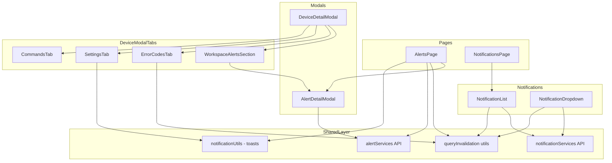
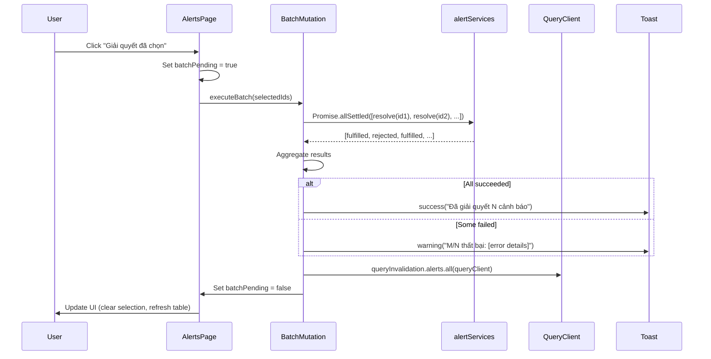
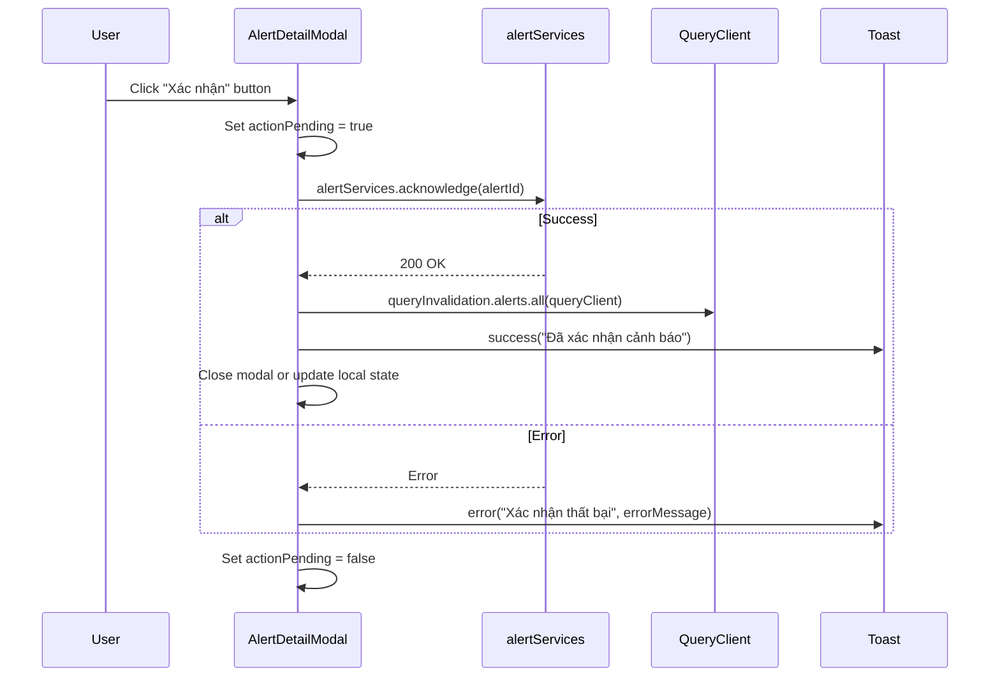
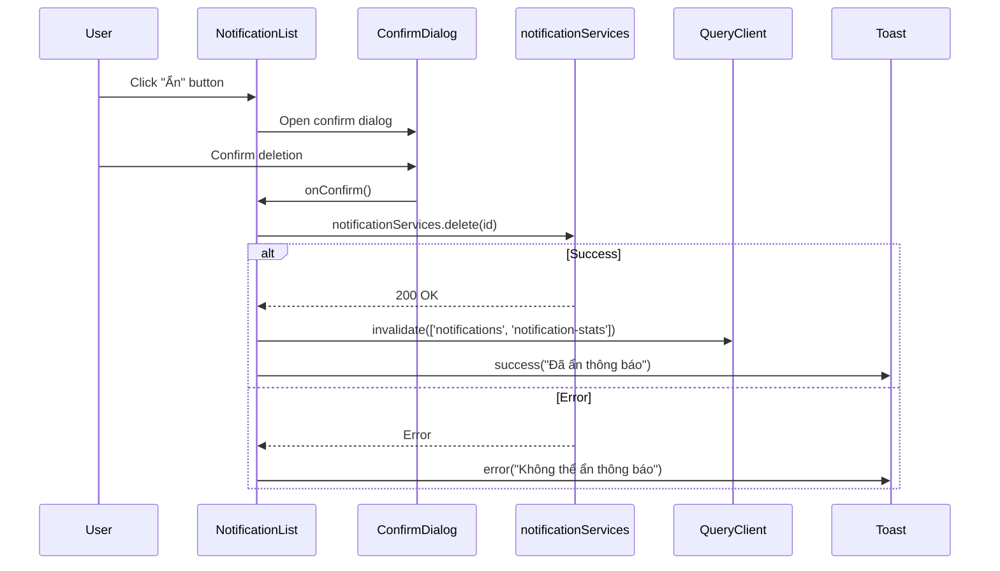

# Design Document: Frontend UX Fixes

## Overview

Tài liệu thiết kế tổng hợp toàn bộ lỗi tính năng, hoạt động và UI/UX đã phát hiện trong frontend web app IoT Vehicle Tracking System. Bao gồm 30 vấn đề được phân loại thành 4 nhóm: lỗi tính năng nghiêm trọng (functional bugs), vấn đề UX/thao tác, thiếu sót API/data flow, và cải thiện cần thiết.

Mục tiêu chính là đảm bảo mọi action trong UI đều có feedback rõ ràng, error handling đầy đủ, và data consistency giữa các component. Thiết kế tuân thủ nguyên tắc: mỗi mutation phải có `onError` handler, mỗi destructive action phải có confirm dialog, và query invalidation phải nhất quán qua helper tập trung.

Tech stack: Next.js 15 App Router, React 19, TypeScript, TanStack React Query, Zustand, Socket.IO, shadcn/ui + Tailwind CSS, react-leaflet, react-hook-form + zod, sonner (toasts), axios.

## Architecture



## Sequence Diagrams

### Bulk Alert Actions (Fixed Flow)



### Alert Action from Modal (New Flow)



### Notification Delete with Confirm (New Flow)



## Components and Interfaces

### Component 1: AlertDetailModal (Enhanced)

**Purpose**: Hiển thị chi tiết cảnh báo VÀ cho phép user thực hiện hành động trực tiếp (acknowledge, resolve, dismiss).

**Interface**:
```typescript
interface AlertDetailModalProps {
  open: boolean;
  onOpenChange: (value: boolean) => void;
  alert: AlertItem | null;
  onActionComplete?: () => void; // callback after successful action
}

interface AlertActionButtonsProps {
  alert: AlertItem;
  onAcknowledge: (id: number) => void;
  onResolve: (id: number) => void;
  onDismiss: (id: number) => void;
  isPending: boolean;
}
```

**Responsibilities**:
- Hiển thị thông tin chi tiết cảnh báo (giữ nguyên)
- Thêm action buttons: "Xác nhận", "Giải quyết", "Bỏ qua"
- Disable buttons khi đang pending hoặc alert đã resolved
- Gọi `queryInvalidation.alerts.all()` sau mỗi action thành công
- Hiển thị error toast khi action thất bại

### Component 2: WorkspaceAlertsSection (Enhanced)

**Purpose**: Hiển thị alerts trong device modal VÀ cho phép resolve/ack trực tiếp.

**Interface**:
```typescript
interface WorkspaceAlertCardProps {
  alert: AlertItem;
  onAcknowledge: (id: number) => void;
  onResolve: (id: number) => void;
  onViewDetail: (id: number) => void;
  isPending: boolean;
}
```

**Responsibilities**:
- Hiển thị danh sách alerts (giữ nguyên)
- Thêm nút "Xác nhận" và "Giải quyết" cho mỗi alert card
- Invalidate cả `device-obd-alerts` query sau action

### Component 3: ErrorCodesTab (Enhanced)

**Purpose**: Hiển thị bảng mã lỗi OBD/system VÀ cho phép đánh dấu đã xử lý.

**Interface**:
```typescript
interface ErrorCodeActionProps {
  errorId: number;
  isResolved: boolean;
  onMarkResolved: (id: number) => void;
  onDelete: (id: number) => void;
  isPending: boolean;
}
```

**Responsibilities**:
- Hiển thị bảng error codes (giữ nguyên)
- Thêm cột "Hành động" với nút "Đánh dấu đã xử lý" / "Xóa"
- Phân biệt OBD DTC vs system error bằng badge riêng
- Invalidate `device-errors` query sau action

### Component 4: NotificationList (Enhanced)

**Purpose**: Hiển thị danh sách thông báo với error handling đầy đủ và confirm dialog.

**Interface**:
```typescript
// Mutations with onError handlers
interface NotificationMutationConfig {
  onSuccess: () => void;
  onError: (error: unknown) => void;
}
```

**Responsibilities**:
- Thêm `onError` cho `markReadMutation` và `deleteMutation`
- Thêm confirm dialog trước khi delete
- Hiển thị error toast khi mutation thất bại

### Component 5: NotificationDropdown (Enhanced)

**Purpose**: Dropdown thông báo nhanh với text rõ nghĩa và error handling.

**Responsibilities**:
- Đổi text "Đánh dấu tất cả" → "Đánh dấu tất cả đã đọc"
- Thêm `onError` cho `markAllMutation`
- Invalidate `notification-stats` query riêng

### Component 6: SettingsTab (Enhanced)

**Purpose**: Form cài đặt thiết bị với error handling cho partial save.

**Responsibilities**:
- Wrap `onSubmit` trong try/catch
- Nếu `onUpdateNameId` thành công nhưng `onUpdateSettings` fail → hiển thị partial error toast
- Rollback form state nếu cần

### Component 7: AlertsPage (Enhanced)

**Purpose**: Trang quản lý cảnh báo với batch actions đúng cách.

**Responsibilities**:
- Thay `forEach + mutate` bằng `Promise.allSettled` batch
- Track loading state cho toàn bộ batch (không chỉ mutation cuối)
- Aggregate errors và hiển thị summary toast
- Optimistic update: remove resolved rows ngay lập tức

## Data Models

### Query Invalidation Helper (Extended)

```typescript
interface QueryInvalidationAlerts {
  all: (queryClient: QueryClient) => void;
  list: (queryClient: QueryClient) => void;
  deviceScoped: (queryClient: QueryClient, deviceId: number | string) => void;
  summary: (queryClient: QueryClient) => void;
}
```

**Validation Rules**:
- `all` phải invalidate: `['alerts']`, `['alerts-summary-*']`, `['device-obd-alerts']`, `['dashboard-recent-alerts']`
- `deviceScoped` phải invalidate: `['device-obd-alerts', deviceId]`, `['alerts']`
- Mọi nơi resolve/ack alert phải gọi `queryInvalidation.alerts.all()` thay vì tự invalidate

### Batch Mutation Result

```typescript
interface BatchMutationResult<T = unknown> {
  total: number;
  succeeded: number;
  failed: number;
  errors: Array<{ id: number; error: string }>;
  results: Array<PromiseSettledResult<T>>;
}
```

### Alert Action State

```typescript
interface AlertActionState {
  pendingAction: 'acknowledge' | 'resolve' | 'dismiss' | null;
  pendingIds: Set<number>;
}
```

## Algorithmic Pseudocode

### Batch Alert Mutation Algorithm

```typescript
async function executeBatchAlertAction(
  ids: number[],
  action: (id: number) => Promise<unknown>,
  queryClient: QueryClient
): Promise<BatchMutationResult> {
  // Precondition: ids.length > 0
  // Postcondition: all ids attempted, errors aggregated, queries invalidated

  const results = await Promise.allSettled(
    ids.map((id) => action(id))
  );

  const succeeded = results.filter((r) => r.status === 'fulfilled').length;
  const failed = results.length - succeeded;
  const errors = results
    .map((r, i) => r.status === 'rejected' 
      ? { id: ids[i], error: getApiErrorMessage(r.reason) } 
      : null)
    .filter(Boolean);

  // Always invalidate regardless of partial failure
  queryInvalidation.alerts.all(queryClient);

  return { total: ids.length, succeeded, failed, errors, results };
}
```

**Preconditions:**
- `ids` is non-empty array of valid alert IDs
- `action` is a function that calls the appropriate API endpoint
- `queryClient` is available from React Query context

**Postconditions:**
- All IDs have been attempted (no short-circuit on first failure)
- Queries are invalidated even on partial failure
- Return value contains complete success/failure breakdown

**Loop Invariants:**
- N/A (Promise.allSettled handles all items concurrently)

### Settings Form Submit with Partial Error Handling

```typescript
async function handleSettingsSubmit(
  values: SettingsFormValues,
  onUpdateNameId: (data: { deviceName: string }) => Promise<void>,
  onUpdateSettings: (data: SettingsPayload) => Promise<void>
): Promise<void> {
  // Precondition: values passes zod validation
  // Postcondition: both updates attempted, partial failure reported

  let nameUpdateSucceeded = false;

  try {
    await onUpdateNameId({ deviceName: values.deviceName });
    nameUpdateSucceeded = true;
  } catch (error) {
    notificationUtils.error(
      'Cập nhật tên thiết bị thất bại',
      getApiErrorMessage(error)
    );
    throw error; // abort entire submit
  }

  try {
    await onUpdateSettings(buildSettingsPayload(values));
  } catch (error) {
    notificationUtils.warning(
      'Lưu cấu hình không hoàn tất',
      'Tên thiết bị đã cập nhật nhưng cấu hình kỹ thuật thất bại. Vui lòng thử lại.'
    );
    throw error;
  }

  notificationUtils.success('Đã lưu cấu hình thiết bị');
}
```

**Preconditions:**
- `values` has been validated by zod schema
- Both update functions are available from modal context

**Postconditions:**
- If both succeed: success toast shown
- If name fails: error toast, form stays dirty
- If name succeeds but settings fails: warning toast explaining partial save

### Optimistic Alert Resolve

```typescript
function useOptimisticAlertResolve(queryClient: QueryClient) {
  return useMutation({
    mutationFn: (id: number) => alertServices.resolve(id),
    onMutate: async (id: number) => {
      // Cancel outgoing refetches
      await queryClient.cancelQueries({ queryKey: ['alerts'] });
      
      // Snapshot previous value
      const previousAlerts = queryClient.getQueryData(['alerts']);
      
      // Optimistically remove the row
      queryClient.setQueryData(['alerts'], (old: any) => ({
        ...old,
        items: old.items.filter((item: any) => item.id !== id),
      }));
      
      return { previousAlerts };
    },
    onError: (error, id, context) => {
      // Rollback on error
      queryClient.setQueryData(['alerts'], context?.previousAlerts);
      notificationUtils.error('Giải quyết cảnh báo thất bại');
    },
    onSettled: () => {
      queryInvalidation.alerts.all(queryClient);
    },
  });
}
```

**Preconditions:**
- Alert with given ID exists in the current query cache
- User has permission to resolve alerts

**Postconditions:**
- On success: row removed immediately, then confirmed by server refetch
- On error: row restored to previous position, error toast shown
- Query always invalidated in `onSettled` regardless of outcome

## Key Functions with Formal Specifications

### Function 1: `queryInvalidation.alerts.all()`

```typescript
function alertsInvalidateAll(queryClient: QueryClient): void
```

**Preconditions:**
- `queryClient` is a valid TanStack QueryClient instance

**Postconditions:**
- All alert-related queries are marked stale
- Includes: `['alerts']`, `['alerts-summary-*']`, `['device-obd-alerts']`, `['dashboard-recent-alerts']`
- Does NOT trigger immediate refetch (only marks stale)

### Function 2: `executeBatchAlertAction()`

```typescript
async function executeBatchAlertAction(
  ids: number[],
  action: (id: number) => Promise<unknown>,
  queryClient: QueryClient
): Promise<BatchMutationResult>
```

**Preconditions:**
- `ids.length > 0`
- `action` returns a Promise that resolves on API success

**Postconditions:**
- Returns `BatchMutationResult` with complete breakdown
- `result.total === ids.length`
- `result.succeeded + result.failed === result.total`
- Queries invalidated regardless of partial failure

### Function 3: `AlertDetailModal` action handlers

```typescript
function useAlertModalActions(alertId: number | null): {
  acknowledge: () => void;
  resolve: () => void;
  dismiss: () => void;
  isPending: boolean;
  pendingAction: string | null;
}
```

**Preconditions:**
- `alertId` is non-null when actions are invoked
- Alert exists and is in actionable state (not already resolved)

**Postconditions:**
- Only one action can be pending at a time
- Success: toast + query invalidation + optional modal close
- Error: error toast, no state change

## Example Usage

```typescript
// Example 1: Batch resolve with proper error aggregation
const handleBulkResolve = async () => {
  setBatchPending(true);
  const result = await executeBatchAlertAction(
    selected,
    (id) => alertServices.resolve(id),
    queryClient
  );
  
  if (result.failed === 0) {
    notificationUtils.success(`Đã giải quyết ${result.succeeded} cảnh báo`);
  } else {
    notificationUtils.warning(
      `${result.succeeded}/${result.total} thành công, ${result.failed} thất bại`,
      result.errors.map(e => e.error).join('; ')
    );
  }
  
  setSelected([]);
  setBatchPending(false);
};

// Example 2: Alert modal with action buttons
<AlertDetailModal
  open={!!detail}
  onOpenChange={(value) => !value && setDetail(null)}
  alert={detail}
  onActionComplete={() => {
    setDetail(null);
    queryInvalidation.alerts.all(queryClient);
  }}
/>

// Example 3: Notification delete with confirm
const [deleteTarget, setDeleteTarget] = useState<number | null>(null);

<Button onClick={() => setDeleteTarget(item.id)}>Ẩn</Button>

<ConfirmDialog
  open={deleteTarget !== null}
  onCancel={() => setDeleteTarget(null)}
  onConfirm={() => {
    deleteMutation.mutate(deleteTarget!);
    setDeleteTarget(null);
  }}
  title="Ẩn thông báo"
  description="Bạn có chắc muốn ẩn thông báo này? Thao tác không thể hoàn tác."
  confirmLabel="Ẩn"
/>

// Example 4: Settings form with try/catch
const onSubmit = async (values: SettingsFormValues) => {
  try {
    await onUpdateNameId({ deviceName: values.deviceName });
    await onUpdateSettings(buildPayload(values));
    notificationUtils.success('Đã lưu cấu hình');
  } catch (error) {
    // Partial save detection
    if (nameAlreadySaved) {
      notificationUtils.warning('Tên đã lưu nhưng cấu hình thất bại');
    } else {
      notificationUtils.error('Lưu cấu hình thất bại', getApiErrorMessage(error));
    }
  }
};

// Example 5: Centralized query invalidation
queryInvalidation.alerts.all(queryClient);
// Instead of scattered:
// queryClient.invalidateQueries({ queryKey: ['alerts'] });
// queryClient.invalidateQueries({ queryKey: ['alerts-summary-total'] });
// ...
```

## Correctness Properties

### Property 1: All mutations have error handlers

∀ mutation M in (markRead, delete, markAllRead, acknowledge, resolve, dismiss): M has onError handler that displays error toast to user. No mutation should fail silently.

**Validates: Requirements 1.4, 7.1, 7.2, 7.3**

### Property 2: Destructive actions require confirmation

∀ destructive action D in (delete notification, delete device): D requires confirm dialog before execution. Direct `mutate()` calls without user confirmation are not allowed for destructive operations.

**Validates: Requirements 6.1, 6.2, 6.3**

### Property 3: Alert actions use centralized query invalidation

∀ alert action A triggered from any component C: `queryInvalidation.alerts.all()` is called on success. No component should manually invalidate individual alert query keys.

**Validates: Requirements 9.2, 9.3**

### Property 4: Batch operations use Promise.allSettled with aggregated results

∀ batch operation B with N items: B uses `Promise.allSettled` AND reports aggregated result. `forEach + mutate` pattern is not allowed for batch operations. Result must satisfy: `succeeded + failed === total`.

**Validates: Requirements 4.1, 4.3**

### Property 5: Sequential form submits handle partial failure

∀ form submit S with multiple sequential API calls: S is wrapped in try/catch with partial failure detection. If first call succeeds but second fails, user is informed which part succeeded.

**Validates: Requirements 5.1, 5.2, 5.3**

### Property 6: Batch loading state reflects entire batch

∀ loading state L for batch operation B: L reflects entire batch status, not just the last item's `isPending`. Buttons must remain disabled until ALL items in batch complete.

**Validates: Requirements 4.2**

### Property 7: Optimistic updates are rollback-safe

∀ alert resolve action R with optimistic update: row is removed immediately AND `onError` restores it from snapshot. After rollback, UI state === previous state before action.

**Validates: Requirements 10.1, 10.2, 10.3**

### Property 8: Query invalidation covers all alert-related keys

`queryInvalidation.alerts.all()` invalidates ALL alert-related query keys: `['alerts']`, `['alerts-summary-*']`, `['device-obd-alerts']`, `['dashboard-recent-alerts']`. No alert-related key is missed.

**Validates: Requirements 9.1, 9.2**

## Error Handling

### Error Scenario 1: Batch Alert Action Partial Failure

**Condition**: Một số alerts trong batch resolve/ack thành công, một số thất bại (ví dụ: alert đã bị xóa bởi user khác)
**Response**: Hiển thị warning toast với breakdown "M/N thành công, K thất bại" + chi tiết lỗi
**Recovery**: Invalidate queries để refresh data, clear selection, user có thể retry failed items

### Error Scenario 2: Settings Form Partial Save

**Condition**: `onUpdateNameId` thành công nhưng `onUpdateSettings` thất bại
**Response**: Warning toast "Tên đã cập nhật nhưng cấu hình kỹ thuật thất bại"
**Recovery**: Form giữ dirty state cho phần settings, user có thể retry chỉ phần settings

### Error Scenario 3: Optimistic Update Rollback

**Condition**: Alert resolve API trả về error sau khi row đã bị remove khỏi UI
**Response**: Restore row về vị trí cũ từ snapshot, hiển thị error toast
**Recovery**: Row xuất hiện lại, user có thể retry hoặc investigate

### Error Scenario 4: Notification Mutation Silent Failure

**Condition**: markRead hoặc delete mutation thất bại nhưng không có onError handler (bug hiện tại)
**Response (Fixed)**: Hiển thị error toast với message từ API
**Recovery**: UI state không thay đổi (mutation đã fail), user biết cần retry

### Error Scenario 5: Query Invalidation Inconsistency

**Condition**: Alert resolved ở page A nhưng device modal vẫn hiển thị alert cũ
**Response (Fixed)**: `queryInvalidation.alerts.all()` invalidate cả `device-obd-alerts`
**Recovery**: Tự động — khi user mở modal, stale query sẽ refetch

## Testing Strategy

### Unit Testing Approach

- Test `executeBatchAlertAction` với various combinations: all success, all fail, partial
- Test `queryInvalidation.alerts.all` invalidates đúng set of query keys
- Test `handleSettingsSubmit` partial failure detection logic
- Test optimistic update rollback behavior

### Property-Based Testing Approach

**Property Test Library**: fast-check

- **Batch result integrity**: ∀ ids[], succeeded + failed === total
- **Query invalidation completeness**: ∀ alert action, all required keys are invalidated
- **Optimistic update consistency**: ∀ resolve action, if error then state === previousState

### Integration Testing Approach

- Test full flow: select alerts → bulk resolve → verify toast + table update
- Test modal action: open detail → click resolve → verify modal closes + table updates
- Test notification delete: click ẩn → confirm → verify item removed + toast shown
- Test settings partial save: mock second API fail → verify warning toast + form state

## Performance Considerations

- **Batch mutations**: Sử dụng `Promise.allSettled` thay vì sequential để giảm total latency
- **Optimistic updates**: Remove row ngay lập tức để UX snappy, không đợi server confirm
- **Query invalidation**: Dùng `invalidateQueries` (mark stale) thay vì `refetchQueries` (force refetch) để tránh waterfall
- **Debounce**: Không cần debounce cho action buttons vì đã có `isPending` disable

## Security Considerations

- Confirm dialog cho destructive actions ngăn accidental deletion
- Batch operations giới hạn bởi server-side rate limiting (không cần client-side limit)
- Error messages từ API được sanitize qua `getApiErrorMessage` trước khi hiển thị

## Dependencies

- `@tanstack/react-query` — server state management, mutations, optimistic updates
- `sonner` — toast notifications (via `notificationUtils`)
- `@/components/common/confirm-dialog` — reusable confirm dialog component (đã có sẵn)
- `@/lib/utils/api-error` — `getApiErrorMessage` helper (đã có sẵn)
- `@/lib/utils/query-invalidation` — centralized invalidation (cần extend)
