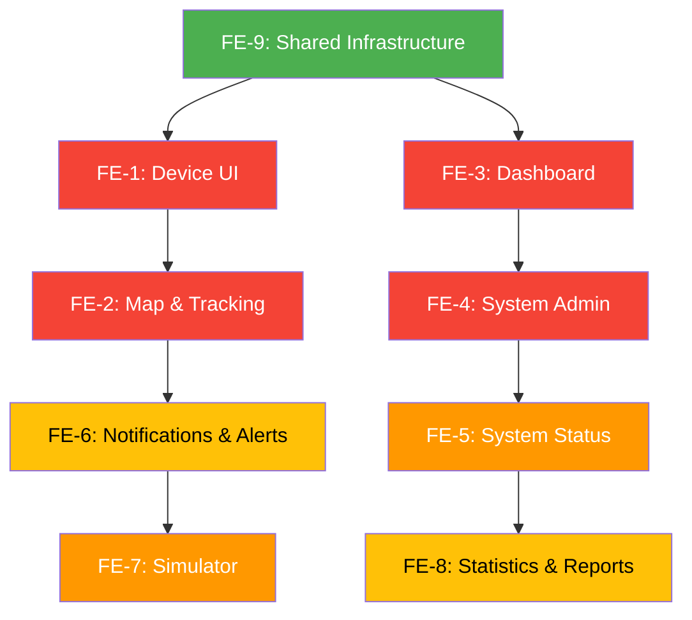

# 35 — Frontend UI Enhancement Plan (Based on IVM26 Reference)

> **Mục tiêu**: Nâng cấp toàn bộ UI của Tracking_Frontend lên ngang bằng chất lượng production-ready của IVM26, loại bỏ mọi stub/placeholder, bổ sung các module còn thiếu.

> **Reference**: `E:\anmh1205\ivm26\IVM26_Frontend\frontend_v2\src\`

---

## 📊 Gap Analysis: Tracking vs IVM26

### Tổng quan so sánh

| Module                  | Tracking (Hiện tại)                             | IVM26 (Reference)                                                           | Gap Level  |
| ----------------------- | ----------------------------------------------- | --------------------------------------------------------------------------- | ---------- |
| **Device Detail Modal** | 88 dòng, Sheet đơn giản, tabs render text thô   | 571 dòng Dialog, 14 sub-components, realtime, RBAC, export                  | 🔴 Critical |
| **Device List/Grid**    | Cơ bản: columns + filters + form                | Card + Grid + StatsBar + Skeletons + Mobile responsive                      | 🟠 Major    |
| **Map & Tracking**      | 6 components nhỏ (map-view 1.6KB, marker 1.1KB) | 14 components (tracking-map 16KB, device panel 8KB, mobile drawer 7KB)      | 🔴 Critical |
| **Dashboard/Overview**  | 6 skeleton components (~700B mỗi file)          | 17 components thật (bar/area/pie graphs, alerts list, runtime chart)        | 🔴 Critical |
| **System Admin**        | Gần như trống                                   | 31 components (data-table, logs, query builder, chart views, PromQL editor) | 🔴 Critical |
| **System Status**       | Trống                                           | 5 components (health card, metric card, progress, badge)                    | 🟠 Major    |
| **Notifications**       | 4 components cơ bản                             | 4 components hoàn chỉnh (filters, list, stats)                              | 🟡 Moderate |
| **Simulator**           | Trống                                           | 5 components (data configurator, preview, device selector, controls)        | 🟠 Major    |
| **Statistics**          | Trống                                           | 2 components (statistics-overview)                                          | 🟡 Moderate |
| **Settings**            | 4 components (chưa kiểm tra nội dung)           | Hoàn chỉnh                                                                  | 🟡 Moderate |
| **Alerts/Violations**   | 3 components cơ bản                             | Trong IVM26 là filter-based (combined-alerts-list)                          | 🟡 Moderate |
| **Trips**               | 4 components cơ bản                             | Không có trong IVM26 (tracking-specific)                                    | ⚪ Unique   |
| **Geofences**           | 4 components cơ bản                             | Không có trong IVM26 (tracking-specific)                                    | ⚪ Unique   |
| **Vehicles**            | 4 components cơ bản                             | Không có trong IVM26 (tracking-specific)                                    | ⚪ Unique   |
| **Customers**           | Trống                                           | Không có trong IVM26                                                        | ⚪ Unique   |
| **Exports**             | Trống                                           | Có ExportModal trong device detail                                          | 🟠 Major    |
| **Firmware**            | Trống                                           | Có feature module hoàn chỉnh trong IVM26                                    | 🟠 Major    |
| **Maintenance**         | 2 stubs                                         | Không có trong IVM26 (tracking-specific)                                    | ⚪ Unique   |

### Vấn đề chính cần giải quyết

1. **Stub/Re-export files**: Nhiều file chỉ re-export component khác (device-detail-modal.tsx → device-detail-sheet.tsx, v.v.)
2. **Thiếu realtime integration**: Tracking không có Socket.IO subscription trong device detail
3. **Thiếu RBAC**: Không có role-based access control trên UI
4. **Thiếu data visualization**: Dashboard chỉ có skeleton, không có biểu đồ thật
5. **Map chưa hoàn chỉnh**: Thiếu device panel, cluster, mobile drawer, search
6. **Missing observability**: Không có system admin tools (logs viewer, query builder, metrics explorer)

---

## 🗂️ Kế hoạch thực hiện — Chia Sub-Phases

### Phase FE-1: Device UI Overhaul (Ưu tiên cao nhất)

> **Mục tiêu**: Nâng cấp Device Detail Modal và Device List lên chuẩn IVM26

**Thời gian dự kiến**: 2-3 ngày

#### FE-1A: Device Detail Modal Rewrite

| Task     | Mô tả                                                                                | Reference IVM26                                 |
| -------- | ------------------------------------------------------------------------------------ | ----------------------------------------------- |
| FE-1A-01 | Chuyển từ `Sheet` sang `Dialog` (90vw × 90vh)                                        | `device-detail-modal/index.tsx`                 |
| FE-1A-02 | Tạo `modal-context.tsx` — cung cấp tất cả data/handlers cho tabs                     | `device-detail-modal/modal-context.tsx`         |
| FE-1A-03 | Tạo `modal-container.tsx` — data fetching layer                                      | `device-detail-modal/modal-container.tsx`       |
| FE-1A-04 | Viết `overview-tab.tsx` — hiển thị device info, runtime stats, realtime data         | `device-detail-modal/overview-tab.tsx` (11KB)   |
| FE-1A-05 | Viết `sessions-tab.tsx` — danh sách phiên chạy với load more, vibration chart dialog | `device-detail-modal/sessions-tab.tsx` (13KB)   |
| FE-1A-06 | Viết `error-codes-tab.tsx` — bảng mã lỗi với filter status/type, pagination          | `device-detail-modal/error-codes-tab.tsx` (8KB) |
| FE-1A-07 | Viết `runtime-tab.tsx` — biểu đồ runtime (recharts)                                  | `device-detail-modal/runtime-tab.tsx`           |
| FE-1A-08 | Viết `vibration-tab.tsx` — biểu đồ rung (recharts)                                   | `device-detail-modal/vibration-tab.tsx`         |
| FE-1A-09 | Viết `settings-tab.tsx` — form cài đặt thiết bị (React Hook Form + Zod)              | `device-detail-modal/settings-tab.tsx` (16KB)   |
| FE-1A-10 | Tạo `session-vibration-chart-dialog.tsx` — dialog xem chi tiết rung từng phiên       | `session-vibration-chart-dialog.tsx` (9KB)      |
| FE-1A-11 | Tạo `export-modal.tsx` — xuất dữ liệu theo thời gian                                 | `export-modal.tsx` (3.5KB)                      |
| FE-1A-12 | Thêm realtime subscription (device.status.changed, device.sessions.updated)          | Lines 217-295 trong index.tsx                   |
| FE-1A-13 | Thêm RBAC checks (canViewSystemInfo, canEditDevice)                                  | `useRoleAccess` hook                            |

**Files tạo/sửa:**
```
src/features/devices/components/device-detail-modal/    ← THƯ MỤC MỚI
  ├── index.tsx              (main modal component)
  ├── modal-context.tsx      (context provider)
  ├── modal-container.tsx    (data fetching wrapper)
  ├── overview-tab.tsx       (thông tin tổng quan)
  ├── sessions-tab.tsx       (phiên chạy)
  ├── error-codes-tab.tsx    (mã lỗi)
  ├── runtime-tab.tsx        (biểu đồ thời gian)
  ├── vibration-tab.tsx      (biểu đồ rung)
  ├── settings-tab.tsx       (cài đặt)
  ├── session-vibration-chart-dialog.tsx
  ├── empty-state.tsx
  └── spec.tsx
src/features/devices/components/export-modal.tsx
src/features/devices/components/device-design-constants.ts
src/features/devices/components/device-skeletons.tsx
src/features/devices/components/error-box.tsx
```

#### FE-1B: Device List Enhancement

| Task     | Mô tả                                                                              | Reference IVM26                      |
| -------- | ---------------------------------------------------------------------------------- | ------------------------------------ |
| FE-1B-01 | Tạo `device-card.tsx` — card hiển thị device với status gradient, runtime, battery | `device-card.tsx` (6.5KB)            |
| FE-1B-02 | Tạo `device-grid.tsx` — grid layout responsive                                     | `device-grid.tsx` (2KB)              |
| FE-1B-03 | Tạo `device-stats-bar.tsx` — thanh tổng hợp (tổng/online/offline/lỗi)              | `device-stats-bar.tsx` (1.2KB)       |
| FE-1B-04 | Nâng cấp `device-filters.tsx` — thêm filter status, search, sort                   | `device-filters.tsx` (3.3KB)         |
| FE-1B-05 | Tạo `stat-card.tsx` — card hiển thị metric đơn                                     | `stat-card.tsx` (1.9KB)              |
| FE-1B-06 | Tạo `device-runtime-chart.tsx` — biểu đồ runtime cho list view                     | `device-runtime-chart.tsx` (6KB)     |
| FE-1B-07 | Tạo `device-vibration-chart.tsx` — biểu đồ vibration cho list view                 | `device-vibration-chart.tsx` (7.6KB) |
| FE-1B-08 | Mobile responsive: `mobile-device-content.tsx`, `mobile-device-header.tsx`         | IVM26 mobile components              |
| FE-1B-09 | Tạo `device-create-modal.tsx` — form tạo thiết bị mới                              | `device-create-modal.tsx` (2.5KB)    |
| FE-1B-10 | Tạo `device-edit-modal.tsx` — form sửa thiết bị                                    | `device-edit-modal.tsx` (1.8KB)      |

---

### Phase FE-2: Map & Tracking Overhaul

> **Mục tiêu**: Map view đầy đủ tính năng: tracking real-time, device panel, search, cluster, mobile drawer

**Thời gian dự kiến**: 2-3 ngày

| Task    | Mô tả                                                                           | Reference IVM26                                                  |
| ------- | ------------------------------------------------------------------------------- | ---------------------------------------------------------------- |
| FE-2-01 | Viết lại `tracking-map.tsx` — component chính với map controls, popup, realtime | `tracking-map.tsx` (16KB)                                        |
| FE-2-02 | Tạo `device-list-panel.tsx` — sidebar panel liệt kê devices trên map            | `device-list-panel.tsx` (8.3KB)                                  |
| FE-2-03 | Tạo `device-list-item.tsx` — mỗi device trong panel                             | `device-list-item.tsx` (6.6KB)                                   |
| FE-2-04 | Tạo `selected-device-card.tsx` — card chi tiết khi click vào marker             | `selected-device-card.tsx` (9.6KB)                               |
| FE-2-05 | Tạo `device-search.tsx` — tìm kiếm device trên map                              | `device-search.tsx` (1.8KB)                                      |
| FE-2-06 | Tạo `device-filter.tsx` + `device-filter-compact.tsx` — bộ lọc cho map          | `device-filter.tsx` (5.7KB), `device-filter-compact.tsx` (5.6KB) |
| FE-2-07 | Tạo `device-cluster.tsx` — nhóm markers gần nhau                                | `device-cluster.tsx` (1.9KB)                                     |
| FE-2-08 | Viết lại `device-marker.tsx` — marker với status icon, popup                    | `device-marker.tsx` (2.5KB)                                      |
| FE-2-09 | Tạo `marker-icon.ts` — icon factory cho markers                                 | `marker-icon.ts` (6.5KB)                                         |
| FE-2-10 | Nâng cấp `map-controls.tsx` — zoom, layers, fullscreen                          | `map-controls.tsx` (5.5KB)                                       |
| FE-2-11 | Nâng cấp `map-layer-switcher.tsx` — chuyển đổi layer bản đồ                     | `map-layer-switcher.tsx` (2.7KB)                                 |
| FE-2-12 | Tạo `mobile-device-drawer.tsx` — bottom sheet cho mobile                        | `mobile-device-drawer.tsx` (7.6KB)                               |

**Files tạo/sửa:**
```
src/features/map/components/
  ├── tracking-map.tsx           (REWRITE)
  ├── device-list-panel.tsx      (NEW)
  ├── device-list-item.tsx       (NEW)
  ├── selected-device-card.tsx   (NEW)
  ├── device-search.tsx          (NEW)
  ├── device-filter.tsx          (NEW)
  ├── device-filter-compact.tsx  (NEW)
  ├── device-cluster.tsx         (NEW)
  ├── device-marker.tsx          (REWRITE)
  ├── marker-icon.ts             (NEW)
  ├── map-controls.tsx           (REWRITE)
  ├── map-layer-switcher.tsx     (REWRITE)
  ├── mobile-device-drawer.tsx   (NEW)
  └── index.ts                   (NEW)
src/features/map/constants/      (NEW)
src/features/map/types/          (ENHANCE)
src/features/map/hooks/          (ENHANCE)
```

---

### Phase FE-3: Dashboard & Overview Rewrite

> **Mục tiêu**: Dashboard hiển thị dữ liệu thật với biểu đồ, thay thế toàn bộ skeleton/placeholder

**Thời gian dự kiến**: 1-2 ngày

| Task    | Mô tả                                                                                                                   | Reference IVM26                  |
| ------- | ----------------------------------------------------------------------------------------------------------------------- | -------------------------------- |
| FE-3-01 | Viết lại `overview.tsx` — trang tổng quan chính với stat cards + tabs                                                   | `overview.tsx` (6.2KB)           |
| FE-3-02 | Tạo `bar-graph.tsx` — biểu đồ cột (recharts): runtime/sessions theo device                                              | `bar-graph.tsx` (9.8KB)          |
| FE-3-03 | Tạo `area-graph.tsx` — biểu đồ area: trend runtime                                                                      | `area-graph.tsx` (3.8KB)         |
| FE-3-04 | Tạo `pie-graph.tsx` — biểu đồ tròn: tỉ lệ status devices                                                                | `pie-graph.tsx` (4.9KB)          |
| FE-3-05 | Tạo `runtime-chart.tsx` — biểu đồ runtime tổng hợp                                                                      | `runtime-chart.tsx` (4KB)        |
| FE-3-06 | Viết lại `stat-cards.tsx` — 4 stat cards: Tổng thiết bị, Online, Offline, Alerts                                        | Stat cards pattern từ IVM26      |
| FE-3-07 | Viết lại `activity-feed.tsx` → `activity-list.tsx` — feed hoạt động gần đây                                             | `activity-list.tsx` (4.1KB)      |
| FE-3-08 | Tạo `combined-alerts-list.tsx` — danh sách alerts kết hợp                                                               | `combined-alerts-list.tsx` (7KB) |
| FE-3-09 | Tạo `system-map.tsx` — bản đồ mini hiển thị phân bố thiết bị                                                            | `system-map.tsx` (3.7KB)         |
| FE-3-10 | Skeleton components: `bar-graph-skeleton.tsx`, `area-graph-skeleton.tsx`, `pie-graph-skeleton.tsx`, `list-skeleton.tsx` | IVM26 skeleton pattern           |
| FE-3-11 | Viết lại `quick-actions.tsx` — các hành động nhanh                                                                      | Custom                           |

**Files tạo/sửa:**
```
src/features/dashboard/components/
  ├── overview.tsx                (REWRITE)
  ├── bar-graph.tsx              (NEW)
  ├── area-graph.tsx             (NEW)
  ├── pie-graph.tsx              (NEW)
  ├── runtime-chart.tsx          (NEW)
  ├── stat-cards.tsx             (REWRITE)
  ├── activity-list.tsx          (REWRITE activity-feed.tsx)
  ├── combined-alerts-list.tsx   (NEW)
  ├── system-map.tsx             (NEW)
  ├── bar-graph-skeleton.tsx     (NEW)
  ├── area-graph-skeleton.tsx    (NEW)
  ├── pie-graph-skeleton.tsx     (NEW)
  ├── list-skeleton.tsx          (NEW)
  ├── quick-actions.tsx          (REWRITE)
  └── index.ts                   (NEW)
```

---

### Phase FE-4: System Admin & Observability

> **Mục tiêu**: Xây dựng system admin tools từ đầu, bao gồm logs viewer, query builder, metrics explorer

**Thời gian dự kiến**: 3-4 ngày (module lớn nhất)

#### FE-4A: Core Admin Components

| Task     | Mô tả                                                                     | Reference IVM26                      |
| -------- | ------------------------------------------------------------------------- | ------------------------------------ |
| FE-4A-01 | Tạo `data-table.tsx` — bảng dữ liệu nâng cao với sort, filter, pagination | `data-table.tsx` (29KB)              |
| FE-4A-02 | Tạo `advanced-data-table.tsx` — bảng dữ liệu cho admin                    | `advanced-data-table.tsx` (25KB)     |
| FE-4A-03 | Tạo `table-selector.tsx` — chọn bảng dữ liệu                              | `table-selector.tsx` (5.6KB)         |
| FE-4A-04 | Tạo `table-view.tsx` — hiển thị bảng dữ liệu                              | `table-view.tsx` (11.5KB)            |
| FE-4A-05 | Tạo `time-range-picker.tsx` — chọn khoảng thời gian                       | `time-range-picker.tsx` (5.9KB)      |
| FE-4A-06 | Tạo `time-range-comparison.tsx` — so sánh khoảng thời gian                | `time-range-comparison.tsx` (13.7KB) |
| FE-4A-07 | Tạo `record-modal.tsx` — xem chi tiết record                              | `record-modal.tsx` (9.5KB)           |

#### FE-4B: Logs Viewer

| Task     | Mô tả                                                                 | Reference IVM26                            |
| -------- | --------------------------------------------------------------------- | ------------------------------------------ |
| FE-4B-01 | Tạo `logs-viewer.tsx` — viewer logs tổng hợp                          | `logs-viewer.tsx` (12.6KB)                 |
| FE-4B-02 | Tạo `logs-ql-editor.tsx` — editor LogsQL query                        | `logs-ql-editor.tsx` (19.2KB)              |
| FE-4B-03 | Tạo `live-tail.tsx` — live streaming logs                             | `live-tail.tsx` (20.7KB)                   |
| FE-4B-04 | Tạo `log-aggregation-and-context.tsx` — aggregation và context view   | `log-aggregation-and-context.tsx` (17.6KB) |
| FE-4B-05 | Tạo `virtual-scroll-list.tsx` — danh sách virtual scroll cho logs lớn | `virtual-scroll-list.tsx` (7.1KB)          |

#### FE-4C: Metrics & Query Builder

| Task     | Mô tả                                                | Reference IVM26                    |
| -------- | ---------------------------------------------------- | ---------------------------------- |
| FE-4C-01 | Tạo `metric-explorer.tsx` — explorer metrics         | `metric-explorer.tsx` (10.7KB)     |
| FE-4C-02 | Tạo `metrics-query.tsx` — query metrics              | `metrics-query.tsx` (11.2KB)       |
| FE-4C-03 | Tạo `query-builder.tsx` — visual query builder       | `query-builder.tsx` (17.8KB)       |
| FE-4C-04 | Tạo `promql-autocomplete.tsx` — PromQL autocomplete  | `promql-autocomplete.tsx` (12.7KB) |
| FE-4C-05 | Tạo `query-validator.tsx` — validate PromQL queries  | `query-validator.tsx` (13.5KB)     |
| FE-4C-06 | Tạo `compact-query-bar.tsx` — compact query bar      | `compact-query-bar.tsx` (24.5KB)   |
| FE-4C-07 | Tạo `query-history.tsx` — lịch sử query đã chạy      | `query-history.tsx` (8.6KB)        |
| FE-4C-08 | Tạo `query-templates.tsx` — templates query phổ biến | `query-templates.tsx` (6.7KB)      |
| FE-4C-09 | Tạo `saved-queries.tsx` + `saved-queries-drawer.tsx` | `saved-queries.tsx` (7.2KB)        |

#### FE-4D: Charts & Dashboard Editor

| Task     | Mô tả                                                          | Reference IVM26                  |
| -------- | -------------------------------------------------------------- | -------------------------------- |
| FE-4D-01 | Tạo `chart-view.tsx` — hiển thị biểu đồ metrics                | `chart-view.tsx` (10.7KB)        |
| FE-4D-02 | Tạo `chart-annotations.tsx` — annotations trên biểu đồ         | `chart-annotations.tsx` (19.3KB) |
| FE-4D-03 | Tạo `vm-quick-charts.tsx` — biểu đồ nhanh VictoriaMetrics      | `vm-quick-charts.tsx` (14.4KB)   |
| FE-4D-04 | Tạo `vm-stats-cards.tsx` — stat cards cho VictoriaMetrics      | `vm-stats-cards.tsx` (4.3KB)     |
| FE-4D-05 | Tạo `dashboard-editor.tsx` — editor dashboard tùy chỉnh        | `dashboard-editor.tsx` (23.1KB)  |
| FE-4D-06 | Tạo `dashboard-viewer.tsx` — viewer dashboard                  | `dashboard-viewer.tsx` (8.2KB)   |
| FE-4D-07 | Tạo `alert-history.tsx` — lịch sử alert                        | `alert-history.tsx` (16.6KB)     |
| FE-4D-08 | Tạo `lazy-load-wrapper.tsx` — lazy loading cho components nặng | `lazy-load-wrapper.tsx` (8.2KB)  |

---

### Phase FE-5: System Status & Monitoring

> **Mục tiêu**: Trang system status hiển thị health check các services

**Thời gian dự kiến**: 1 ngày

| Task    | Mô tả                                                         | Reference IVM26                     |
| ------- | ------------------------------------------------------------- | ----------------------------------- |
| FE-5-01 | Tạo `component-health-card.tsx` — card health cho mỗi service | `component-health-card.tsx` (3.9KB) |
| FE-5-02 | Tạo `metric-card.tsx` — card metric đơn                       | `metric-card.tsx` (2.4KB)           |
| FE-5-03 | Tạo `progress-metric.tsx` — metric dạng progress bar          | `progress-metric.tsx` (2KB)         |
| FE-5-04 | Tạo `system-status-badge.tsx` — badge trạng thái hệ thống     | `system-status-badge.tsx` (1.7KB)   |
| FE-5-05 | Tạo page `system-status/page.tsx` — trang system status chính | Custom layout                       |

---

### Phase FE-6: Notifications & Alerts Enhancement

> **Mục tiêu**: Hoàn thiện notification center và alerts management

**Thời gian dự kiến**: 1 ngày

| Task    | Mô tả                                                              | Reference IVM26                     |
| ------- | ------------------------------------------------------------------ | ----------------------------------- |
| FE-6-01 | Nâng cấp `notification-center.tsx` — full notification page        | `notifications-list.tsx` (2.6KB)    |
| FE-6-02 | Tạo `notifications-filters.tsx` — bộ lọc notifications             | `notifications-filters.tsx` (2.5KB) |
| FE-6-03 | Tạo `notifications-stats.tsx` — thống kê notifications             | `notifications-stats.tsx` (1.4KB)   |
| FE-6-04 | Nâng cấp `notification-dropdown.tsx` — dropdown thông báo realtime | Enhance existing                    |
| FE-6-05 | Nâng cấp alert components với thêm filter, detail view             | IVM26 alert patterns                |

---

### Phase FE-7: Simulator Module

> **Mục tiêu**: Xây dựng simulator cho phép giả lập dữ liệu thiết bị

**Thời gian dự kiến**: 1 ngày

| Task    | Mô tả                                                  | Reference IVM26                  |
| ------- | ------------------------------------------------------ | -------------------------------- |
| FE-7-01 | Tạo `device-selector.tsx` — chọn thiết bị giả lập      | `device-selector.tsx` (2.6KB)    |
| FE-7-02 | Tạo `data-configurator.tsx` — cấu hình dữ liệu giả lập | `data-configurator.tsx` (6.5KB)  |
| FE-7-03 | Tạo `data-preview.tsx` — xem trước dữ liệu             | `data-preview.tsx` (5KB)         |
| FE-7-04 | Tạo `simulator-controls.tsx` — điều khiển giả lập      | `simulator-controls.tsx` (2.6KB) |
| FE-7-05 | Tạo page `simulator/page.tsx` — trang simulator chính  | Custom layout                    |

---

### Phase FE-8: Statistics & Reports

> **Mục tiêu**: Trang thống kê tổng quan hệ thống

**Thời gian dự kiến**: 1 ngày

| Task    | Mô tả                                                | Reference IVM26                   |
| ------- | ---------------------------------------------------- | --------------------------------- |
| FE-8-01 | Tạo `statistics-overview.tsx` — trang thống kê chính | `statistics-overview.tsx` (4.3KB) |
| FE-8-02 | Tạo page `statistics/page.tsx`                       | Custom                            |
| FE-8-03 | Hoàn thiện exports module — trang quản lý xuất file  | Custom based on ExportModal       |

---

### Phase FE-9: Shared Infrastructure & Cross-cutting

> **Mục tiêu**: Các module dùng chung cần thiết cho tất cả phases trên

**Thời gian dự kiến**: 1 ngày (nên làm ĐẦU TIÊN hoặc song song với FE-1)

| Task    | Mô tả                                                                        | Reference IVM26                 |
| ------- | ---------------------------------------------------------------------------- | ------------------------------- |
| FE-9-01 | Tạo/cập nhật `useRoleAccess` hook — RBAC trên frontend                       | `use-role-access.ts`            |
| FE-9-02 | Tạo/cập nhật `useRealtimeSubscription` hook — generic Socket.IO subscription | `use-realtime-subscription.ts`  |
| FE-9-03 | Tạo/cập nhật `useDeviceStatusRealtime` hook — derive device status           | `use-device-status-realtime.ts` |
| FE-9-04 | Tạo `query-invalidation.ts` utility — centralized query invalidation         | `query-invalidation.ts`         |
| FE-9-05 | Tạo `notification-utils.ts` — centralized notification/toast                 | `notification.ts`               |
| FE-9-06 | Tạo `logger.ts` — frontend logger utility                                    | `logger.ts`                     |
| FE-9-07 | Tạo `date/format.ts` — date formatting utilities                             | `format.ts`                     |
| FE-9-08 | Tạo `PageContainer` component nếu chưa có                                    | `layout/PageContainer.tsx`      |
| FE-9-09 | Tạo `lazy/` components cho lazy loading                                      | `components/lazy/`              |

---

## 📋 Thứ tự thực hiện đề xuất



**Thứ tự ưu tiên:**

1. **FE-9** (Shared Infrastructure) — BẮT ĐẦU TỪ ĐÂY — tạo nền tảng
2. **FE-1** (Device UI) — Module quan trọng nhất, user dùng hàng ngày
3. **FE-3** (Dashboard) — Trang chủ, ấn tượng đầu tiên
4. **FE-2** (Map) — Core tracking feature
5. **FE-4** (System Admin) — Module lớn nhất, cần backend APIs tương ứng
6. **FE-5** (System Status) — Phụ thuộc vào FE-4 components
7. **FE-6** (Notifications) — Enhancement, không phải rewrite
8. **FE-7** (Simulator) — Development tool
9. **FE-8** (Statistics) — Cần backend statistics endpoints

---

## ⚠️ Backend APIs cần bổ sung

Một số features frontend cần backend endpoints tương ứng. Kiểm tra và bổ sung nếu chưa có:

| API Endpoint                                 | Cho Module | Trạng thái   |
| -------------------------------------------- | ---------- | ------------ |
| `GET /api/v1/devices/:id/detail` (aggregate) | FE-1       | Cần kiểm tra |
| `GET /api/v1/devices/:id/runtime-chart`      | FE-1       | Cần kiểm tra |
| `GET /api/v1/devices/:id/vibration-chart`    | FE-1       | Cần kiểm tra |
| `POST /api/v1/exports`                       | FE-1       | Cần kiểm tra |
| `GET /api/v1/system/status`                  | FE-5       | Cần tạo mới  |
| `GET /api/v1/statistics/overview`            | FE-8       | Cần tạo mới  |
| `GET /api/v1/admin/logs`                     | FE-4       | Cần kiểm tra |
| `POST /api/v1/admin/query`                   | FE-4       | Cần tạo mới  |
| `GET /api/v1/admin/metrics`                  | FE-4       | Cần kiểm tra |

---

## 🔧 Quy tắc kỹ thuật (Nhất quán với 00-README.md)

1. **shadcn/ui ONLY** — không hand-roll components
2. **recharts** cho tất cả biểu đồ
3. **React Hook Form + Zod** cho tất cả form
4. **lucide-react** cho icons (KHÔNG `@tabler/icons-react`)
5. **TanStack Query** cho data fetching
6. **Zustand** cho client state
7. **Socket.IO** cho realtime
8. **`@geoman-io/leaflet-geoman-free`** cho geofence editor

---

## 📏 Tổng kết

| Metric                | Giá trị                |
| --------------------- | ---------------------- |
| **Tổng số tasks**     | ~100 tasks             |
| **Tổng số files mới** | ~80+ files             |
| **Tổng số files sửa** | ~20+ files             |
| **Thời gian dự kiến** | 12-16 ngày (agent)     |
| **Phases**            | 9 phases (FE-1 → FE-9) |
| **Ưu tiên cao nhất**  | FE-9, FE-1, FE-3, FE-2 |
