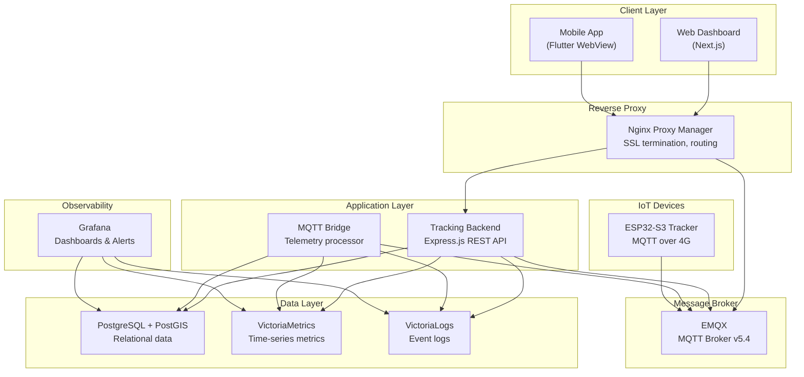
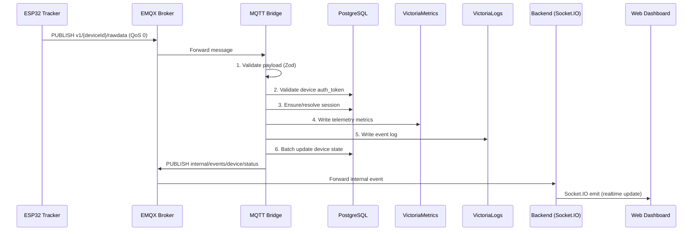
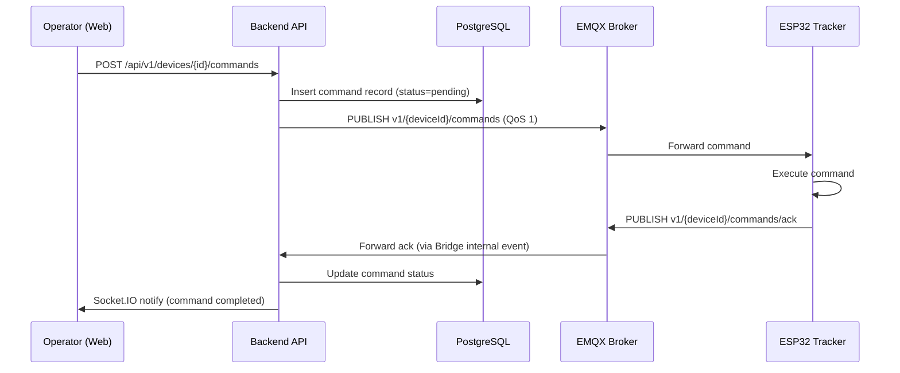
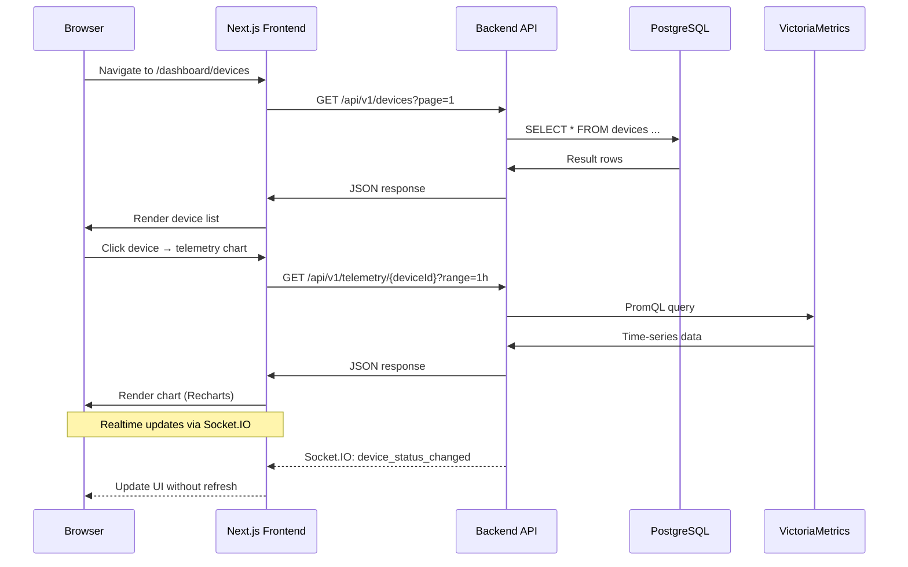
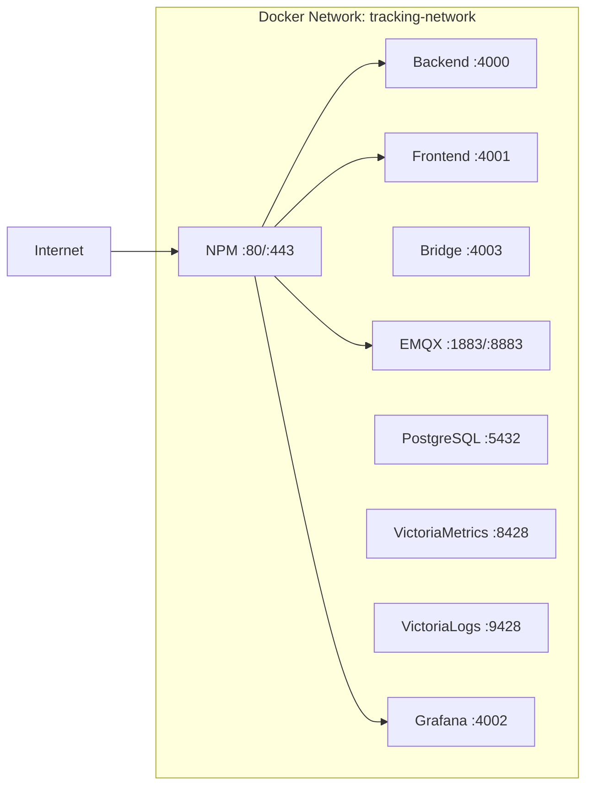

# 01 - System Architecture

> Kiến trúc tổng thể hệ thống cloud IoT Vehicle Tracking — các service, data flow, và cách chúng kết nối.

---

## Mục lục

1. [Tổng quan hệ thống](#1-tổng-quan-hệ-thống)
2. [Service Map](#2-service-map)
3. [Data Flow: Device → Cloud](#3-data-flow-device--cloud)
4. [Data Flow: Cloud → Device](#4-data-flow-cloud--device)
5. [Data Flow: User → Dashboard](#5-data-flow-user--dashboard)
6. [Network Topology](#6-network-topology)
7. [Port Mapping](#7-port-mapping)
8. [Design Decisions](#8-design-decisions)

---

## 1. Tổng quan hệ thống

Hệ thống cloud gồm **12 service** chạy trên Docker, kết nối qua Docker network `tracking-network`.
Mỗi service có trách nhiệm riêng biệt, giao tiếp qua MQTT, HTTP, hoặc PostgreSQL.

---

## 2. Service Map

| Service | Image | Vai trò | Port |
|---------|-------|---------|------|
| **Tracking_Backend** | Node.js (Express) | REST API, WebSocket, MQTT command publisher | 4000 |
| **Tracking_MqttBridge** | Node.js (standalone) | Subscribe MQTT → process → write DB/metrics | 4003 (health) |
| **Tracking_Frontend** | Next.js 16 | Web dashboard (SSR + SPA) | 4001 |
| **Tracking_Mobile** | Flutter | Mobile app (WebView hybrid) | — |
| **Tracking_EMQX** | emqx/emqx:5.4.0 | MQTT broker (TCP/TLS/WS) | 1883, 8883, 8083, 18083 |
| **Tracking_PostgreSQL** | postgis/postgis:16-3.4 | Relational DB + spatial queries | 5432 |
| **Tracking_VictoriaMetrics** | victoria-metrics:v1.96.0 | Time-series storage (30d retention) | 8428 |
| **Tracking_VictoriaLogs** | victoria-logs:v1.3.1 | Structured event logs (7d retention) | 9428 |
| **Tracking_Grafana** | grafana:10.2.0 | Monitoring dashboards | 4002 |
| **Tracking_NPM** | nginx-proxy-manager:2.11.3 | Reverse proxy + SSL | 80, 443, 81 |

---

## 3. Data Flow: Device → Cloud

**Giải thích:**
- Device gửi telemetry mỗi 5–10 giây qua MQTT QoS 0 (chấp nhận mất vài message)
- Bridge xử lý tuần tự: validate → auth → session → write metrics → write logs → batch DB
- Internal events được publish lên MQTT topic riêng → Backend lắng nghe → push realtime qua Socket.IO

---

## 4. Data Flow: Cloud → Device

---

## 5. Data Flow: User → Dashboard

---

## 6. Network Topology

Tất cả service nằm trong cùng Docker network `tracking-network` (external).
NPM là điểm vào duy nhất từ internet — xử lý SSL termination và routing.

---

## 7. Port Mapping

| Port | Service | Protocol | Mô tả |
|------|---------|----------|--------|
| 80 | NPM | HTTP | Redirect → HTTPS |
| 443 | NPM | HTTPS | Web dashboard, API |
| 81 | NPM | HTTP | NPM admin panel |
| 1883 | EMQX | MQTT | Device connections (internal) |
| 8883 | NPM→EMQX | MQTTS | Device connections (TLS via NPM) |
| 4000 | Backend | HTTP | REST API + WebSocket |
| 4001 | Frontend | HTTP | Next.js SSR |
| 4002 | Grafana | HTTP | Monitoring |
| 4003 | Bridge | HTTP | Health check endpoint |
| 5432 | PostgreSQL | TCP | Database |
| 8428 | VictoriaMetrics | HTTP | Metrics write/query |
| 9428 | VictoriaLogs | HTTP | Logs write/query |
| 18083 | EMQX | HTTP | EMQX Dashboard |

---

## 8. Design Decisions

| Quyết định | Lý do |
|------------|-------|
| **EMQX thay vì Mosquitto** | Cần authentication built-in, dashboard, clustering support cho production |
| **Tách Bridge khỏi Backend** | Bridge xử lý high-throughput MQTT (hàng nghìn msg/s), Backend phục vụ REST API — tách để scale độc lập |
| **VictoriaMetrics thay vì InfluxDB** | Nhẹ hơn, tương thích PromQL, single binary, ít RAM hơn |
| **VictoriaLogs thay vì Elasticsearch** | Nhẹ hơn 10x, đủ cho structured event logs, không cần full-text search phức tạp |
| **PostgreSQL + PostGIS** | Cần spatial queries (geofence, distance), relational integrity, mature ecosystem |
| **Next.js 16 (App Router)** | SSR cho SEO, React Server Components giảm bundle size, built-in API routes |
| **Socket.IO cho realtime** | Fallback transport (WebSocket → polling), room-based broadcasting, reconnection logic |
| **NPM cho reverse proxy** | UI quản lý SSL/Let's Encrypt dễ dàng, không cần viết nginx config thủ công |
| **Flutter WebView hybrid** | Tái sử dụng web dashboard, thêm native features (push notification, offline) |
| **Batch writer pattern** | Giảm DB connections, tránh N+1 writes, circuit breaker khi DB quá tải |

---

> **Tiếp theo:** [02-mqtt-bridge-service.md](./02-mqtt-bridge-service.md) — Chi tiết MQTT Bridge — service xử lý telemetry từ device
