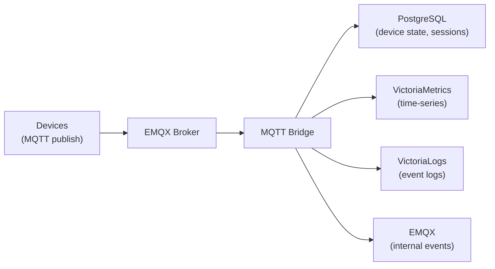
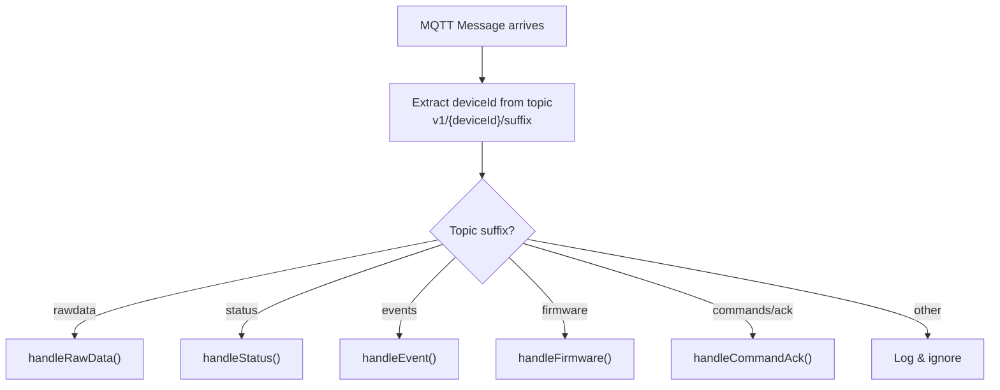
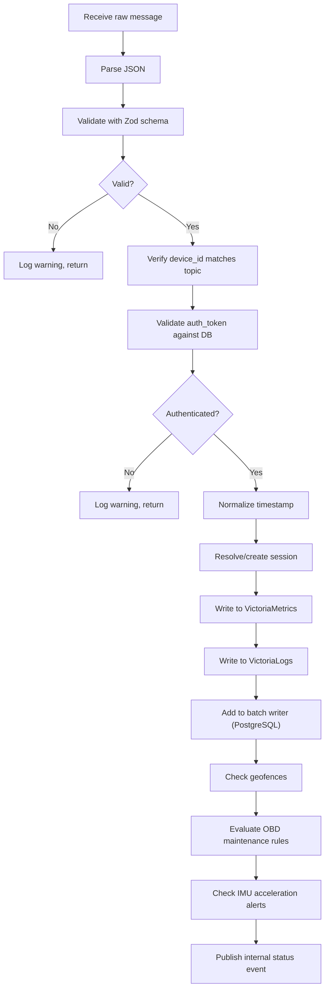
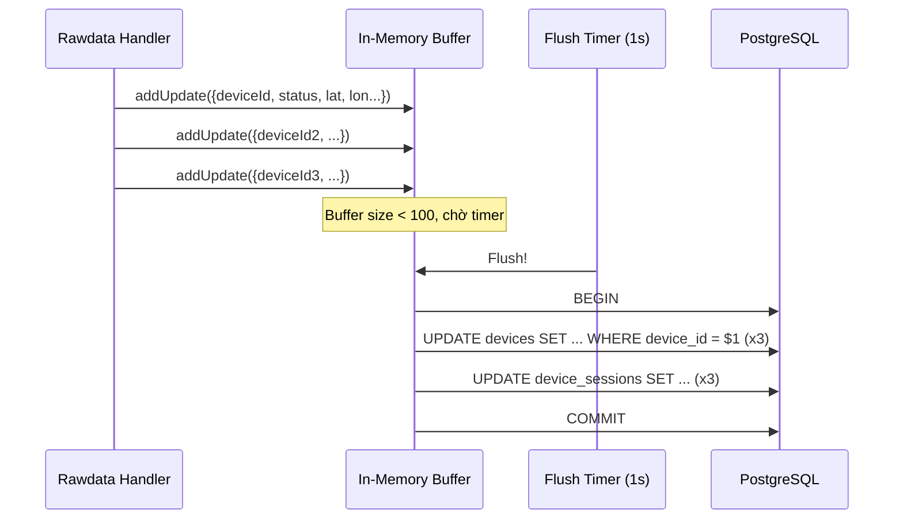
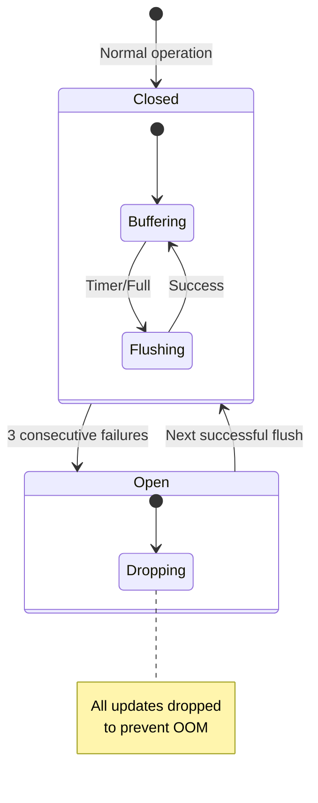
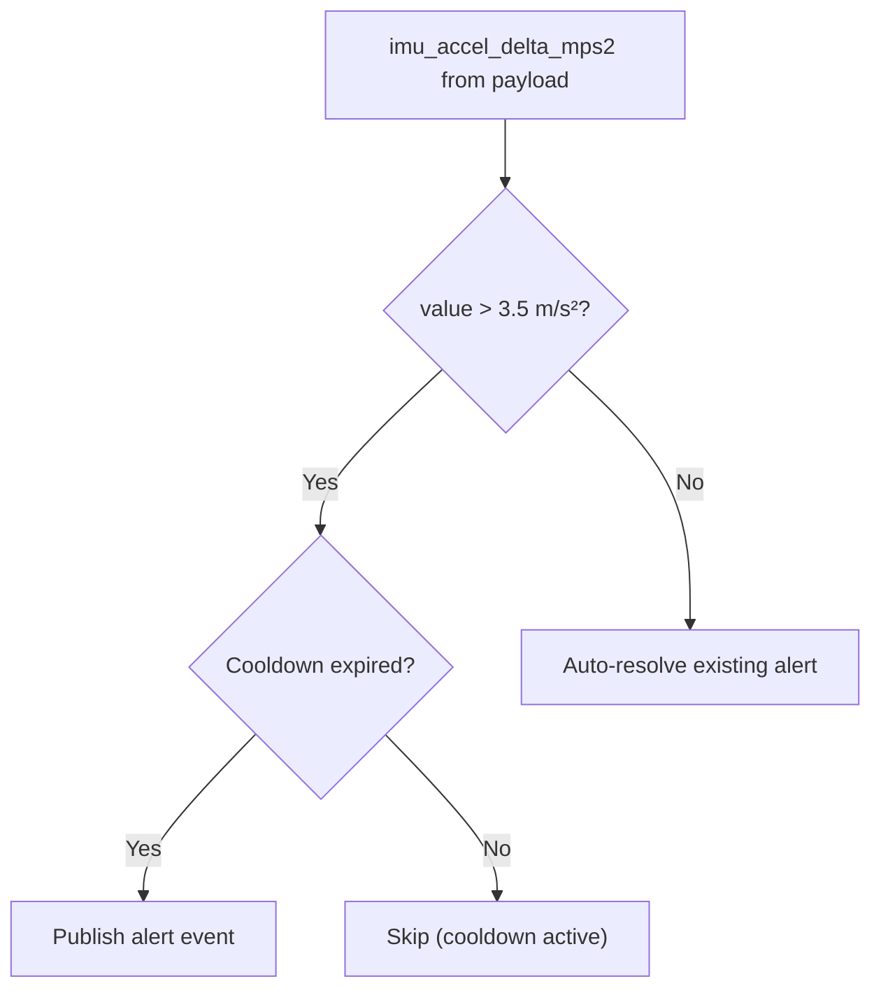
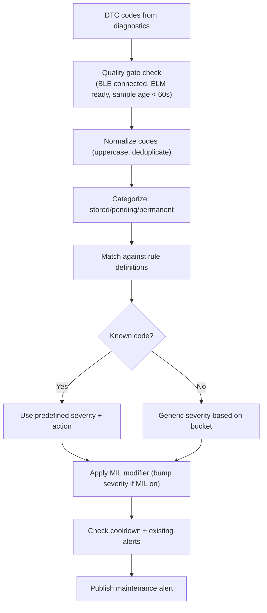
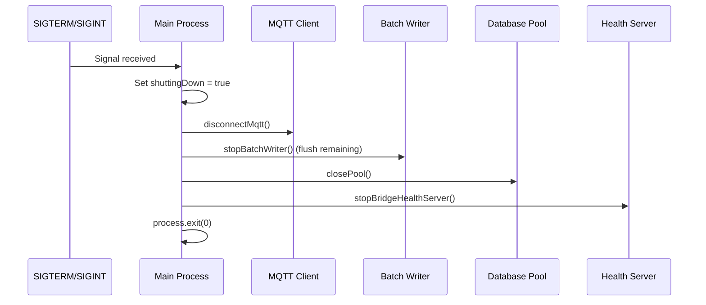

# 02 - MQTT Bridge Service

> Service cốt lõi xử lý telemetry từ device — subscribe MQTT topics, validate, persist vào DB/metrics/logs.

---

## Mục lục

1. [Vai trò của MQTT Bridge](#1-vai-trò-của-mqtt-bridge)
2. [Topic Structure](#2-topic-structure)
3. [Message Routing](#3-message-routing)
4. [Rawdata Handler Flow](#4-rawdata-handler-flow)
5. [Batch Writer Pattern](#5-batch-writer-pattern)
6. [Internal Event Publishing](#6-internal-event-publishing)
7. [Device State Cache](#7-device-state-cache)
8. [Alert Engine (OBD + IMU)](#8-alert-engine-obd--imu)
9. [Graceful Shutdown](#9-graceful-shutdown)
10. [File Map](#10-file-map)

---

## 1. Vai trò của MQTT Bridge

MQTT Bridge là **data ingestion pipeline** — nhận raw telemetry từ hàng trăm device,
xử lý real-time, và phân phối vào các storage backends:



**Đặc điểm:**
- Stateless (có thể restart bất kỳ lúc nào)
- In-memory cache cho device state (rebuild từ DB khi restart)
- Circuit breaker cho DB writes (tránh OOM khi DB down)
- Health endpoint cho monitoring

---

## 2. Topic Structure

### Device Topics (subscribe)

| Topic Pattern | QoS | Mô tả |
|---------------|-----|--------|
| `v1/+/rawdata` | 0 | Telemetry data (GPS, speed, battery, OBD, IMU) |
| `v1/+/status` | 1 | Device state transitions (online/offline/running/stopped) |
| `v1/+/events` | 1 | Error events, warnings |
| `v1/+/firmware` | 1 | OTA progress reports |
| `v1/+/commands/ack` | 1 | Command execution acknowledgments |

**Giải thích QoS:**
- QoS 0 cho rawdata: Telemetry gửi mỗi 5–10s, mất 1–2 message không ảnh hưởng
- QoS 1 cho status/events/firmware: Quan trọng, cần đảm bảo delivery

### Internal Topics (publish)

| Topic | Mô tả |
|-------|--------|
| `internal/events/device/status` | Device status changed |
| `internal/events/device/alert` | Alert triggered |
| `internal/events/device/session` | Session created/closed |
| `internal/events/device/data` | Telemetry summary |
| `internal/events/device/zone` | Geofence enter/exit |
| `internal/events/device/firmware` | OTA status update |
| `internal/events/device/command` | Command ack received |

---

## 3. Message Routing



**Code pattern:**

```typescript
// src/index.ts — Message router
const routeMessage = (topic: string, message: Buffer): void => {
  const deviceId = extractDeviceId(topic); // v1/{deviceId}/...
  if (!deviceId) return;

  const suffix = topic.split('/').slice(2).join('/');

  switch (suffix) {
    case 'rawdata':
      handleRawData(deviceId, message).catch(logError);
      break;
    case 'status':
      handleStatus(deviceId, message).catch(logError);
      break;
    // ...
  }
};
```

---

## 4. Rawdata Handler Flow

Handler phức tạp nhất — xử lý telemetry payload từ device:



**Xử lý timestamp:**
- Ưu tiên `payload.timestamp` (device clock)
- Fallback `metadata.sent_at` (modem clock)
- Last resort: server `Date.now()`

**Session management:**
- Firmware gửi `local_session` object (boot_id + session_seq)
- Bridge dùng authoritative session identity để map vào DB session
- Nếu không có session → tạo mới dựa trên ignition/speed state

---

## 5. Batch Writer Pattern

Thay vì UPDATE device state mỗi message (hàng trăm writes/s), Bridge buffer lại và flush theo batch:



**Cấu hình:**
- `MAX_BUFFER_SIZE = 100` — flush ngay khi đạt 100 items
- `FLUSH_INTERVAL_MS = 1000` — flush mỗi 1 giây dù chưa đầy
- `MAX_CONSECUTIVE_FAILURES = 3` — circuit breaker mở sau 3 lần flush thất bại

**Circuit Breaker:**



---

## 6. Internal Event Publishing

Bridge publish internal events lên MQTT để Backend lắng nghe và push realtime:

```typescript
// src/publishers/internal-event.publisher.ts
publishInternalEvent('status', {
  device_id: deviceId,
  status: 'running',
  latitude: 10.76,
  longitude: 106.66,
  speed: 45.2,
  session_id: 123,
});
// → Publish to: internal/events/device/status
```

**Event types:**
- `status` — Device online/offline/running/stopped
- `alert` — Maintenance alert, IMU alert, geofence violation
- `session` — Session created/closed
- `data` — Telemetry summary (cho realtime map)
- `zone` — Geofence enter/exit
- `firmware` — OTA progress
- `command` — Command ack from device

---

## 7. Device State Cache

In-memory cache lưu trạng thái mới nhất của mỗi device (tránh query DB mỗi message):

```typescript
// src/cache/device-state.cache.ts
interface DeviceState {
  status: 'online' | 'offline' | 'running' | 'stopped';
  sessionId?: number;
  runtimeState: RuntimeStateSnapshot;
  lastTimestampMs: number;
}

// Get cached state
const state = getStatus(deviceId);

// Update cache after processing
setStatus(deviceId, newState);

// Resolve session from cache (avoid DB lookup)
const sessionId = resolveSessionId(deviceId);
```

**Đặc điểm:**
- Rebuild từ DB khi Bridge restart
- TTL-based eviction cho devices offline lâu
- Thread-safe (single-threaded Node.js)

---

## 8. Alert Engine (OBD + IMU)

Bridge đánh giá realtime alerts dựa trên telemetry data:

### IMU Acceleration Alert



### OBD Maintenance Rules

| Rule | Condition | Severity |
|------|-----------|----------|
| Channel unstable | connect_fail_count_5m ≥ 3 | medium |
| Coolant risk | coolant ≥ 105°C AND load ≥ 60% | high |
| Idle-load anomaly | RPM > 900 AND speed ≤ 3 km/h for > 10 min | medium |
| Voltage risk | battery < 12V AND load > 50% | high |
| DTC codes | Stored/pending/permanent codes detected | varies |

### DTC (Diagnostic Trouble Code) Processing



---

## 9. Graceful Shutdown



---

## 10. File Map

| File | Vai trò |
|------|---------|
| `src/index.ts` | Entry point, message router, lifecycle |
| `src/mqtt/client.ts` | MQTT connection management |
| `src/mqtt/subscriptions.ts` | Topic subscription with QoS |
| `src/handlers/rawdata.handler.ts` | Telemetry processing (phức tạp nhất) |
| `src/handlers/status.handler.ts` | Device status transitions |
| `src/handlers/event.handler.ts` | Error/warning events |
| `src/handlers/firmware.handler.ts` | OTA progress |
| `src/services/batch-writer.service.ts` | Buffered DB writes + circuit breaker |
| `src/services/bridge-health.service.ts` | HTTP health endpoint |
| `src/services/device-auth.service.ts` | Device token validation |
| `src/services/geofence-checker.service.ts` | Geofence enter/exit detection |
| `src/publishers/internal-event.publisher.ts` | Publish to internal MQTT topics |
| `src/publishers/session-assignment.publisher.ts` | Session lifecycle events |
| `src/cache/device-state.cache.ts` | In-memory device state |
| `src/cache/geofence-state.cache.ts` | Geofence state per device |
| `src/infrastructure/database.ts` | PostgreSQL pool + queries |
| `src/infrastructure/victoriametrics.ts` | Metrics write (Prometheus format) |
| `src/infrastructure/victorialogs.ts` | Event log write |
| `src/infrastructure/logger.ts` | Pino structured logging |
| `src/validators/payload.validator.ts` | Zod schemas for payloads |
| `src/config/env.ts` | Environment configuration |
| `src/constants/topics.ts` | MQTT topic constants |

---

> **Tiếp theo:** [03-backend-api-service.md](./03-backend-api-service.md) — Backend REST API — Express.js service phục vụ dashboard
