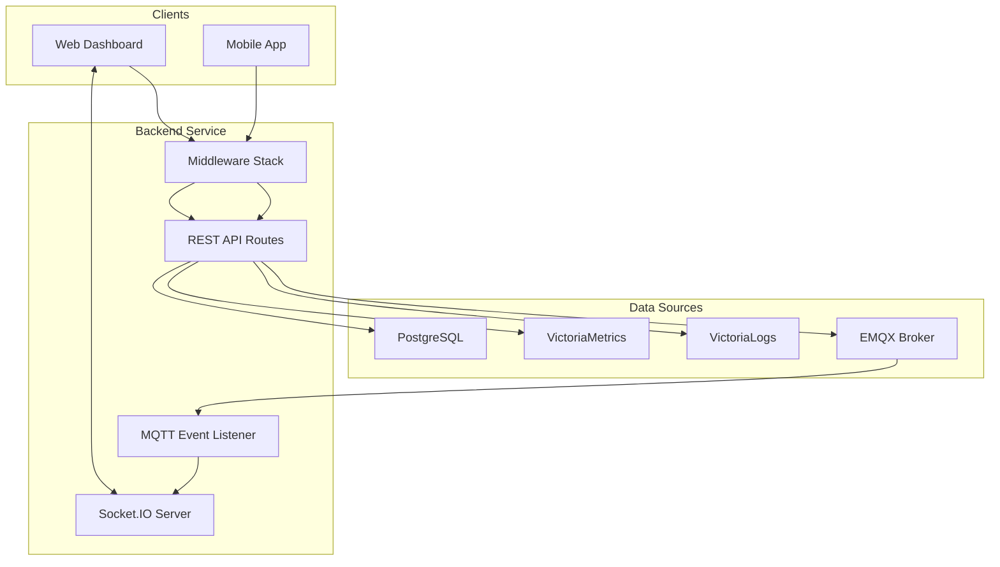
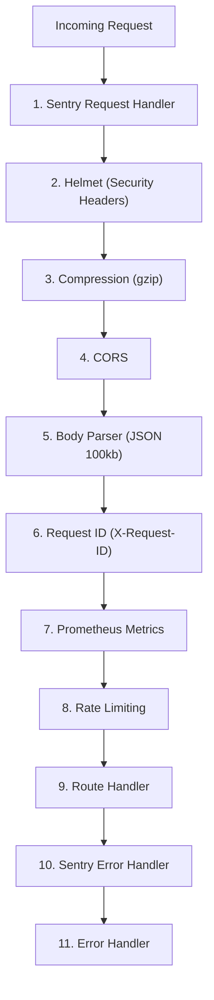
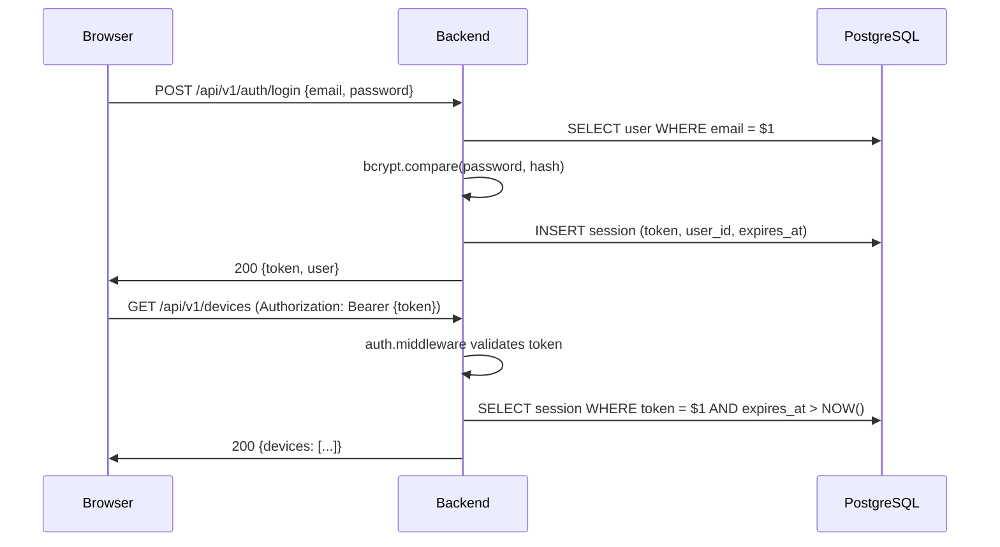
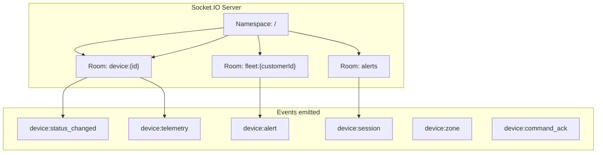
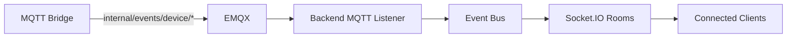

# 03 - Backend API Service

> Express.js REST API — phục vụ dashboard, quản lý devices, gửi commands, realtime WebSocket.

---

## Mục lục

1. [Vai trò của Backend](#1-vai-trò-của-backend)
2. [Middleware Pipeline](#2-middleware-pipeline)
3. [Domain-Driven Structure](#3-domain-driven-structure)
4. [Authentication & Authorization](#4-authentication--authorization)
5. [Realtime (Socket.IO)](#5-realtime-socketio)
6. [MQTT Event Listener](#6-mqtt-event-listener)
7. [API Versioning](#7-api-versioning)
8. [Error Handling](#8-error-handling)
9. [Graceful Shutdown](#9-graceful-shutdown)
10. [File Map](#10-file-map)

---

## 1. Vai trò của Backend

Backend là **API gateway** cho toàn bộ hệ thống:
- REST API cho Frontend/Mobile
- WebSocket (Socket.IO) cho realtime updates
- MQTT publisher cho device commands
- Proxy queries tới VictoriaMetrics/VictoriaLogs



---

## 2. Middleware Pipeline

Request đi qua middleware theo thứ tự:



**Chi tiết từng middleware:**

| # | Middleware | Mục đích |
|---|-----------|----------|
| 1 | Sentry | Capture request context cho error tracking |
| 2 | Helmet | Set security headers (CSP, HSTS, X-Frame-Options) |
| 3 | Compression | Gzip response (skip firmware hex downloads) |
| 4 | CORS | Allow frontend origin, credentials |
| 5 | Body Parser | Parse JSON body, limit 100kb |
| 6 | Request ID | Generate/forward X-Request-ID cho tracing |
| 7 | Metrics | Count requests, measure latency (Prometheus) |
| 8 | Rate Limit | Throttle requests per IP |
| 9 | Routes | Business logic |
| 10 | Sentry Error | Capture unhandled errors |
| 11 | Error Handler | Format error response, log |

---

## 3. Domain-Driven Structure

Backend tổ chức theo **domain modules** — mỗi domain có repositories, services, types riêng:

```
src/
├── api/
│   ├── controllers/     # Request/response handling
│   ├── routes/          # Express router definitions
│   ├── validators/      # Zod request validation
│   └── openapi/         # Swagger spec
├── domain/
│   ├── alert/           # Alert management
│   ├── audit/           # Audit logging
│   ├── auth/            # Authentication/sessions
│   ├── customer/        # Multi-tenant customers
│   ├── dashboard/       # Dashboard aggregations
│   ├── device/          # Device CRUD + commands
│   ├── driver/          # Driver management
│   ├── firmware/        # OTA firmware management
│   ├── fuel-analytics/  # Fuel consumption analysis
│   ├── geofence/        # Geofence CRUD + checks
│   ├── iot/             # IoT command publishing
│   ├── maintenance/     # Maintenance scheduling
│   ├── notification/    # Push notifications
│   ├── statistics/      # Fleet statistics
│   ├── telemetry/       # Telemetry queries (VM)
│   ├── trip/            # Trip/session management
│   ├── vehicle/         # Vehicle CRUD
│   ├── violation/       # Speed/geofence violations
│   └── zone/            # Zone management
├── infrastructure/
│   ├── database/        # PostgreSQL pool
│   ├── logger/          # Winston structured logging
│   ├── metrics/         # Prometheus client
│   └── realtime/        # Socket.IO + MQTT listener
├── middleware/          # Express middlewares
└── shared/
    ├── contracts/       # Shared interfaces
    ├── serializers/     # Response formatters
    ├── types/           # Shared types
    └── utils/           # Utility functions
```

**Pattern cho mỗi domain:**

```typescript
// domain/device/repositories/device.repository.ts
export const findDeviceById = async (id: string) => { /* SQL query */ };

// domain/device/services/device.service.ts
export const getDeviceDetails = async (id: string) => {
  const device = await findDeviceById(id);
  // Business logic...
  return device;
};

// api/controllers/device.controller.ts
export const getDevice = async (req: Request, res: Response) => {
  const device = await getDeviceDetails(req.params.id);
  res.json(device);
};
```

---

## 4. Authentication & Authorization

### Session-based Auth



### Role-based Access

| Role | Quyền |
|------|--------|
| `super_admin` | Full access, system settings |
| `admin` | Manage devices, users, customers |
| `operator` | View devices, send commands |
| `viewer` | Read-only access |

### Auth Middleware

```typescript
// src/middleware/auth.middleware.ts
export const authMiddleware = async (req, res, next) => {
  const token = req.headers.authorization?.replace('Bearer ', '');
  if (!token) return res.status(401).json({ error: 'Unauthorized' });

  const session = await validateSession(token);
  if (!session) return res.status(401).json({ error: 'Session expired' });

  req.user = session.user;
  req.sessionId = session.id;
  next();
};
```

---

## 5. Realtime (Socket.IO)

Backend chạy Socket.IO server song song với HTTP server:



**Client subscription:**

```typescript
// Frontend connects and joins rooms
socket.emit('subscribe', { deviceIds: ['DEV001', 'DEV002'] });

// Listen for realtime updates
socket.on('device:status_changed', (data) => {
  // Update UI without page refresh
});
```

---

## 6. MQTT Event Listener

Backend subscribe internal MQTT topics (published by Bridge) và forward qua Socket.IO:



**Luồng:**
1. Bridge publish `internal/events/device/status` khi device thay đổi trạng thái
2. Backend MQTT listener nhận message
3. Parse và route vào Socket.IO room tương ứng
4. Clients trong room nhận realtime update

---

## 7. API Versioning

```typescript
// Canonical path
app.use('/api/v1', routes);

// Compatibility alias (legacy clients)
app.use('/api', routes);
```

**Endpoints không cần auth:**
- `GET /health` — Health check
- `GET /ws-health` — WebSocket health
- `GET /metrics` — Prometheus metrics
- `GET /api-docs` — Swagger UI

---

## 8. Error Handling

```typescript
// src/middleware/error-handler.middleware.ts
export const errorHandler = (err, req, res, next) => {
  const statusCode = err.statusCode || 500;
  const message = err.isOperational ? err.message : 'Internal server error';

  logger.error({
    err,
    requestId: req.id,
    method: req.method,
    path: req.path,
    statusCode,
  });

  res.status(statusCode).json({
    error: message,
    requestId: req.id,
    ...(appConfig.isProduction ? {} : { stack: err.stack }),
  });
};
```

**Error categories:**
- `400` — Validation error (Zod)
- `401` — Unauthorized (no/invalid token)
- `403` — Forbidden (insufficient role)
- `404` — Resource not found
- `429` — Rate limited
- `500` — Internal error (logged to Sentry)

---

## 9. Graceful Shutdown

```typescript
const gracefulShutdown = (signal: string) => {
  server.close(async () => {
    await closeMqttEventListener();  // Stop MQTT subscription
    await closeSocketServer();        // Disconnect all WebSocket clients
    await closePool();                // Close DB connections
    process.exit(0);
  });

  // Force kill after 10s
  setTimeout(() => process.exit(1), 10_000);
};

process.on('SIGTERM', () => gracefulShutdown('SIGTERM'));
process.on('SIGINT', () => gracefulShutdown('SIGINT'));
```

---

## 10. File Map

| File | Vai trò |
|------|---------|
| `src/index.ts` | App bootstrap, middleware setup, server start |
| `src/config/env.ts` | Environment variables (typed) |
| `src/config/sentry.ts` | Sentry SDK initialization |
| `src/api/routes/index.ts` | Route aggregator |
| `src/api/routes/health.routes.ts` | Health check endpoints |
| `src/api/routes/metrics.routes.ts` | Prometheus metrics endpoint |
| `src/api/openapi/spec.ts` | Swagger/OpenAPI specification |
| `src/middleware/auth.middleware.ts` | JWT/session validation |
| `src/middleware/error-handler.middleware.ts` | Global error handler |
| `src/middleware/rate-limit.middleware.ts` | Rate limiting |
| `src/middleware/request-id.middleware.ts` | Request ID generation |
| `src/middleware/metrics.middleware.ts` | HTTP metrics collection |
| `src/infrastructure/database/pool.ts` | PostgreSQL connection pool |
| `src/infrastructure/logger/index.ts` | Winston logger |
| `src/infrastructure/realtime/index.ts` | Socket.IO + MQTT listener |
| `src/infrastructure/metrics/index.ts` | Prometheus client setup |

---

> **Tiếp theo:** [04-frontend-dashboard.md](./04-frontend-dashboard.md) — Next.js Web Dashboard — kiến trúc frontend
