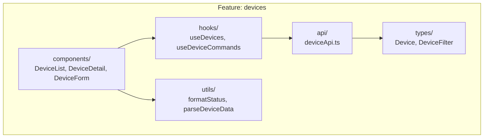
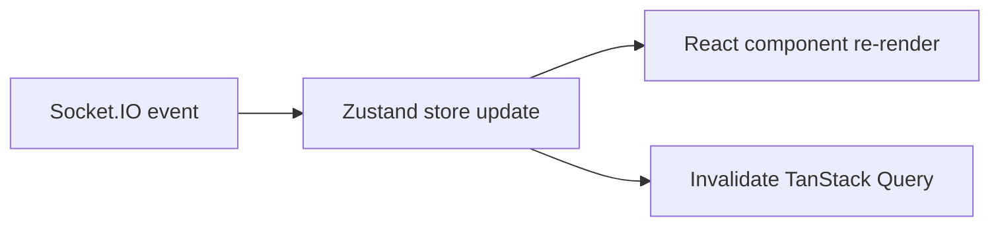
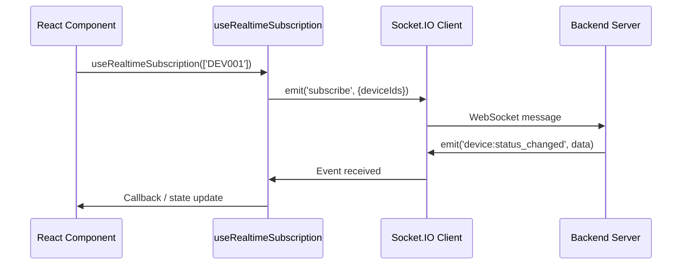
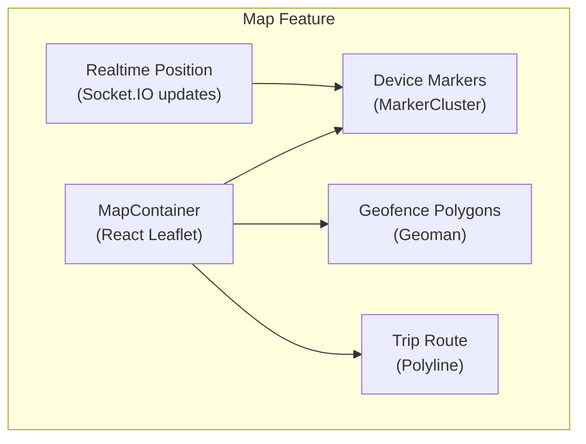
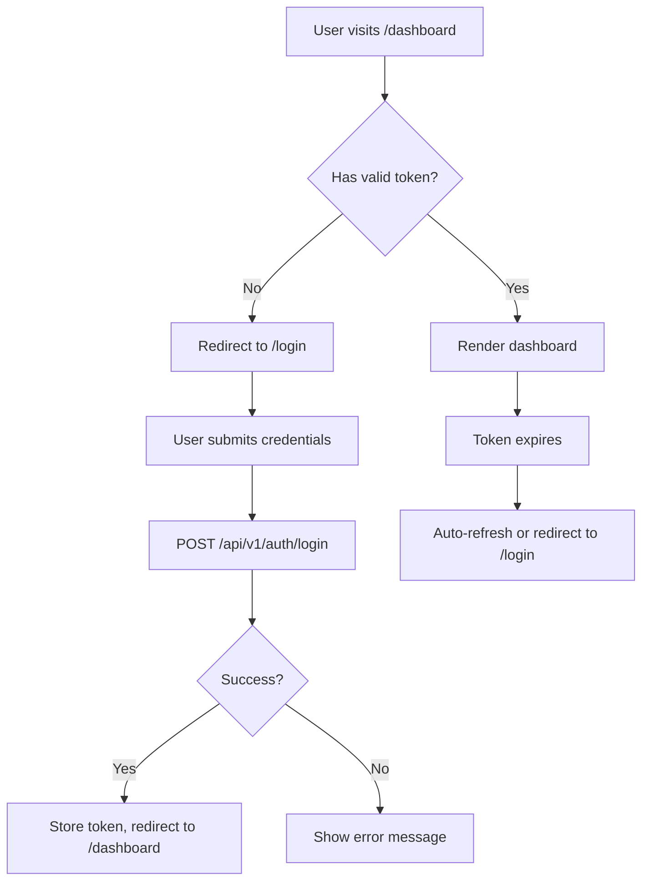

# 04 - Frontend Dashboard

> Next.js 16 Web Dashboard — kiến trúc feature-based, realtime updates, map tracking.

---

## Mục lục

1. [Tech Stack](#1-tech-stack)
2. [Project Structure](#2-project-structure)
3. [Feature-Based Architecture](#3-feature-based-architecture)
4. [State Management](#4-state-management)
5. [Realtime Updates (Socket.IO)](#5-realtime-updates-socketio)
6. [Map Integration (Leaflet)](#6-map-integration-leaflet)
7. [Data Fetching (TanStack Query)](#7-data-fetching-tanstack-query)
8. [UI Component System](#8-ui-component-system)
9. [Authentication Flow](#9-authentication-flow)
10. [File Map](#10-file-map)

---

## 1. Tech Stack

| Library | Version | Vai trò |
|---------|---------|---------|
| Next.js | 16.1.6 | Framework (App Router, SSR) |
| React | 19.2.3 | UI library |
| TypeScript | 5.x | Type safety |
| TanStack Query | 5.x | Server state management |
| Zustand | 5.x | Client state management |
| Socket.IO Client | 4.8.3 | Realtime WebSocket |
| React Leaflet | 5.x | Map rendering |
| Recharts | 3.x | Charts/graphs |
| Radix UI | 1.4.3 | Accessible primitives |
| Tailwind CSS | 4.x | Styling |
| shadcn/ui | — | Component library |
| React Hook Form | 7.x | Form management |
| Zod | 4.x | Schema validation |
| Axios | 1.x | HTTP client |

---

## 2. Project Structure

```
src/
├── app/                    # Next.js App Router pages
│   ├── dashboard/          # Protected dashboard routes
│   │   ├── devices/
│   │   ├── vehicles/
│   │   ├── trips/
│   │   ├── alerts/
│   │   ├── map/
│   │   ├── geofences/
│   │   ├── statistics/
│   │   └── settings/
│   ├── login/              # Public login page
│   ├── layout.tsx          # Root layout (providers)
│   └── page.tsx            # Landing/redirect
├── features/               # Feature modules (business logic)
│   ├── admin/
│   ├── alerts/
│   ├── auth/
│   ├── customers/
│   ├── dashboard/
│   ├── devices/
│   ├── drivers/
│   ├── fuel-analytics/
│   ├── geofences/
│   ├── maintenance/
│   ├── map/
│   ├── notifications/
│   ├── settings/
│   ├── statistics/
│   ├── trips/
│   ├── vehicles/
│   └── violations/
├── components/             # Shared UI components
│   ├── ui/                 # shadcn/ui primitives
│   ├── common/             # Reusable business components
│   ├── layout/             # Sidebar, header, etc.
│   └── providers/          # Context providers
├── hooks/                  # Shared custom hooks
├── lib/                    # Utilities & configurations
│   ├── api/                # Axios instance, interceptors
│   ├── stores/             # Zustand stores
│   ├── utils/              # Helper functions
│   └── validations/        # Shared Zod schemas
├── config/                 # App configuration
└── types/                  # Global TypeScript types
```

---

## 3. Feature-Based Architecture

Mỗi feature là một module độc lập chứa mọi thứ cần thiết:



**Quy tắc:**
- Feature KHÔNG import từ feature khác (trừ shared types)
- Feature export components qua `index.ts`
- Shared logic nằm trong `src/hooks/` hoặc `src/lib/`

---

## 4. State Management

### Server State (TanStack Query)

Dùng cho data từ API — auto caching, refetching, invalidation:

```typescript
// features/devices/hooks/useDevices.ts
export const useDevices = (filters: DeviceFilter) => {
  return useQuery({
    queryKey: ['devices', filters],
    queryFn: () => deviceApi.getDevices(filters),
    staleTime: 30_000, // 30s before refetch
  });
};
```

### Client State (Zustand)

Dùng cho UI state — sidebar, theme, filters:

```typescript
// lib/stores/sidebar.store.ts
export const useSidebarStore = create<SidebarState>((set) => ({
  isOpen: true,
  toggle: () => set((state) => ({ isOpen: !state.isOpen })),
}));
```

### Realtime State (Socket.IO + Zustand)

Device status updates qua WebSocket → update Zustand store → React re-render:



---

## 5. Realtime Updates (Socket.IO)



**Custom hook pattern:**

```typescript
// hooks/use-realtime-subscription.ts
export const useRealtimeSubscription = (deviceIds: string[]) => {
  useEffect(() => {
    const socket = getSocket();
    socket.emit('subscribe', { deviceIds });

    socket.on('device:status_changed', handleStatusChange);
    socket.on('device:telemetry', handleTelemetry);

    return () => {
      socket.emit('unsubscribe', { deviceIds });
      socket.off('device:status_changed');
      socket.off('device:telemetry');
    };
  }, [deviceIds]);
};
```

---

## 6. Map Integration (Leaflet)



**Libraries:**
- `react-leaflet` — React wrapper cho Leaflet
- `react-leaflet-cluster` — Marker clustering (nhiều devices)
- `@geoman-io/leaflet-geoman-free` — Draw/edit geofence polygons

**Realtime vehicle tracking:**

```typescript
// features/map/components/VehicleMarker.tsx
const VehicleMarker = ({ device }) => {
  const position = useDevicePosition(device.id); // Realtime hook

  return (
    <Marker position={[position.lat, position.lng]}>
      <Popup>
        <DeviceInfo device={device} speed={position.speed} />
      </Popup>
    </Marker>
  );
};
```

---

## 7. Data Fetching (TanStack Query)

### Query Pattern

```typescript
// features/trips/hooks/useTrips.ts
export const useTrips = (deviceId: string, dateRange: DateRange) => {
  return useQuery({
    queryKey: ['trips', deviceId, dateRange],
    queryFn: () => tripApi.getTrips(deviceId, dateRange),
    enabled: !!deviceId, // Only fetch when deviceId available
  });
};
```

### Mutation Pattern

```typescript
// hooks/mutations/useDeviceCommand.ts
export const useDeviceCommand = () => {
  const queryClient = useQueryClient();

  return useMutation({
    mutationFn: (params: { deviceId: string; command: string }) =>
      deviceApi.sendCommand(params.deviceId, params.command),
    onSuccess: (_, { deviceId }) => {
      queryClient.invalidateQueries({ queryKey: ['device', deviceId] });
      toast.success('Command sent successfully');
    },
  });
};
```

### Infinite List Pattern

```typescript
// hooks/use-infinite-list-query.ts
export const useInfiniteListQuery = (queryKey, fetchFn) => {
  return useInfiniteQuery({
    queryKey,
    queryFn: ({ pageParam = 1 }) => fetchFn({ page: pageParam }),
    getNextPageParam: (lastPage) => lastPage.nextPage ?? undefined,
  });
};
```

---

## 8. UI Component System

Dựa trên **shadcn/ui** — copy-paste components, fully customizable:

```
components/ui/
├── button.tsx
├── card.tsx
├── dialog.tsx
├── dropdown-menu.tsx
├── input.tsx
├── select.tsx
├── table.tsx
├── tabs.tsx
├── toast.tsx (sonner)
└── ...
```

**Styling approach:**
- Tailwind CSS 4 (utility-first)
- `class-variance-authority` cho component variants
- `tailwind-merge` cho class merging
- CSS variables cho theming (dark/light mode via `next-themes`)

**Example component:**

```typescript
// components/ui/button.tsx
const buttonVariants = cva(
  "inline-flex items-center justify-center rounded-md text-sm font-medium",
  {
    variants: {
      variant: {
        default: "bg-primary text-primary-foreground hover:bg-primary/90",
        destructive: "bg-destructive text-destructive-foreground",
        outline: "border border-input bg-background hover:bg-accent",
      },
      size: {
        default: "h-10 px-4 py-2",
        sm: "h-9 rounded-md px-3",
        lg: "h-11 rounded-md px-8",
      },
    },
  }
);
```

---

## 9. Authentication Flow



**Middleware (Next.js):**

```typescript
// middleware.ts
export function middleware(request: NextRequest) {
  const token = request.cookies.get('session_token');
  const isAuthPage = request.nextUrl.pathname.startsWith('/login');

  if (!token && !isAuthPage) {
    return NextResponse.redirect(new URL('/login', request.url));
  }

  if (token && isAuthPage) {
    return NextResponse.redirect(new URL('/dashboard', request.url));
  }
}
```

---

## 10. File Map

| File/Folder | Vai trò |
|-------------|---------|
| `src/app/layout.tsx` | Root layout (providers, fonts, metadata) |
| `src/app/dashboard/` | Protected dashboard pages |
| `src/features/` | Feature modules (components + hooks + api) |
| `src/components/ui/` | shadcn/ui primitives |
| `src/components/layout/` | Sidebar, header, breadcrumbs |
| `src/components/providers/` | QueryClient, Theme, Socket providers |
| `src/hooks/use-realtime-subscription.ts` | Socket.IO subscription hook |
| `src/hooks/use-device-status-realtime.ts` | Device status realtime hook |
| `src/hooks/use-role-access.ts` | Role-based UI visibility |
| `src/lib/api/` | Axios instance + interceptors |
| `src/lib/stores/` | Zustand stores |
| `src/lib/utils.ts` | cn() helper (clsx + tailwind-merge) |
| `src/config/nav-config.ts` | Sidebar navigation items |
| `src/config/dashboard-route-registry.ts` | Route definitions |
| `middleware.ts` | Next.js auth middleware |
| `next.config.ts` | Next.js configuration |
| `components.json` | shadcn/ui configuration |

---

> **Tiếp theo:** [05-emqx-mqtt-broker.md](./05-emqx-mqtt-broker.md) — EMQX MQTT Broker — cấu hình và quản lý
