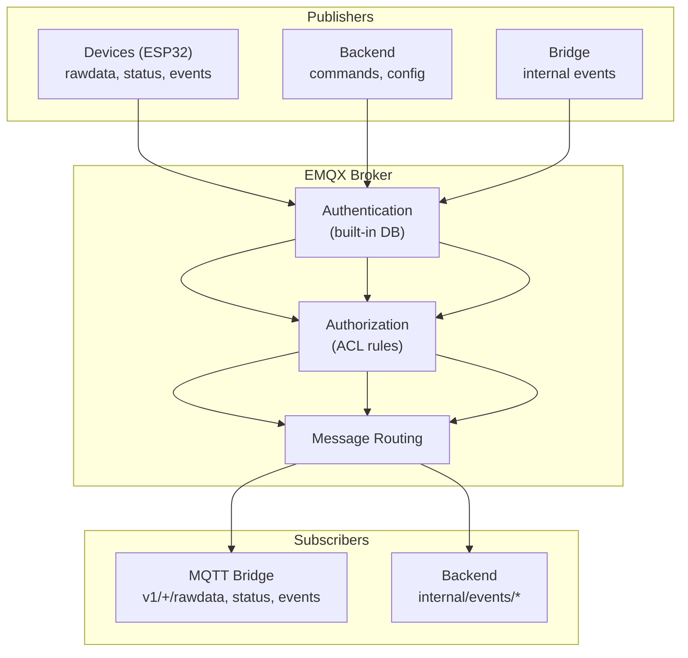
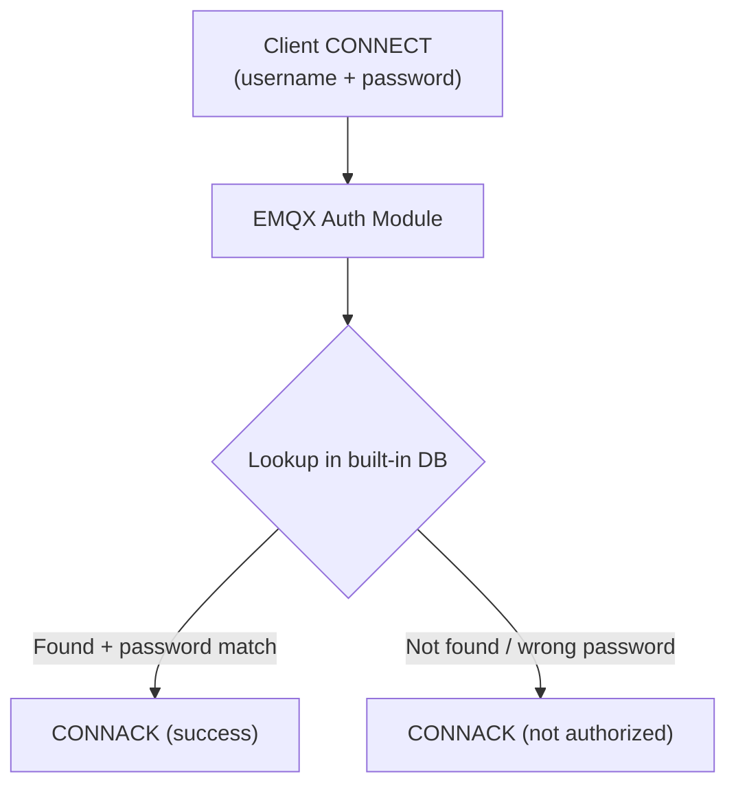

# 05 - EMQX MQTT Broker

> EMQX v5.4 — MQTT broker trung tâm kết nối devices với cloud services.

---

## Mục lục

1. [Vai trò của EMQX](#1-vai-trò-của-emqx)
2. [Listeners & Protocols](#2-listeners--protocols)
3. [Authentication](#3-authentication)
4. [Authorization (ACL)](#4-authorization-acl)
5. [Topic Design](#5-topic-design)
6. [QoS Strategy](#6-qos-strategy)
7. [Client Management](#7-client-management)
8. [Monitoring](#8-monitoring)
9. [Configuration](#9-configuration)
10. [Troubleshooting](#10-troubleshooting)

---

## 1. Vai trò của EMQX

EMQX là **message broker** trung tâm — mọi giao tiếp MQTT đều đi qua đây:



---

## 2. Listeners & Protocols

| Listener | Port | Protocol | Mục đích |
|----------|------|----------|----------|
| TCP | 1883 | MQTT v3.1.1/v5 | Internal services (Bridge, Backend) |
| SSL/TLS | 8883 | MQTTS | Devices qua internet (via NPM) |
| WebSocket | 8083 | WS | Development/testing |
| Secure WebSocket | 8084 | WSS | Browser MQTT clients |
| Dashboard | 18083 | HTTP | EMQX admin UI |

**Cấu hình listeners:**

```hocon
# etc/emqx.conf
listeners.tcp.default {
  bind = "0.0.0.0:1883"
  max_connections = 10240
}

listeners.ssl.default {
  bind = "0.0.0.0:8883"
  max_connections = 10240
  ssl_options {
    certfile = "/opt/emqx/etc/certs/emqx.pem"
    keyfile = "/opt/emqx/etc/certs/emqx.key"
    cacertfile = "/opt/emqx/etc/certs/cacert.pem"
  }
}
```

---

## 3. Authentication

EMQX sử dụng **built-in database** cho authentication:



**Client types:**

| Client | Username | Mô tả |
|--------|----------|--------|
| Device | `device_{deviceId}` | ESP32 tracker |
| Backend | `backend` | REST API service |
| Bridge | `bridge` | MQTT Bridge service |

**Tạo credentials qua EMQX Dashboard (port 18083) hoặc REST API:**

```bash
# EMQX REST API — tạo user
curl -X POST http://emqx:18083/api/v5/authentication/password_based:built_in_database/users \
  -H "Content-Type: application/json" \
  -d '{"user_id": "device_DEV001", "password": "secret123"}'
```

---

## 4. Authorization (ACL)

```hocon
# etc/emqx.conf
authorization {
  no_match = deny        # Deny nếu không match rule nào
  deny_action = disconnect  # Disconnect client khi bị deny
}
```

**ACL rules (ví dụ):**

| Client Pattern | Action | Topic Pattern | Allow/Deny |
|----------------|--------|---------------|------------|
| `device_*` | publish | `v1/${clientid}/rawdata` | allow |
| `device_*` | publish | `v1/${clientid}/status` | allow |
| `device_*` | publish | `v1/${clientid}/events` | allow |
| `device_*` | subscribe | `v1/${clientid}/commands` | allow |
| `bridge` | subscribe | `v1/+/rawdata` | allow |
| `bridge` | subscribe | `v1/+/status` | allow |
| `bridge` | publish | `internal/events/#` | allow |
| `backend` | subscribe | `internal/events/#` | allow |
| `backend` | publish | `v1/+/commands` | allow |

**Nguyên tắc:**
- Device chỉ publish/subscribe topic của chính nó (`${clientid}`)
- Bridge subscribe wildcard (`+`) để nhận từ tất cả devices
- Backend publish commands tới device cụ thể
- Internal topics chỉ Bridge publish, Backend subscribe

---

## 5. Topic Design

### Naming Convention

```
v1/{deviceId}/{message_type}
```

| Segment | Ý nghĩa |
|---------|---------|
| `v1` | API version (cho backward compatibility) |
| `{deviceId}` | Unique device identifier |
| `{message_type}` | Loại message (rawdata, status, events, firmware, commands) |

### Topic Hierarchy

```
v1/
├── {deviceId}/
│   ├── rawdata          # Telemetry (GPS, speed, battery, OBD, IMU)
│   ├── status           # State transitions (online/offline/running/stopped)
│   ├── events           # Error events, warnings
│   ├── firmware         # OTA progress reports
│   ├── commands         # Commands FROM cloud TO device
│   └── commands/ack     # Command acknowledgments FROM device
│
internal/
├── events/
│   ├── device/status    # Device status changed (Bridge → Backend)
│   ├── device/alert     # Alert triggered
│   ├── device/session   # Session lifecycle
│   ├── device/data      # Telemetry summary
│   ├── device/zone      # Geofence events
│   ├── device/firmware  # OTA status
│   └── device/command   # Command ack
```

---

## 6. QoS Strategy

| Topic | QoS | Lý do |
|-------|-----|-------|
| `v1/+/rawdata` | 0 | High frequency (5-10s), mất 1-2 msg OK |
| `v1/+/status` | 1 | State transitions quan trọng |
| `v1/+/events` | 1 | Errors/warnings không được mất |
| `v1/+/firmware` | 1 | OTA progress critical |
| `v1/+/commands` | 1 | Commands phải đến device |
| `v1/+/commands/ack` | 1 | Ack phải đến cloud |
| `internal/events/*` | 0-1 | Varies (data=0, alert=1) |

**Tại sao không dùng QoS 2?**
- QoS 2 đảm bảo exactly-once nhưng tốn 4 round-trips
- Với cellular connection (high latency), QoS 2 quá chậm
- System đã idempotent — nhận duplicate không gây lỗi

---

## 7. Client Management

### Session & Clean Start

| Client | Clean Start | Session Expiry |
|--------|-------------|----------------|
| Device | false | 300s (5 min) |
| Bridge | true | 0 (no session) |
| Backend | true | 0 (no session) |

**Device dùng persistent session:**
- Khi device mất kết nối (vào hầm, mất sóng), EMQX giữ session 5 phút
- Messages QoS 1 được queue lại
- Khi device reconnect → nhận messages đã queue

**Bridge/Backend dùng clean session:**
- Stateless services, restart bất kỳ lúc nào
- Không cần queue messages khi offline

### Keep Alive

- Device: 60s (phù hợp cellular, tiết kiệm battery)
- Bridge/Backend: 30s (internal network, detect disconnect nhanh)

---

## 8. Monitoring

### EMQX Dashboard (port 18083)

Cung cấp:
- Connected clients list
- Message throughput (msg/s)
- Subscription count
- Topic metrics
- Client kick/ban

### Health Check

```yaml
# docker-compose.yml
healthcheck:
  test: ["CMD", "emqx", "ping"]
  interval: 10s
  timeout: 5s
  retries: 5
```

### Metrics cho Grafana

EMQX expose Prometheus metrics tại `/api/v5/prometheus/stats`:
- `emqx_messages_received_total`
- `emqx_messages_sent_total`
- `emqx_connections_count`
- `emqx_subscriptions_count`

---

## 9. Configuration

### Docker Compose

```yaml
services:
  emqx:
    image: emqx/emqx:5.4.0
    environment:
      EMQX_ALLOW_ANONYMOUS: "false"
      EMQX_AUTHENTICATION__1__MECHANISM: password_based
      EMQX_AUTHENTICATION__1__BACKEND: built_in_database
    volumes:
      - emqx-data:/opt/emqx/data
      - emqx-log:/opt/emqx/log
    deploy:
      resources:
        limits:
          memory: 1G
          cpus: '2.0'
```

### Environment Variables

| Variable | Mô tả |
|----------|--------|
| `EMQX_DASHBOARD__DEFAULT_PASSWORD` | Admin dashboard password |
| `EMQX_NODE__COOKIE` | Erlang cookie (clustering) |
| `EMQX_ALLOW_ANONYMOUS` | Disable anonymous access |

---

## 10. Troubleshooting

| Vấn đề | Nguyên nhân | Giải pháp |
|---------|-------------|-----------|
| Device không connect | Wrong credentials | Check EMQX Dashboard → Clients |
| Messages không đến Bridge | ACL deny | Check Authorization logs |
| High memory usage | Too many retained messages | Purge retained, check session expiry |
| Connection refused | Port not exposed | Check docker-compose ports |
| TLS handshake failed | Certificate mismatch | Verify cert chain, CN/SAN |

**Debug commands:**

```bash
# Check EMQX status
docker exec tracking-emqx emqx ping

# View connected clients
docker exec tracking-emqx emqx_ctl clients list

# View subscriptions
docker exec tracking-emqx emqx_ctl subscriptions list

# Check logs
docker logs tracking-emqx --tail 100
```

---

> **Tiếp theo:** [06-postgresql-database.md](./06-postgresql-database.md) — PostgreSQL + PostGIS — schema design và migrations
