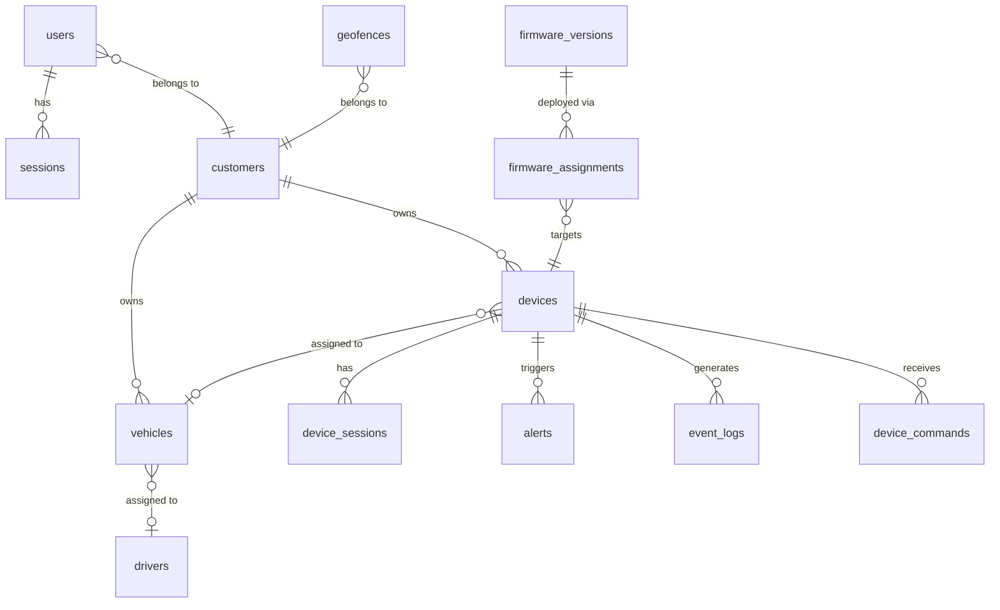

# 06 - PostgreSQL Database

> PostgreSQL 16 + PostGIS — relational data, spatial queries, migration-based schema.

---

## Mục lục

1. [Database Overview](#1-database-overview)
2. [Schema Design](#2-schema-design)
3. [Core Tables](#3-core-tables)
4. [Migration System](#4-migration-system)
5. [Spatial Queries (PostGIS)](#5-spatial-queries-postgis)
6. [Connection Pooling](#6-connection-pooling)
7. [Indexing Strategy](#7-indexing-strategy)
8. [Maintenance Scripts](#8-maintenance-scripts)
9. [Backup & Recovery](#9-backup--recovery)
10. [File Map](#10-file-map)

---

## 1. Database Overview

PostgreSQL là **primary data store** cho:
- Device registry & state
- User accounts & sessions
- Driving sessions & trips
- Alerts & notifications
- Geofences (spatial data)
- Firmware management
- Audit logs

**Image:** `postgis/postgis:16-3.4` (PostgreSQL 16 + PostGIS 3.4)

---

## 2. Schema Design



---

## 3. Core Tables

### users

| Column | Type | Mô tả |
|--------|------|--------|
| id | SERIAL PK | Auto-increment ID |
| email | VARCHAR UNIQUE | Login email |
| password_hash | VARCHAR | bcrypt hash |
| role | VARCHAR | super_admin, admin, operator, viewer |
| customer_id | FK → customers | Multi-tenant isolation |
| is_active | BOOLEAN | Account enabled |
| created_at | TIMESTAMPTZ | |

### devices

| Column | Type | Mô tả |
|--------|------|--------|
| id | SERIAL PK | |
| device_id | VARCHAR UNIQUE | Hardware identifier (e.g., "DEV001") |
| auth_token | VARCHAR | MQTT authentication token |
| customer_id | FK → customers | Owner |
| vehicle_id | FK → vehicles | Assigned vehicle |
| current_status | VARCHAR | online/offline/running/stopped |
| ignition_state | VARCHAR | ON/OFF |
| motion_state | VARCHAR | MOVING/STATIONARY |
| last_latitude | DOUBLE | Last known position |
| last_longitude | DOUBLE | |
| last_speed | DOUBLE | km/h |
| last_seen_at | TIMESTAMPTZ | Last telemetry received |
| state_updated_at | TIMESTAMPTZ | Last state change |
| firmware_version | VARCHAR | Current firmware |

### device_sessions

| Column | Type | Mô tả |
|--------|------|--------|
| id | SERIAL PK | |
| device_id | FK → devices | |
| status | VARCHAR | running/closed |
| started_at | TIMESTAMPTZ | Session start |
| ended_at | TIMESTAMPTZ | Session end (null if running) |
| start_latitude | DOUBLE | Start position |
| start_longitude | DOUBLE | |
| last_latitude | DOUBLE | Current/end position |
| last_longitude | DOUBLE | |
| last_speed | DOUBLE | |
| distance_km | DOUBLE | Total distance |
| boot_id | VARCHAR | Firmware boot identifier |
| session_seq | INTEGER | Session sequence within boot |

### alerts

| Column | Type | Mô tả |
|--------|------|--------|
| id | SERIAL PK | |
| device_id | FK → devices | |
| vehicle_id | FK → vehicles | |
| alert_type | VARCHAR | maintenance_due, high_imu_accel_delta, geofence_violation |
| severity | VARCHAR | low/medium/high/critical |
| title | VARCHAR | Alert title |
| message | TEXT | Detailed message |
| source | VARCHAR | obd/device/system |
| status | VARCHAR | active/resolved |
| resolved_at | TIMESTAMPTZ | |
| resolution_notes | TEXT | |

### geofences

| Column | Type | Mô tả |
|--------|------|--------|
| id | SERIAL PK | |
| customer_id | FK → customers | |
| name | VARCHAR | Geofence name |
| geometry | GEOMETRY(Polygon, 4326) | PostGIS polygon |
| type | VARCHAR | inclusion/exclusion |
| is_active | BOOLEAN | |

### firmware_versions

| Column | Type | Mô tả |
|--------|------|--------|
| id | SERIAL PK | |
| version | VARCHAR | Semantic version (e.g., "1.2.3") |
| filename | VARCHAR | Binary filename |
| file_size | INTEGER | Bytes |
| checksum | VARCHAR | SHA256 hash |
| release_notes | TEXT | |
| created_at | TIMESTAMPTZ | |

---

## 4. Migration System

Migrations nằm trong `Tracking_PostgreSQL/init/` — chạy theo thứ tự alphabetical:

```
init/
├── 00-extensions.sql          # PostGIS, uuid-ossp
├── 01-users.sql               # Users table
├── 02-devices.sql             # Devices table
├── 03-error-codes.sql         # Error code lookup
├── 04-event-logs.sql          # Event logs
├── 05-firmware.sql            # Firmware management
├── 06-vehicles.sql            # Vehicles
├── 07-trips-alerts.sql        # Trips & alerts
├── 08-geofences.sql           # Geofences (PostGIS)
├── 09-audit.sql               # Audit trail
├── 10-validation-errors.sql   # Telemetry validation errors
├── 11-drivers.sql             # Drivers
├── 12-audit-logs.sql          # Detailed audit logs
├── 12-violations.sql          # Speed/geofence violations
├── 13-device-commands.sql     # Remote commands
├── 13-ota-hardening.sql       # OTA security
├── 14-zones.sql               # Zone management
├── 15-canonical-telemetry-fields.sql
├── 16-authoritative-session-identity.sql
├── 17-imu-accel-delta-standardization.sql
├── 18-imu-accel-delta-threshold-standardization.sql
├── 19-device-session-runtime-seconds.sql
├── 20-backfill-closing-gps-session-links.sql
└── 21-realtime-session-query-indexes.sql
```

**Chạy migrations:**
- **Fresh install:** Docker `initdb.d` tự chạy tất cả files khi volume trống
- **Existing DB:** Dùng script `scripts/apply-init-migrations.js`

```bash
# Apply new migrations to existing DB
node scripts/apply-init-migrations.js
```

---

## 5. Spatial Queries (PostGIS)

### Geofence Check

```sql
-- Kiểm tra device có nằm trong geofence không
SELECT id, name, type
FROM geofences
WHERE is_active = true
  AND customer_id = $1
  AND ST_Contains(geometry, ST_SetSRID(ST_Point($2, $3), 4326));
-- $2 = longitude, $3 = latitude
```

### Distance Calculation

```sql
-- Tính khoảng cách giữa 2 điểm (meters)
SELECT ST_Distance(
  ST_SetSRID(ST_Point($1, $2), 4326)::geography,
  ST_SetSRID(ST_Point($3, $4), 4326)::geography
) AS distance_meters;
```

### Devices trong bán kính

```sql
-- Tìm devices trong bán kính 5km
SELECT device_id, last_latitude, last_longitude
FROM devices
WHERE ST_DWithin(
  ST_SetSRID(ST_Point(last_longitude, last_latitude), 4326)::geography,
  ST_SetSRID(ST_Point($1, $2), 4326)::geography,
  5000  -- 5000 meters
);
```

---

## 6. Connection Pooling

```typescript
// Backend: src/infrastructure/database/pool.ts
import { Pool } from 'pg';

export const pool = new Pool({
  host: dbConfig.host,
  port: dbConfig.port,
  database: dbConfig.database,
  user: dbConfig.user,
  password: dbConfig.password,
  max: dbConfig.connectionLimit, // Default: 20
  idleTimeoutMillis: 30000,
  connectionTimeoutMillis: 5000,
});
```

**Connection limits:**
- Backend: 20 connections (REST API, concurrent requests)
- Bridge: 10 connections (batch writes, auth lookups)
- Total: ~30 connections (PostgreSQL default max = 100)

---

## 7. Indexing Strategy

| Table | Index | Columns | Mô tả |
|-------|-------|---------|--------|
| devices | PK | id | |
| devices | UNIQUE | device_id | Fast lookup by hardware ID |
| devices | INDEX | customer_id | Filter by customer |
| devices | INDEX | vehicle_id | Join with vehicles |
| device_sessions | INDEX | device_id, status | Active session lookup |
| device_sessions | INDEX | started_at DESC | Recent sessions |
| alerts | INDEX | device_id, status | Active alerts per device |
| alerts | INDEX | created_at DESC | Recent alerts |
| geofences | GIST | geometry | Spatial index for ST_Contains |
| event_logs | INDEX | device_id, created_at | Time-range queries |

---

## 8. Maintenance Scripts

```
scripts/
├── apply-init-migrations.js         # Run new migrations
├── cleanup-keep-core-master-data.sql # Clean test data, keep config
├── postgres-command-runner.js        # Execute SQL files
├── postgres-env-loader.js           # Load .env for scripts
├── seed-local-audit-mock-data.sql   # Seed test data
└── uat-runtime-schema-sync.sql      # Sync UAT schema
```

---

## 9. Backup & Recovery

```bash
# Backup
docker exec tracking-postgres pg_dump -U postgres vehicle_tracking > backup.sql

# Restore
docker exec -i tracking-postgres psql -U postgres vehicle_tracking < backup.sql

# Point-in-time (WAL archiving — production)
# Configure in postgresql.conf:
# archive_mode = on
# archive_command = 'cp %p /backup/wal/%f'
```

---

## 10. File Map

| File | Vai trò |
|------|---------|
| `docker-compose.yml` | PostgreSQL container definition |
| `.env` / `.env.example` | Database credentials |
| `init/00-extensions.sql` | Enable PostGIS, uuid-ossp |
| `init/01-users.sql` | Users + auth tables |
| `init/02-devices.sql` | Device registry |
| `init/07-trips-alerts.sql` | Sessions, trips, alerts |
| `init/08-geofences.sql` | Geofence with PostGIS geometry |
| `init/13-device-commands.sql` | Remote command queue |
| `scripts/apply-init-migrations.js` | Migration runner |

---

> **Tiếp theo:** [07-victoriametrics-timeseries.md](./07-victoriametrics-timeseries.md) — VictoriaMetrics — time-series storage cho telemetry
