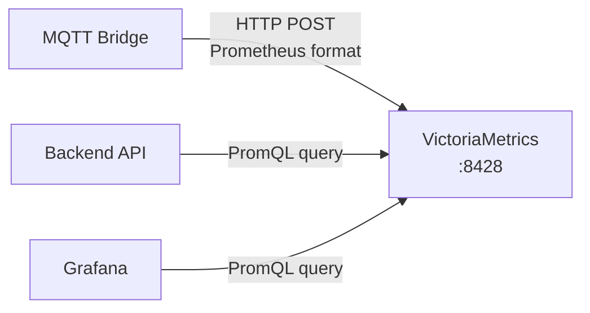
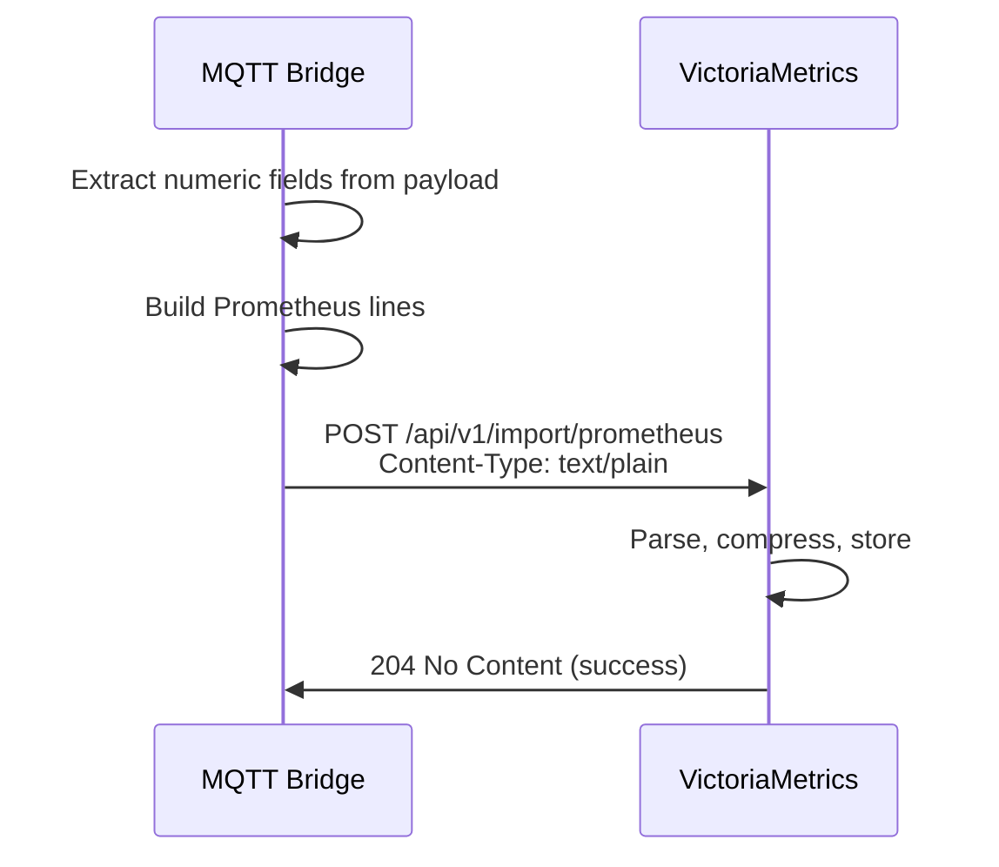

# 07 - VictoriaMetrics Time-Series

> VictoriaMetrics — lightweight time-series database cho telemetry metrics (GPS, speed, battery, OBD).

---

## Mục lục

1. [Vai trò của VictoriaMetrics](#1-vai-trò-của-victoriametrics)
2. [Data Model](#2-data-model)
3. [Write Path](#3-write-path)
4. [Query (PromQL)](#4-query-promql)
5. [Retention & Storage](#5-retention--storage)
6. [Metrics Catalog](#6-metrics-catalog)
7. [Grafana Integration](#7-grafana-integration)
8. [Configuration](#8-configuration)
9. [Performance Tuning](#9-performance-tuning)

---

## 1. Vai trò của VictoriaMetrics

VictoriaMetrics lưu trữ **time-series telemetry** — dữ liệu số thay đổi theo thời gian:



**Tại sao dùng VictoriaMetrics thay vì PostgreSQL cho telemetry?**
- Compression tốt hơn 10x cho time-series data
- Query nhanh hơn cho range queries (1h, 24h, 7d)
- Built-in downsampling và retention
- PromQL — ngôn ngữ query mạnh cho metrics
- Single binary, ít RAM (~200MB cho millions of data points)

---

## 2. Data Model

VictoriaMetrics dùng **Prometheus data model**:

```
metric_name{label1="value1", label2="value2"} value timestamp
```

**Ví dụ telemetry:**

```
tracker_telemetry_speed{device_id="DEV001"} 65.2 1716393600000
tracker_telemetry_battery_v{device_id="DEV001"} 12.4 1716393600000
tracker_telemetry_latitude{device_id="DEV001"} 10.7623 1716393600000
tracker_telemetry_longitude{device_id="DEV001"} 106.6601 1716393600000
tracker_telemetry_satellites{device_id="DEV001"} 12 1716393600000
```

**Naming convention:**
- Prefix: `tracker_telemetry_`
- Suffix: field name từ payload (snake_case)
- Label: `device_id` (unique identifier)

---

## 3. Write Path



**Code (Bridge):**

```typescript
// src/infrastructure/victoriametrics.ts
export const writeDeviceTelemetry = async (
  deviceId: string,
  data: Record<string, number | undefined>,
  timestampMs: number,
): Promise<void> => {
  const lines: string[] = [];

  for (const [key, value] of Object.entries(data)) {
    if (value === undefined) continue;
    const metricName = `tracker_telemetry_${sanitizeLabel(key)}`;
    lines.push(`${metricName}{device_id="${sanitizeLabel(deviceId)}"} ${value} ${timestampMs}`);
  }

  await fetch(`${VM_URL}/api/v1/import/prometheus`, {
    method: 'POST',
    headers: { 'Content-Type': 'text/plain' },
    body: lines.join('\n') + '\n',
  });
};
```

**Sanitization:**
- Label values chỉ chứa `[a-zA-Z0-9_-]`
- Tránh injection vào line protocol

---

## 4. Query (PromQL)

### Từ Backend API

```typescript
// Backend queries VM for telemetry charts
const response = await fetch(
  `${VM_URL}/api/v1/query_range?` +
  `query=tracker_telemetry_speed{device_id="${deviceId}"}` +
  `&start=${startTimestamp}&end=${endTimestamp}&step=30s`
);
```

### Common Queries

**Tốc độ trung bình 1 giờ qua:**
```promql
avg_over_time(tracker_telemetry_speed{device_id="DEV001"}[1h])
```

**Tốc độ tối đa trong ngày:**
```promql
max_over_time(tracker_telemetry_speed{device_id="DEV001"}[24h])
```

**Battery voltage trend:**
```promql
tracker_telemetry_battery_v{device_id="DEV001"}
```

**Số devices đang online (có data trong 5 phút):**
```promql
count(count_over_time(tracker_telemetry_speed[5m]))
```

**Quãng đường ước tính (tích phân speed):**
```promql
increase(tracker_telemetry_speed{device_id="DEV001"}[1h]) / 3600
```

---

## 5. Retention & Storage

```yaml
# docker-compose.yml
command:
  - "-retentionPeriod=30d"      # Giữ data 30 ngày
  - "-storageDataPath=/storage"  # Persistent volume
  - "-httpListenAddr=:8428"
  - "-search.latencyOffset=0s"   # No delay for recent data
```

**Storage estimate:**
- 1 device × 10 metrics × 1 sample/10s = 6 samples/min = 8,640/day
- 100 devices × 30 days ≈ 26M data points
- VictoriaMetrics compression: ~1-2 bytes/point → ~50MB

---

## 6. Metrics Catalog

| Metric Name | Unit | Mô tả |
|-------------|------|--------|
| `tracker_telemetry_speed` | km/h | Vehicle speed |
| `tracker_telemetry_latitude` | degrees | GPS latitude |
| `tracker_telemetry_longitude` | degrees | GPS longitude |
| `tracker_telemetry_altitude` | meters | GPS altitude |
| `tracker_telemetry_satellites` | count | GPS satellite count |
| `tracker_telemetry_course` | degrees | Heading (0-360) |
| `tracker_telemetry_battery_v` | volts | Vehicle battery voltage |
| `tracker_telemetry_device_battery_pct` | percent | Device battery % |
| `tracker_telemetry_imu_accel_delta_mps2` | m/s² | IMU acceleration delta |
| `tracker_telemetry_rpm` | RPM | Engine RPM (OBD) |
| `tracker_telemetry_coolant_c` | °C | Coolant temperature (OBD) |
| `tracker_telemetry_engine_load_pct` | percent | Engine load (OBD) |
| `tracker_telemetry_obd_speed_kph` | km/h | OBD speed |
| `tracker_telemetry_fuel_level_pct` | percent | Fuel level (OBD) |
| `tracker_telemetry_runtime_s` | seconds | Session runtime |

---

## 7. Grafana Integration

VictoriaMetrics là datasource cho Grafana:

```yaml
# Tracking_Grafana/provisioning/datasources/datasource.yml
apiVersion: 1
datasources:
  - name: VictoriaMetrics
    type: prometheus
    url: http://tracking-victoriametrics:8428
    access: proxy
    isDefault: true
```

**Dashboard panels:**
- Speed over time (line chart)
- Battery voltage trend
- GPS track on map (using coordinates)
- OBD diagnostics (RPM, coolant, load)
- Fleet overview (aggregated metrics)

---

## 8. Configuration

```yaml
# docker-compose.yml
services:
  victoriametrics:
    image: victoriametrics/victoria-metrics:v1.96.0
    command:
      - "-retentionPeriod=30d"
      - "-storageDataPath=/storage"
      - "-httpListenAddr=:8428"
      - "-search.latencyOffset=0s"
      - "-promscrape.config=/etc/victoriametrics/prometheus.yml"
    volumes:
      - ../Tracking_Data/Tracking_VictoriaMetrics:/storage
      - ../Tracking_Grafana/provisioning/prometheus/prometheus.yml:/etc/victoriametrics/prometheus.yml:ro
    deploy:
      resources:
        limits:
          memory: 512M
          cpus: '1.0'
```

**Prometheus scraping:**
- VictoriaMetrics cũng scrape metrics từ Backend (`/metrics` endpoint)
- Dùng cho application metrics (request count, latency, error rate)

---

## 9. Performance Tuning

| Parameter | Default | Recommended | Mô tả |
|-----------|---------|-------------|--------|
| `retentionPeriod` | 1 month | 30d | Giữ data bao lâu |
| `memory` limit | — | 512M | Đủ cho 100 devices |
| `search.latencyOffset` | 30s | 0s | Cho phép query data mới nhất |
| `maxLabelsPerTimeseries` | 30 | 30 | Giới hạn labels |

**Best practices:**
- Không tạo quá nhiều unique label values (high cardinality)
- Dùng `device_id` là label duy nhất cho telemetry
- Batch writes (nhiều lines trong 1 request) hiệu quả hơn single writes
- Dùng `step` phù hợp khi query (30s cho 1h range, 5m cho 24h range)

---

> **Tiếp theo:** [08-victorialogs-events.md](./08-victorialogs-events.md) — VictoriaLogs — structured event logging
