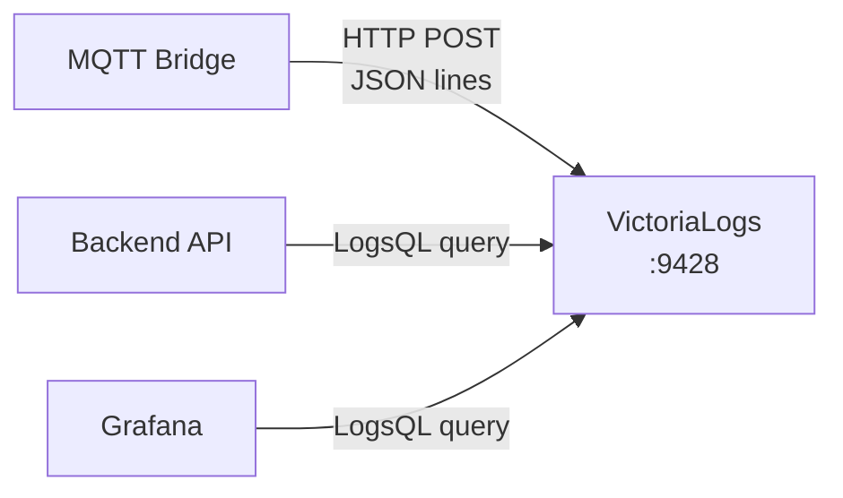

# 08 - VictoriaLogs Event Logging

> VictoriaLogs — structured event log storage cho device events, errors, state transitions.

---

## Mục lục

1. [Vai trò của VictoriaLogs](#1-vai-trò-của-victorialogs)
2. [Data Model](#2-data-model)
3. [Write Path](#3-write-path)
4. [Query Language (LogsQL)](#4-query-language-logsql)
5. [Event Types](#5-event-types)
6. [Retention & Storage](#6-retention--storage)
7. [Grafana Integration](#7-grafana-integration)
8. [Configuration](#8-configuration)

---

## 1. Vai trò của VictoriaLogs

VictoriaLogs lưu trữ **structured event logs** — sự kiện rời rạc (không phải time-series):



**Khác biệt với VictoriaMetrics:**

| | VictoriaMetrics | VictoriaLogs |
|---|---|---|
| Data type | Numeric time-series | Structured text events |
| Ví dụ | speed=65.2 at T | "Device DEV001 went offline" |
| Query | PromQL | LogsQL |
| Retention | 30 days | 7 days |
| Use case | Charts, trends | Event investigation, debugging |

---

## 2. Data Model

Mỗi log entry là một JSON object:

```json
{
  "_time": "2024-05-22T10:30:00Z",
  "_msg": "Device state changed to running",
  "device_id": "DEV001",
  "event_type": "state_change",
  "event_name": "device_running",
  "severity": "info",
  "details": {
    "previous_status": "online",
    "new_status": "running",
    "session_id": 456
  }
}
```

**Required fields:**
- `_time` — Timestamp (ISO 8601)
- `_msg` — Human-readable message
- `device_id` — Device identifier

**Optional fields:**
- `event_type` — Category (state_change, error, alert, obd_maintenance_alert)
- `event_name` — Specific event name
- `severity` — info/warning/error/critical
- `details` — Additional structured data (JSON)

---

## 3. Write Path

```typescript
// src/infrastructure/victorialogs.ts
const INGEST_URL = `${victoriaLogsConfig.url}/insert/jsonline`;

export const writeDeviceEvent = async (
  deviceId: string,
  eventType: string,
  eventName: string,
  details?: Record<string, unknown>,
): Promise<void> => {
  const entry = {
    _time: new Date().toISOString(),
    _msg: `${eventType}: ${eventName}`,
    device_id: deviceId,
    event_type: eventType,
    event_name: eventName,
    ...details,
  };

  await fetch(INGEST_URL, {
    method: 'POST',
    headers: { 'Content-Type': 'application/json' },
    body: JSON.stringify(entry) + '\n',
  });
};
```

**Khi nào Bridge ghi log:**
- Device status change (online → running → stopped → offline)
- OBD maintenance alert triggered/resolved
- IMU acceleration alert
- Geofence enter/exit
- Session created/closed
- Firmware OTA progress
- Validation errors (invalid payload)

---

## 4. Query Language (LogsQL)

### Basic queries

```
# Tất cả events của device DEV001
device_id:"DEV001"

# Errors trong 1 giờ qua
severity:"error" AND _time:[now-1h, now]

# OBD alerts
event_type:"obd_maintenance_alert"

# State changes
event_type:"state_change" AND device_id:"DEV001"
```

### Advanced queries

```
# Devices có lỗi nhiều nhất
device_id:* AND severity:"error" | stats count() by device_id | sort by count desc

# Timeline of a specific device
device_id:"DEV001" | sort by _time
```

---

## 5. Event Types

| Event Type | Mô tả | Severity |
|------------|--------|----------|
| `state_change` | Device status transition | info |
| `session_created` | New driving session started | info |
| `session_closed` | Driving session ended | info |
| `obd_maintenance_alert` | OBD-based maintenance alert | medium-critical |
| `high_imu_accel_alert` | IMU acceleration threshold exceeded | medium |
| `geofence_enter` | Device entered geofence | info |
| `geofence_exit` | Device exited geofence | info-warning |
| `firmware_progress` | OTA update progress | info |
| `validation_error` | Invalid telemetry payload | warning |
| `device_auth_failed` | Authentication failure | warning |
| `command_sent` | Command published to device | info |
| `command_ack` | Command acknowledged by device | info |

---

## 6. Retention & Storage

```yaml
command:
  - "-retentionPeriod=7d"       # Giữ logs 7 ngày
  - "-storageDataPath=/storage"
  - "-httpListenAddr=:9428"
```

**Tại sao 7 ngày?**
- Event logs chủ yếu dùng cho debugging/investigation
- Alerts quan trọng đã persist vào PostgreSQL
- 7 ngày đủ cho troubleshooting gần đây
- Tiết kiệm disk space

---

## 7. Grafana Integration

```yaml
# Datasource configuration
datasources:
  - name: VictoriaLogs
    type: victoriametrics-logs-datasource
    url: http://tracking-victorialogs:9428
```

**Dashboard panels:**
- Event timeline (log stream)
- Error rate over time
- Alert frequency by device
- State transition history

---

## 8. Configuration

```yaml
services:
  victorialogs:
    image: victoriametrics/victoria-logs:v1.3.1-victorialogs
    command:
      - "-retentionPeriod=7d"
      - "-storageDataPath=/storage"
      - "-httpListenAddr=:9428"
    volumes:
      - ../Tracking_Data/Tracking_VictoriaLogs:/storage
    deploy:
      resources:
        limits:
          memory: 512M
          cpus: '1.0'
```

**API Endpoints:**
- `POST /insert/jsonline` — Ingest logs (JSON Lines format)
- `GET /select/logsql/query` — Query logs (LogsQL)
- `GET /-/healthy` — Health check

---

> **Tiếp theo:** [09-grafana-monitoring.md](./09-grafana-monitoring.md) — Grafana — dashboards và alerting
