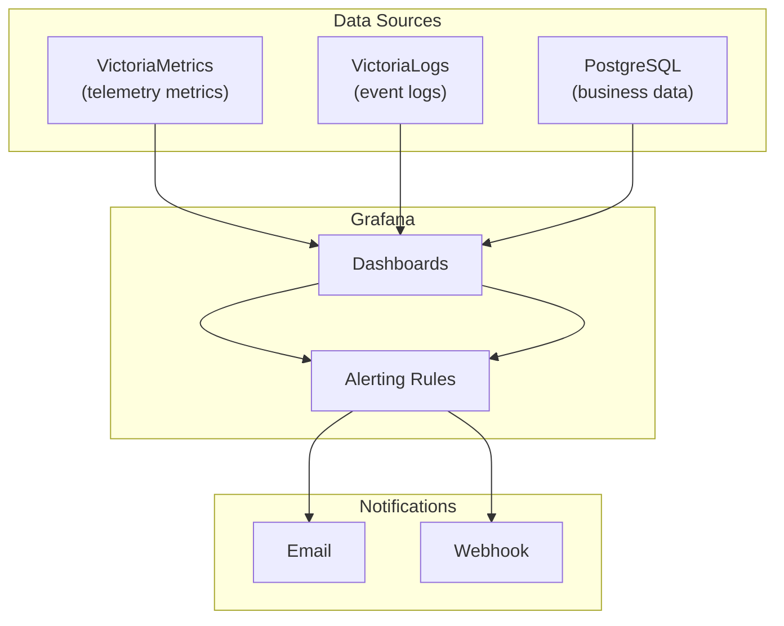

# 09 - Grafana Monitoring

> Grafana — dashboards cho system monitoring, device telemetry visualization, alerting.

---

## Mục lục

1. [Vai trò của Grafana](#1-vai-trò-của-grafana)
2. [Datasources](#2-datasources)
3. [Dashboard Categories](#3-dashboard-categories)
4. [Provisioning](#4-provisioning)
5. [Alerting](#5-alerting)
6. [Configuration](#6-configuration)

---

## 1. Vai trò của Grafana

Grafana là **observability layer** — visualize metrics, logs, và alerts:



---

## 2. Datasources

| Datasource | Type | URL | Mô tả |
|------------|------|-----|--------|
| VictoriaMetrics | Prometheus | http://tracking-victoriametrics:8428 | Telemetry time-series |
| VictoriaLogs | Logs | http://tracking-victorialogs:9428 | Event logs |
| PostgreSQL | PostgreSQL | tracking-postgres:5432 | Business data |

---

## 3. Dashboard Categories

### System Health

| Panel | Query | Mô tả |
|-------|-------|--------|
| MQTT Messages/s | `rate(emqx_messages_received_total[5m])` | Throughput |
| Connected Devices | `emqx_connections_count` | Active connections |
| API Request Rate | `rate(http_requests_total[5m])` | Backend load |
| API Latency P95 | `histogram_quantile(0.95, http_request_duration_seconds_bucket)` | Response time |
| DB Connection Pool | `pg_pool_active_connections` | Pool utilization |
| Bridge Health | `bridge_batch_write_failures_total` | Write errors |

### Fleet Overview

| Panel | Query | Mô tả |
|-------|-------|--------|
| Devices Online | `count(tracker_telemetry_speed > 0)` | Moving devices |
| Average Speed | `avg(tracker_telemetry_speed)` | Fleet avg speed |
| Battery Alerts | `count(tracker_telemetry_battery_v < 12)` | Low battery |
| Active Sessions | SQL: `SELECT count(*) FROM device_sessions WHERE status='running'` | |

### Device Detail

| Panel | Query | Mô tả |
|-------|-------|--------|
| Speed Chart | `tracker_telemetry_speed{device_id="$device"}` | Speed over time |
| Battery Trend | `tracker_telemetry_battery_v{device_id="$device"}` | Voltage trend |
| GPS Track | Coordinates on map panel | Route visualization |
| OBD Diagnostics | `tracker_telemetry_rpm{device_id="$device"}` | Engine data |
| Event Log | LogsQL: `device_id:"$device"` | Recent events |

---

## 4. Provisioning

Grafana auto-loads configuration from provisioning directory:

```
Tracking_Grafana/provisioning/
├── dashboards/
│   └── dashboard.yml          # Dashboard provider config
├── datasources/
│   └── datasource.yml         # Datasource definitions
└── prometheus/
    └── prometheus.yml         # Scrape targets (used by VM)
```

**Datasource provisioning:**

```yaml
# provisioning/datasources/datasource.yml
apiVersion: 1
datasources:
  - name: VictoriaMetrics
    type: prometheus
    url: http://tracking-victoriametrics:8428
    access: proxy
    isDefault: true
  - name: PostgreSQL
    type: postgres
    url: tracking-postgres:5432
    database: vehicle_tracking
    user: postgres
    secureJsonData:
      password: ${POSTGRES_PASSWORD}
```

---

## 5. Alerting

### Alert Rules

| Alert | Condition | Severity | Action |
|-------|-----------|----------|--------|
| Device Offline | No data for 10 min | warning | Notify operator |
| High Error Rate | >10 errors/min | critical | Page on-call |
| DB Connection Exhausted | pool_active > 18 | warning | Scale pool |
| Bridge Circuit Open | circuit_open = 1 | critical | Investigate DB |
| Low Battery Fleet | >5 devices < 11.5V | warning | Schedule maintenance |

### Notification Channels

```yaml
# provisioning/alerting/
contactPoints:
  - name: ops-team
    type: email
    settings:
      addresses: ops@company.com
  - name: webhook
    type: webhook
    settings:
      url: https://hooks.slack.com/services/...
```

---

## 6. Configuration

```yaml
services:
  grafana:
    image: grafana/grafana:10.2.0
    environment:
      GF_SECURITY_ADMIN_USER: ${GRAFANA_USER:-admin}
      GF_SECURITY_ADMIN_PASSWORD: ${GRAFANA_PASSWORD}
      GF_INSTALL_PLUGINS: grafana-clock-panel
      GF_SERVER_HTTP_PORT: "4002"
    volumes:
      - ../Tracking_Data/Tracking_Grafana:/var/lib/grafana
      - ./provisioning:/etc/grafana/provisioning
    ports:
      - "4002:4002"
```

**Access:**
- URL: `http://localhost:4002` (dev) hoặc qua NPM (production)
- Default credentials: admin / (from env)
- Persistent data in `Tracking_Data/Tracking_Grafana/grafana.db`

---

> **Tiếp theo:** [10-mobile-app.md](./10-mobile-app.md) — Flutter Mobile App — WebView hybrid architecture
