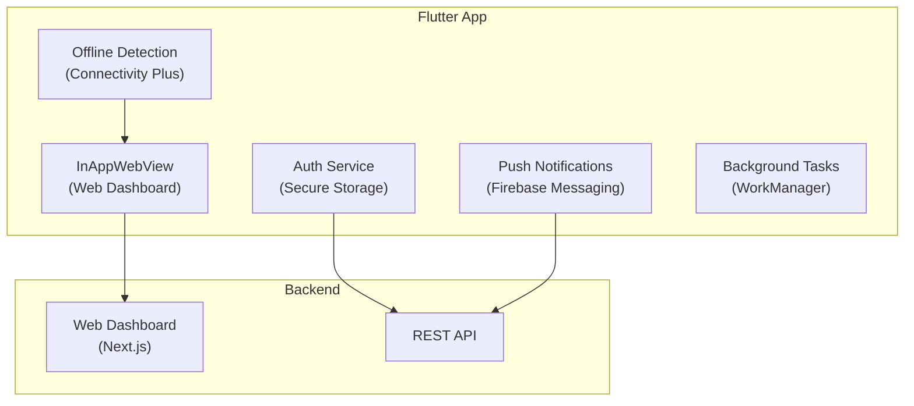
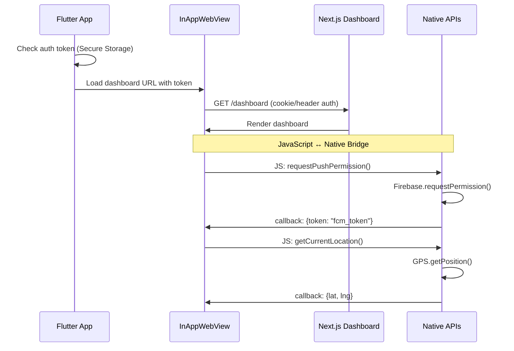
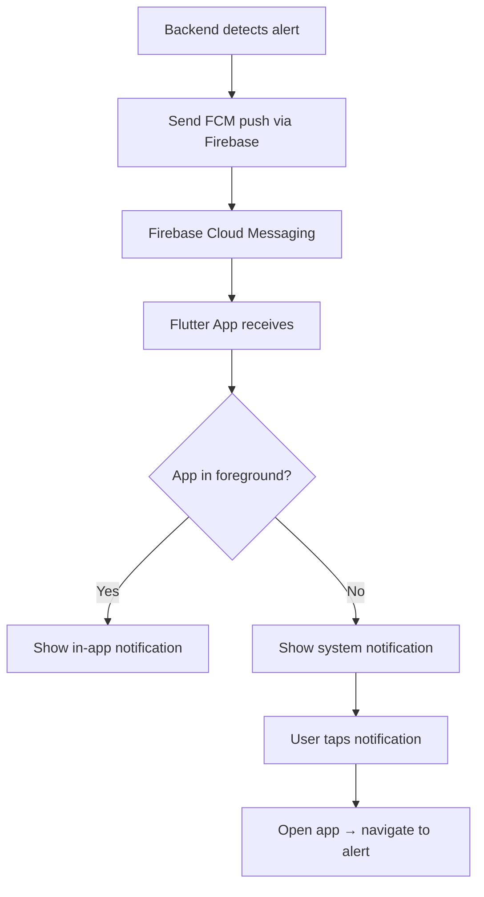
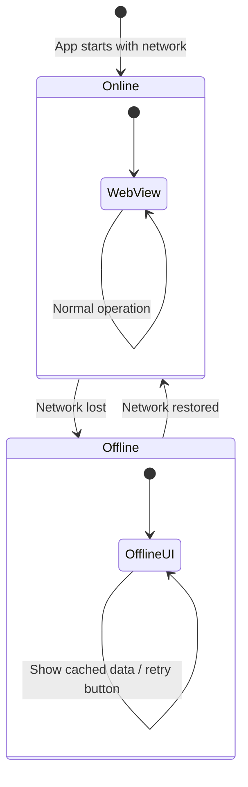
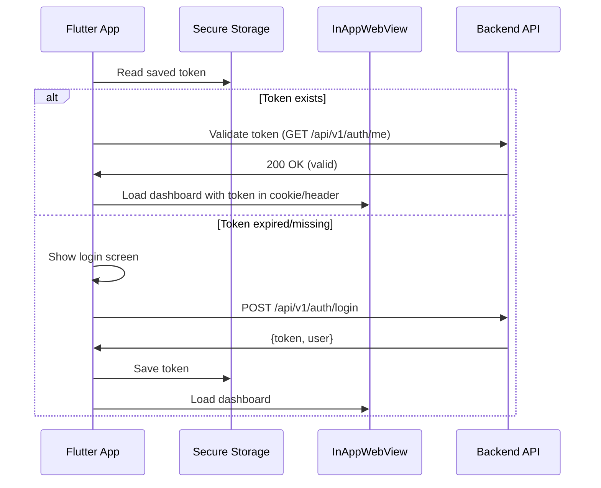

# 10 - Mobile App (Flutter)

> Flutter WebView Hybrid App — tái sử dụng web dashboard + native features (push notification, offline).

---

## Mục lục

1. [Architecture Overview](#1-architecture-overview)
2. [WebView Hybrid Approach](#2-webview-hybrid-approach)
3. [Project Structure](#3-project-structure)
4. [Core Services](#4-core-services)
5. [Push Notifications (Firebase)](#5-push-notifications-firebase)
6. [Offline Support](#6-offline-support)
7. [Authentication Bridge](#7-authentication-bridge)
8. [Dependencies](#8-dependencies)

---

## 1. Architecture Overview

Mobile app dùng **WebView hybrid** — render web dashboard trong native container,
bổ sung native capabilities:



**Tại sao WebView hybrid thay vì native UI?**
- Web dashboard đã hoàn chỉnh (20+ features)
- Không cần maintain 2 UI codebases
- Update UI không cần publish app store
- Native features (push, offline, biometrics) vẫn có

---

## 2. WebView Hybrid Approach



**JavaScript Bridge:**
- Web code gọi native functions qua `window.flutter_inappwebview.callHandler()`
- Native code inject JavaScript vào WebView
- Bidirectional communication

---

## 3. Project Structure

```
lib/
├── main.dart                    # Entry point
├── app.dart                     # MaterialApp configuration
├── core/
│   ├── config/                  # App configuration, URLs
│   ├── services/                # Core services (auth, network)
│   └── utils/                   # Utility functions
├── features/
│   ├── auth/                    # Login, token management
│   ├── webview/                 # WebView container + bridge
│   ├── notifications/           # Push notification handling
│   └── offline/                 # Offline mode UI
└── widgets/
    ├── error_view.dart          # Error display
    ├── loading_indicator.dart   # Loading spinner
    └── splash_screen.dart       # App splash
```

---

## 4. Core Services

### Network Service

```dart
// core/services/network_service.dart
class NetworkService {
  final Connectivity _connectivity = Connectivity();

  Stream<ConnectivityResult> get onConnectivityChanged =>
      _connectivity.onConnectivityChanged;

  Future<bool> get isOnline async {
    final result = await _connectivity.checkConnectivity();
    return result != ConnectivityResult.none;
  }
}
```

### Secure Storage

```dart
// core/services/storage_service.dart
class StorageService {
  final _secureStorage = FlutterSecureStorage();

  Future<void> saveToken(String token) =>
      _secureStorage.write(key: 'auth_token', value: token);

  Future<String?> getToken() =>
      _secureStorage.read(key: 'auth_token');

  Future<void> clearToken() =>
      _secureStorage.delete(key: 'auth_token');
}
```

---

## 5. Push Notifications (Firebase)



**Setup:**

```dart
// features/notifications/notification_service.dart
class NotificationService {
  final FirebaseMessaging _messaging = FirebaseMessaging.instance;

  Future<void> initialize() async {
    // Request permission
    await _messaging.requestPermission();

    // Get FCM token
    final token = await _messaging.getToken();
    // Send token to backend for targeting

    // Handle foreground messages
    FirebaseMessaging.onMessage.listen(_handleForegroundMessage);

    // Handle background messages
    FirebaseMessaging.onBackgroundMessage(_handleBackgroundMessage);
  }
}
```

---

## 6. Offline Support



**Offline features:**
- Detect network loss → show offline indicator
- Cache last known device positions (SharedPreferences)
- Queue actions for retry when online
- WorkManager for background sync

---

## 7. Authentication Bridge



---

## 8. Dependencies

| Package | Version | Vai trò |
|---------|---------|---------|
| `flutter_inappwebview` | ^6.0.0 | WebView container |
| `flutter_riverpod` | ^2.4.0 | State management |
| `firebase_core` | ^2.24.0 | Firebase initialization |
| `firebase_messaging` | ^14.7.0 | Push notifications |
| `shared_preferences` | ^2.2.0 | Simple key-value storage |
| `flutter_secure_storage` | ^9.0.0 | Encrypted token storage |
| `connectivity_plus` | ^5.0.0 | Network detection |
| `flutter_local_notifications` | ^16.0.0 | Local notification display |
| `workmanager` | ^0.5.0 | Background tasks |

---

> **Tiếp theo:** [11-docker-deployment.md](./11-docker-deployment.md) — Docker Deployment — containerization và orchestration
