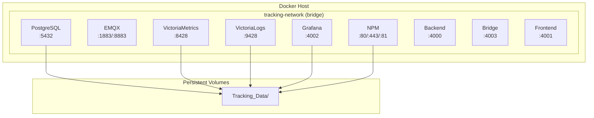
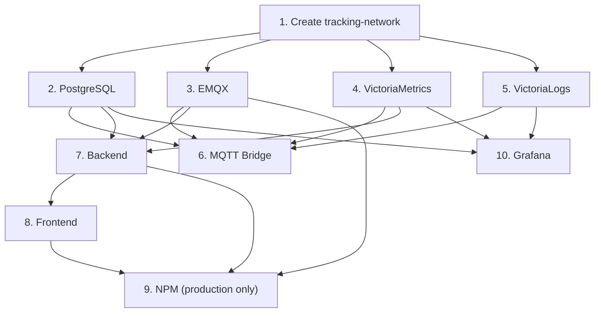

# 11 - Docker Deployment

> Containerization strategy — Docker Compose, networking, resource limits, environments.

---

## Mục lục

1. [Deployment Architecture](#1-deployment-architecture)
2. [Docker Network](#2-docker-network)
3. [Service Compose Files](#3-service-compose-files)
4. [Build Strategy](#4-build-strategy)
5. [Environment Management](#5-environment-management)
6. [Resource Limits](#6-resource-limits)
7. [Health Checks](#7-health-checks)
8. [UAT vs Production](#8-uat-vs-production)
9. [Startup Order](#9-startup-order)
10. [Common Operations](#10-common-operations)

---

## 1. Deployment Architecture

Mỗi service có docker-compose riêng — cho phép start/stop/scale độc lập:



---

## 2. Docker Network

Tất cả services dùng chung external network:

```bash
# Tạo network (chạy 1 lần)
docker network create tracking-network
```

```yaml
# Mỗi docker-compose.yml đều có:
networks:
  tracking-network:
    external: true
```

**Tại sao external network?**
- Cho phép services trong các compose files khác nhau giao tiếp
- Không bị xóa khi `docker-compose down`
- DNS resolution: container name = hostname (e.g., `tracking-postgres`)

---

## 3. Service Compose Files

| Service | File | Image |
|---------|------|-------|
| PostgreSQL | `Tracking_PostgreSQL/docker-compose.yml` | postgis/postgis:16-3.4 |
| EMQX | `Tracking_EMQX/docker-compose.yml` | emqx/emqx:5.4.0 |
| VictoriaMetrics | `Tracking_VictoriaMetrics/docker-compose.yml` | victoriametrics/victoria-metrics:v1.96.0 |
| VictoriaLogs | `Tracking_VictoriaLogs/docker-compose.yml` | victoriametrics/victoria-logs:v1.3.1 |
| Grafana | `Tracking_Grafana/docker-compose.yml` | grafana/grafana:10.2.0 |
| NPM | `Tracking_NPM/docker-compose.yml` | jc21/nginx-proxy-manager:2.11.3 |
| Backend | `Tracking_Backend/docker-compose.yml` | Custom (Dockerfile) |
| Bridge | `Tracking_MqttBridge/docker-compose.yml` | Custom (Dockerfile) |
| Frontend | `Tracking_Frontend/docker-compose.yml` | Custom (Dockerfile) |

---

## 4. Build Strategy

### Application Services (Backend, Bridge, Frontend)

```dockerfile
# Tracking_Backend/Dockerfile (multi-stage)
FROM node:20-alpine AS builder
WORKDIR /app
COPY package*.json ./
RUN npm ci
COPY . .
RUN npm run build

FROM node:20-alpine AS runner
WORKDIR /app
COPY --from=builder /app/dist ./dist
COPY --from=builder /app/node_modules ./node_modules
COPY --from=builder /app/package.json ./
EXPOSE 4000
CMD ["node", "dist/index.js"]
```

**Multi-stage benefits:**
- Builder stage: full devDependencies cho build
- Runner stage: chỉ production dependencies → image nhỏ hơn
- No source code trong final image

### Infrastructure Services

Dùng official images trực tiếp — không cần custom build.

---

## 5. Environment Management

### .env Files

Mỗi service có `.env` riêng (gitignored) và `.env.example` (committed):

```bash
# Tracking_Backend/.env.example
PORT=4000
NODE_ENV=development
POSTGRESQL_HOST=tracking-postgres
POSTGRESQL_PORT=5432
POSTGRESQL_DATABASE=vehicle_tracking
POSTGRESQL_USER=postgres
POSTGRESQL_PASSWORD=changeme
MQTT_HOST=tracking-emqx
MQTT_PORT=1883
MQTT_USERNAME=backend
MQTT_PASSWORD=changeme
SESSION_SECRET=changeme
CORS_ORIGIN=http://localhost:4001
```

### Environment Hierarchy

```
Development (local):
  - Services run on host (npm run dev)
  - Connect to Docker infra (PG, EMQX, VM, VL)

UAT (docker-compose.uat.yml):
  - All services in Docker
  - NPM handles SSL
  - Real domain

Production:
  - Same as UAT + monitoring
  - Stricter resource limits
  - External backups
```

---

## 6. Resource Limits

| Service | Memory | CPU | Justification |
|---------|--------|-----|---------------|
| PostgreSQL | 1G | 2.0 | Complex queries, PostGIS |
| EMQX | 1G | 2.0 | Message routing, 10K connections |
| VictoriaMetrics | 512M | 1.0 | Efficient storage engine |
| VictoriaLogs | 512M | 1.0 | Lightweight log storage |
| Grafana | — | — | Low usage, no limit needed |
| Backend | 512M | 1.0 | Node.js API |
| Bridge | 256M | 0.5 | Lightweight processor |
| Frontend | 512M | 1.0 | Next.js SSR |
| NPM | 256M | 0.5 | Reverse proxy |

**Total:** ~5GB RAM cho full stack

---

## 7. Health Checks

Mỗi service có health check để Docker biết khi nào ready:

```yaml
# Pattern chung
healthcheck:
  test: ["CMD", "..."]
  interval: 10s    # Check mỗi 10s
  timeout: 5s      # Timeout per check
  retries: 5       # Unhealthy sau 5 failures
```

| Service | Health Check Command |
|---------|---------------------|
| PostgreSQL | `pg_isready -U postgres` |
| EMQX | `emqx ping` |
| VictoriaMetrics | `wget --spider http://127.0.0.1:8428/-/healthy` |
| VictoriaLogs | `wget --spider http://127.0.0.1:9428/-/healthy` |
| Grafana | `wget --spider http://localhost:4002/api/health` |
| Backend | `GET /health` |
| Bridge | `GET /health` (port 4003) |

---

## 8. UAT vs Production

### UAT (docker-compose.uat.yml)

```yaml
# Tracking_Backend/docker-compose.uat.yml
services:
  backend:
    build: .
    container_name: tracking-backend
    env_file: .env
    environment:
      NODE_ENV: production
    restart: unless-stopped
    networks:
      - tracking-network
    deploy:
      resources:
        limits:
          memory: 512M
```

### Differences

| Aspect | Development | UAT/Production |
|--------|-------------|----------------|
| Run mode | `npm run dev` (host) | Docker container |
| Hot reload | Yes (tsx watch) | No (compiled JS) |
| SSL | No | Yes (NPM + Let's Encrypt) |
| Domain | localhost | real domain |
| Logging | Pretty (pino-pretty) | JSON structured |
| Source maps | Yes | No |
| NPM profile | Disabled | Enabled |

---

## 9. Startup Order



**Startup script:**

```bash
# 1. Infrastructure
docker compose -f Tracking_PostgreSQL/docker-compose.yml up -d
docker compose -f Tracking_EMQX/docker-compose.yml up -d
docker compose -f Tracking_VictoriaMetrics/docker-compose.yml up -d
docker compose -f Tracking_VictoriaLogs/docker-compose.yml up -d

# 2. Wait for health checks
sleep 10

# 3. Application services
docker compose -f Tracking_MqttBridge/docker-compose.uat.yml up -d
docker compose -f Tracking_Backend/docker-compose.uat.yml up -d
docker compose -f Tracking_Frontend/docker-compose.uat.yml up -d

# 4. Monitoring & proxy
docker compose -f Tracking_Grafana/docker-compose.yml up -d
docker compose -f Tracking_NPM/docker-compose.yml --profile production up -d
```

---

## 10. Common Operations

```bash
# View all running containers
docker ps --filter "network=tracking-network"

# View logs of a service
docker logs tracking-backend --tail 100 -f

# Restart a service
docker compose -f Tracking_Backend/docker-compose.uat.yml restart

# Rebuild and restart (after code change)
docker compose -f Tracking_Backend/docker-compose.uat.yml up -d --build

# Enter container shell
docker exec -it tracking-backend sh

# Check network connectivity
docker exec tracking-backend ping tracking-postgres

# Database backup
docker exec tracking-postgres pg_dump -U postgres vehicle_tracking > backup.sql

# View resource usage
docker stats --filter "network=tracking-network"
```

---

> **Tiếp theo:** [12-realtime-websocket.md](./12-realtime-websocket.md) — Realtime WebSocket — Socket.IO architecture
