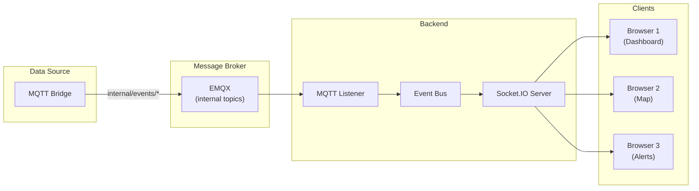
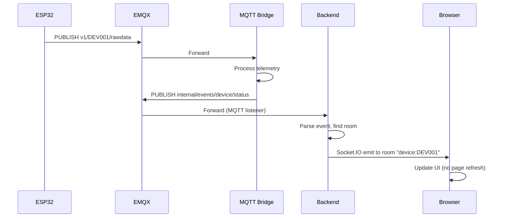
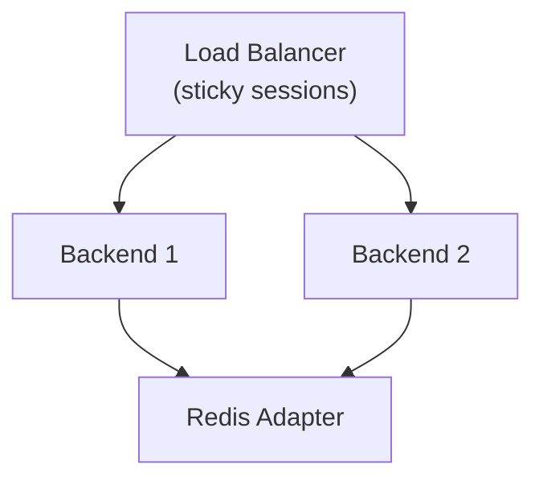

# 12 - Realtime WebSocket

> Socket.IO — realtime communication giữa Backend và Frontend cho live device tracking.

---

## Mục lục

1. [Realtime Architecture](#1-realtime-architecture)
2. [Event Flow](#2-event-flow)
3. [Socket.IO Server (Backend)](#3-socketio-server-backend)
4. [Socket.IO Client (Frontend)](#4-socketio-client-frontend)
5. [Room-Based Broadcasting](#5-room-based-broadcasting)
6. [Event Catalog](#6-event-catalog)
7. [Connection Management](#7-connection-management)
8. [Scaling Considerations](#8-scaling-considerations)

---

## 1. Realtime Architecture



---

## 2. Event Flow



**Latency:** Device → Browser ≈ 200-500ms (depends on network)

---

## 3. Socket.IO Server (Backend)

```typescript
// src/infrastructure/realtime/index.ts
import { Server as SocketServer } from 'socket.io';

export const registerRealtime = (httpServer: HttpServer) => {
  const io = new SocketServer(httpServer, {
    cors: { origin: corsConfig.origin, credentials: true },
    transports: ['websocket', 'polling'],
  });

  io.on('connection', (socket) => {
    // Authenticate socket
    const token = socket.handshake.auth.token;
    if (!validateToken(token)) {
      socket.disconnect();
      return;
    }

    // Handle room subscriptions
    socket.on('subscribe', ({ deviceIds }) => {
      deviceIds.forEach(id => socket.join(`device:${id}`));
    });

    socket.on('unsubscribe', ({ deviceIds }) => {
      deviceIds.forEach(id => socket.leave(`device:${id}`));
    });

    socket.on('disconnect', () => {
      // Cleanup
    });
  });

  return io;
};
```

---

## 4. Socket.IO Client (Frontend)

```typescript
// src/lib/runtime/socket.ts
import { io, Socket } from 'socket.io-client';

let socket: Socket | null = null;

export const getSocket = (): Socket => {
  if (!socket) {
    socket = io(BACKEND_URL, {
      auth: { token: getAuthToken() },
      transports: ['websocket'],
      reconnection: true,
      reconnectionDelay: 1000,
      reconnectionAttempts: 10,
    });
  }
  return socket;
};
```

**React hook:**

```typescript
// src/hooks/use-realtime-subscription.ts
export const useRealtimeSubscription = (
  deviceIds: string[],
  onEvent: (event: string, data: unknown) => void,
) => {
  useEffect(() => {
    const socket = getSocket();

    socket.emit('subscribe', { deviceIds });

    const events = [
      'device:status_changed',
      'device:telemetry',
      'device:alert',
      'device:session',
    ];

    events.forEach(event => {
      socket.on(event, (data) => onEvent(event, data));
    });

    return () => {
      socket.emit('unsubscribe', { deviceIds });
      events.forEach(event => socket.off(event));
    };
  }, [deviceIds]);
};
```

---

## 5. Room-Based Broadcasting

```mermaid
graph TD
    subgraph "Socket.IO Rooms"
        R1["device:DEV001<br/>(3 clients)"]
        R2["device:DEV002<br/>(1 client)"]
        R3["fleet:CUST01<br/>(5 clients)"]
        R4["alerts<br/>(2 clients)"]
    end

    EVENT["Status event for DEV001"] --> R1
    EVENT --> R3

    Note right of R1: Only clients watching<br/>DEV001 receive this event
```

**Room types:**
- `device:{deviceId}` — Events for specific device
- `fleet:{customerId}` — All events for customer's devices
- `alerts` — All alert events (for alert dashboard)

**Broadcasting logic:**

```typescript
// When internal event received from MQTT
const handleInternalEvent = (eventType: string, data: any) => {
  const { device_id, customer_id } = data;

  // Emit to device-specific room
  io.to(`device:${device_id}`).emit(`device:${eventType}`, data);

  // Emit to fleet room
  if (customer_id) {
    io.to(`fleet:${customer_id}`).emit(`device:${eventType}`, data);
  }

  // Emit to alerts room (if alert event)
  if (eventType === 'alert') {
    io.to('alerts').emit('device:alert', data);
  }
};
```

---

## 6. Event Catalog

| Event | Direction | Payload | Mô tả |
|-------|-----------|---------|--------|
| `device:status_changed` | Server → Client | `{device_id, status, lat, lng, speed}` | Device online/offline/running |
| `device:telemetry` | Server → Client | `{device_id, lat, lng, speed, battery}` | Position update |
| `device:alert` | Server → Client | `{device_id, alert_type, severity, message}` | New alert |
| `device:session` | Server → Client | `{device_id, session_id, action}` | Session start/end |
| `device:zone` | Server → Client | `{device_id, zone_id, action}` | Geofence enter/exit |
| `device:command_ack` | Server → Client | `{device_id, command_id, status}` | Command result |
| `subscribe` | Client → Server | `{deviceIds: string[]}` | Join device rooms |
| `unsubscribe` | Client → Server | `{deviceIds: string[]}` | Leave device rooms |

---

## 7. Connection Management

### Reconnection

```typescript
// Client auto-reconnects with exponential backoff
const socket = io(url, {
  reconnection: true,
  reconnectionDelay: 1000,      // Start at 1s
  reconnectionDelayMax: 30000,  // Max 30s
  reconnectionAttempts: 10,     // Give up after 10
});

socket.on('reconnect', () => {
  // Re-subscribe to rooms after reconnect
  socket.emit('subscribe', { deviceIds: currentDeviceIds });
});
```

### Health Monitoring

```typescript
// Backend exposes WebSocket health
app.get('/ws-health', (_req, res) => {
  res.json({
    connectedClients: io.engine.clientsCount,
    rooms: io.sockets.adapter.rooms.size,
    uptime: process.uptime(),
  });
});
```

---

## 8. Scaling Considerations

### Current (Single Instance)

- 1 Backend instance handles all WebSocket connections
- Sufficient for ~1000 concurrent clients
- In-memory room state

### Future (Multi-Instance)



**Khi cần scale:**
- Add `@socket.io/redis-adapter` cho cross-instance broadcasting
- Load balancer với sticky sessions (WebSocket requires same server)
- Redis pub/sub cho event distribution

---

> **Tiếp theo:** [13-telemetry-pipeline.md](./13-telemetry-pipeline.md) — Telemetry Pipeline — end-to-end data processing
