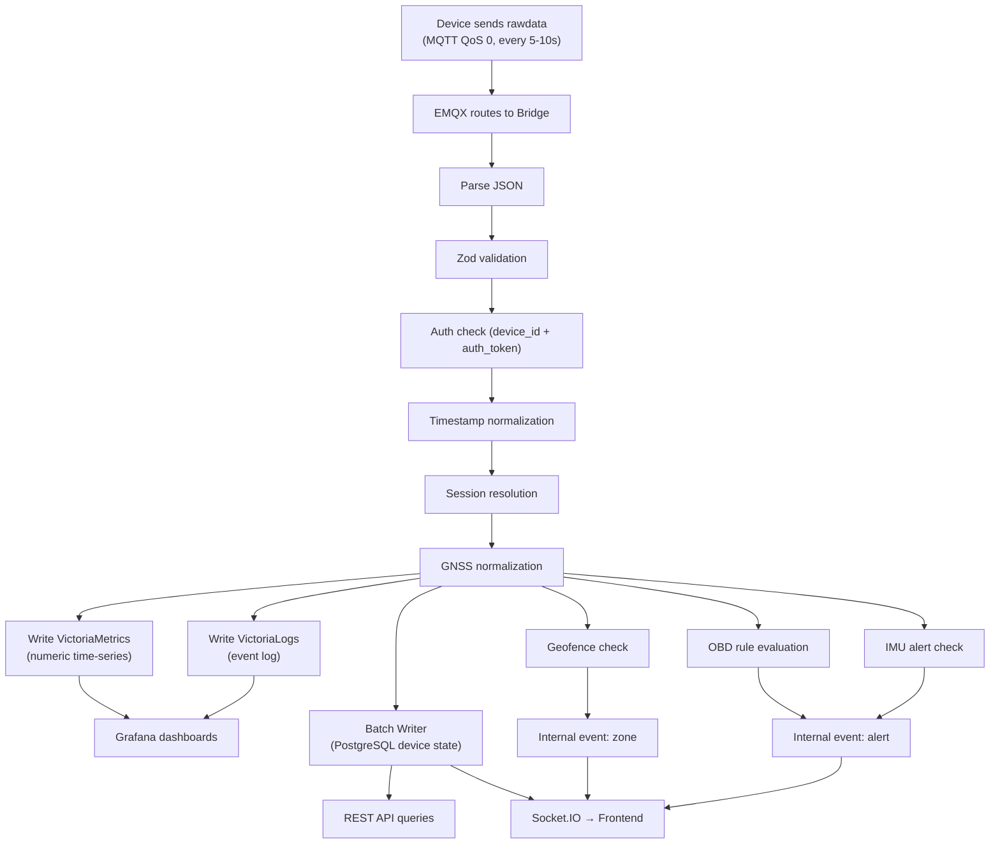
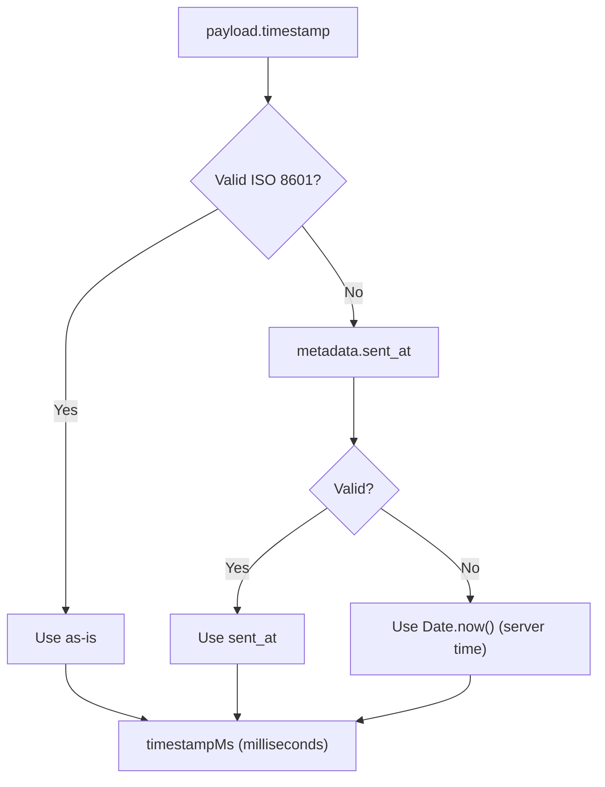
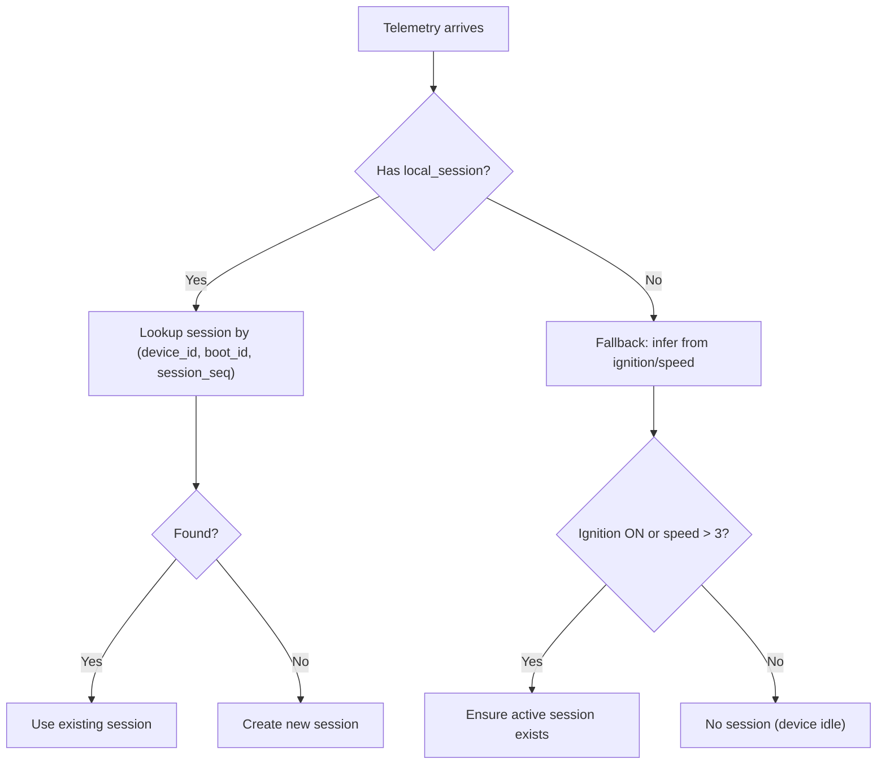
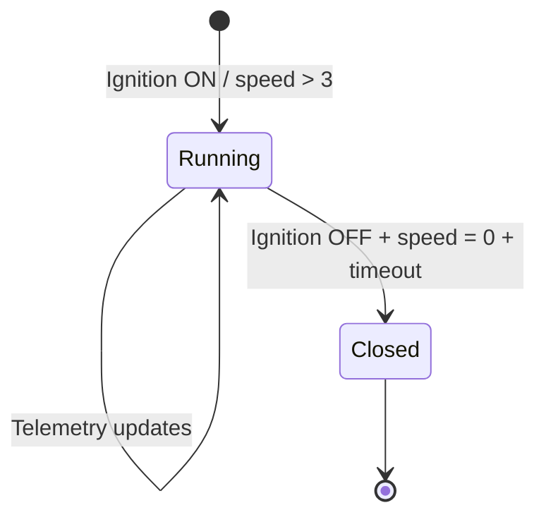
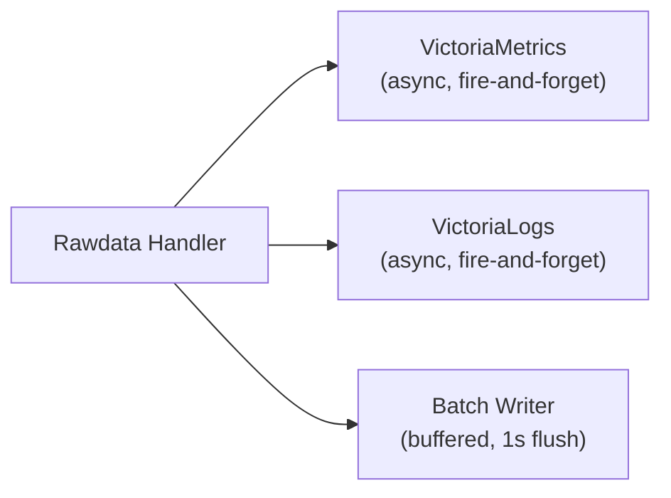
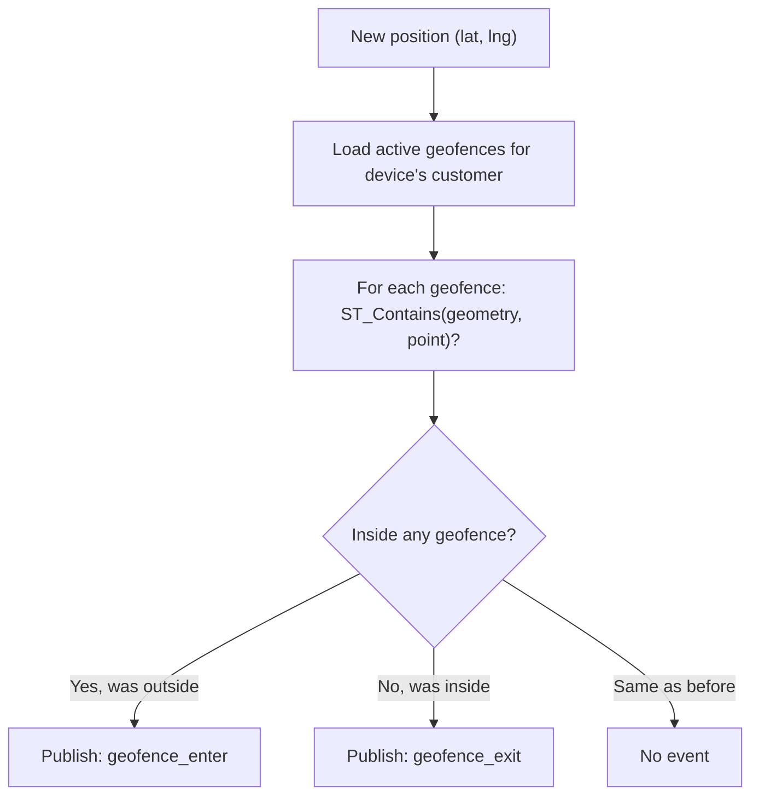

# 13 - Telemetry Pipeline

> End-to-end data processing — từ device gửi raw telemetry đến hiển thị trên dashboard.

---

## Mục lục

1. [Pipeline Overview](#1-pipeline-overview)
2. [Payload Schema](#2-payload-schema)
3. [Validation (Zod)](#3-validation-zod)
4. [Timestamp Normalization](#4-timestamp-normalization)
5. [Session Management](#5-session-management)
6. [Multi-Store Write](#6-multi-store-write)
7. [Geofence Checking](#7-geofence-checking)
8. [Status Derivation](#8-status-derivation)
9. [Data Retention Strategy](#9-data-retention-strategy)

---

## 1. Pipeline Overview



---

## 2. Payload Schema

Device gửi JSON payload trên topic `v1/{deviceId}/rawdata`:

```json
{
  "device_id": "DEV001",
  "auth_token": "secret_token_here",
  "timestamp": "2024-05-22T10:30:00.000Z",
  "boot_id": "abc123",
  "state": {
    "ignition": "ON",
    "motion": "MOVING",
    "vehicle": "RUNNING",
    "device": "ACTIVE",
    "sleep": "NONE"
  },
  "local_session": {
    "boot_id": "abc123",
    "session_seq": 3,
    "started_at": "2024-05-22T08:00:00.000Z"
  },
  "data": {
    "latitude": 10.7623,
    "longitude": 106.6601,
    "altitude": 15.2,
    "speed": 45.5,
    "course": 180.0,
    "satellites": 12,
    "battery_v": 12.4,
    "device_battery_pct": 85,
    "ignition": true,
    "imu_accel_delta_mps2": 0.8
  },
  "diagnostics": {
    "channel": {
      "ble_obd_connected": true,
      "elm_ready": true,
      "connect_fail_count_5m": 0
    },
    "quality": {
      "sample_age_ms": 5000
    },
    "signals": {
      "rpm": 2500,
      "coolant_c": 85,
      "engine_load_pct": 45,
      "obd_speed_kph": 46,
      "fuel_level_pct": 72
    },
    "dtc": {
      "stored": [],
      "pending": [],
      "permanent": []
    },
    "mil_on": false
  },
  "metadata": {
    "message_id": "uuid-here",
    "schema_version": "2.1",
    "seq_no": 1234,
    "boot_id": "abc123",
    "sent_at": "2024-05-22T10:30:00.500Z"
  }
}
```

---

## 3. Validation (Zod)

```typescript
// src/validators/payload.validator.ts
import { z } from 'zod';

export const rawDataSchema = z.object({
  device_id: z.string().min(1),
  auth_token: z.string().min(1),
  timestamp: z.string().optional(),
  boot_id: z.string().optional(),
  state: z.object({
    ignition: z.string().optional(),
    motion: z.string().optional(),
    vehicle: z.string().optional(),
    device: z.string().optional(),
    sleep: z.string().optional(),
  }).optional(),
  local_session: z.object({
    boot_id: z.string(),
    session_seq: z.number(),
    started_at: z.string().optional(),
  }).optional(),
  data: z.object({
    latitude: z.number().optional(),
    longitude: z.number().optional(),
    altitude: z.number().optional(),
    speed: z.number().optional(),
    course: z.number().optional(),
    satellites: z.number().optional(),
    battery_v: z.number().optional(),
    device_battery_pct: z.number().optional(),
    ignition: z.boolean().optional(),
    imu_accel_delta_mps2: z.number().optional(),
    vibration: z.number().optional(),
  }),
  diagnostics: z.object({/* ... */}).optional(),
  metadata: z.object({
    message_id: z.string().optional(),
    schema_version: z.string().optional(),
    seq_no: z.number().optional(),
    boot_id: z.string().optional(),
    sent_at: z.string().optional(),
  }).optional(),
});
```

**Validation failures → logged to VictoriaLogs, message dropped.**

---

## 4. Timestamp Normalization



**Tại sao cần normalization?**
- Device clock có thể sai (RTC drift, no NTP)
- Modem clock (sent_at) thường chính xác hơn
- Server time là last resort (adds network latency)

---

## 5. Session Management

### Authoritative Session Identity

Firmware gửi `local_session` object chứa:
- `boot_id` — Unique per firmware boot
- `session_seq` — Incremental per boot (0, 1, 2...)

Bridge dùng composite key `(device_id, boot_id, session_seq)` để map vào DB session:



### Session Lifecycle



---

## 6. Multi-Store Write

Mỗi telemetry message được ghi vào 3 stores song song:

| Store | Data Written | Purpose |
|-------|-------------|---------|
| VictoriaMetrics | Numeric fields (speed, lat, lng, battery, rpm...) | Time-series charts, Grafana |
| VictoriaLogs | Event entry (state change, session, alert) | Investigation, debugging |
| PostgreSQL | Device state (last_lat, last_lng, status, session) | REST API queries, realtime |



**Error handling:**
- VM/VL write failures → logged, not retried (data is ephemeral)
- PostgreSQL write failures → circuit breaker (see batch writer)
- No message is blocked by downstream failures

---

## 7. Geofence Checking



**Geofence state cache:**
- In-memory map: `deviceId → Set<geofenceId>` (currently inside)
- Compare with new check result → detect enter/exit
- Publish internal event for realtime notification

---

## 8. Status Derivation

Device status is derived from multiple signals:

```typescript
// Runtime state normalization
const runtimeState = normalizeRuntimeState({
  state: payload.state,           // Firmware-reported state
  legacyStatus: previousStatus,   // Previous known status
  ignitionHint: payload.data.ignition,
  speedKph: effectiveSpeed,
  previous: previousState?.runtimeState,
});
```

**Status mapping:**

| Condition | Derived Status |
|-----------|---------------|
| Ignition ON + speed > 3 | `running` |
| Ignition ON + speed ≤ 3 | `online` (idling) |
| Ignition OFF + recent data | `stopped` |
| No data for > 5 min | `offline` |

---

## 9. Data Retention Strategy

| Store | Retention | Mô tả |
|-------|-----------|--------|
| VictoriaMetrics | 30 days | Telemetry time-series |
| VictoriaLogs | 7 days | Event logs |
| PostgreSQL (devices) | Forever | Current state |
| PostgreSQL (sessions) | Forever | Trip history |
| PostgreSQL (alerts) | Forever | Alert history |
| PostgreSQL (event_logs) | 90 days | Detailed events |

**Tại sao khác nhau?**
- Time-series: 30 ngày đủ cho trend analysis, sau đó aggregate
- Event logs: 7 ngày đủ cho debugging, alerts đã persist vào PG
- Business data (sessions, alerts): giữ vĩnh viễn cho reporting

---

> **Tiếp theo:** [14-security-authentication.md](./14-security-authentication.md) — Security & Authentication — bảo mật hệ thống
