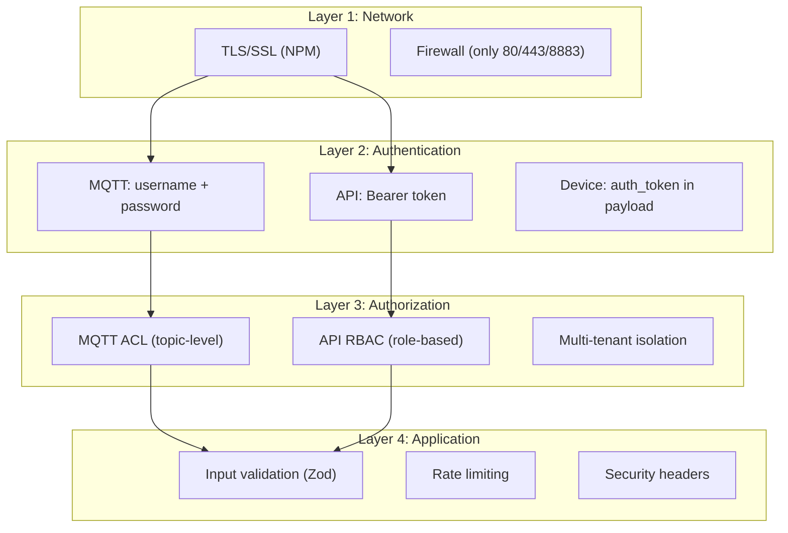
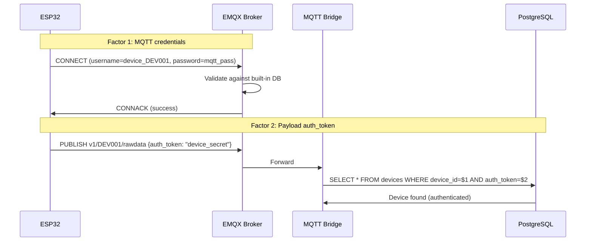
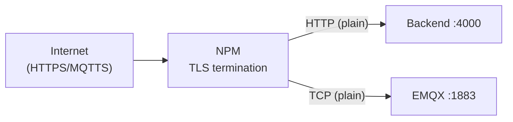
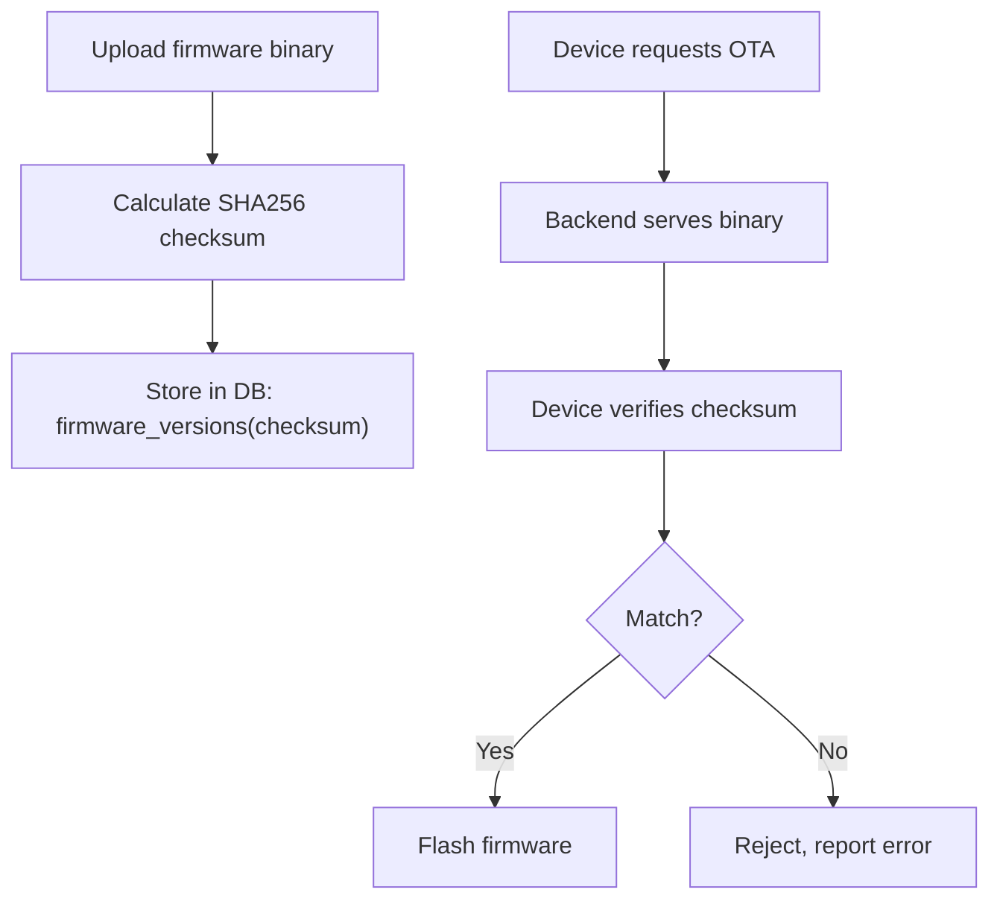

# 14 - Security & Authentication

> Bảo mật hệ thống — device auth, user auth, network security, data protection.

---

## Mục lục

1. [Security Layers](#1-security-layers)
2. [Device Authentication (MQTT)](#2-device-authentication-mqtt)
3. [User Authentication (REST API)](#3-user-authentication-rest-api)
4. [Network Security](#4-network-security)
5. [API Security](#5-api-security)
6. [Data Protection](#6-data-protection)
7. [OTA Security](#7-ota-security)
8. [Monitoring & Audit](#8-monitoring--audit)

---

## 1. Security Layers



---

## 2. Device Authentication (MQTT)

### Two-Factor Device Auth



**Tại sao 2 lớp?**
- MQTT credentials: Ngăn unauthorized MQTT connections
- Payload auth_token: Ngăn spoofing (device A publish as device B)
- Nếu MQTT credentials bị leak → attacker vẫn cần auth_token

---

## 3. User Authentication (REST API)

### Session-Based Auth

```typescript
// Login flow
POST /api/v1/auth/login
Body: { email, password }

// Backend validates:
1. Find user by email
2. bcrypt.compare(password, user.password_hash)
3. Generate session token (crypto.randomUUID)
4. Store in DB: sessions(token, user_id, expires_at)
5. Return: { token, user: { id, email, role } }
```

### Token Validation

```typescript
// Every authenticated request:
GET /api/v1/devices
Headers: { Authorization: "Bearer {token}" }

// auth.middleware.ts validates:
1. Extract token from header
2. SELECT session WHERE token=$1 AND expires_at > NOW()
3. If valid → attach user to request
4. If expired → 401 Unauthorized
```

### Session Configuration

```typescript
export const sessionConfig = {
  secret: requireEnv('SESSION_SECRET'),
  maxLifetimeHours: 24,    // Token valid for 24h
  extensionHours: 4,       // Extend on activity
};
```

---

## 4. Network Security

### TLS Termination (NPM)



- All external traffic encrypted (Let's Encrypt certificates)
- Internal Docker network: plain HTTP/TCP (trusted network)
- MQTT devices connect via port 8883 (TLS) through NPM

### Exposed Ports (Production)

| Port | Protocol | Access |
|------|----------|--------|
| 80 | HTTP | Public (redirect to 443) |
| 443 | HTTPS | Public (web dashboard, API) |
| 8883 | MQTTS | Public (device connections) |
| 81 | HTTP | Admin only (NPM panel) |

**All other ports internal only** (not exposed to internet).

---

## 5. API Security

### Helmet (Security Headers)

```typescript
app.use(helmet());
// Sets:
// X-Content-Type-Options: nosniff
// X-Frame-Options: DENY
// X-XSS-Protection: 0
// Strict-Transport-Security: max-age=15552000
// Content-Security-Policy: default-src 'self'
```

### Rate Limiting

```typescript
import rateLimit from 'express-rate-limit';

export const generalRateLimit = rateLimit({
  windowMs: 15 * 60 * 1000, // 15 minutes
  max: 100,                   // 100 requests per window
  standardHeaders: true,
  legacyHeaders: false,
});

// Stricter for auth endpoints
export const authRateLimit = rateLimit({
  windowMs: 15 * 60 * 1000,
  max: 5, // Only 5 login attempts per 15 min
});
```

### Input Validation

```typescript
// Every endpoint validates input with Zod
const createDeviceSchema = z.object({
  device_id: z.string().min(3).max(50).regex(/^[A-Z0-9_]+$/),
  name: z.string().min(1).max(100),
  customer_id: z.number().int().positive(),
});

// In controller:
const validated = createDeviceSchema.parse(req.body);
// Throws ZodError if invalid → caught by error handler → 400
```

### CORS

```typescript
app.use(cors({
  origin: corsConfig.origin,  // Only allow frontend origin
  credentials: true,
  methods: ['GET', 'POST', 'PUT', 'PATCH', 'DELETE', 'OPTIONS'],
  allowedHeaders: ['Content-Type', 'Authorization', 'X-Request-ID'],
}));
```

---

## 6. Data Protection

### Password Hashing

```typescript
import bcrypt from 'bcryptjs';

// Hash on registration
const hash = await bcrypt.hash(password, 12); // 12 rounds

// Verify on login
const valid = await bcrypt.compare(inputPassword, storedHash);
```

### Sensitive Data Handling

| Data | Storage | Protection |
|------|---------|------------|
| User passwords | PostgreSQL | bcrypt hash (12 rounds) |
| Device auth_tokens | PostgreSQL | Plain (rotatable) |
| Session tokens | PostgreSQL | UUID v4 (unpredictable) |
| MQTT passwords | EMQX built-in DB | Hashed by EMQX |
| Environment secrets | .env files | gitignored, not in image |

### Payload Sanitization

```typescript
// Remove auth_token before logging/storing
const buildSanitizedRawPayload = (payload: RawDataPayload) => {
  const { auth_token: _authToken, ...safePayload } = payload;
  return safePayload;
};
```

---

## 7. OTA Security

### Firmware Integrity



### OTA Timeout Protection

```typescript
export const firmwareConfig = {
  assignedTimeoutSec: 600,      // 10 min to start download
  inProgressTimeoutSec: 900,    // 15 min to complete
};
// If timeout → mark OTA as failed, device stays on current firmware
```

---

## 8. Monitoring & Audit

### Audit Logging

```sql
-- Every sensitive action logged
INSERT INTO audit_logs (user_id, action, resource_type, resource_id, details, ip_address)
VALUES ($1, 'device_command_sent', 'device', $2, $3, $4);
```

### Security Events Monitored

| Event | Detection | Action |
|-------|-----------|--------|
| Failed login attempts | Rate limit counter | Block IP after 5 attempts |
| Device auth failures | Bridge logs | Alert if > 10/min |
| Unauthorized API access | 401/403 responses | Log + alert |
| Unusual traffic patterns | EMQX metrics | Manual investigation |

### Sentry Error Tracking

```typescript
// Captures unhandled errors with context
initSentry();
app.use(sentryRequestHandler);  // Capture request context
app.use(sentryErrorHandler);    // Capture errors
```

---

> **Tiếp theo:** [15-development-workflow.md](./15-development-workflow.md) — Development Workflow — local setup, testing, CI/CD
