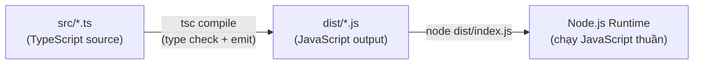
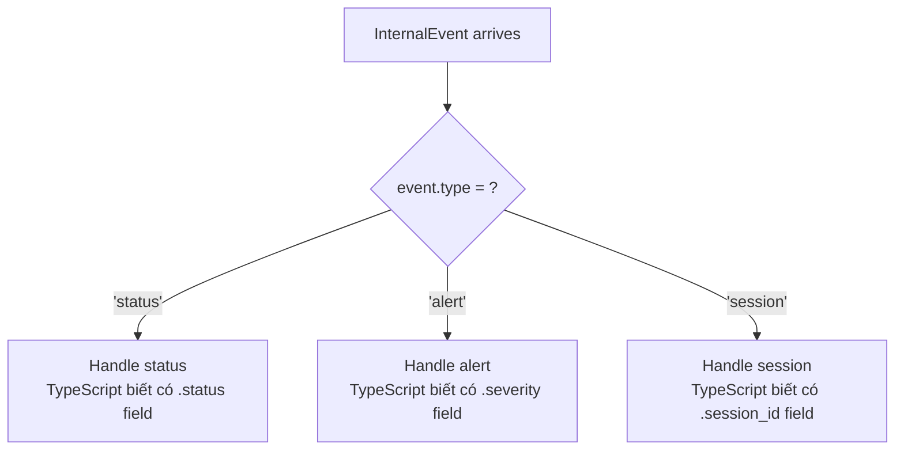
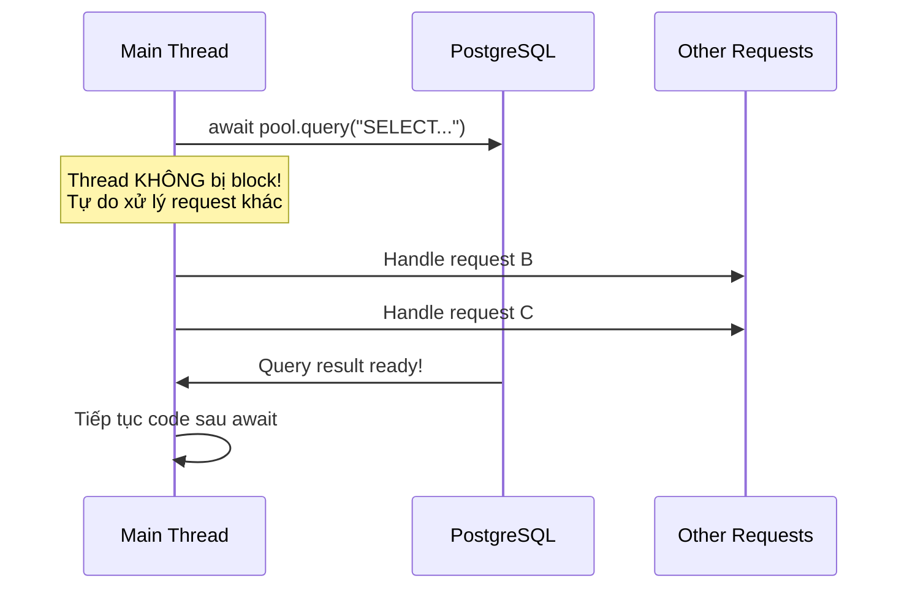

# 16 - TypeScript Fundamentals

> Kiến thức nền tảng TypeScript — type system, async patterns, module system.
> Mỗi khái niệm có giải thích "tại sao", code mẫu từ project, và so sánh đúng/sai.

---

## Mục lục

1. [TypeScript là gì và tại sao dùng?](#1-typescript-là-gì-và-tại-sao-dùng)
2. [Type System — Tư duy về Types](#2-type-system--tư-duy-về-types)
3. [Interfaces & Type Aliases — Mô tả dữ liệu](#3-interfaces--type-aliases--mô-tả-dữ-liệu)
4. [Union Types & Narrowing — Xử lý nhiều khả năng](#4-union-types--narrowing--xử-lý-nhiều-khả-năng)
5. [Generics — Code tái sử dụng với type safety](#5-generics--code-tái-sử-dụng-với-type-safety)
6. [Async/Await — Xử lý bất đồng bộ](#6-asyncawait--xử-lý-bất-đồng-bộ)
7. [Zod — Runtime validation + Type inference](#7-zod--runtime-validation--type-inference)
8. [Patterns thực tế trong project](#8-patterns-thực-tế-trong-project)

---

## 1. TypeScript là gì và tại sao dùng?

TypeScript là JavaScript với hệ thống kiểu tĩnh (static types). Compiler kiểm tra
lỗi **trước khi chạy** — phát hiện bugs mà JavaScript chỉ phát hiện khi runtime crash.

### Vấn đề với JavaScript thuần

```javascript
// JavaScript — không báo lỗi gì, crash lúc runtime
function processDevice(device) {
  console.log(device.device_id.toUpperCase());
  // Nếu device là null → TypeError: Cannot read property 'device_id' of null
  // Nếu device_id là number → TypeError: toUpperCase is not a function
  // Phát hiện lỗi khi nào? Khi user gặp bug trên production!
}
```

### TypeScript giải quyết

```typescript
// TypeScript — compiler báo lỗi NGAY khi viết code
interface Device {
  device_id: string;
  status: 'online' | 'offline' | 'running' | 'stopped';
  last_speed?: number; // ? = có thể undefined
}

function processDevice(device: Device) {
  console.log(device.device_id.toUpperCase()); // ✓ Compiler biết device_id là string
  console.log(device.last_speed.toFixed(1));   // ✗ Error! last_speed có thể undefined
  // Phải check trước:
  if (device.last_speed !== undefined) {
    console.log(device.last_speed.toFixed(1)); // ✓ Bây giờ compiler biết chắc là number
  }
}

processDevice(null);        // ✗ Error! Argument of type 'null' is not assignable
processDevice({ id: 123 }); // ✗ Error! Property 'device_id' is missing
```

**Tại sao quan trọng trong project này?**

MQTT Bridge xử lý hàng nghìn messages/giây từ devices. Mỗi message có payload phức tạp
(20+ fields, nhiều optional). Nếu không có TypeScript:
- Typo `devce_id` thay vì `device_id` → silent bug, data mất
- Quên check `payload.data.speed` có thể undefined → crash toàn bộ Bridge
- Refactor 1 field name → phải grep toàn bộ codebase, dễ miss

TypeScript biến những lỗi runtime thành lỗi compile-time — phát hiện ngay khi viết code.

### Compilation flow trong project



**Quan trọng:** TypeScript types chỉ tồn tại lúc compile. Runtime chạy JavaScript thuần —
không có type checking. Đó là lý do cần Zod cho runtime validation (xem phần 7).

---

## 2. Type System — Tư duy về Types

### Primitive Types — Kiểu nguyên thủy

```typescript
// Mỗi biến có 1 type cố định — compiler enforce
const deviceId: string = 'DEV001';     // Chuỗi ký tự
const speed: number = 65.5;            // Số (integer và float đều là number)
const isOnline: boolean = true;        // true hoặc false
const nothing: null = null;            // Giá trị "trống" có chủ đích
const notSet: undefined = undefined;   // Chưa được gán giá trị
```

**Tại sao phân biệt null vs undefined?**

Trong project, convention là:
- `undefined` = field không tồn tại (device chưa gửi GPS → `latitude` là undefined)
- `null` = field tồn tại nhưng giá trị trống (device đã gán vehicle rồi gỡ → `vehicle_id` là null)

```typescript
// Bridge: rawdata handler
const latitude = payload.data.latitude;  // number | undefined
// undefined = device chưa có GPS fix, field không có trong payload

const vehicleId = device.vehicle_id;     // number | null
// null = device từng gán vehicle, admin đã gỡ ra
```

### Optional chaining & Nullish coalescing

Hai operators quan trọng nhất khi làm việc với data có thể null/undefined:

```typescript
// Optional chaining (?.) — truy cập an toàn, trả undefined nếu null/undefined
const schemaVersion = payload.metadata?.schema_version;
// Nếu payload.metadata là undefined → schemaVersion = undefined (không crash)
// Tương đương: payload.metadata ? payload.metadata.schema_version : undefined

// Nullish coalescing (??) — default value khi null/undefined
const port = fromEnv('PORT') ?? 4000;
// Nếu PORT không set (undefined) → dùng 4000
// KHÁC với || : '' ?? 4000 = '' (chuỗi rỗng không phải nullish)
//               '' || 4000 = 4000 (chuỗi rỗng là falsy)

// Kết hợp cả hai — pattern rất phổ biến trong project
const speed = payload.data?.speed ?? 0;
const deviceId = parts[1] ?? null;
```

**Code thực tế từ Bridge** (`src/index.ts`):

```typescript
const extractDeviceId = (topic: string): string | null => {
  const parts = topic.split('/');
  if (parts.length < 3 || parts[0] !== 'v1') return null;
  return parts[1] ?? null;
  // parts[1] có thể undefined nếu split trả array ngắn
  // ?? null chuyển undefined → null (consistent return type)
};
```

---

## 3. Interfaces & Type Aliases — Mô tả dữ liệu

### Interface — "Hợp đồng" cho object shape

Interface mô tả object phải có những fields nào, kiểu gì. Giống như struct trong C
nhưng chỉ tồn tại lúc compile (không chiếm memory runtime).

```typescript
// src/types/payload.types.ts (Bridge)
// Mô tả chính xác payload mà device gửi lên
interface RawDataPayload {
  device_id: string;           // Bắt buộc — device hardware ID
  auth_token: string;          // Bắt buộc — authentication
  timestamp?: string;          // Optional — device clock (có thể sai)
  boot_id?: string;            // Optional — firmware boot identifier
  data: {                      // Bắt buộc — telemetry data object
    latitude?: number;         // Optional — chưa có GPS fix
    longitude?: number;
    speed?: number;
    battery_v?: number;
    ignition?: boolean;
    imu_accel_delta_mps2?: number;
  };
  diagnostics?: RawDiagnostics; // Optional — OBD data (chỉ khi BLE connected)
  metadata?: {                  // Optional — message metadata
    message_id?: string;
    schema_version?: string;
    seq_no?: number;
    sent_at?: string;
  };
}
```

**Tại sao hầu hết fields là optional (?)?**

Device ESP32 gửi payload khác nhau tùy trạng thái:
- Xe đang chạy + OBD connected: payload đầy đủ (GPS + OBD + IMU + metadata)
- Xe đang chạy + OBD disconnected: không có `diagnostics`
- Heartbeat (xe đỗ): chỉ có GPS + battery, không có speed/OBD
- GPS chưa fix: không có latitude/longitude

TypeScript buộc code phải handle TẤT CẢ trường hợp — không thể "quên" check undefined.

### Type Alias — Đặt tên cho bất kỳ type nào

```typescript
// String literal union — chỉ cho phép giá trị cụ thể
type DeviceStatus = 'online' | 'offline' | 'running' | 'stopped';
// Compiler báo lỗi nếu gán giá trị khác:
const status: DeviceStatus = 'active'; // ✗ Error! 'active' not assignable

// Function type — mô tả signature của callback
type MessageHandler = (deviceId: string, message: Buffer) => Promise<void>;
// Dùng khi truyền function như parameter (giống function pointer trong C)

// Utility type — biến đổi type có sẵn
type DeviceUpdatePayload = Omit<RawDataPayload, 'auth_token'>;
// Giống RawDataPayload nhưng BỎ field auth_token (security — không log token)
```

**Code thực tế — Omit pattern trong Bridge** (`src/handlers/rawdata.handler.ts`):

```typescript
// Trước khi log payload, BỎ auth_token (không bao giờ log credentials)
const buildSanitizedRawPayload = (payload: RawDataPayload): Omit<RawDataPayload, 'auth_token'> => {
  const { auth_token: _authToken, ...safePayload } = payload;
  // Destructuring: tách auth_token ra biến _authToken (prefix _ = không dùng)
  // ...safePayload: spread operator — copy tất cả fields CÒN LẠI vào object mới
  return safePayload;
};
// TypeScript đảm bảo return type KHÔNG CÓ auth_token — nếu vô tình include → compile error
```

---

## 4. Union Types & Narrowing — Xử lý nhiều khả năng

### Vấn đề: Một biến có thể là nhiều type

```typescript
// toFiniteNumber: convert unknown value → number hoặc undefined
// Input có thể là string "65.5", number 65.5, null, undefined, NaN, Infinity...
const toFiniteNumber = (value: unknown): number | undefined => {
  const parsed = Number(value);
  return Number.isFinite(parsed) ? parsed : undefined;
  // Number("65.5") = 65.5 ✓
  // Number(null) = 0 — nhưng isFinite(0) = true... cần cẩn thận!
  // Number(undefined) = NaN — isFinite(NaN) = false → return undefined ✓
  // Number("abc") = NaN → undefined ✓
  // Number(Infinity) → isFinite = false → undefined ✓
};
```

**Tại sao cần hàm này?** Device payload đến từ MQTT (JSON parse) — mọi field đều là `unknown`
cho đến khi validate. Hàm này convert an toàn, trả undefined nếu không phải số hợp lệ.

### Narrowing — Thu hẹp type bằng điều kiện

```typescript
// TypeScript theo dõi điều kiện if/switch và tự thu hẹp type
const speed: number | undefined = payload.data.speed;

// Trước if: speed là "number | undefined"
if (speed !== undefined) {
  // SAU if: TypeScript biết speed chắc chắn là "number"
  console.log(speed.toFixed(1)); // ✓ Không cần cast
}
// Ngoài if: speed vẫn là "number | undefined"
```

### Discriminated Union — Pattern mạnh nhất cho event handling



```typescript
// Mỗi variant có 1 field chung (type) với giá trị literal khác nhau
type InternalEvent =
  | { type: 'status'; device_id: string; status: DeviceStatus; speed?: number }
  | { type: 'alert'; device_id: string; severity: 'low' | 'medium' | 'high' | 'critical'; message: string }
  | { type: 'session'; device_id: string; session_id: number; action: 'created' | 'closed' };

function handleInternalEvent(event: InternalEvent) {
  switch (event.type) {
    case 'status':
      // TypeScript TỰ ĐỘNG biết event có .status và .speed
      io.to(`device:${event.device_id}`).emit('device:status_changed', {
        status: event.status,
        speed: event.speed,
      });
      break;

    case 'alert':
      // TypeScript TỰ ĐỘNG biết event có .severity và .message
      io.to('alerts').emit('device:alert', {
        severity: event.severity,
        message: event.message,
      });
      break;

    case 'session':
      // TypeScript TỰ ĐỘNG biết event có .session_id và .action
      if (event.action === 'closed') {
        // Invalidate cache, update UI...
      }
      break;
  }
}
```

**Tại sao pattern này mạnh?** Nếu thêm variant mới (ví dụ `type: 'zone'`) mà quên
handle trong switch → TypeScript có thể báo lỗi (với exhaustive check pattern).

---

## 5. Generics — Code tái sử dụng với type safety

### Vấn đề: Muốn viết 1 function hoạt động với nhiều types

```typescript
// Không có generics — phải viết nhiều hàm giống nhau:
function firstDevice(arr: Device[]): Device | undefined { return arr[0]; }
function firstAlert(arr: Alert[]): Alert | undefined { return arr[0]; }
function firstString(arr: string[]): string | undefined { return arr[0]; }
// Lặp lại logic giống hệt, chỉ khác type!

// Với generics — viết 1 lần, hoạt động với MỌI type:
function first<T>(arr: T[]): T | undefined { return arr[0]; }
// T là "type parameter" — placeholder, được thay thế khi gọi

const device = first(devices);  // TypeScript infer T = Device → return Device | undefined
const alert = first(alerts);    // T = Alert → return Alert | undefined
const name = first(['a', 'b']); // T = string → return string | undefined
```

### Generics trong project — Record<K, V>

```typescript
// Record<string, number | undefined> = object với key là string, value là number hoặc undefined
// Dùng cho telemetry data — key là metric name, value là giá trị

export const writeDeviceTelemetry = async (
  deviceId: string,
  data: Record<string, number | undefined>,
  timestampMs: number,
): Promise<void> => {
  // data có thể là:
  // { speed: 65.5, latitude: 10.76, longitude: 106.66, battery_v: 12.4, rpm: undefined }
  
  for (const [key, value] of Object.entries(data)) {
    if (value === undefined) continue; // Skip undefined metrics
    // key: string (metric name), value: number (metric value)
    const metricName = `tracker_telemetry_${sanitizeLabel(key)}`;
    lines.push(`${metricName}{device_id="${deviceId}"} ${value} ${timestampMs}`);
  }
};

// Gọi từ rawdata handler:
await writeDeviceTelemetry(deviceId, {
  speed: payload.data.speed,           // number | undefined
  latitude: effectiveLatitude,          // number | undefined
  longitude: effectiveLongitude,        // number | undefined
  battery_v: payload.data.battery_v,   // number | undefined
  imu_accel_delta_mps2: imuAccelDelta, // number | undefined
  rpm: diagnostics?.signals?.rpm,       // number | undefined
}, timestampMs);
// Hàm tự skip undefined values — chỉ write metrics có giá trị
```

---

## 6. Async/Await — Xử lý bất đồng bộ

### Vấn đề: I/O operations mất thời gian

Node.js là single-threaded. Nếu chờ DB query 50ms bằng cách block thread →
toàn bộ server đứng yên 50ms, không xử lý request nào khác.

Giải pháp: **async/await** — "đặt hẹn" cho I/O, thread tự do làm việc khác trong lúc chờ.



### Promise — Đại diện cho "giá trị tương lai"

```typescript
// Promise<Device | null> = "sẽ trả về Device hoặc null trong tương lai"
async function validateDevice(
  deviceId: string,
  authToken: string,
): Promise<Device | null> {
  // await = "chờ Promise resolve, nhưng KHÔNG block thread"
  const result = await pool.query(
    'SELECT * FROM devices WHERE device_id = $1 AND auth_token = $2',
    [deviceId, authToken],
  );
  // Code sau await chỉ chạy KHI query xong
  return result.rows[0] ?? null;
}
```

### Error handling — try/catch với async

```typescript
// Pattern trong Bridge: rawdata handler
export const handleRawData = async (deviceId: string, message: Buffer): Promise<void> => {
  // Toàn bộ handler wrapped trong try/catch
  // Nếu BẤT KỲ await nào throw → catch bắt, log, và TIẾP TỤC xử lý message tiếp
  try {
    const parsed = JSON.parse(message.toString());
    const result = rawDataSchema.safeParse(parsed);
    if (!result.success) {
      logger.warn({ issues: result.error.issues }, 'Invalid payload');
      return; // Drop message, không crash
    }

    const device = await validateDevice(result.data.device_id, result.data.auth_token);
    if (!device) {
      logger.warn({ deviceId }, 'Auth failed');
      return; // Drop message
    }

    // Nhiều await operations...
    await writeDeviceTelemetry(deviceId, metrics, timestampMs);
    await writeDeviceEvent(deviceId, 'telemetry', 'processed');

  } catch (err) {
    // Catch-all: log error nhưng KHÔNG crash process
    // Bridge phải tiếp tục xử lý messages khác
    logger.error({ err, deviceId, event: 'rawdata_handler_failed' }, 'Handler failed');
  }
};
```

**Tại sao không throw lên trên?** Bridge xử lý hàng nghìn messages/giây.
Nếu 1 message lỗi mà crash process → MẤT TẤT CẢ messages đang xử lý.
Pattern: catch, log, drop message lỗi, tiếp tục.

### Fire-and-forget — Chạy background không chờ

```typescript
// Trong index.ts — message router
client.on('message', (topic, message) => {
  // KHÔNG await — handleRawData chạy background
  // Nếu await → block message processing cho messages tiếp theo
  handleRawData(deviceId, message).catch((err) => {
    logger.error({ err, deviceId }, 'Handler failed');
  });
  // .catch() đảm bảo unhandled rejection không crash process
});
```

**Giải thích:** MQTT client emit 'message' event cho MỖI message nhận được.
Nếu await handler → phải xử lý xong message A mới nhận message B.
Fire-and-forget cho phép xử lý concurrent (nhiều messages cùng lúc).

### Promise.all — Chạy song song nhiều operations

```typescript
// Ghi vào 3 stores CÙNG LÚC (không cần chờ tuần tự)
await Promise.all([
  writeDeviceTelemetry(deviceId, metrics, timestampMs),  // ~5ms
  writeDeviceEvent(deviceId, 'telemetry', 'processed'),  // ~5ms
  checkGeofences(deviceId, latitude, longitude),          // ~10ms
]);
// Tổng: ~10ms (max của 3) thay vì ~20ms (tổng tuần tự)

// So sánh tuần tự (chậm hơn):
await writeDeviceTelemetry(deviceId, metrics, timestampMs);  // chờ 5ms
await writeDeviceEvent(deviceId, 'telemetry', 'processed');  // chờ thêm 5ms
await checkGeofences(deviceId, latitude, longitude);          // chờ thêm 10ms
// Tổng: 20ms
```

---

## 7. Zod — Runtime validation + Type inference

### Vấn đề: TypeScript types biến mất lúc runtime

```typescript
// TypeScript chỉ check lúc COMPILE
interface RawDataPayload {
  device_id: string;
  data: { speed?: number };
}

// Nhưng data từ MQTT là JSON.parse(buffer) → type là "any" hoặc "unknown"
// Runtime KHÔNG CÓ type checking — device có thể gửi bất kỳ thứ gì:
// { "device_id": 123 }          ← device_id phải là string!
// { "data": "not an object" }   ← data phải là object!
// { }                           ← thiếu device_id!
```

### Giải pháp: Zod schema = runtime type checking

```typescript
import { z } from 'zod';

// Zod schema: VỪA validate runtime, VỪA infer TypeScript type
const rawDataSchema = z.object({
  device_id: z.string().min(1),    // Phải là string, ít nhất 1 ký tự
  auth_token: z.string().min(1),
  timestamp: z.string().optional(), // Optional string
  data: z.object({
    latitude: z.number().optional(),
    longitude: z.number().optional(),
    speed: z.number().min(0).optional(), // Nếu có, phải >= 0
    battery_v: z.number().optional(),
    ignition: z.boolean().optional(),
  }),
  metadata: z.object({
    message_id: z.string().optional(),
    seq_no: z.number().int().optional(), // Integer
  }).optional(),
});

// Infer TypeScript type TỪ schema (không cần viết interface riêng!)
type RawDataPayload = z.infer<typeof rawDataSchema>;
// Equivalent to interface ở trên, nhưng LUÔN sync với validation logic
```

### Sử dụng trong Bridge

```typescript
export const handleRawData = async (deviceId: string, message: Buffer): Promise<void> => {
  let parsed: unknown;
  try {
    parsed = JSON.parse(message.toString()); // parsed: unknown (chưa biết gì)
  } catch {
    logger.warn({ deviceId }, 'Invalid JSON');
    return; // Không phải JSON → drop
  }

  // safeParse: validate mà KHÔNG throw (trả result object)
  const result = rawDataSchema.safeParse(parsed);

  if (!result.success) {
    // Validation failed — log chi tiết lỗi gì
    logger.warn({
      deviceId,
      issues: result.error.issues,
      // issues: [{ path: ['device_id'], message: 'Required', code: 'invalid_type' }]
    }, 'Invalid payload');
    return; // Drop invalid message
  }

  // result.data: RawDataPayload — TypeScript biết CHÍNH XÁC type
  // Mọi field đã được validate, safe to use
  const payload = result.data;
  console.log(payload.device_id); // ✓ Chắc chắn là string, ít nhất 1 ký tự
  console.log(payload.data.speed); // ✓ number | undefined (đã validate)
};
```

**Tại sao safeParse thay vì parse?**
- `parse()` throw ZodError nếu invalid → phải try/catch
- `safeParse()` trả `{ success: true, data }` hoặc `{ success: false, error }` → explicit handling
- Trong Bridge: message invalid là BÌNH THƯỜNG (device lỗi, firmware cũ) → không nên throw

---

## 8. Patterns thực tế trong project

### `as const` — Biến object thành immutable literal type

```typescript
// KHÔNG có as const:
const TOPICS = { RAW_DATA: 'v1/+/rawdata', STATUS: 'v1/+/status' };
// Type: { RAW_DATA: string, STATUS: string } — quá rộng!

// CÓ as const:
export const DEVICE_TOPICS = {
  RAW_DATA: 'v1/+/rawdata',
  STATUS: 'v1/+/status',
  EVENTS: 'v1/+/events',
  FIRMWARE: 'v1/+/firmware',
  COMMAND_ACK: 'v1/+/commands/ack',
} as const;
// Type: { readonly RAW_DATA: "v1/+/rawdata", readonly STATUS: "v1/+/status", ... }
// - Giá trị CHÍNH XÁC (literal type, không phải string chung)
// - readonly — không thể reassign
// - IDE autocomplete hiển thị giá trị thực tế
```

### Exhaustive switch — Compiler báo khi quên handle case

```typescript
type AlertSeverity = 'low' | 'medium' | 'high' | 'critical';

function getSeverityColor(severity: AlertSeverity): string {
  switch (severity) {
    case 'low': return '#22c55e';      // green
    case 'medium': return '#f59e0b';   // amber
    case 'high': return '#ef4444';     // red
    case 'critical': return '#7c2d12'; // dark red
    default:
      // never type: nếu tất cả cases đã handle → code này unreachable
      // Nếu THÊM severity mới (ví dụ 'info') mà QUÊN handle → COMPILE ERROR ở đây!
      const _exhaustive: never = severity;
      return _exhaustive;
  }
}
// Thêm 'info' vào AlertSeverity → compiler báo:
// "Type 'info' is not assignable to type 'never'" tại dòng default
// → Buộc developer phải thêm case 'info' trước khi code compile được
```

### Module pattern — Export/Import

```typescript
// src/infrastructure/logger.ts — Export named
export const logger = pino({ level: 'info' });

// src/config/env.ts — Export multiple named
export const appConfig = { port: 4000 } as const;
export const dbConfig = { host: 'localhost' } as const;
export const mqttConfig = { host: 'localhost' } as const;

// src/handlers/rawdata.handler.ts — Import named
import { logger } from '../infrastructure/logger';
import { appConfig, mqttConfig } from '../config/env';
import { rawDataSchema } from '../validators/payload.validator';

// Path alias (@/) — tránh relative path dài
import { logger } from '@/infrastructure/logger';
// Thay vì: import { logger } from '../../../infrastructure/logger';
// Configured trong tsconfig.json: paths: { "@/*": ["./src/*"] }
```

---

> **Tiếp theo:** [17-nodejs-express-patterns.md](./17-nodejs-express-patterns.md) — Node.js runtime & Express.js framework