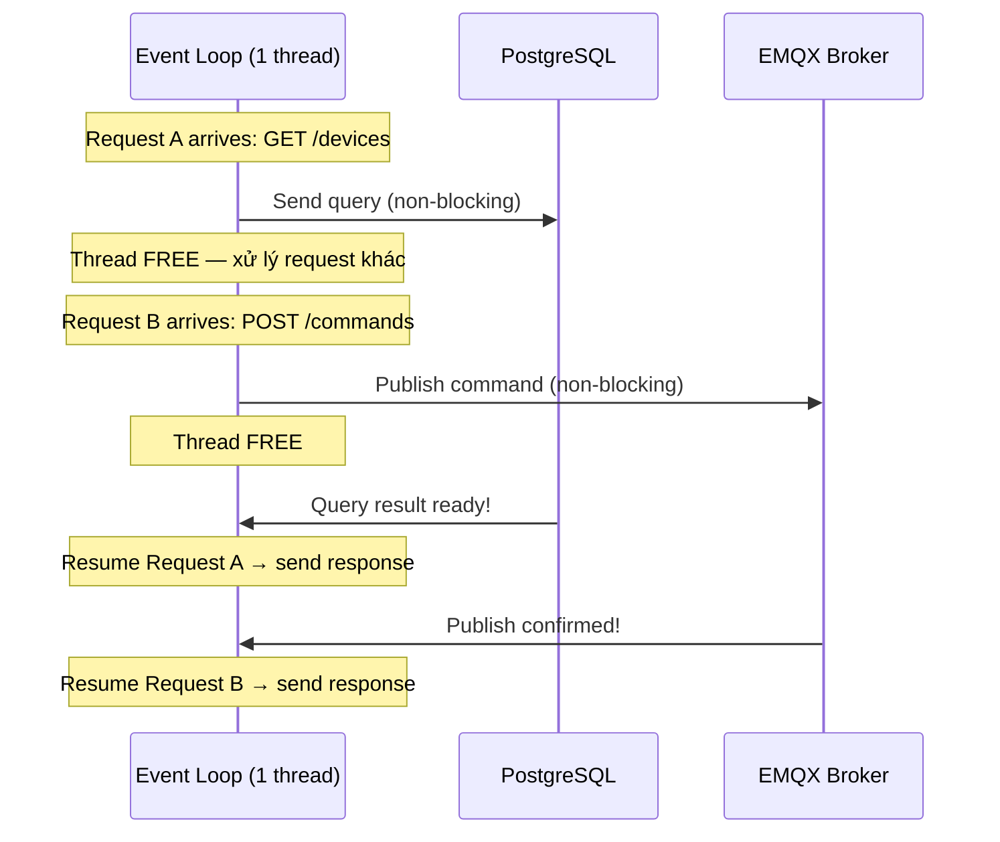
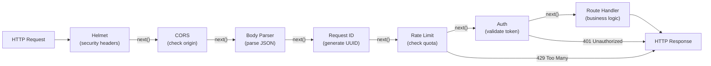
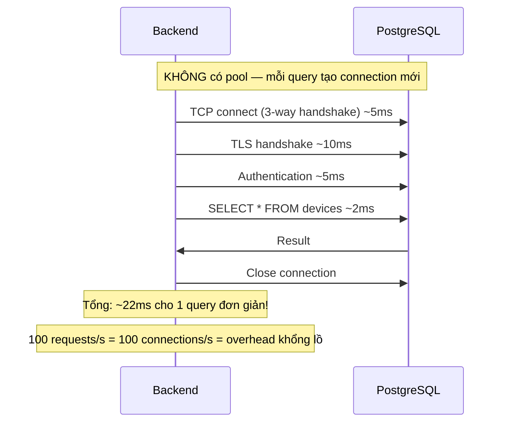
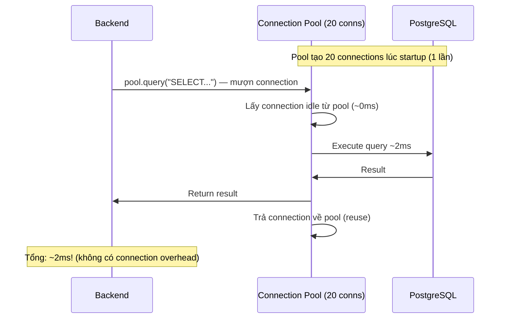
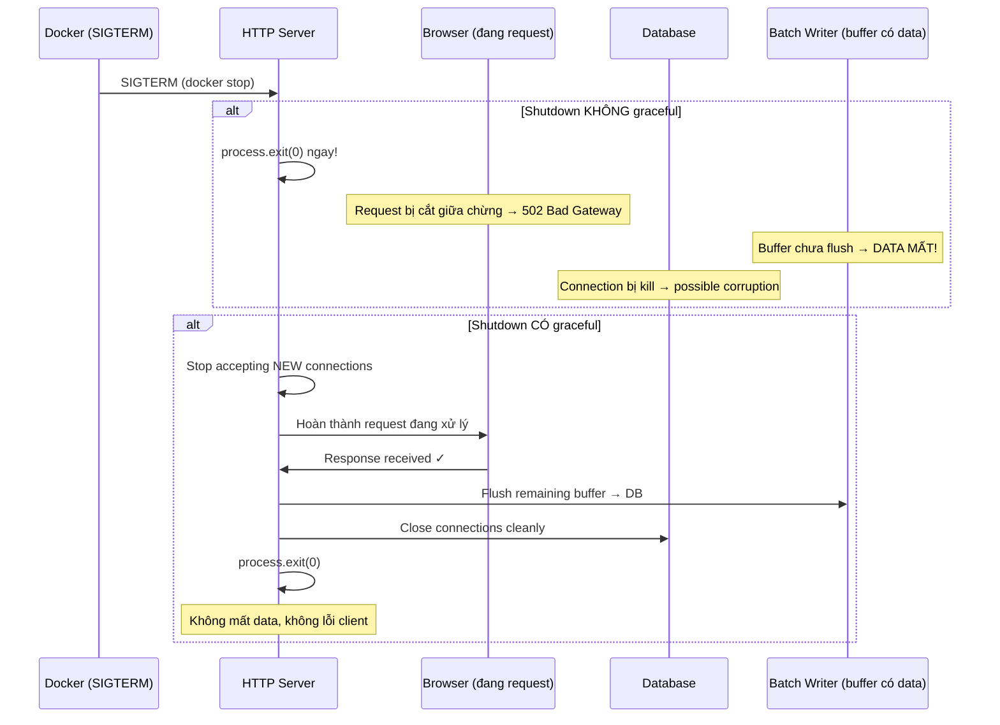

# 17 - Node.js & Express Patterns

> Node.js runtime, Express.js framework — event loop, middleware chain, connection pooling.
> Mỗi pattern có giải thích "tại sao thiết kế như vậy" + code thực tế từ project.

---

## Mục lục

1. [Node.js Event Loop — Tại sao single-threaded mà xử lý được nghìn requests?](#1-nodejs-event-loop)
2. [Express Middleware Chain — Request đi qua pipeline như thế nào?](#2-express-middleware-chain)
3. [Connection Pooling — Tại sao không tạo connection mới mỗi query?](#3-connection-pooling)
4. [Structured Logging — Tại sao không dùng console.log?](#4-structured-logging)
5. [Graceful Shutdown — Tại sao không process.exit() ngay?](#5-graceful-shutdown)
6. [Environment Configuration — Tại sao cần typed config?](#6-environment-configuration)

---

## 1. Node.js Event Loop

### Vấn đề: Server cần xử lý nhiều requests cùng lúc

Mỗi request cần I/O (đọc DB, gọi API, đọc file). Nếu mỗi request chiếm 1 thread
(như Java/C#) → 1000 requests = 1000 threads = tốn RAM + context switching.

### Giải pháp Node.js: 1 thread + non-blocking I/O

Node.js chỉ dùng **1 thread** cho application code. Khi gặp I/O (DB query, network call),
nó "đặt hẹn" rồi tiếp tục xử lý request khác. Khi I/O xong → callback/promise được gọi.



**So sánh với multi-threaded (Java):**
- Java: 1000 requests → 1000 threads → ~1GB RAM cho thread stacks
- Node.js: 1000 requests → 1 thread → ~50MB RAM
- Trade-off: Node.js KHÔNG THỂ block thread (CPU-intensive work cần worker threads)

### Quy tắc vàng: KHÔNG BAO GIỜ block event loop

```typescript
// ✗ SAI — block thread 5 giây, TOÀN BỘ server đứng yên!
function heavyComputation() {
  const start = Date.now();
  while (Date.now() - start < 5000) { } // Busy wait
  return 'done';
}

// ✗ SAI — synchronous file read block thread
const data = fs.readFileSync('/large-file.bin'); // Block!

// ✓ ĐÚNG — async file read, thread tự do trong lúc chờ
const data = await fs.promises.readFile('/large-file.bin');

// ✓ ĐÚNG — async DB query
const result = await pool.query('SELECT * FROM devices WHERE id = $1', [id]);
```

**Trong project:** Mọi I/O đều async — DB queries, MQTT publish, HTTP fetch (VictoriaMetrics),
file operations. Không có synchronous I/O nào trong hot path.

---

## 2. Express Middleware Chain

### Middleware là gì?

Middleware = function nằm giữa "request đến" và "response đi". Mỗi middleware
làm 1 việc nhỏ rồi chuyển tiếp cho middleware tiếp theo (gọi `next()`).

Giống dây chuyền sản xuất: mỗi trạm xử lý 1 bước, sản phẩm đi qua tuần tự.



**Quan trọng:** Middleware có thể:
1. Gọi `next()` → chuyển sang middleware tiếp theo
2. Gửi response (`res.json(...)`) → DỪNG pipeline, không gọi next

### Code thực tế — Request ID middleware

```typescript
// src/middleware/request-id.middleware.ts
// Mục đích: Mỗi request có 1 UUID duy nhất để trace qua logs

import { Request, Response, NextFunction } from 'express';
import crypto from 'crypto';

export const requestId = (req: Request, res: Response, next: NextFunction) => {
  // 1. Nếu client gửi X-Request-ID header → dùng luôn (cho distributed tracing)
  //    Nếu không → tạo UUID mới
  const id = (req.headers['x-request-id'] as string) || crypto.randomUUID();

  // 2. Attach vào request object (các middleware/handler sau có thể đọc)
  req.id = id;

  // 3. Set response header (client nhận lại ID để reference khi report bug)
  res.setHeader('X-Request-ID', id);

  // 4. Chuyển tiếp cho middleware tiếp theo
  next();
};
```

### Code thực tế — Auth middleware (có thể DỪNG pipeline)

```typescript
// src/middleware/auth.middleware.ts
// Mục đích: Validate session token, attach user info vào request

export const authMiddleware = async (req: Request, res: Response, next: NextFunction) => {
  // 1. Extract token từ header "Authorization: Bearer xxx"
  const authHeader = req.headers.authorization;
  const token = authHeader?.replace('Bearer ', '');

  if (!token) {
    // DỪNG pipeline — trả 401, KHÔNG gọi next()
    return res.status(401).json({ error: 'No authentication token provided' });
  }

  // 2. Validate token against database
  const session = await findSessionByToken(token);

  if (!session || session.expires_at < new Date()) {
    // Token invalid hoặc expired → DỪNG
    return res.status(401).json({ error: 'Session expired or invalid' });
  }

  // 3. Attach user info vào request (route handler sẽ dùng)
  req.user = session.user;
  req.sessionId = session.id;

  // 4. Token valid → cho đi tiếp
  next();
};
```

**Tại sao tách auth thành middleware riêng?**
- Không phải mọi route cần auth (health check, login, swagger docs)
- DRY: viết 1 lần, apply cho nhiều routes
- Testable: có thể test auth logic riêng biệt

### Thứ tự middleware QUAN TRỌNG

```typescript
// src/index.ts — Thứ tự đăng ký middleware
// Chạy TRƯỚC route handlers (theo thứ tự đăng ký)

app.use(sentryRequestHandler);  // 1. Capture request context (PHẢI đầu tiên)
app.use(helmet());              // 2. Security headers
app.use(compression());         // 3. Gzip response body
app.use(cors({ origin }));      // 4. CORS check
app.use(express.json());        // 5. Parse JSON body (PHẢI trước route handlers)
app.use(requestId);             // 6. Generate request ID
app.use(httpMetricsMiddleware); // 7. Count requests (Prometheus)
app.use(generalRateLimit);      // 8. Rate limiting

// Routes (business logic)
app.use('/health', healthRoutes);       // 9a. No auth needed
app.use('/api/v1', routes);             // 9b. Auth inside routes

// Error handlers (PHẢI cuối cùng — catch errors từ routes)
app.use(sentryErrorHandler);    // 10. Report to Sentry
app.use(errorHandler);          // 11. Format error response
```

**Tại sao `express.json()` phải trước routes?**
Nếu đặt sau → `req.body` là undefined trong route handler → crash.

**Tại sao error handler phải cuối?**
Express nhận biết error handler bằng 4 parameters `(err, req, res, next)`.
Khi route handler throw/next(err) → Express skip tất cả middleware thường,
nhảy thẳng đến error handler.

---

## 3. Connection Pooling

### Vấn đề: Tạo DB connection tốn thời gian



### Giải pháp: Connection Pool

Pool giữ sẵn N connections mở. Khi cần query → "mượn" 1 connection từ pool.
Xong → "trả" lại pool (không close). Connection tiếp theo dùng lại ngay.



### Code thực tế — Pool configuration

```typescript
// src/infrastructure/database/pool.ts (Backend)
import { Pool } from 'pg';
import { dbConfig } from '@/config/env';

export const pool = new Pool({
  host: dbConfig.host,           // 'tracking-postgres' (Docker hostname)
  port: dbConfig.port,           // 5432
  database: dbConfig.database,   // 'vehicle_tracking'
  user: dbConfig.user,           // 'postgres'
  password: dbConfig.password,
  max: 20,                       // Tối đa 20 connections trong pool
  idleTimeoutMillis: 30000,      // Close connection idle > 30s (tiết kiệm resources)
  connectionTimeoutMillis: 5000, // Fail nếu không lấy được connection trong 5s
});

// Graceful shutdown — close tất cả connections
export const closePool = async (): Promise<void> => {
  await pool.end();
};
```

### Sử dụng pool — 2 patterns

```typescript
// Pattern 1: Simple query (auto checkout/release)
// Pool tự mượn connection, execute, trả lại
const result = await pool.query(
  'SELECT * FROM devices WHERE customer_id = $1 AND current_status = $2',
  [customerId, 'running'],
);
const devices = result.rows; // Array of row objects

// Pattern 2: Transaction (manual checkout/release)
// Cần giữ CÙNG connection cho nhiều queries (transaction isolation)
const client = await pool.connect(); // Mượn 1 connection cụ thể
try {
  await client.query('BEGIN');
  await client.query('UPDATE devices SET status = $1 WHERE id = $2', ['offline', id]);
  await client.query('INSERT INTO event_logs (device_id, event) VALUES ($1, $2)', [id, 'offline']);
  await client.query('COMMIT'); // Cả 2 operations thành công → commit
} catch (err) {
  await client.query('ROLLBACK'); // Bất kỳ lỗi nào → rollback TẤT CẢ
  throw err;
} finally {
  client.release(); // LUÔN trả connection về pool!
  // Nếu quên release → connection leak → pool cạn dần → server đứng!
}
```

**Tại sao max: 20?**
- PostgreSQL default max_connections = 100
- Backend dùng 20, Bridge dùng 10 → tổng 30 (còn dư cho admin tools, Grafana)
- 20 connections đủ cho ~200 concurrent requests (mỗi query ~2-5ms)

---

## 4. Structured Logging

### Vấn đề: console.log không đủ cho production

```typescript
// ✗ console.log — không có timestamp, level, context
console.log('Device auth failed');
// Output: "Device auth failed"
// Không biết: khi nào? device nào? request nào? severity?

// ✓ Structured logging — JSON với đầy đủ context
logger.warn({
  deviceId: 'DEV001',
  event: 'device_auth_failed',
  requestId: 'abc-123',
}, 'Device auth failed');
// Output: {"level":"warn","time":1716393600,"deviceId":"DEV001","event":"device_auth_failed","requestId":"abc-123","msg":"Device auth failed"}
```

**Tại sao JSON?**
- Machine-parseable: Grafana/ELK có thể filter, aggregate, alert
- Searchable: `event:device_auth_failed AND deviceId:DEV001`
- Consistent: mọi log entry cùng format

### Pino (Bridge) — Lightweight, fast

```typescript
// src/infrastructure/logger.ts (Bridge)
import pino from 'pino';

export const logger = pino({
  level: process.env.LOG_LEVEL ?? 'info',
  // Development: pretty print (human-readable)
  // Production: raw JSON (machine-parseable)
  ...(process.env.NODE_ENV !== 'production' && {
    transport: { target: 'pino-pretty' },
  }),
});

// Usage patterns trong project:
// 1. Info — normal operation
logger.info({ deviceId, event: 'rawdata_processed', latencyMs: 12 }, 'Rawdata processed');

// 2. Warn — unexpected but handled
logger.warn({ deviceId, event: 'rawdata_payload_invalid_json' }, 'Invalid rawdata payload');

// 3. Error — something broke
logger.error({ err, deviceId, event: 'rawdata_handler_failed' }, 'Rawdata handler failed');
// err object tự động serialize stack trace
```

### Convention: `event` field

Mọi log entry trong project có field `event` — identifier duy nhất cho loại sự kiện.
Cho phép search/filter chính xác trong Grafana:

```
event:device_auth_failed          → Tất cả auth failures
event:batch_write_failed          → DB write problems
event:bridge_started              → Bridge lifecycle
event:mqtt_topic_device_unresolved → Topic parsing issues
```

---

## 5. Graceful Shutdown

### Vấn đề: Tại sao không `process.exit(0)` ngay?



### Code thực tế — Backend graceful shutdown

```typescript
// src/index.ts
const gracefulShutdown = (signal: string) => {
  logger.info(`${signal} received. Starting graceful shutdown...`);

  // 1. Stop accepting NEW connections (existing requests continue)
  server.close(async () => {
    logger.info('HTTP server closed');

    // 2. Close MQTT subscription (stop receiving new events)
    await closeMqttEventListener();
    logger.info('MQTT event listener closed');

    // 3. Close WebSocket server (disconnect all clients)
    await closeSocketServer();
    logger.info('WebSocket server closed');

    // 4. Close database pool (wait for active queries to finish)
    await closePool();
    logger.info('Database pool closed');

    // 5. Exit cleanly
    process.exit(0);
  });

  // Safety net: nếu cleanup mất quá lâu → force kill
  // Docker mặc định chờ 10s sau SIGTERM rồi gửi SIGKILL
  setTimeout(() => {
    logger.error('Forced shutdown after timeout');
    process.exit(1);
  }, 10_000);
};

// Docker gửi SIGTERM khi `docker stop`
process.on('SIGTERM', () => gracefulShutdown('SIGTERM'));
// Ctrl+C gửi SIGINT
process.on('SIGINT', () => gracefulShutdown('SIGINT'));
```

### Bridge graceful shutdown — Flush batch writer

```typescript
// Bridge có thêm bước quan trọng: flush buffered data
const shutdown = async (signal: string): Promise<void> => {
  bridgeHealthState.shuttingDown = true;

  // 1. Disconnect MQTT (stop receiving messages)
  await disconnectMqtt();

  // 2. FLUSH batch writer — ghi hết buffer vào DB trước khi exit
  //    Nếu skip bước này → device state updates trong buffer bị MẤT
  await stopBatchWriter();

  // 3. Close DB pool
  await closePool();

  // 4. Stop health server
  await stopBridgeHealthServer();

  process.exit(0);
};
```

---

## 6. Environment Configuration

### Vấn đề: Hardcode config = không deploy được

```typescript
// ✗ SAI — hardcode
const pool = new Pool({ host: 'localhost', password: 'mypassword123' });
// Development: OK
// Production: WRONG host, LEAKED password in source code!
```

### Giải pháp: Environment variables + typed config

```typescript
// src/config/env.ts — Single source of truth cho tất cả config
import 'dotenv/config'; // Load .env file vào process.env

// Helper: đọc env var
const fromEnv = (key: string): string | undefined => process.env[key];

// Helper: parse integer với fallback
const toInt = (value: string | undefined, fallback: number): number => {
  const parsed = value ? Number.parseInt(value, 10) : NaN;
  return Number.isFinite(parsed) ? parsed : fallback;
};

// Helper: require env var (crash nếu missing trong production)
const requireEnv = (key: string, value: string | undefined): string => {
  if (!value) {
    if (fromEnv('NODE_ENV') === 'production') {
      // Production PHẢI có — crash ngay khi startup (fail fast)
      throw new Error(`CRITICAL: Environment variable "${key}" is not set!`);
    }
    // Development: warn nhưng không crash (dùng default)
    console.warn(`WARNING: Environment variable "${key}" is not set.`);
  }
  return value ?? '';
};

// Export typed config objects — IDE autocomplete, type-safe
export const appConfig = {
  port: toInt(fromEnv('PORT'), 4000),
  nodeEnv: fromEnv('NODE_ENV') ?? 'development',
  isProduction: fromEnv('NODE_ENV') === 'production',
} as const;

export const dbConfig = {
  host: fromEnv('POSTGRESQL_HOST') ?? 'localhost',
  port: toInt(fromEnv('POSTGRESQL_PORT'), 5432),
  database: fromEnv('POSTGRESQL_DATABASE') ?? 'vehicle_tracking',
  user: fromEnv('POSTGRESQL_USER') ?? 'postgres',
  password: requireEnv('POSTGRESQL_PASSWORD', fromEnv('POSTGRESQL_PASSWORD')),
  connectionLimit: toInt(fromEnv('POSTGRESQL_CONNECTION_LIMIT'), 20),
} as const;

export const mqttConfig = {
  host: fromEnv('MQTT_HOST') ?? 'localhost',
  port: toInt(fromEnv('MQTT_PORT'), 1883),
  useTls: appConfig.isProduction
    ? fromEnv('MQTT_USE_TLS') !== 'false'  // Production: TLS mặc định ON
    : fromEnv('MQTT_USE_TLS') === 'true',  // Dev: TLS mặc định OFF
  username: fromEnv('MQTT_USERNAME') ?? 'backend',
  password: requireEnv('MQTT_PASSWORD', fromEnv('MQTT_PASSWORD')),
} as const;
```

**Tại sao `as const`?**
- Biến config thành readonly — không thể vô tình reassign
- IDE hiển thị giá trị cụ thể khi hover

**Tại sao `requireEnv` crash trong production?**
- Fail fast: phát hiện missing config NGAY khi deploy, không phải khi user gặp lỗi
- Development: warn nhưng dùng default → developer không cần setup đầy đủ env

**Tại sao tách thành objects (appConfig, dbConfig, mqttConfig)?**
- Organized: import chỉ config cần thiết
- Autocomplete: `dbConfig.` → IDE hiện tất cả DB options
- Testable: có thể mock từng config object

---

> **Tiếp theo:** [18-react-nextjs-patterns.md](./18-react-nextjs-patterns.md) — React & Next.js patterns