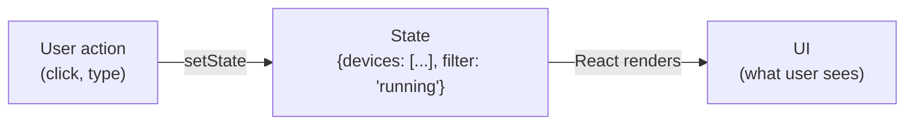
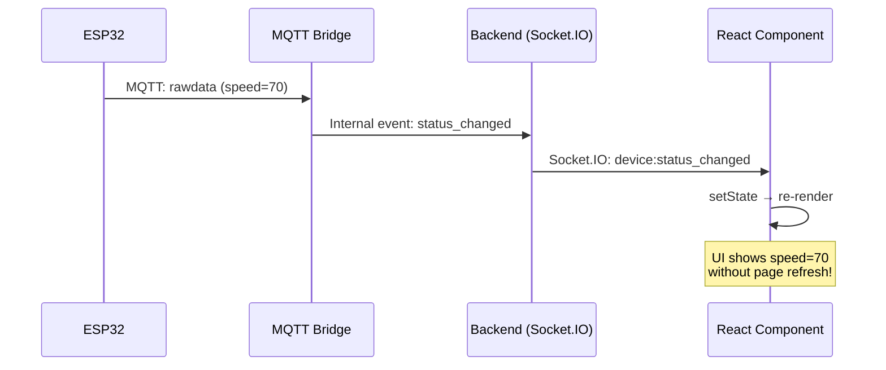

# 18 - React & Next.js Patterns

> React component model, hooks, Next.js App Router — cách Frontend được xây dựng.
> Giải thích "tại sao" đằng sau mỗi pattern + code thực tế từ project.

---

## Mục lục

1. [React — Tư duy declarative UI](#1-react--tư-duy-declarative-ui)
2. [Component — Đơn vị xây dựng UI](#2-component--đơn-vị-xây-dựng-ui)
3. [Hooks — Logic tái sử dụng](#3-hooks--logic-tái-sử-dụng)
4. [Next.js App Router — File-based routing](#4-nextjs-app-router--file-based-routing)
5. [Server vs Client Components — Render ở đâu?](#5-server-vs-client-components--render-ở-đâu)
6. [TanStack Query — Server state management](#6-tanstack-query--server-state-management)
7. [Zustand — Client state management](#7-zustand--client-state-management)
8. [Socket.IO Integration — Realtime updates](#8-socketio-integration--realtime-updates)

---

## 1. React — Tư duy declarative UI

### Vấn đề: Imperative DOM manipulation phức tạp

```javascript
// Imperative (jQuery style) — BẠN phải nói "làm thế nào"
// Khi device status thay đổi:
document.getElementById('device-status').textContent = 'Running';
document.getElementById('device-status').className = 'text-green-500';
document.getElementById('speed-display').textContent = '65.5 km/h';
// 100 devices × 10 fields = 1000 DOM operations phải quản lý thủ công
// Quên update 1 element → UI không đồng bộ với data → BUG
```

### React: Declarative — BẠN chỉ nói "muốn gì", React lo "làm thế nào"

```tsx
// Declarative — mô tả UI PHẢI trông như thế nào dựa trên data
function DeviceStatus({ device }: { device: Device }) {
  return (
    <div>
      <span className={device.status === 'running' ? 'text-green-500' : 'text-gray-500'}>
        {device.status}
      </span>
      <span>{device.speed?.toFixed(1)} km/h</span>
    </div>
  );
}
// Khi device.status thay đổi → React TỰ ĐỘNG update DOM
// Không cần biết element nào cần update — React diff và chỉ update phần thay đổi
```

### Mental model: UI = f(state)



**Quy tắc:** Không bao giờ manipulate DOM trực tiếp. Thay đổi STATE → React tự update UI.

---

## 2. Component — Đơn vị xây dựng UI

### Component = Function trả về JSX

```tsx
// Mỗi component là 1 function nhận props, trả về UI description (JSX)
// JSX trông giống HTML nhưng thực ra là JavaScript objects

interface DeviceCardProps {
  device: Device;
  onSelect: (device: Device) => void; // Callback khi user click
}

function DeviceCard({ device, onSelect }: DeviceCardProps) {
  // Logic
  const statusColor = device.status === 'running' ? 'bg-green-500' : 'bg-gray-400';
  const lastSeen = formatDistanceToNow(device.last_seen_at);

  // UI (JSX)
  return (
    <div
      className="rounded-lg border p-4 cursor-pointer hover:shadow-md"
      onClick={() => onSelect(device)} // Event handler
    >
      <div className="flex items-center gap-2">
        <div className={`h-3 w-3 rounded-full ${statusColor}`} /> {/* Status dot */}
        <h3 className="font-semibold">{device.device_id}</h3>
      </div>

      <p className="text-sm text-muted-foreground mt-1">
        {device.vehicle?.plate_number ?? 'Unassigned'}
      </p>

      {/* Conditional rendering: chỉ hiện speed nếu đang chạy */}
      {device.status === 'running' && (
        <p className="text-lg font-bold mt-2">
          {device.last_speed?.toFixed(1) ?? '—'} km/h
        </p>
      )}

      <p className="text-xs text-muted-foreground mt-2">
        Last seen: {lastSeen}
      </p>
    </div>
  );
}
```

### Composition — Xây UI từ components nhỏ

```tsx
// Page component = composition của nhiều components nhỏ
function DevicesPage() {
  const { data: devices, isLoading } = useDevices(); // Custom hook (xem phần 3)

  return (
    <div className="p-6">
      <PageHeader title="Devices" />
      <DeviceFilter onFilterChange={setFilter} />

      {isLoading ? (
        <LoadingSkeleton count={6} />
      ) : (
        <div className="grid grid-cols-3 gap-4">
          {devices.map(device => (
            <DeviceCard
              key={device.id}           // key: React dùng để track element nào thay đổi
              device={device}
              onSelect={handleSelect}
            />
          ))}
        </div>
      )}
    </div>
  );
}
```

**Tại sao cần `key`?** Khi list thay đổi (thêm/xóa/reorder), React dùng key để biết
element nào giữ nguyên, nào mới, nào bị xóa. Không có key → React re-render toàn bộ list.

---

## 3. Hooks — Logic tái sử dụng

### useState — Quản lý state nội bộ component

```tsx
function DeviceFilter() {
  // useState trả về [giá trị hiện tại, function để update]
  const [status, setStatus] = useState<DeviceStatus | 'all'>('all');
  const [search, setSearch] = useState('');

  // Khi user thay đổi select → setStatus → component re-render → UI update
  return (
    <div className="flex gap-4">
      <input
        value={search}
        onChange={(e) => setSearch(e.target.value)}
        placeholder="Search devices..."
      />
      <select value={status} onChange={(e) => setStatus(e.target.value as DeviceStatus)}>
        <option value="all">All Status</option>
        <option value="running">Running</option>
        <option value="offline">Offline</option>
      </select>
    </div>
  );
}
```

**Quy tắc quan trọng:** KHÔNG mutate state trực tiếp!

```tsx
// ✗ SAI — mutate array trực tiếp, React không biết state thay đổi
devices.push(newDevice);
setDevices(devices); // React thấy cùng reference → KHÔNG re-render!

// ✓ ĐÚNG — tạo array MỚI (immutable update)
setDevices([...devices, newDevice]); // Spread: copy + thêm mới
setDevices(devices.filter(d => d.id !== deletedId)); // Filter: copy - bỏ 1
```

### useEffect — Side effects (API calls, subscriptions, timers)

```tsx
// useEffect chạy SAU render, dùng cho "side effects" — thứ ngoài UI
function DeviceDetail({ deviceId }: { deviceId: string }) {
  const [device, setDevice] = useState<Device | null>(null);

  useEffect(() => {
    // Effect function: chạy khi deviceId thay đổi
    let cancelled = false; // Flag để cancel nếu component unmount

    const fetchDevice = async () => {
      const data = await api.getDevice(deviceId);
      if (!cancelled) { // Chỉ update state nếu component vẫn mounted
        setDevice(data);
      }
    };
    fetchDevice();

    // Cleanup function: chạy khi component unmount HOẶC trước re-run
    return () => {
      cancelled = true; // Prevent state update on unmounted component
    };
  }, [deviceId]); // Dependency array: chỉ re-run khi deviceId thay đổi

  // ...render device...
}
```

**Dependency array giải thích:**
- `[deviceId]` — re-run effect khi deviceId thay đổi (navigate sang device khác)
- `[]` — chạy 1 lần khi mount (giống componentDidMount)
- Không có array — chạy MỖI render (hiếm khi đúng, thường là bug)

### Custom Hook — Tách logic tái sử dụng

```tsx
// src/hooks/use-device-status-realtime.ts
// Custom hook: encapsulate Socket.IO subscription logic
// Bất kỳ component nào cần realtime device status → dùng hook này

export function useDeviceStatusRealtime(deviceId: string) {
  const [status, setStatus] = useState<DeviceStatus>('offline');
  const [position, setPosition] = useState<{ lat: number; lng: number } | null>(null);
  const [speed, setSpeed] = useState<number>(0);

  useEffect(() => {
    const socket = getSocket();

    // Subscribe to device room
    socket.emit('subscribe', { deviceIds: [deviceId] });

    // Listen for status changes
    const handleStatusChange = (data: any) => {
      if (data.device_id === deviceId) {
        setStatus(data.status);
        if (data.latitude && data.longitude) {
          setPosition({ lat: data.latitude, lng: data.longitude });
        }
        if (data.speed !== undefined) {
          setSpeed(data.speed);
        }
      }
    };

    socket.on('device:status_changed', handleStatusChange);

    // Cleanup: unsubscribe khi component unmount hoặc deviceId thay đổi
    return () => {
      socket.emit('unsubscribe', { deviceIds: [deviceId] });
      socket.off('device:status_changed', handleStatusChange);
    };
  }, [deviceId]);

  return { status, position, speed }; // Return reactive values
}

// Usage — bất kỳ component nào:
function MapMarker({ deviceId }: { deviceId: string }) {
  const { status, position, speed } = useDeviceStatusRealtime(deviceId);
  // position tự động update khi device di chuyển — component re-render
  if (!position) return null;
  return <Marker position={[position.lat, position.lng]} />;
}
```

---

## 4. Next.js App Router — File-based routing

### Tại sao Next.js thay vì React thuần?

React thuần = SPA (Single Page Application) — browser download toàn bộ JS rồi render.
Vấn đề: initial load chậm, SEO kém (search engine thấy HTML trống).

Next.js thêm:
- **SSR** (Server-Side Rendering): Server render HTML → browser nhận HTML có content ngay
- **File-based routing**: Tạo file = tạo route (không cần react-router config)
- **API routes**: Backend endpoints trong cùng project
- **Image optimization**: Tự resize/compress images
- **Code splitting**: Chỉ load JS cần thiết cho page hiện tại

### File = Route

```
src/app/
├── page.tsx                      → URL: /
├── login/page.tsx                → URL: /login
├── dashboard/
│   ├── layout.tsx                → Layout wrapper cho TẤT CẢ /dashboard/*
│   ├── page.tsx                  → URL: /dashboard
│   ├── devices/
│   │   ├── page.tsx              → URL: /dashboard/devices
│   │   └── [id]/
│   │       └── page.tsx          → URL: /dashboard/devices/123 (dynamic segment)
│   ├── map/page.tsx              → URL: /dashboard/map
│   └── alerts/page.tsx           → URL: /dashboard/alerts
```

### Layout — Shared UI wrapper (không re-render khi navigate)

```tsx
// src/app/dashboard/layout.tsx
// Layout wrap TẤT CẢ pages trong /dashboard/*
// Sidebar + Header giữ nguyên khi navigate giữa pages

export default function DashboardLayout({ children }: { children: React.ReactNode }) {
  return (
    <div className="flex h-screen">
      <Sidebar />  {/* Giữ nguyên khi navigate */}
      <div className="flex-1 flex flex-col overflow-hidden">
        <Header /> {/* Giữ nguyên */}
        <main className="flex-1 overflow-auto p-6">
          {children} {/* CHỈ phần này thay đổi khi navigate */}
        </main>
      </div>
    </div>
  );
}
```

---

## 5. Server vs Client Components — Render ở đâu?

### Server Components (mặc định trong App Router)

Chạy trên server → gửi HTML cho browser. KHÔNG có JavaScript gửi cho client.

```tsx
// src/app/dashboard/devices/page.tsx
// KHÔNG có 'use client' → Server Component
// Có thể fetch data trực tiếp, không cần useEffect

export default async function DevicesPage() {
  // Fetch chạy trên SERVER — không expose API key cho client
  const devices = await fetch('http://backend:4000/api/v1/devices', {
    headers: { Authorization: `Bearer ${getServerToken()}` },
  }).then(r => r.json());

  return (
    <div>
      <h1>Devices ({devices.length})</h1>
      {/* DeviceList là Client Component — có interactivity */}
      <DeviceList initialDevices={devices} />
    </div>
  );
}
```

### Client Components — Cần interactivity

```tsx
'use client'; // BẮT BUỘC directive ở đầu file

// Client Component: có useState, useEffect, event handlers
// JavaScript được gửi cho browser

import { useState } from 'react';

export function DeviceList({ initialDevices }: { initialDevices: Device[] }) {
  const [filter, setFilter] = useState('all');
  // useState, onClick, onChange... → cần 'use client'

  const filtered = initialDevices.filter(d =>
    filter === 'all' || d.status === filter
  );

  return (
    <div>
      <select onChange={(e) => setFilter(e.target.value)}>
        <option value="all">All</option>
        <option value="running">Running</option>
      </select>
      {filtered.map(d => <DeviceCard key={d.id} device={d} />)}
    </div>
  );
}
```

**Quy tắc đơn giản:**
- Cần useState/useEffect/onClick → `'use client'`
- Chỉ hiển thị data (no interactivity) → Server Component (mặc định)
- Server Component có thể import Client Component (nhưng không ngược lại)

---

## 6. TanStack Query — Server state management

### Vấn đề: Quản lý data từ API phức tạp

Khi fetch data từ API, cần handle: loading state, error state, caching, refetching,
pagination, optimistic updates, cache invalidation... Viết tay = hàng trăm dòng boilerplate.

### useQuery — Fetch + cache + auto-refetch

```tsx
'use client';
import { useQuery } from '@tanstack/react-query';

function DeviceList({ customerId }: { customerId: number }) {
  const {
    data,        // Response data (undefined khi loading)
    isLoading,   // true khi fetch lần đầu
    error,       // Error object nếu fetch fail
    refetch,     // Function để manual refetch
  } = useQuery({
    // queryKey: cache key — data được cache theo key này
    // Khi key thay đổi → auto refetch
    queryKey: ['devices', customerId, { status: 'running' }],

    // queryFn: function thực sự fetch data
    queryFn: () => api.get(`/devices?customer_id=${customerId}&status=running`),

    // staleTime: data "fresh" bao lâu trước khi cần refetch
    staleTime: 30_000, // 30 giây — không refetch nếu data < 30s tuổi

    // refetchInterval: auto-refetch định kỳ (polling)
    refetchInterval: 60_000, // Refetch mỗi 60s (backup cho realtime)
  });

  if (isLoading) return <Skeleton />; // Loading UI
  if (error) return <ErrorView error={error} />; // Error UI
  return <Table data={data.devices} />; // Success UI
}
```

**Tại sao TanStack Query thay vì useEffect + useState?**

```tsx
// ✗ Viết tay — 30+ dòng, dễ bug (race condition, memory leak, no cache)
const [data, setData] = useState(null);
const [loading, setLoading] = useState(true);
const [error, setError] = useState(null);
useEffect(() => {
  let cancelled = false;
  setLoading(true);
  api.getDevices().then(d => { if (!cancelled) setData(d); })
    .catch(e => { if (!cancelled) setError(e); })
    .finally(() => { if (!cancelled) setLoading(false); });
  return () => { cancelled = true; };
}, []);

// ✓ TanStack Query — 5 dòng, có cache, dedup, refetch, error retry...
const { data, isLoading, error } = useQuery({
  queryKey: ['devices'],
  queryFn: () => api.getDevices(),
});
```

### useMutation — Create/Update/Delete + cache invalidation

```tsx
function SendCommandButton({ deviceId }: { deviceId: string }) {
  const queryClient = useQueryClient();

  const mutation = useMutation({
    // Function thực hiện mutation
    mutationFn: (command: string) =>
      api.post(`/devices/${deviceId}/commands`, { command }),

    // Sau khi thành công → invalidate cache → auto refetch device data
    onSuccess: () => {
      queryClient.invalidateQueries({ queryKey: ['device', deviceId] });
      toast.success('Command sent successfully');
    },

    onError: (err) => {
      toast.error(`Failed: ${err.message}`);
    },
  });

  return (
    <Button
      onClick={() => mutation.mutate('reboot')}
      disabled={mutation.isPending} // Disable button while sending
    >
      {mutation.isPending ? 'Sending...' : 'Reboot Device'}
    </Button>
  );
}
```

---

## 7. Zustand — Client state management

### Khi nào dùng Zustand vs TanStack Query?

| TanStack Query | Zustand |
|----------------|---------|
| Data từ server (API) | Data chỉ tồn tại trên client |
| Devices, alerts, trips | Sidebar open/close, theme, filters |
| Cần cache, refetch | Cần share state giữa components |
| Server là source of truth | Client là source of truth |

### Tạo store

```typescript
// src/lib/stores/sidebar.store.ts
import { create } from 'zustand';

interface SidebarState {
  isOpen: boolean;
  toggle: () => void;
  close: () => void;
}

// create() tạo hook có thể dùng trong bất kỳ component nào
export const useSidebarStore = create<SidebarState>((set) => ({
  // Initial state
  isOpen: true,

  // Actions (functions thay đổi state)
  toggle: () => set((state) => ({ isOpen: !state.isOpen })),
  close: () => set({ isOpen: false }),
}));
```

### Sử dụng trong components

```tsx
// Component A: Toggle button
function SidebarToggle() {
  const toggle = useSidebarStore((state) => state.toggle);
  // Chỉ subscribe vào toggle function — KHÔNG re-render khi isOpen thay đổi
  return <Button onClick={toggle}>☰</Button>;
}

// Component B: Sidebar (re-render khi isOpen thay đổi)
function Sidebar() {
  const isOpen = useSidebarStore((state) => state.isOpen);
  if (!isOpen) return null;
  return <aside className="w-64">...</aside>;
}
// Khi toggle() được gọi → isOpen thay đổi → Sidebar re-render → show/hide
// SidebarToggle KHÔNG re-render (chỉ subscribe toggle function, không isOpen)
```

---

## 8. Socket.IO Integration — Realtime updates

### Flow: Backend event → UI update (không page refresh)



### Socket provider pattern

```tsx
// src/components/providers/socket-provider.tsx
'use client';

export function SocketProvider({ children }: { children: React.ReactNode }) {
  useEffect(() => {
    // Connect Socket.IO khi app mount
    const socket = io(BACKEND_URL, {
      auth: { token: getAuthToken() },
      transports: ['websocket'], // Skip polling, use WebSocket directly
      reconnection: true,
      reconnectionDelay: 1000,
    });

    socket.on('connect', () => console.log('Realtime connected'));
    socket.on('disconnect', () => console.log('Realtime disconnected'));

    return () => { socket.disconnect(); };
  }, []);

  return <>{children}</>;
}
```

### Realtime + TanStack Query integration

```tsx
// Pattern: Socket.IO event → invalidate query → auto refetch
function useRealtimeDeviceUpdates(deviceIds: string[]) {
  const queryClient = useQueryClient();

  useEffect(() => {
    const socket = getSocket();
    socket.emit('subscribe', { deviceIds });

    socket.on('device:status_changed', (data) => {
      // Option 1: Invalidate cache → trigger refetch
      queryClient.invalidateQueries({ queryKey: ['devices'] });

      // Option 2: Update cache directly (faster, no network request)
      queryClient.setQueryData(['device', data.device_id], (old: Device) => ({
        ...old,
        status: data.status,
        last_speed: data.speed,
        last_latitude: data.latitude,
        last_longitude: data.longitude,
      }));
    });

    return () => {
      socket.emit('unsubscribe', { deviceIds });
      socket.off('device:status_changed');
    };
  }, [deviceIds, queryClient]);
}
```

**Tại sao Option 2 (direct cache update) tốt hơn cho realtime?**
- Không cần network request (instant update)
- Giảm load trên Backend API
- UI update ngay lập tức (< 100ms latency)
- Fallback: refetchInterval vẫn chạy để đảm bảo consistency

---

> **Tiếp theo:** [19-docker-fundamentals.md](./19-docker-fundamentals.md) — Docker fundamentals