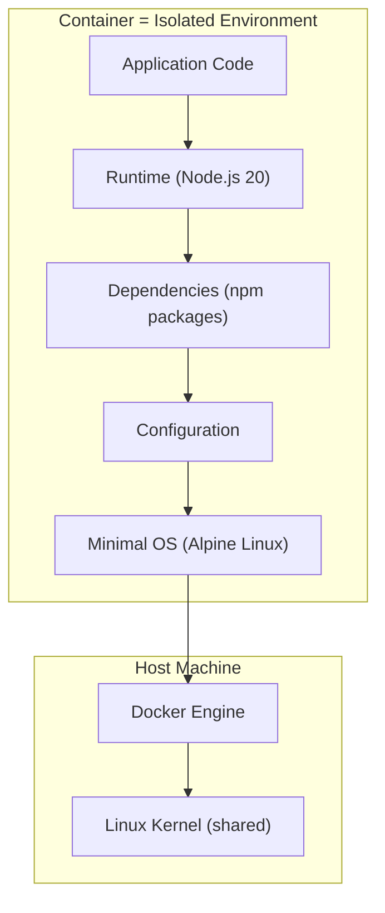
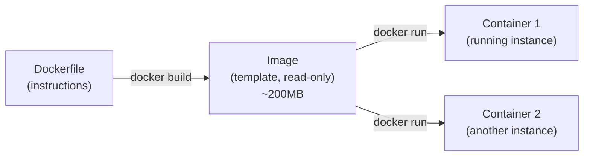
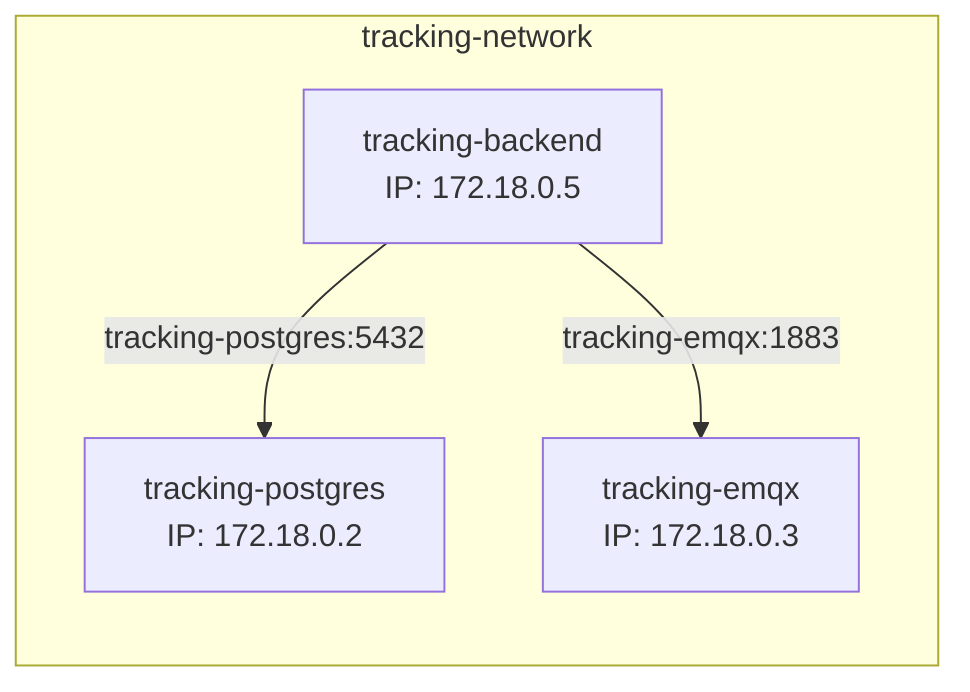
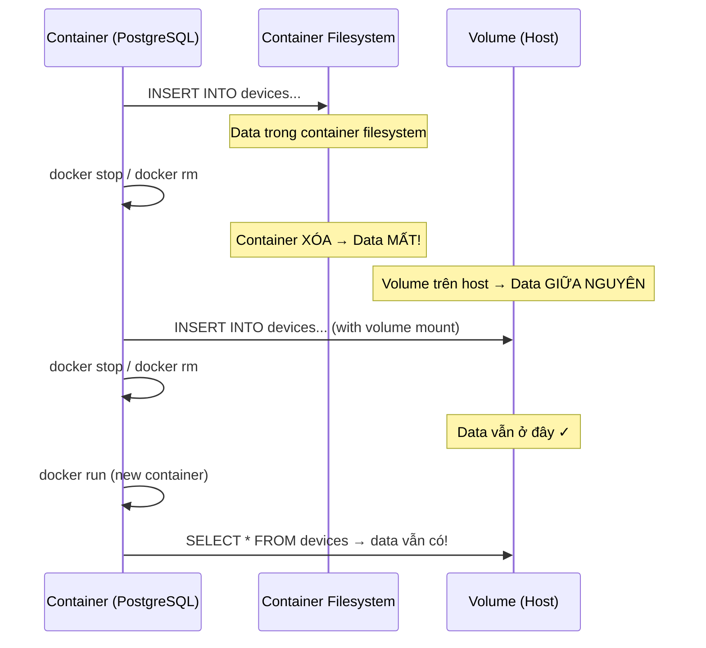
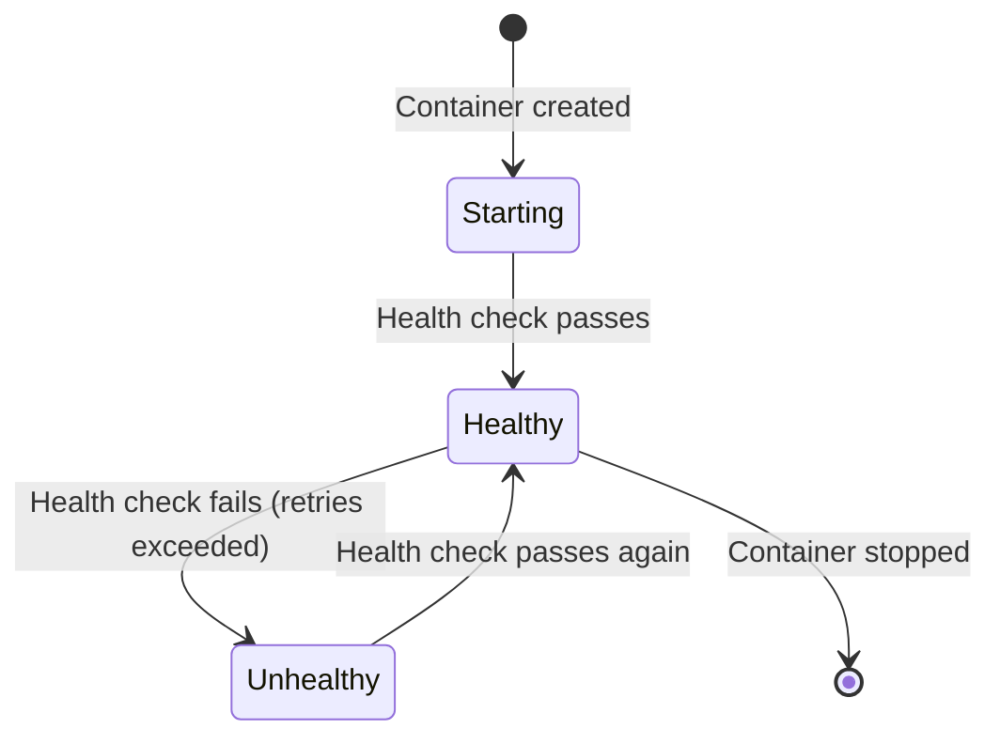

# 19 - Docker Fundamentals

> Docker containerization — tại sao cần, cách hoạt động, patterns trong project.
> Giải thích từ zero, kèm ví dụ thực tế từ hệ thống cloud.

---

## Mục lục

1. [Docker giải quyết vấn đề gì?](#1-docker-giải-quyết-vấn-đề-gì)
2. [Image & Container — Khái niệm cốt lõi](#2-image--container--khái-niệm-cốt-lõi)
3. [Dockerfile — "Recipe" để build image](#3-dockerfile--recipe-để-build-image)
4. [Docker Compose — Orchestrate nhiều containers](#4-docker-compose--orchestrate-nhiều-containers)
5. [Networking — Containers giao tiếp như thế nào?](#5-networking--containers-giao-tiếp-như-thế-nào)
6. [Volumes — Data persistent qua container lifecycle](#6-volumes--data-persistent-qua-container-lifecycle)
7. [Health Checks — Biết container có healthy không?](#7-health-checks--biết-container-có-healthy-không)
8. [Patterns trong project](#8-patterns-trong-project)

---

## 1. Docker giải quyết vấn đề gì?

### Vấn đề "Works on my machine"

Hệ thống cloud có 9 services, mỗi service cần runtime + dependencies khác nhau:
- Backend: Node.js 20 + npm packages
- PostgreSQL: version 16 + PostGIS extension
- EMQX: Erlang runtime + specific config
- VictoriaMetrics: Go binary + storage config

Nếu cài trực tiếp trên server:
- Developer A dùng Node 18, Developer B dùng Node 20 → behavior khác nhau
- Server production dùng Ubuntu, developer dùng Windows → path khác, behavior khác
- Upgrade PostgreSQL 15 → 16 trên production → downtime + risk

### Docker: Đóng gói MỌI THỨ vào container



**Mỗi container:**
- Có filesystem riêng (không thấy files của container khác)
- Có network riêng (port isolation)
- Có process space riêng (PID 1 = application process)
- Share kernel với host (nhẹ hơn VM rất nhiều)

**Kết quả:** `docker compose up` trên BẤT KỲ máy nào → hệ thống chạy GIỐNG HỆT nhau.

---

## 2. Image & Container — Khái niệm cốt lõi

### Image = Template (read-only)

Image giống "class" trong OOP — định nghĩa container sẽ chứa gì.
Image được build từ Dockerfile, có thể share qua Docker Hub/Registry.



### Container = Running instance

Container giống "object" — instance cụ thể của image, đang chạy process.

```bash
# Từ image postgis/postgis:16-3.4, tạo container tên "tracking-postgres"
docker run --name tracking-postgres -e POSTGRES_PASSWORD=secret postgis/postgis:16-3.4
```

**Quan trọng:** Container là **ephemeral** (tạm thời). Khi xóa container → mọi data
bên trong MẤT. Đó là lý do cần Volumes (phần 6).

### Layers — Image được build từ layers

```dockerfile
FROM node:20-alpine          # Layer 1: Base OS + Node.js (~50MB)
COPY package*.json ./        # Layer 2: Package files (~100KB)
RUN npm ci                   # Layer 3: Dependencies (~150MB)
COPY . .                     # Layer 4: Source code (~5MB)
RUN npm run build            # Layer 5: Compiled output (~2MB)
```

Mỗi instruction tạo 1 layer. Layers được **cache** — nếu layer không thay đổi,
Docker dùng lại từ cache (build nhanh hơn nhiều).

**Tại sao COPY package.json TRƯỚC source code?**
- package.json ít thay đổi → layer 2+3 được cache
- Source code thay đổi thường xuyên → chỉ layer 4+5 rebuild
- Nếu COPY tất cả trước → mỗi lần đổi 1 dòng code = npm install lại (chậm!)

---

## 3. Dockerfile — "Recipe" để build image

### Multi-stage build (pattern trong project)

```dockerfile
# ===== Stage 1: BUILD =====
# Image lớn, có devDependencies (TypeScript compiler, ESLint...)
FROM node:20-alpine AS builder
WORKDIR /app

# Copy package files trước (cache layer)
COPY package*.json ./
RUN npm ci
# npm ci: install CHÍNH XÁC versions trong package-lock.json (reproducible)

# Copy source và build
COPY . .
RUN npm run build
# Output: dist/ folder chứa compiled JavaScript

# ===== Stage 2: PRODUCTION =====
# Image nhỏ, chỉ có production dependencies
FROM node:20-alpine AS runner
WORKDIR /app

# Chỉ copy những gì CẦN để chạy (không có source .ts, không có devDeps)
COPY --from=builder /app/dist ./dist
COPY --from=builder /app/node_modules ./node_modules
COPY --from=builder /app/package.json ./

# Document port (không thực sự mở — chỉ documentation)
EXPOSE 4000

# Command chạy khi container start
CMD ["node", "dist/index.js"]
```

**Tại sao multi-stage?**

| | Single stage | Multi-stage |
|---|---|---|
| Image size | ~800MB (có TypeScript, ESLint, test tools) | ~200MB (chỉ runtime) |
| Security | Source code trong image | Chỉ compiled JS |
| Attack surface | devDependencies có thể có vulnerabilities | Minimal dependencies |

### .dockerignore — Không copy vào image

```
# .dockerignore
node_modules     # Sẽ npm ci trong container (platform-specific binaries)
dist             # Sẽ build trong container
.env             # KHÔNG BAO GIỜ đưa secrets vào image!
.git             # Không cần git history
*.md             # Không cần docs trong runtime
```

---

## 4. Docker Compose — Orchestrate nhiều containers

### Tại sao cần Compose?

Hệ thống có 9 services. Chạy thủ công:
```bash
docker run --name postgres -e POSTGRES_PASSWORD=... -v ... -p 5432:5432 --network tracking postgis/postgis:16-3.4
docker run --name emqx -e ... -v ... --network tracking emqx/emqx:5.4.0
docker run --name backend --env-file .env --network tracking tracking-backend:latest
# ... 6 services nữa, mỗi cái 1 dòng dài với 10+ flags
```

Docker Compose: **1 file YAML** mô tả tất cả, `docker compose up` chạy hết.

### Anatomy of docker-compose.yml

```yaml
# Tracking_PostgreSQL/docker-compose.yml
version: '3.8'  # Compose file format version

services:
  postgres:  # Service name (cũng là hostname trong network)
    image: postgis/postgis:16-3.4  # Image từ Docker Hub
    container_name: tracking-postgres  # Tên container cố định

    environment:  # Biến môi trường (thay vì -e flags)
      POSTGRES_USER: ${POSTGRES_USER:-postgres}  # Từ .env, default "postgres"
      POSTGRES_PASSWORD: ${POSTGRES_PASSWORD:?POSTGRES_PASSWORD is required}
      # :? = FAIL nếu không set (fail fast)
      POSTGRES_DB: ${POSTGRES_DB:-vehicle_tracking}

    volumes:  # Mount host directory → container (persistent data)
      - ../Tracking_Data/Tracking_PostgreSQL/data:/var/lib/postgresql/data
      # Host path : Container path
      # Data PostgreSQL persist ở host, không mất khi container restart
      - ./init:/docker-entrypoint-initdb.d
      # SQL files trong init/ tự chạy khi DB khởi tạo lần đầu

    ports:
      - "0.0.0.0:5432:5432"  # Expose port ra host (dev access)
      # host_port:container_port

    healthcheck:  # Docker kiểm tra container có healthy không
      test: ["CMD-SHELL", "pg_isready -U ${POSTGRES_USER:-postgres}"]
      interval: 10s   # Check mỗi 10 giây
      timeout: 5s     # Timeout per check
      retries: 5      # Unhealthy sau 5 lần fail liên tiếp

    restart: unless-stopped  # Auto-restart nếu crash (trừ khi manually stopped)

    networks:
      - tracking-network  # Join shared network

    deploy:
      resources:
        limits:
          memory: 1G    # Max 1GB RAM (OOM kill nếu vượt)
          cpus: '2.0'   # Max 2 CPU cores

networks:
  tracking-network:
    external: true  # Network đã tạo sẵn, không tạo mới
```

---

## 5. Networking — Containers giao tiếp như thế nào?

### Docker Network = Virtual LAN

Containers trong cùng network có thể giao tiếp bằng **container name** (DNS resolution):



**Backend config:**
```typescript
// POSTGRESQL_HOST=tracking-postgres (container name, KHÔNG phải localhost!)
// MQTT_HOST=tracking-emqx
```

**Tại sao external network?**

Mỗi service có docker-compose.yml riêng. Nếu dùng default network:
- `docker compose up` trong Tracking_PostgreSQL/ tạo network "tracking_postgresql_default"
- `docker compose up` trong Tracking_Backend/ tạo network "tracking_backend_default"
- 2 networks khác nhau → containers KHÔNG thấy nhau!

External network: tạo 1 lần (`docker network create tracking-network`),
tất cả compose files reference cùng network → containers giao tiếp được.

---

## 6. Volumes — Data persistent qua container lifecycle

### Vấn đề: Container ephemeral



### Bind mount trong project

```yaml
volumes:
  # PostgreSQL data
  - ../Tracking_Data/Tracking_PostgreSQL/data:/var/lib/postgresql/data
  # Ý nghĩa: folder trên HOST (../Tracking_Data/...) được mount VÀO container
  # PostgreSQL ghi data vào /var/lib/postgresql/data (trong container)
  # Thực tế data nằm trên host filesystem → persist qua container lifecycle

  # Init scripts (read-only)
  - ./init:/docker-entrypoint-initdb.d
  # PostgreSQL image tự chạy .sql files trong /docker-entrypoint-initdb.d khi init
```

### Data layout trên host

```
Tracking_Data/
├── Tracking_PostgreSQL/data/    # PostgreSQL data files
├── Tracking_VictoriaMetrics/    # Time-series data
├── Tracking_VictoriaLogs/       # Event log data
├── Tracking_Grafana/            # Grafana dashboards + config
└── Tracking_NPM/               # SSL certificates + proxy config
```

**Tại sao tách Tracking_Data ra folder riêng?**
- Backup dễ: chỉ cần backup folder này
- Gitignore: data không commit vào git (chỉ code + config)
- Migrate: copy folder sang server mới = migrate toàn bộ data

---

## 7. Health Checks — Biết container có healthy không?

### Tại sao cần health check?

Container "running" ≠ application "ready". Ví dụ:
- PostgreSQL container start → nhưng cần 5-10s để init database
- Backend container start → nhưng cần connect DB trước khi serve requests
- Nếu Backend start trước PostgreSQL ready → crash!

Health check cho Docker biết khi nào application THỰC SỰ sẵn sàng.

### Health check patterns trong project

```yaml
# PostgreSQL: pg_isready command
healthcheck:
  test: ["CMD-SHELL", "pg_isready -U postgres"]
  # pg_isready: PostgreSQL built-in tool, return 0 nếu accepting connections

# EMQX: emqx ping
healthcheck:
  test: ["CMD", "emqx", "ping"]
  # emqx ping: check Erlang node alive

# VictoriaMetrics: HTTP health endpoint
healthcheck:
  test: ["CMD", "wget", "--no-verbose", "--tries=1", "--spider", "http://127.0.0.1:8428/-/healthy"]
  # wget --spider: chỉ check HTTP 200, không download body

# Grafana: HTTP API health
healthcheck:
  test: ["CMD", "wget", "--spider", "http://localhost:4002/api/health"]
```

### Health status lifecycle



---

## 8. Patterns trong project

### Startup order (dependency management)

```bash
# Infrastructure TRƯỚC (không phụ thuộc gì)
docker compose -f Tracking_PostgreSQL/docker-compose.yml up -d
docker compose -f Tracking_EMQX/docker-compose.yml up -d
docker compose -f Tracking_VictoriaMetrics/docker-compose.yml up -d
docker compose -f Tracking_VictoriaLogs/docker-compose.yml up -d

# Chờ infrastructure healthy
sleep 10  # Hoặc dùng script check health

# Application services (phụ thuộc infrastructure)
docker compose -f Tracking_MqttBridge/docker-compose.uat.yml up -d
docker compose -f Tracking_Backend/docker-compose.uat.yml up -d
docker compose -f Tracking_Frontend/docker-compose.uat.yml up -d
```

**Tại sao không dùng `depends_on`?**
- `depends_on` chỉ chờ container START, không chờ HEALTHY
- Các services nằm trong compose files KHÁC NHAU → depends_on không hoạt động cross-file
- Script thủ công cho phép kiểm soát chính xác

### Resource limits — Tránh 1 service chiếm hết resources

```yaml
deploy:
  resources:
    limits:
      memory: 512M  # Nếu vượt → OOM kill → container restart
      cpus: '1.0'   # Throttle CPU usage
```

Nếu KHÔNG có limits: memory leak trong Backend có thể chiếm hết RAM →
Linux OOM killer giết process NGẪU NHIÊN (có thể giết PostgreSQL!) → data corruption.

---

> **Tiếp theo:** [20-sql-postgresql-patterns.md](./20-sql-postgresql-patterns.md) — SQL & PostgreSQL patterns