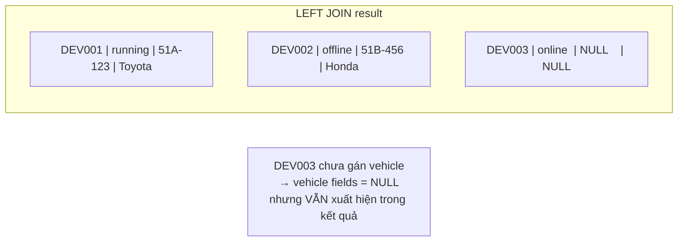
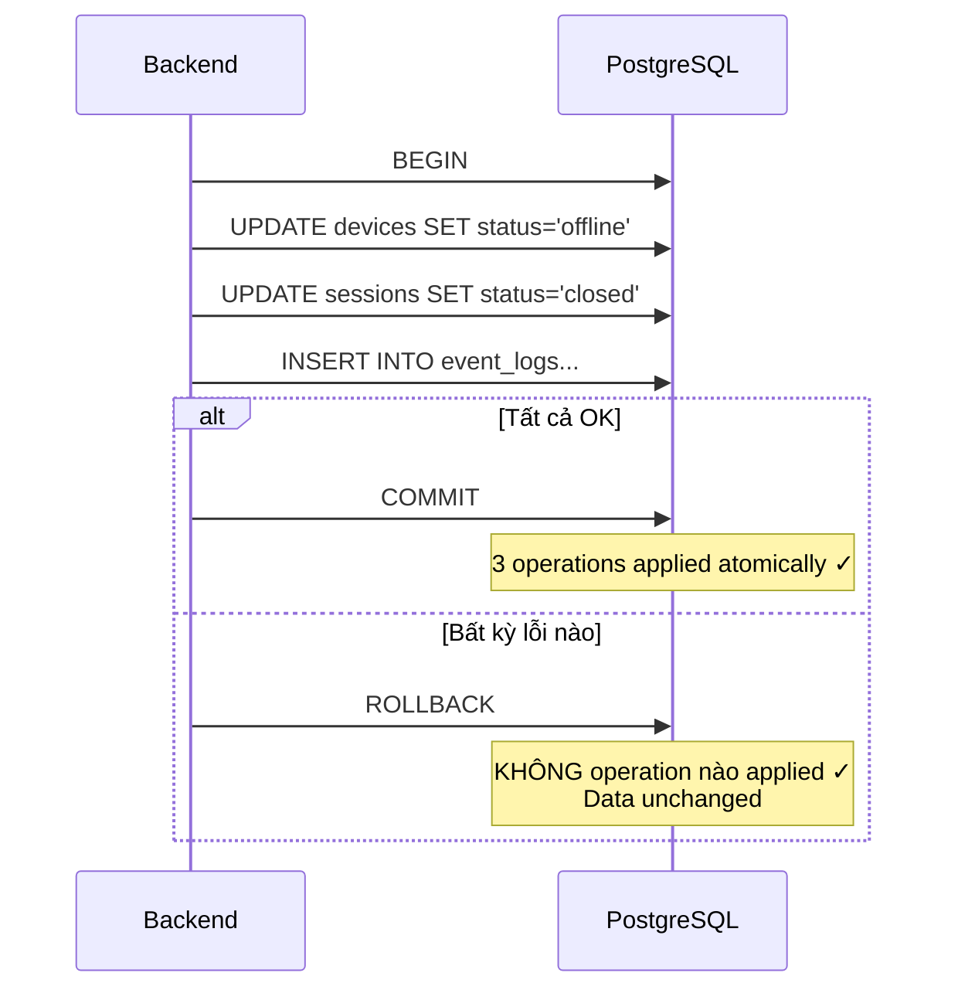
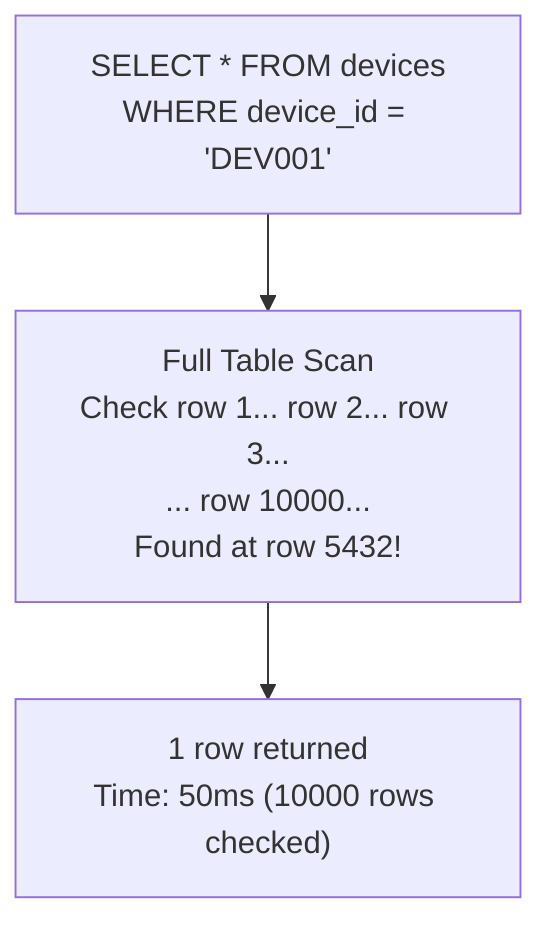
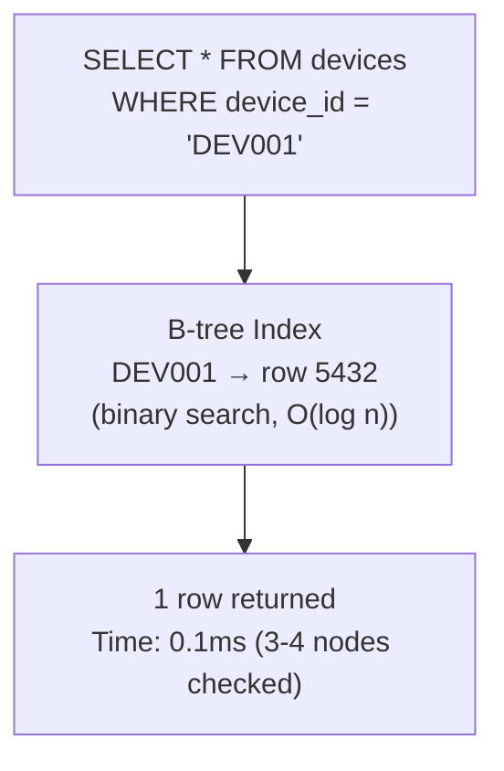
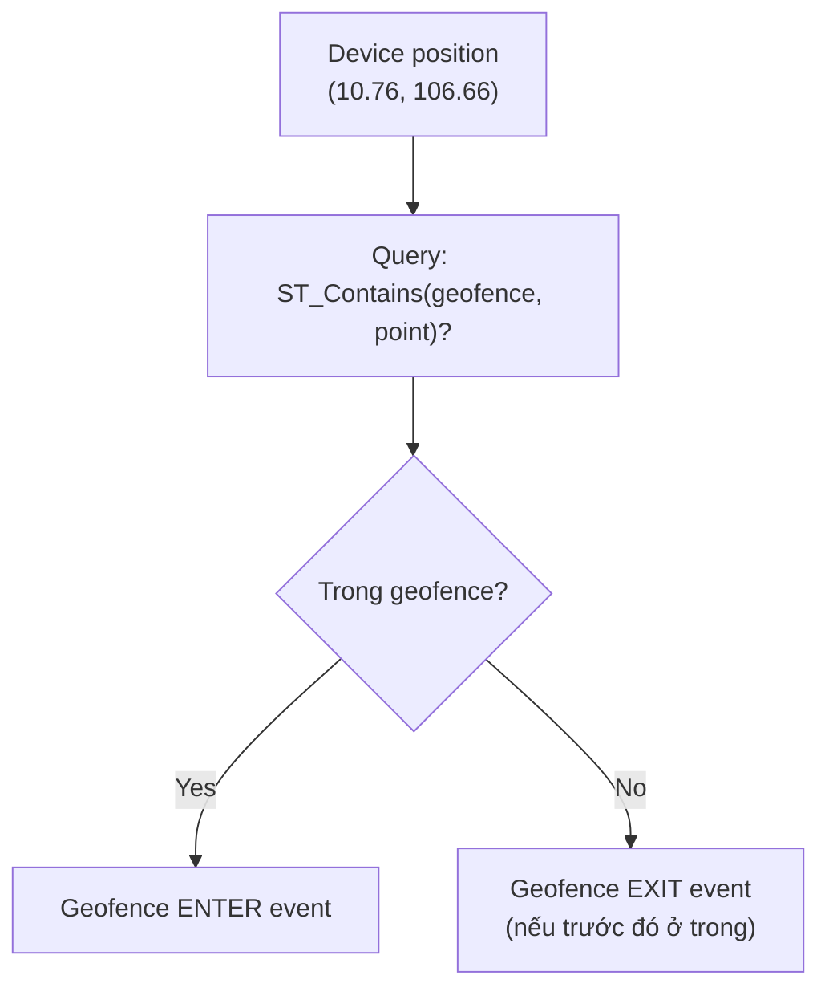

# 20 - SQL & PostgreSQL Patterns

> SQL fundamentals, PostgreSQL features, query patterns thực tế trong project.
> Giải thích từ cơ bản, kèm "tại sao" và code thực tế từ Bridge/Backend.

---

## Mục lục

1. [SQL là gì và tại sao dùng PostgreSQL?](#1-sql-là-gì-và-tại-sao-dùng-postgresql)
2. [CRUD — Bốn operations cơ bản](#2-crud--bốn-operations-cơ-bản)
3. [Parameterized Queries — Chống SQL Injection](#3-parameterized-queries--chống-sql-injection)
4. [JOINs — Kết hợp data từ nhiều bảng](#4-joins--kết-hợp-data-từ-nhiều-bảng)
5. [Transactions — All-or-nothing operations](#5-transactions--all-or-nothing-operations)
6. [Indexes — Tại sao query chậm và cách fix](#6-indexes--tại-sao-query-chậm-và-cách-fix)
7. [PostGIS — Spatial queries cho geofencing](#7-postgis--spatial-queries-cho-geofencing)
8. [PostgreSQL-Specific Features](#8-postgresql-specific-features)
9. [Query Patterns trong project](#9-query-patterns-trong-project)

---

## 1. SQL là gì và tại sao dùng PostgreSQL?

### Relational Database — Data có quan hệ

Hệ thống tracking có nhiều entities liên quan:
- 1 Customer có nhiều Devices
- 1 Device gắn vào 1 Vehicle
- 1 Device có nhiều Sessions (trips)
- 1 Device có nhiều Alerts

Relational database lưu data trong **tables** (bảng) với **relationships** (quan hệ)
giữa chúng. SQL là ngôn ngữ để query/manipulate data.

### Tại sao PostgreSQL thay vì MySQL/MongoDB?

| Yêu cầu | PostgreSQL | MongoDB |
|----------|-----------|---------|
| Geofence (polygon contains point) | PostGIS extension ✓ | Có nhưng kém hơn |
| Relational integrity (FK) | Native ✓ | Không có |
| Complex queries (JOIN, CTE) | Mạnh ✓ | Aggregation pipeline phức tạp |
| ACID transactions | Full ✓ | Limited |
| JSON storage khi cần | JSONB ✓ | Native |

---

## 2. CRUD — Bốn operations cơ bản

### CREATE (INSERT) — Thêm data mới

```sql
-- Thêm 1 device mới
INSERT INTO devices (device_id, auth_token, customer_id, current_status)
VALUES ('DEV001', 'secret_token_abc', 1, 'offline');

-- RETURNING: lấy lại giá trị auto-generated (id, created_at)
INSERT INTO alerts (device_id, alert_type, severity, title, message)
VALUES ('DEV001', 'maintenance_due', 'high', 'OBD: Coolant risk', 'Coolant 108C with load 65%')
RETURNING id, created_at;
-- Result: id=456, created_at='2024-05-22T10:30:00Z'
-- Không cần query lại để lấy id!
```

### READ (SELECT) — Đọc data

```sql
-- Đọc tất cả devices đang chạy của customer 1
SELECT device_id, current_status, last_speed, last_latitude, last_longitude
FROM devices
WHERE customer_id = 1 AND current_status = 'running'
ORDER BY last_seen_at DESC;  -- Mới nhất trước
```

### UPDATE — Cập nhật data có sẵn

```sql
-- Cập nhật vị trí và trạng thái device
UPDATE devices
SET current_status = 'running',
    last_latitude = 10.7623,
    last_longitude = 106.6601,
    last_speed = 65.5,
    last_seen_at = NOW()
WHERE device_id = 'DEV001';
-- WHERE quan trọng! Không có WHERE → update TẤT CẢ rows!
```

### DELETE — Xóa data

```sql
-- Soft delete (preferred): đánh dấu resolved thay vì xóa
UPDATE alerts SET status = 'resolved', resolved_at = NOW()
WHERE id = 456;

-- Hard delete: xóa event logs cũ hơn 90 ngày (cleanup)
DELETE FROM event_logs
WHERE created_at < NOW() - INTERVAL '90 days';
```

---

## 3. Parameterized Queries — Chống SQL Injection

### Vấn đề: SQL Injection

```typescript
// ✗ NGUY HIỂM — string interpolation
const deviceId = req.params.id; // User input: "'; DROP TABLE devices; --"

await pool.query(`SELECT * FROM devices WHERE device_id = '${deviceId}'`);
// Query thực tế:
// SELECT * FROM devices WHERE device_id = ''; DROP TABLE devices; --'
// → XÓA TOÀN BỘ BẢNG DEVICES!
```

### Giải pháp: Parameterized queries ($1, $2...)

```typescript
// ✓ AN TOÀN — parameters tách biệt khỏi SQL
await pool.query(
  'SELECT * FROM devices WHERE device_id = $1 AND auth_token = $2',
  [deviceId, authToken],  // Values passed riêng, KHÔNG nằm trong SQL string
);
// PostgreSQL driver tự escape values — injection KHÔNG THỂ xảy ra
// Dù deviceId = "'; DROP TABLE devices; --" → chỉ search string đó, không execute
```

**Quy tắc tuyệt đối:** KHÔNG BAO GIỜ dùng template literals/string concatenation
cho SQL queries với user input. LUÔN dùng $1, $2... parameters.

### Code thực tế từ Bridge

```typescript
// src/infrastructure/database.ts
export const validateDevice = async (
  deviceId: string,
  authToken: string,
): Promise<DeviceRow | null> => {
  const result = await pool.query(
    `SELECT id, device_id, customer_id, vehicle_id, current_status,
            last_seen_at, state_updated_at
     FROM devices
     WHERE device_id = $1 AND auth_token = $2 AND is_active = true`,
    [deviceId, authToken],  // $1 = deviceId, $2 = authToken
  );
  return result.rows[0] ?? null;
  // rows[0]: first row hoặc undefined nếu không tìm thấy
  // ?? null: convert undefined → null (explicit "not found")
};
```

---

## 4. JOINs — Kết hợp data từ nhiều bảng

### Tại sao cần JOIN?

Data được **normalize** (tách thành nhiều bảng) để tránh duplication:
- Bảng `devices`: device_id, vehicle_id (FK), customer_id (FK)
- Bảng `vehicles`: id, plate_number, brand, model
- Bảng `customers`: id, name, contact

Khi cần hiển thị "Device DEV001, xe 51A-12345, khách hàng ABC Corp" →
cần JOIN 3 bảng lại.

### LEFT JOIN — Lấy tất cả từ bảng trái, kể cả không match

```sql
-- Tất cả devices, kèm thông tin vehicle (nếu có)
SELECT
  d.device_id,
  d.current_status,
  d.last_speed,
  v.plate_number,    -- NULL nếu device chưa gán vehicle
  v.brand,           -- NULL nếu device chưa gán vehicle
  c.name AS customer_name
FROM devices d
LEFT JOIN vehicles v ON d.vehicle_id = v.id
-- LEFT JOIN: giữ TẤT CẢ devices, kể cả chưa gán vehicle (v.* = NULL)
INNER JOIN customers c ON d.customer_id = c.id
-- INNER JOIN: chỉ devices CÓ customer (loại bỏ orphan devices)
WHERE d.customer_id = $1
ORDER BY d.last_seen_at DESC NULLS LAST;
-- NULLS LAST: devices chưa bao giờ online (last_seen_at = NULL) xuống cuối
```



---

## 5. Transactions — All-or-nothing operations

### Vấn đề: Partial update = data inconsistent

Khi device offline, cần:
1. Update device status → 'offline'
2. Close active session → status = 'closed'
3. Insert event log → 'device_offline'

Nếu step 2 fail (DB timeout) nhưng step 1 đã commit:
- Device status = 'offline' ✓
- Session vẫn 'running' ✗ → DATA INCONSISTENT!

### Transaction: Tất cả thành công HOẶC tất cả rollback



### Code thực tế — Batch Writer (Bridge)

```typescript
// src/services/batch-writer.service.ts
// Flush 100 device updates trong 1 transaction

const flush = async (): Promise<void> => {
  const batch = buffer.splice(0, buffer.length); // Lấy hết buffer
  if (batch.length === 0) return;

  const client = await pool.connect(); // Mượn connection từ pool
  try {
    await client.query('BEGIN'); // Bắt đầu transaction

    for (const update of batch) {
      // Update device state
      await client.query(
        `UPDATE devices
         SET current_status = $2,
             last_latitude = COALESCE($3, last_latitude),
             last_longitude = COALESCE($4, last_longitude),
             last_speed = COALESCE($5, last_speed),
             last_seen_at = GREATEST(
               COALESCE(last_seen_at, to_timestamp($6 / 1000.0)),
               to_timestamp($6 / 1000.0)
             )
         WHERE device_id = $1`,
        [update.deviceId, update.status, update.latitude, update.longitude,
         update.speed, update.serverTimestamp],
      );

      // Update session (nếu có)
      if (update.sessionId) {
        await client.query(
          `UPDATE device_sessions
           SET last_latitude = COALESCE($2, last_latitude),
               last_longitude = COALESCE($3, last_longitude),
               last_speed = COALESCE($4, last_speed),
               updated_at = NOW()
           WHERE id = $1`,
          [update.sessionId, update.latitude, update.longitude, update.speed],
        );
      }
    }

    await client.query('COMMIT'); // Tất cả OK → commit
    // 100 updates applied atomically — hoặc tất cả hoặc không gì

  } catch (err) {
    await client.query('ROLLBACK'); // Lỗi → rollback tất cả
    throw err;
  } finally {
    client.release(); // LUÔN trả connection về pool!
    // Quên release = connection leak = pool cạn dần = server đứng
  }
};
```

**Giải thích COALESCE và GREATEST:**
- `COALESCE($3, last_latitude)`: Nếu $3 là NULL → giữ giá trị cũ (không overwrite bằng NULL)
- `GREATEST(last_seen_at, new_timestamp)`: Chỉ update nếu timestamp MỚI HƠN
  (tránh out-of-order messages ghi đè data mới bằng data cũ)

---

## 6. Indexes — Tại sao query chậm và cách fix

### Không có index = Full Table Scan



### Có index = B-tree Lookup



### Tạo index

```sql
-- Index trên device_id (lookup by hardware ID — rất thường xuyên)
CREATE UNIQUE INDEX idx_devices_device_id ON devices(device_id);
-- UNIQUE: cũng enforce không có 2 devices cùng device_id

-- Composite index (query filter by customer + status)
CREATE INDEX idx_devices_customer_status ON devices(customer_id, current_status);
-- Tối ưu cho: WHERE customer_id = $1 AND current_status = 'running'

-- Partial index (chỉ index rows thỏa condition)
CREATE INDEX idx_sessions_active ON device_sessions(device_id)
WHERE status = 'running';
-- Chỉ index sessions đang chạy (ít rows) → index nhỏ, nhanh hơn
-- Tối ưu cho: WHERE device_id = $1 AND status = 'running'

-- GiST index cho PostGIS (spatial queries)
CREATE INDEX idx_geofences_geometry ON geofences USING GIST(geometry);
-- Tối ưu cho: ST_Contains(geometry, point)
```

**Khi nào KHÔNG cần index?**
- Bảng nhỏ (< 1000 rows) — full scan đủ nhanh
- Columns ít dùng trong WHERE/JOIN
- Columns có ít giá trị unique (boolean: chỉ true/false → index không giúp nhiều)

---

## 7. PostGIS — Spatial queries cho geofencing

### Geofence check: Point trong Polygon?



```sql
-- Tìm tất cả geofences mà device đang ở trong
SELECT id, name, type
FROM geofences
WHERE is_active = true
  AND customer_id = $1
  AND ST_Contains(
    geometry,  -- Polygon geometry của geofence
    ST_SetSRID(ST_Point($2, $3), 4326)  -- Point từ device GPS
    -- $2 = longitude, $3 = latitude
    -- SRID 4326 = WGS84 (hệ tọa độ GPS)
  );
```

**Giải thích:**
- `ST_Point(longitude, latitude)`: Tạo point geometry từ GPS coordinates
- `ST_SetSRID(..., 4326)`: Gán hệ tọa độ WGS84 (GPS standard)
- `ST_Contains(polygon, point)`: Trả true nếu point nằm TRONG polygon
- GiST index trên `geometry` column → query nhanh dù có hàng nghìn geofences

### Khoảng cách giữa 2 điểm (meters)

```sql
-- Tính khoảng cách device đến 1 điểm (ví dụ: depot)
SELECT ST_Distance(
  ST_SetSRID(ST_Point(device_lon, device_lat), 4326)::geography,
  ST_SetSRID(ST_Point(depot_lon, depot_lat), 4326)::geography
) AS distance_meters;
-- ::geography cast: tính trên bề mặt Earth (kết quả = meters)
-- Nếu không cast: tính trên mặt phẳng (kết quả = degrees, vô nghĩa!)
```

---

## 8. PostgreSQL-Specific Features

### INTERVAL — Tính toán thời gian

```sql
-- Devices offline hơn 1 giờ
SELECT device_id, last_seen_at
FROM devices
WHERE last_seen_at < NOW() - INTERVAL '1 hour';

-- Sessions trong 7 ngày qua
SELECT * FROM device_sessions
WHERE started_at > NOW() - INTERVAL '7 days'
ORDER BY started_at DESC;
```

### COALESCE — Default value cho NULL

```sql
-- Nếu last_speed là NULL → hiển thị 0
SELECT device_id, COALESCE(last_speed, 0) AS speed FROM devices;

-- Nếu vehicle chưa gán → hiển thị 'Unassigned'
SELECT d.device_id, COALESCE(v.plate_number, 'Unassigned') AS vehicle
FROM devices d
LEFT JOIN vehicles v ON d.vehicle_id = v.id;
```

### FILTER — Conditional aggregation (thay vì CASE WHEN)

```sql
-- Đếm devices theo status trong 1 query (thay vì 4 queries riêng)
SELECT
  COUNT(*) AS total,
  COUNT(*) FILTER (WHERE current_status = 'running') AS running,
  COUNT(*) FILTER (WHERE current_status = 'online') AS online,
  COUNT(*) FILTER (WHERE current_status = 'offline') AS offline,
  COUNT(*) FILTER (WHERE current_status = 'stopped') AS stopped
FROM devices
WHERE customer_id = $1;
-- 1 query, 1 table scan → hiệu quả hơn 4 queries riêng biệt
```

---

## 9. Query Patterns trong project

### Pagination (Backend API)

```typescript
// GET /api/v1/devices?page=2&pageSize=20
const getDevices = async (customerId: number, page: number, pageSize: number) => {
  const offset = (page - 1) * pageSize;
  // page=1 → offset=0 (skip 0 rows)
  // page=2 → offset=20 (skip first 20 rows)

  // Chạy 2 queries song song (data + count)
  const [dataResult, countResult] = await Promise.all([
    pool.query(
      `SELECT d.*, v.plate_number
       FROM devices d
       LEFT JOIN vehicles v ON d.vehicle_id = v.id
       WHERE d.customer_id = $1
       ORDER BY d.last_seen_at DESC NULLS LAST
       LIMIT $2 OFFSET $3`,
      [customerId, pageSize, offset],
    ),
    pool.query(
      'SELECT COUNT(*)::int AS total FROM devices WHERE customer_id = $1',
      [customerId],
    ),
  ]);

  return {
    devices: dataResult.rows,
    total: countResult.rows[0].total,
    page,
    pageSize,
    totalPages: Math.ceil(countResult.rows[0].total / pageSize),
  };
};
```

### UPSERT — Insert or Update (device registration)

```sql
-- Nếu device_id đã tồn tại → update, nếu chưa → insert
INSERT INTO devices (device_id, auth_token, customer_id, current_status)
VALUES ($1, $2, $3, 'offline')
ON CONFLICT (device_id)
DO UPDATE SET
  auth_token = EXCLUDED.auth_token,  -- EXCLUDED = giá trị mới
  customer_id = EXCLUDED.customer_id,
  updated_at = NOW();
```

### Conditional UPDATE (Bridge batch writer)

```sql
-- Chỉ update status nếu session vẫn running
-- (tránh race condition: session đã closed nhưng late message đến)
UPDATE devices
SET current_status = CASE
      WHEN $7::bigint IS NULL THEN $2  -- Không có session → update bình thường
      WHEN EXISTS (
        SELECT 1 FROM device_sessions s
        WHERE s.id = $7 AND s.status = 'running'
      ) THEN $2  -- Session vẫn running → update
      ELSE current_status  -- Session đã closed → GIỮA NGUYÊN (không update)
    END,
    last_seen_at = GREATEST(last_seen_at, to_timestamp($6 / 1000.0))
WHERE device_id = $1;
```

**Tại sao cần CASE WHEN phức tạp này?**

Telemetry messages có thể đến **out-of-order** (network delay, offline replay).
Message cũ (từ session đã closed) không được overwrite status mới.
GREATEST + CASE WHEN đảm bảo chỉ data MỚI HƠN mới update.

---

> **Tiếp theo:** [21-mqtt-protocol-in-cloud.md](./21-mqtt-protocol-in-cloud.md) — MQTT.js client library