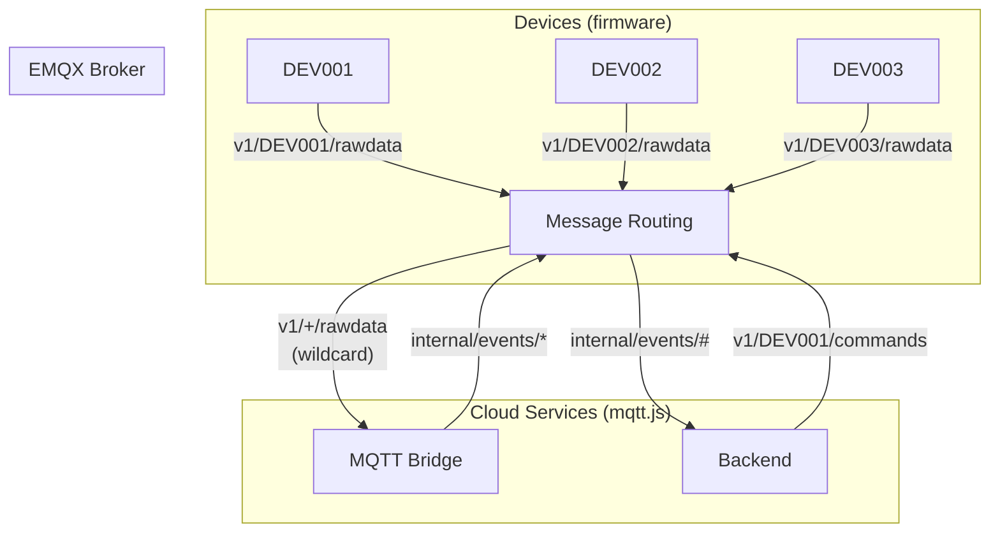
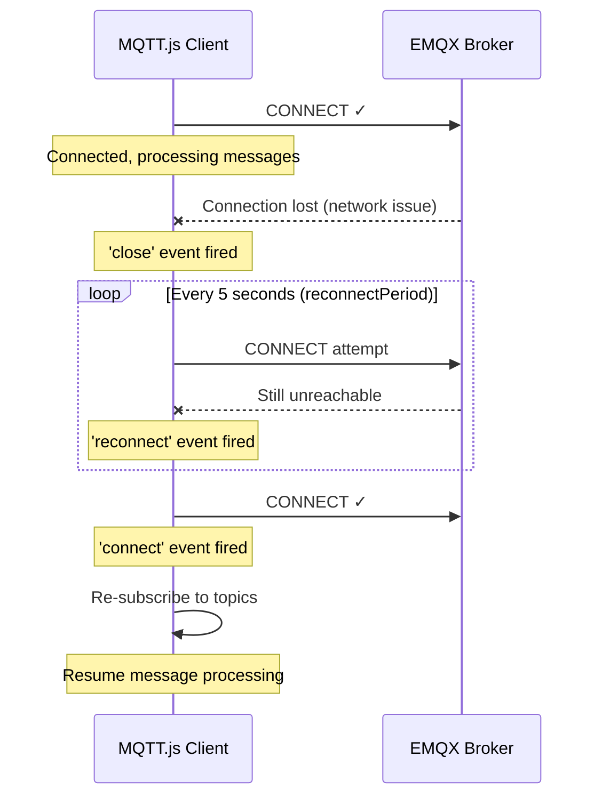

# 21 - MQTT.js Client Library

> MQTT.js — cách cloud services kết nối EMQX broker, subscribe/publish messages.
> Giải thích flow thực tế, error handling, reconnection logic.

---

## Mục lục

1. [MQTT trong cloud — Khác gì so với firmware?](#1-mqtt-trong-cloud--khác-gì-so-với-firmware)
2. [Connection Lifecycle](#2-connection-lifecycle)
3. [Subscribe & Message Routing](#3-subscribe--message-routing)
4. [Publish — Gửi commands và internal events](#4-publish--gửi-commands-và-internal-events)
5. [Wildcard Topics — Nhận từ tất cả devices](#5-wildcard-topics--nhận-từ-tất-cả-devices)
6. [Reconnection & Error Recovery](#6-reconnection--error-recovery)
7. [QoS trong Node.js context](#7-qos-trong-nodejs-context)
8. [Patterns thực tế trong project](#8-patterns-thực-tế-trong-project)

---

## 1. MQTT trong cloud — Khác gì so với firmware?

### Firmware (ESP32) — Publisher chính

```
Device → EMQX: PUBLISH v1/DEV001/rawdata (telemetry mỗi 5-10s)
Device → EMQX: PUBLISH v1/DEV001/status (state changes)
Device ← EMQX: SUBSCRIBE v1/DEV001/commands (nhận lệnh)
```

Firmware dùng MQTT qua AT commands (SIM7600 modem) — bandwidth thấp, connection không ổn định.

### Cloud (Node.js) — Subscriber + Internal publisher

```
Bridge ← EMQX: SUBSCRIBE v1/+/rawdata (nhận từ TẤT CẢ devices)
Bridge → EMQX: PUBLISH internal/events/device/status (forward cho Backend)
Backend ← EMQX: SUBSCRIBE internal/events/# (nhận internal events)
Backend → EMQX: PUBLISH v1/{deviceId}/commands (gửi lệnh cho device)
```

Cloud dùng MQTT.js library — TCP connection ổn định (internal Docker network),
throughput cao (hàng nghìn messages/giây).



---

## 2. Connection Lifecycle

### Tạo connection — Bridge pattern

```typescript
// src/mqtt/client.ts (Bridge)
import mqtt, { MqttClient } from 'mqtt';
import { mqttConfig } from '../config/env';
import { logger } from '../infrastructure/logger';

let client: MqttClient | null = null;

export const connectMqtt = (): Promise<MqttClient> => {
  return new Promise((resolve, reject) => {
    // Chọn protocol dựa trên environment
    const protocol = mqttConfig.useTls ? 'mqtts' : 'mqtt';
    const port = mqttConfig.useTls ? mqttConfig.tlsPort : mqttConfig.port;
    const url = `${protocol}://${mqttConfig.host}:${port}`;

    logger.info({ url, event: 'mqtt_connecting' }, 'Connecting to MQTT broker');

    client = mqtt.connect(url, {
      // Client ID phải UNIQUE — EMQX disconnect client cũ nếu trùng ID
      clientId: `bridge-${process.pid}-${Date.now()}`,
      // process.pid: PID của Node.js process (unique per instance)
      // Date.now(): timestamp (unique per restart)

      username: mqttConfig.username,  // 'bridge' — EMQX authentication
      password: mqttConfig.password,

      clean: true,
      // clean: true = không giữ session khi disconnect
      // Bridge là stateless — restart bất kỳ lúc nào, subscribe lại từ đầu
      // (Khác device: clean: false để nhận messages queue khi offline)

      keepalive: 30,
      // Gửi PINGREQ mỗi 30s nếu không có traffic
      // EMQX biết client còn sống (không disconnect do idle)

      reconnectPeriod: 5000,
      // Nếu mất kết nối → tự reconnect mỗi 5 giây
      // mqtt.js handle reconnection tự động!

      connectTimeout: 10000,
      // Fail nếu không connect được trong 10s (EMQX down?)
    });

    // Event: connection thành công
    client.on('connect', () => {
      logger.info({ event: 'mqtt_connected' }, 'Connected to MQTT broker');
      resolve(client!);
    });

    // Event: connection error (first attempt)
    client.on('error', (err) => {
      logger.error({ err, event: 'mqtt_error' }, 'MQTT connection error');
      reject(err);
    });
  });
};
```

**Tại sao `clientId` cần unique?**

EMQX rule: 1 client ID = 1 connection. Nếu client mới connect với cùng ID →
EMQX DISCONNECT client cũ (kick). Trong production với multiple instances,
mỗi instance PHẢI có ID khác nhau.

---

## 3. Subscribe & Message Routing

### Subscribe to device topics

```typescript
// src/mqtt/subscriptions.ts
import type { MqttClient } from 'mqtt';
import { DEVICE_TOPICS } from '../constants/topics';

// QoS mapping: mỗi topic có QoS phù hợp
const SUBSCRIPTION_QOS: Record<string, 0 | 1> = {
  [DEVICE_TOPICS.RAW_DATA]: 0,     // 'v1/+/rawdata' — high frequency, loss OK
  [DEVICE_TOPICS.STATUS]: 1,       // 'v1/+/status' — important, must deliver
  [DEVICE_TOPICS.EVENTS]: 1,       // 'v1/+/events' — errors, must not lose
  [DEVICE_TOPICS.FIRMWARE]: 1,     // 'v1/+/firmware' — OTA critical
  [DEVICE_TOPICS.COMMAND_ACK]: 1,  // 'v1/+/commands/ack' — operator feedback
};

export const subscribeToDeviceTopics = (client: MqttClient): Promise<void> => {
  // Build subscription map: { topic: { qos } }
  const topicMap: Record<string, { qos: 0 | 1 }> = {};
  for (const topic of Object.values(DEVICE_TOPICS)) {
    topicMap[topic] = { qos: SUBSCRIPTION_QOS[topic] ?? 1 };
  }

  return new Promise((resolve, reject) => {
    // Subscribe to ALL topics in 1 call (efficient)
    client.subscribe(topicMap, (err, granted) => {
      if (err) {
        logger.error({ err, event: 'mqtt_subscribe_failed' }, 'Subscribe failed');
        reject(err);
        return;
      }

      // Log each granted subscription (confirm broker accepted)
      if (granted) {
        for (const g of granted) {
          logger.info({ topic: g.topic, qos: g.qos, event: 'mqtt_topic_subscribed' },
            'Topic subscribed');
        }
      }
      resolve();
    });
  });
};
```

### Message routing — Dispatch by topic suffix

```typescript
// src/index.ts — Main message handler
client.on('message', (topic: string, message: Buffer) => {
  // 1. Extract deviceId from topic: "v1/DEV001/rawdata" → "DEV001"
  const deviceId = extractDeviceId(topic);
  if (!deviceId) {
    logger.warn({ topic, event: 'mqtt_topic_device_unresolved' }, 'Cannot extract device ID');
    return;
  }

  // 2. Extract suffix: "v1/DEV001/rawdata" → "rawdata"
  //                     "v1/DEV001/commands/ack" → "commands/ack"
  const suffix = topic.split('/').slice(2).join('/');

  // 3. Route to appropriate handler
  switch (suffix) {
    case 'rawdata':
      // Fire-and-forget: handler chạy async, không block message processing
      handleRawData(deviceId, message).catch((err) => {
        logger.error({ err, deviceId, event: 'rawdata_handler_failed' }, 'Handler failed');
      });
      break;
    case 'status':
      handleStatus(deviceId, message).catch((err) => {
        logger.error({ err, deviceId, event: 'status_handler_failed' }, 'Handler failed');
      });
      break;
    case 'events':
      handleEvent(deviceId, message).catch((err) => {
        logger.error({ err, deviceId, event: 'event_handler_failed' }, 'Handler failed');
      });
      break;
    case 'firmware':
      handleFirmware(deviceId, message).catch((err) => {
        logger.error({ err, deviceId, event: 'firmware_handler_failed' }, 'Handler failed');
      });
      break;
    case 'commands/ack':
      handleCommandAck(deviceId, message); // Synchronous (lightweight)
      break;
    default:
      logger.debug({ suffix, event: 'mqtt_topic_suffix_unhandled' }, 'Topic ignored');
  }
});
```

**Tại sao `.catch()` thay vì try/catch?**

`client.on('message', ...)` là synchronous callback. Nếu handler là async:
- `await handleRawData(...)` → block message processing cho message tiếp theo
- Fire-and-forget + `.catch()` → xử lý concurrent, lỗi được log mà không crash

---

## 4. Publish — Gửi commands và internal events

### Backend gửi command cho device

```typescript
// Backend: src/domain/iot/services/command.service.ts
export const sendDeviceCommand = async (deviceId: string, command: CommandPayload) => {
  const topic = `v1/${deviceId}/commands`;
  const payload = JSON.stringify({
    command_id: crypto.randomUUID(),
    command: command.type,
    params: command.params,
    timestamp: Date.now(),
  });

  // QoS 1: đảm bảo command đến broker (broker forward cho device khi online)
  await new Promise<void>((resolve, reject) => {
    mqttClient.publish(topic, payload, { qos: 1 }, (err) => {
      if (err) reject(err);
      else resolve();
    });
  });

  // Lưu command vào DB (tracking status: pending → acknowledged → completed)
  await insertCommand(deviceId, command);
};
```

### Bridge publish internal events

```typescript
// src/publishers/internal-event.publisher.ts
// Bridge → EMQX → Backend (qua internal topics)

export const publishInternalEvent = (
  eventType: string,  // 'status' | 'alert' | 'session' | 'data' | 'zone' | 'firmware' | 'command'
  payload: Record<string, unknown>,
): void => {
  const client = getClient();
  if (!client?.connected) {
    logger.warn({ eventType, event: 'internal_publish_skipped_not_connected' },
      'Cannot publish — MQTT not connected');
    return;
  }

  const topic = `internal/events/device/${eventType}`;
  const message = JSON.stringify({
    ...payload,
    published_at: new Date().toISOString(),
  });

  // QoS varies: data=0 (high frequency), alert/status=1 (important)
  const qos = eventType === 'data' ? 0 : 1;

  client.publish(topic, message, { qos }, (err) => {
    if (err) {
      logger.error({ err, eventType, event: 'internal_publish_failed' }, 'Internal publish failed');
    }
  });
};

// Usage trong rawdata handler:
publishInternalEvent('status', {
  device_id: 'DEV001',
  status: 'running',
  latitude: 10.7623,
  longitude: 106.6601,
  speed: 65.5,
  session_id: 456,
});
// → Published to: internal/events/device/status
// → Backend receives → emits Socket.IO → Frontend updates map marker
```

---

## 5. Wildcard Topics — Nhận từ tất cả devices

### `+` (Plus) — Single-level wildcard

```
Topic pattern: v1/+/rawdata
```

`+` match CHÍNH XÁC 1 level (giữa 2 dấu `/`):

| Topic | Match? | Giải thích |
|-------|--------|-----------|
| `v1/DEV001/rawdata` | ✓ | + = "DEV001" |
| `v1/DEV002/rawdata` | ✓ | + = "DEV002" |
| `v1/DEV001/status` | ✗ | suffix khác ("status" ≠ "rawdata") |
| `v1/DEV001/sub/rawdata` | ✗ | + chỉ match 1 level, không match "DEV001/sub" |

**Trong project:** Bridge subscribe `v1/+/rawdata` → nhận rawdata từ TẤT CẢ devices
mà không cần biết trước device IDs.

### `#` (Hash) — Multi-level wildcard

```
Topic pattern: internal/events/#
```

`#` match 0 hoặc nhiều levels (PHẢI ở cuối topic):

| Topic | Match? |
|-------|--------|
| `internal/events/device/status` | ✓ |
| `internal/events/device/alert` | ✓ |
| `internal/events/system/health` | ✓ |
| `internal/events` | ✓ (0 levels after) |
| `internal/other/topic` | ✗ (prefix khác) |

**Trong project:** Backend subscribe `internal/events/#` → nhận TẤT CẢ internal events
từ Bridge (status, alert, session, data, zone, firmware, command).

---

## 6. Reconnection & Error Recovery

### mqtt.js auto-reconnection



### Code: Handle reconnection

```typescript
// Events quan trọng cần handle
client.on('connect', () => {
  logger.info({ event: 'mqtt_connected' }, 'MQTT connected');
  // Re-subscribe SAU reconnect (vì clean: true = subscriptions mất khi disconnect)
  subscribeToDeviceTopics(client);
  bridgeHealthState.subscriptionsReady = true;
});

client.on('close', () => {
  logger.warn({ event: 'mqtt_disconnected' }, 'MQTT disconnected');
  bridgeHealthState.subscriptionsReady = false;
  // mqtt.js tự reconnect — không cần manual logic
});

client.on('reconnect', () => {
  logger.info({ event: 'mqtt_reconnecting' }, 'MQTT reconnecting...');
});

client.on('error', (err) => {
  logger.error({ err, event: 'mqtt_error' }, 'MQTT error');
  bridgeHealthState.lastError = err.message;
  // KHÔNG crash process — mqtt.js sẽ retry
});

// Uncaught exception handler — last resort
process.on('uncaughtException', (err) => {
  logger.error({ err, event: 'process_uncaught_exception' }, 'Uncaught exception');
  shutdown('uncaughtException'); // Graceful shutdown
});
```

**Tại sao không crash khi MQTT error?**

Bridge là critical service — nếu crash, TOÀN BỘ telemetry pipeline dừng.
MQTT errors thường transient (network blip, EMQX restart). Auto-reconnect
giải quyết 99% cases. Chỉ crash khi uncaught exception (bug thực sự).

---

## 7. QoS trong Node.js context

### QoS 0 — Publish and forget

```typescript
// Rawdata: gửi mỗi 5-10s, mất 1-2 message không ảnh hưởng
client.publish('internal/events/device/data', payload, { qos: 0 });
// Không có callback — không biết broker nhận chưa
// Nhanh nhất, ít overhead nhất
```

### QoS 1 — At least once delivery

```typescript
// Alert: PHẢI đến Backend (operator cần thấy)
client.publish('internal/events/device/alert', payload, { qos: 1 }, (err) => {
  if (err) {
    // Broker KHÔNG confirm nhận — message có thể mất
    logger.error({ err, event: 'alert_publish_failed' }, 'Alert publish failed');
    // Có thể retry hoặc queue cho lần sau
  }
  // Không có err = broker confirmed (PUBACK received)
});
```

**Flow QoS 1:**
```
Client → Broker: PUBLISH (QoS 1, packet ID = 42)
Broker → Client: PUBACK (packet ID = 42)  ← Confirmation
```

Nếu không nhận PUBACK trong timeout → mqtt.js tự retry PUBLISH.
Kết quả: message có thể đến **nhiều hơn 1 lần** (at-least-once).
Receiver (Backend) phải handle duplicate (idempotent processing).

---

## 8. Patterns thực tế trong project

### Health state tracking

```typescript
// Bridge tracks MQTT health cho monitoring
const bridgeHealthState = {
  startedAt: new Date().toISOString(),
  subscriptionsReady: false,      // true sau khi subscribe thành công
  shuttingDown: false,            // true khi graceful shutdown
  lastMessageAt: undefined,       // Timestamp message gần nhất
  lastError: undefined,           // Error message gần nhất
};

// Health endpoint trả về snapshot
const getBridgeHealthSnapshot = () => ({
  status: bridgeHealthState.shuttingDown ? 'down'
    : client?.connected && bridgeHealthState.subscriptionsReady ? 'ok'
    : 'degraded',
  mqttConnected: Boolean(client?.connected),
  subscriptionsReady: bridgeHealthState.subscriptionsReady,
  lastMessageAt: bridgeHealthState.lastMessageAt,
  lastError: bridgeHealthState.lastError,
});
// Grafana/monitoring poll endpoint này để detect issues
```

### Message timestamp tracking

```typescript
// Update lastMessageAt mỗi khi nhận message (bất kỳ topic nào)
client.on('message', (topic, message) => {
  bridgeHealthState.lastMessageAt = new Date().toISOString();
  routeMessage(topic, message);
});
// Nếu lastMessageAt > 5 phút trước → alert: Bridge không nhận messages!
// (có thể EMQX down, subscription lost, network issue)
```

### Disconnect pattern (graceful shutdown)

```typescript
export const disconnectMqtt = (): Promise<void> => {
  return new Promise((resolve) => {
    if (!client) return resolve();

    // end(force, options, callback)
    // force=false: gửi DISCONNECT packet cho broker trước khi close TCP
    // Broker biết client disconnect intentionally (không phải crash)
    client.end(false, {}, () => {
      logger.info({ event: 'mqtt_disconnected_graceful' }, 'MQTT disconnected gracefully');
      resolve();
    });
  });
};
```

---

> Đây là file cuối trong bộ tài liệu kiến thức cơ bản.
> Quay lại: [01-system-architecture.md](./01-system-architecture.md)