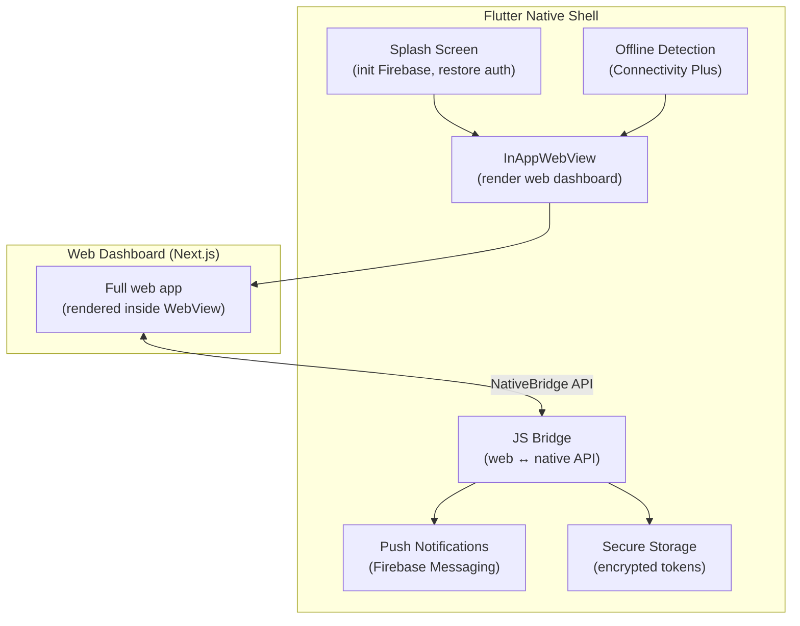
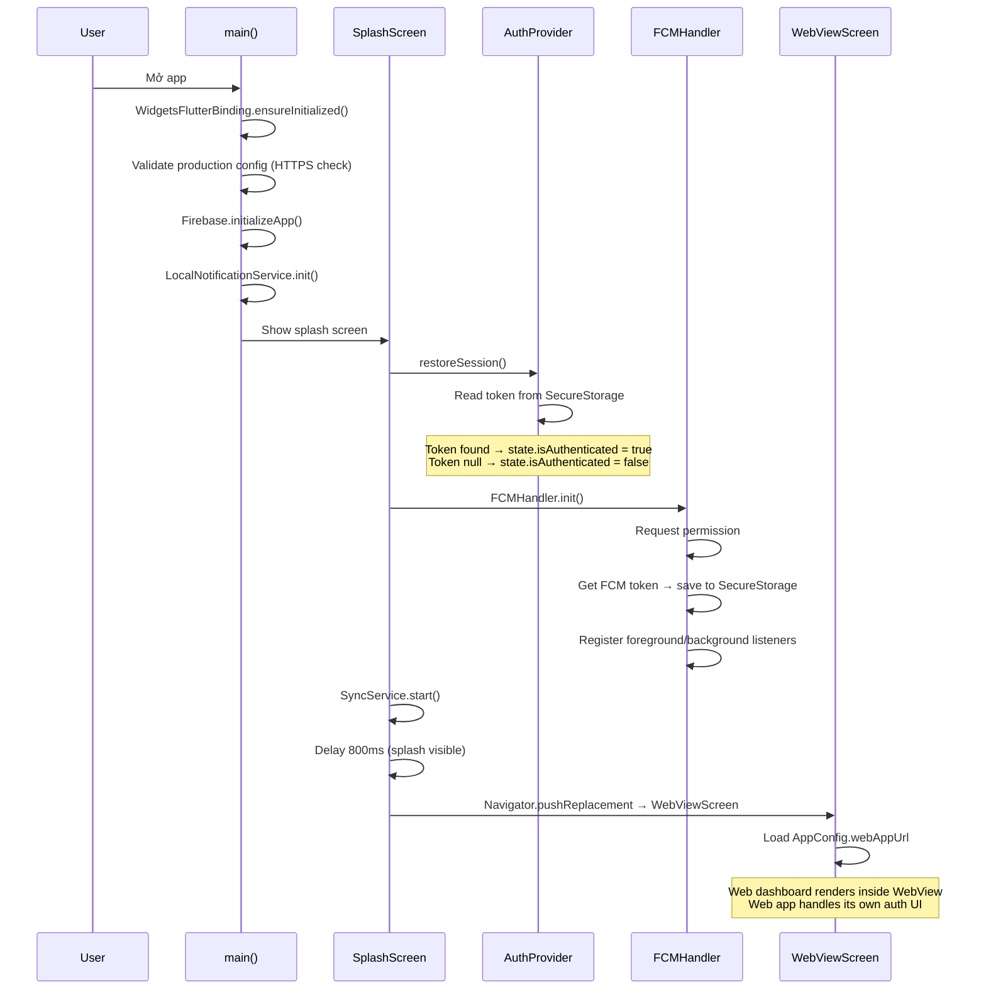
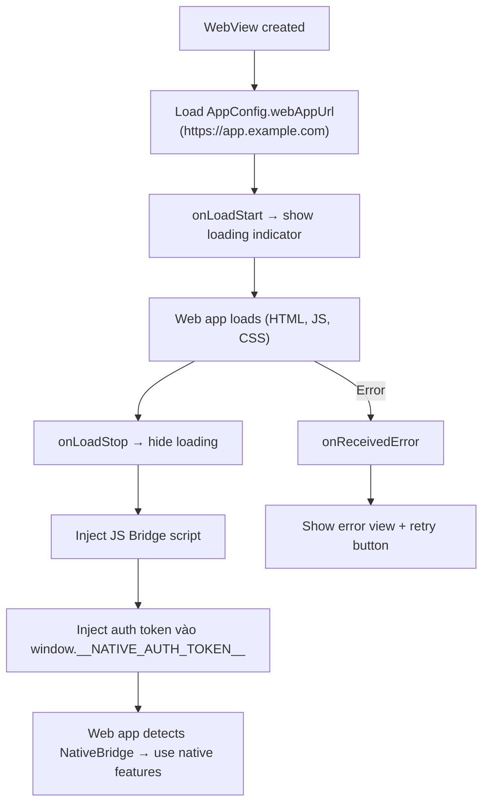
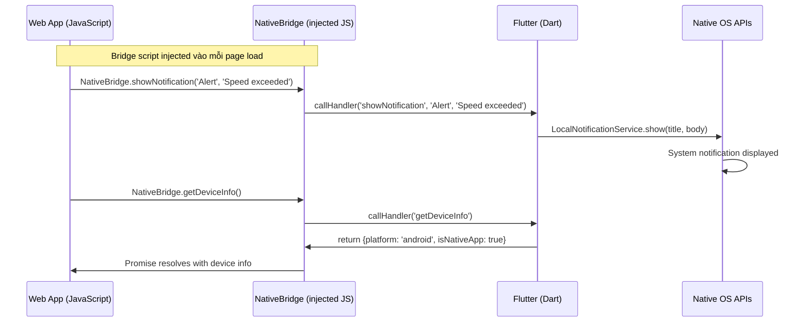
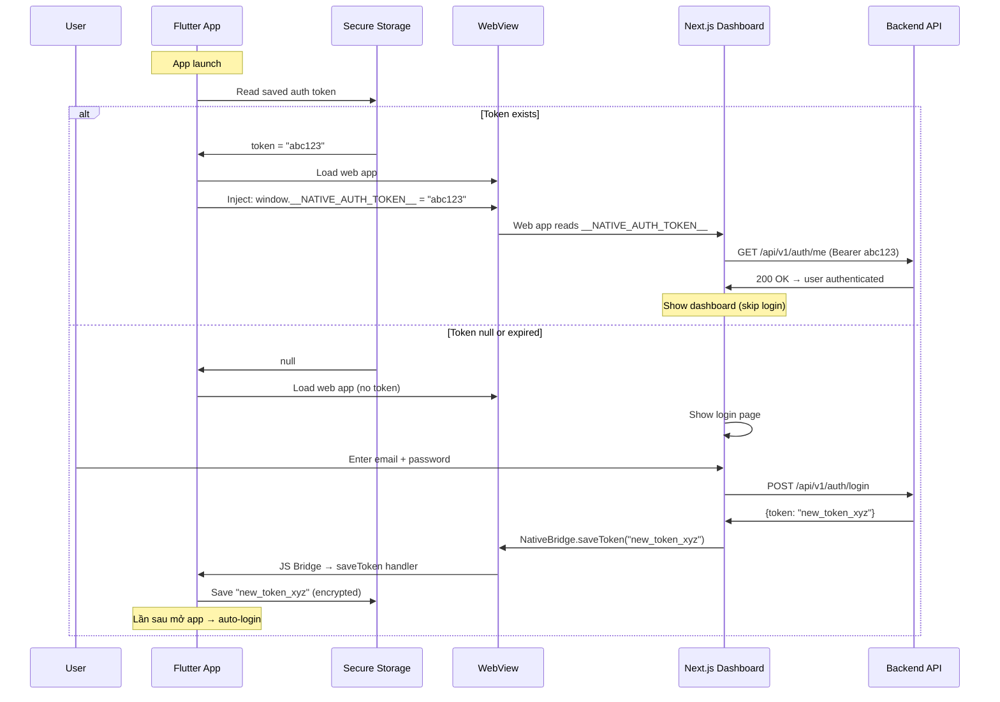
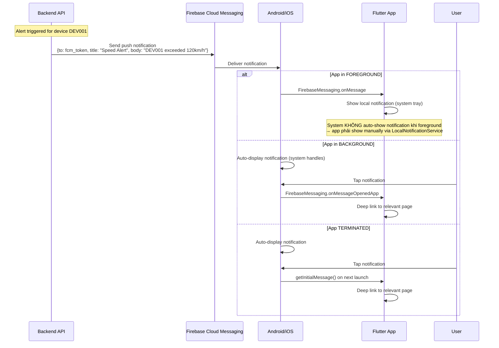

# 22 - Flutter Mobile App (Chi tiết)

> Flutter WebView Hybrid — kiến trúc, JS Bridge, push notifications, offline support.
> Giải thích "tại sao WebView hybrid", flow thực tế, code từ project với comment chi tiết.

---

## Mục lục

1. [Tại sao Flutter WebView Hybrid?](#1-tại-sao-flutter-webview-hybrid)
2. [App Lifecycle — Từ launch đến WebView](#2-app-lifecycle--từ-launch-đến-webview)
3. [WebView Container — Cách load web dashboard](#3-webview-container--cách-load-web-dashboard)
4. [JavaScript Bridge — Web ↔ Native communication](#4-javascript-bridge--web--native-communication)
5. [Authentication Flow — Token sharing giữa Web và Native](#5-authentication-flow--token-sharing-giữa-web-và-native)
6. [Push Notifications — Firebase Cloud Messaging](#6-push-notifications--firebase-cloud-messaging)
7. [Connectivity & Offline Handling](#7-connectivity--offline-handling)
8. [State Management — Riverpod](#8-state-management--riverpod)
9. [Project Structure & File Map](#9-project-structure--file-map)

---

## 1. Tại sao Flutter WebView Hybrid?

### Vấn đề: Cần mobile app nhưng web dashboard đã hoàn chỉnh

Web dashboard (Next.js) có 20+ features: device management, map tracking, alerts,
trips, geofences, statistics, firmware OTA... Nếu viết native app:
- Duplicate toàn bộ UI (hàng tháng development)
- Maintain 2 codebases (web + mobile) cho cùng features
- Mỗi lần thêm feature web → phải thêm lại cho mobile

### Giải pháp: WebView Hybrid



**Lợi ích:**
- **Tái sử dụng 100% web UI** — không viết lại
- **Update UI không cần publish app store** — deploy web = mobile cũng update
- **Native capabilities** — push notifications, secure storage, offline detection, biometrics
- **Single codebase cho iOS + Android** — Flutter cross-platform

**Trade-offs:**
- Performance kém hơn native UI (WebView overhead)
- Không có native feel (animations, gestures)
- Phụ thuộc vào network (cần load web app)

**Khi nào pattern này phù hợp?**
- Dashboard/admin app (không cần 60fps animations)
- Web app đã mature, mobile là "bonus"
- Team nhỏ, không đủ resources cho native app riêng

---

## 2. App Lifecycle — Từ launch đến WebView



### Code: main.dart

```dart
void main() async {
  // Phải gọi trước khi dùng bất kỳ Flutter API nào
  WidgetsFlutterBinding.ensureInitialized();

  // Fail fast: nếu production mà dùng HTTP (không HTTPS) → crash ngay
  // Tránh deploy app production kết nối không an toàn
  if (!AppConfig.hasSecureProductionConfig) {
    throw StateError('Invalid production configuration. Use HTTPS/WSS URLs.');
  }

  // Firebase init (FCM, Analytics, Crashlytics...)
  try {
    await Firebase.initializeApp();
  } catch (e) {
    // Không crash nếu Firebase chưa config (development)
    Log.error('Firebase init failed: $e');
  }

  // Local notifications (hiển thị notification khi app foreground)
  await LocalNotificationService.init();

  // ProviderScope: root của Riverpod state management
  runApp(const ProviderScope(child: TrackingApp()));
}
```

---

## 3. WebView Container — Cách load web dashboard

### WebViewScreen — Main screen của app

```dart
// lib/features/webview/webview_screen.dart
class WebViewScreen extends ConsumerStatefulWidget {
  // ConsumerStatefulWidget: có cả StatefulWidget lifecycle VÀ Riverpod access
  // ...
}

class _WebViewScreenState extends ConsumerState<WebViewScreen> {
  InAppWebViewController? _controller;
  bool _isLoading = true;
  bool _hasError = false;

  // WebView settings — configure behavior
  final InAppWebViewSettings _settings = InAppWebViewSettings(
    javaScriptEnabled: true,           // Web app cần JS
    supportZoom: false,                // Không cho zoom (mobile UI)
    domStorageEnabled: true,           // localStorage cho web app
    databaseEnabled: true,             // IndexedDB
    useHybridComposition: true,        // Android: better performance
    allowsBackForwardNavigationGestures: true, // iOS: swipe back
  );
}
```

### Load flow



### Xử lý navigation — Block external URLs

```dart
Future<NavigationActionPolicy?> _shouldOverrideUrlLoading(
  InAppWebViewController controller,
  NavigationAction action,
) async {
  final url = action.request.url?.toString() ?? '';

  // Cho phép navigation TRONG web app domain
  if (url.startsWith(AppConfig.webAppUrl) || url.startsWith('about:')) {
    return NavigationActionPolicy.ALLOW;
  }

  // Block URLs bên ngoài (phishing protection, UX consistency)
  Log.warn('Blocked external navigation: $url');
  return NavigationActionPolicy.CANCEL;
  // Có thể mở trong external browser nếu cần:
  // await launchUrl(Uri.parse(url));
}
```

**Tại sao block external URLs?**
- Security: tránh redirect sang phishing site
- UX: user không bị "thoát" khỏi app bất ngờ
- Control: mọi navigation trong app domain

### Back button handling

```dart
// PopScope: intercept Android back button
PopScope(
  canPop: false, // Không cho pop route (thoát app)
  onPopInvokedWithResult: (didPop, _) async {
    if (didPop) return;
    // Nếu WebView có history → go back trong web app
    final canGoBack = await _controller?.canGoBack() ?? false;
    if (canGoBack) {
      _controller?.goBack(); // Navigate back trong web app
    }
    // Nếu không có history → không làm gì (không thoát app)
  },
)
```

---

## 4. JavaScript Bridge — Web ↔ Native communication

### Tại sao cần JS Bridge?

Web app chạy trong WebView sandbox — KHÔNG thể truy cập native APIs trực tiếp:
- Không thể show system notification
- Không thể đọc secure storage (Keychain/EncryptedPrefs)
- Không thể lấy FCM token
- Không thể detect platform (iOS/Android)

JS Bridge = "cầu nối" cho phép web app GỌI native functions.

### Architecture



### Bridge injection — Mỗi page load

```dart
// lib/features/webview/js_bridge.dart

/// JavaScript injected vào WebView — define window.NativeBridge object
static const String _bridgeScript = '''
  (function() {
    // Tránh inject nhiều lần (SPA navigation không reload page)
    if (window.NativeBridge) return;

    window.NativeBridge = {
      // Web app check: đang chạy trong native app?
      isNativeApp: function() { return true; },

      // Gọi native notification
      showNotification: function(title, body) {
        window.flutter_inappwebview.callHandler('showNotification', title, body);
      },

      // Lưu auth token vào native secure storage
      saveToken: function(token) {
        window.flutter_inappwebview.callHandler('saveToken', token);
      },

      // Lấy device info (platform, version)
      getDeviceInfo: function() {
        return window.flutter_inappwebview.callHandler('getDeviceInfo');
      },

      // Trigger native logout (clear secure storage)
      logout: function() {
        window.flutter_inappwebview.callHandler('logout');
      },

      // Lấy FCM token (để register với backend)
      getFcmToken: function() {
        return window.flutter_inappwebview.callHandler('getFcmToken');
      }
    };

    // Dispatch event → web app biết bridge sẵn sàng
    window.dispatchEvent(new Event('NativeBridgeReady'));
  })();
''';
```

### Native handlers — Dart side

```dart
// Register handlers khi WebView created
static void register(InAppWebViewController controller, WidgetRef ref) {
  // Handler: showNotification
  controller.addJavaScriptHandler(
    handlerName: 'showNotification',
    callback: (args) {
      final title = args.isNotEmpty ? args[0].toString() : 'Notification';
      final body = args.length > 1 ? args[1].toString() : '';
      NotificationService.show(title: title, body: body);
      // Hiển thị system notification (cả khi app background)
    },
  );

  // Handler: saveToken (web app login → save token native side)
  controller.addJavaScriptHandler(
    handlerName: 'saveToken',
    callback: (args) async {
      if (args.isNotEmpty) {
        final token = args[0].toString();
        await ref.read(authProvider.notifier).login(token);
        // Token saved vào EncryptedSharedPreferences/Keychain
        // Lần sau mở app → auto-restore session (không cần login lại)
      }
    },
  );

  // Handler: getDeviceInfo (web app detect platform)
  controller.addJavaScriptHandler(
    handlerName: 'getDeviceInfo',
    callback: (_) {
      return {
        'platform': Platform.isIOS ? 'ios' : 'android',
        'isNativeApp': true,
        'appVersion': '1.0.0',
      };
      // Web app dùng để: show/hide native-only features,
      // adjust UI cho mobile, send platform info cho analytics
    },
  );

  // Handler: logout
  controller.addJavaScriptHandler(
    handlerName: 'logout',
    callback: (_) async {
      await ref.read(authProvider.notifier).logout();
      // Clear secure storage → lần sau mở app phải login lại
    },
  );
}
```

### Web app sử dụng Bridge

```typescript
// Trong Next.js frontend code:
// Detect native app
if (window.NativeBridge?.isNativeApp()) {
  // Đang chạy trong Flutter app → dùng native features
  const info = await window.NativeBridge.getDeviceInfo();
  console.log(`Platform: ${info.platform}`); // 'android' hoặc 'ios'
}

// Sau khi login thành công → save token cho native
window.NativeBridge?.saveToken(authToken);

// Show native notification (thay vì web notification)
window.NativeBridge?.showNotification('Alert', 'Device DEV001 exceeded speed limit');

// Wait for bridge ready (nếu code chạy trước bridge inject)
window.addEventListener('NativeBridgeReady', () => {
  // Bridge sẵn sàng, có thể gọi NativeBridge.*
});
```

---

## 5. Authentication Flow — Token sharing giữa Web và Native



**Tại sao lưu token ở native side (không chỉ web localStorage)?**
- `FlutterSecureStorage` dùng Keychain (iOS) / EncryptedSharedPreferences (Android)
- Encrypted at rest — an toàn hơn localStorage (plain text)
- Persist qua app updates và WebView cache clear
- Native code có thể dùng token cho background tasks (push registration)

---

## 6. Push Notifications — Firebase Cloud Messaging

### Flow: Backend → FCM → Mobile App



### FCM initialization

```dart
// lib/features/notifications/fcm_handler.dart
static Future<void> init() async {
  // 1. Request permission (iOS bắt buộc, Android auto-grant)
  final settings = await _messaging.requestPermission(
    alert: true, badge: true, sound: true,
  );
  if (settings.authorizationStatus == AuthorizationStatus.denied) {
    return; // User từ chối → không thể gửi push
  }

  // 2. Get FCM token (unique per device installation)
  final token = await _messaging.getToken();
  if (token != null) {
    await StorageService.instance.saveFcmToken(token);
    // TODO: Gửi token cho Backend API để register device
    // Backend dùng token này để target push notifications
  }

  // 3. Token refresh listener (token có thể thay đổi)
  _messaging.onTokenRefresh.listen((newToken) async {
    await StorageService.instance.saveFcmToken(newToken);
    // TODO: Update token trên Backend
  });

  // 4. Background message handler (PHẢI là top-level function)
  FirebaseMessaging.onBackgroundMessage(_firebaseBackgroundHandler);

  // 5. Foreground message handler
  FirebaseMessaging.onMessage.listen(_handleForegroundMessage);

  // 6. Notification tap handler (app was in background)
  FirebaseMessaging.onMessageOpenedApp.listen(_handleNotificationTap);
}
```

### Deep linking từ notification

```dart
static void _handleNotificationTap(RemoteMessage message) {
  // Data payload chứa route để navigate trong web app
  // Ví dụ: { "route": "/dashboard/devices/DEV001" }
  final route = message.data['route'];
  if (route != null) {
    // WebView controller navigate đến path trong web app
    // webViewControllerProvider.navigateTo(route);
    Log.info('Deep link: $route');
  }
}
```

---

## 7. Connectivity & Offline Handling

### Detect network changes

```dart
// lib/core/services/connectivity_service.dart
// Riverpod StreamProvider: emit true/false khi connectivity thay đổi

final isOnlineProvider = StreamProvider<bool>((ref) {
  return ConnectivityService.onConnectivityChanged;
});

// Stream từ connectivity_plus package
static Stream<bool> get onConnectivityChanged {
  return _connectivity.onConnectivityChanged.map((result) {
    return result != ConnectivityResult.none;
    // ConnectivityResult.wifi → true
    // ConnectivityResult.mobile → true
    // ConnectivityResult.none → false
  });
}
```

### UI response to offline

```dart
// WebViewScreen watches connectivity
final isOnline = ref.watch(isOnlineProvider);

isOnline.when(
  data: (online) {
    if (!online && _hasError) {
      // Offline + WebView error → show offline UI
      return ErrorView(
        message: 'Không có kết nối Internet',
        onRetry: _reload,
      );
    }
    return _buildWebView(); // Online hoặc WebView OK → show WebView
  },
  loading: () => _buildWebView(), // Chưa biết → show WebView (optimistic)
  error: (_, __) => _buildWebView(),
);
```

### Offline Cache — Lưu data non-sensitive

```dart
// lib/features/offline/offline_cache.dart
// SharedPreferences-backed cache với timestamp tracking

// Cache last known device positions (hiển thị khi offline)
await OfflineCache.instance.put('devices_list', jsonEncode(devices));

// Read cached data
final cached = await OfflineCache.instance.get('devices_list');
if (cached != null) {
  final devices = jsonDecode(cached);
  // Show cached data while offline
}

// Check staleness (data quá cũ → không hiển thị)
final isStale = await OfflineCache.instance.isStale(
  'devices_list',
  const Duration(hours: 1), // Data > 1 giờ = stale
);
```

---

## 8. State Management — Riverpod

### Tại sao Riverpod?

Flutter có nhiều state management options (Provider, Bloc, GetX, Riverpod...).
Project dùng Riverpod vì:
- Compile-safe (không runtime errors như Provider)
- Testable (override providers trong tests)
- No BuildContext dependency (có thể dùng ngoài widget tree)
- Auto-dispose (tự cleanup khi không dùng)

### Provider types trong project

```dart
// StateNotifierProvider: complex state với actions
final authProvider = StateNotifierProvider<AuthNotifier, AuthState>((ref) {
  return AuthNotifier();
});
// Usage: ref.read(authProvider).token
//        ref.read(authProvider.notifier).login(token)

// StreamProvider: reactive stream (connectivity)
final isOnlineProvider = StreamProvider<bool>((ref) {
  return ConnectivityService.onConnectivityChanged;
});
// Usage: ref.watch(isOnlineProvider) → AsyncValue<bool>

// StateNotifierProvider: WebView controller
final webViewControllerProvider =
    StateNotifierProvider<WebViewControllerNotifier, WebViewState>((ref) {
  return WebViewControllerNotifier();
});
// Usage: ref.read(webViewControllerProvider.notifier).navigateTo('/alerts')
```

### AuthState pattern

```dart
class AuthState {
  final String? token;
  final bool isLoading;

  const AuthState({this.token, this.isLoading = false});

  bool get isAuthenticated => token != null;

  // Immutable update (giống React useState)
  AuthState copyWith({String? token, bool? isLoading, bool clearToken = false}) {
    return AuthState(
      token: clearToken ? null : (token ?? this.token),
      isLoading: isLoading ?? this.isLoading,
    );
  }
}

class AuthNotifier extends StateNotifier<AuthState> {
  AuthNotifier() : super(const AuthState());

  Future<void> restoreSession() async {
    state = state.copyWith(isLoading: true);
    final token = await _authService.getSavedToken();
    // Nếu có token → authenticated, nếu null → not authenticated
    state = token != null ? AuthState(token: token) : const AuthState();
  }

  Future<void> login(String token) async {
    await _authService.saveToken(token); // Persist to secure storage
    state = AuthState(token: token);     // Update state → UI rebuilds
  }

  Future<void> logout() async {
    await _authService.clearToken();     // Clear secure storage
    state = const AuthState();           // Reset state → UI rebuilds
  }
}
```

---

## 9. Project Structure & File Map

```
lib/
├── main.dart                              # Entry point: init Firebase, run app
├── app.dart                               # MaterialApp: theme, routes
├── core/
│   ├── config/
│   │   ├── app_config.dart                # URLs, environment (compile-time)
│   │   └── routes.dart                    # Route name constants
│   ├── services/
│   │   ├── connectivity_service.dart      # Network detection (Riverpod stream)
│   │   ├── notification_service.dart      # Local notification display
│   │   └── storage_service.dart           # Encrypted key-value storage
│   └── utils/
│       └── logger.dart                    # Logging utility
├── features/
│   ├── auth/
│   │   ├── auth_provider.dart             # Riverpod: AuthState + AuthNotifier
│   │   └── auth_service.dart              # Token persistence logic
│   ├── notifications/
│   │   ├── fcm_handler.dart               # Firebase Messaging lifecycle
│   │   └── local_notification_service.dart # Show system notifications
│   ├── offline/
│   │   ├── offline_cache.dart             # SharedPreferences cache + staleness
│   │   └── sync_service.dart              # Background sync (WorkManager)
│   └── webview/
│       ├── js_bridge.dart                 # NativeBridge: JS ↔ Dart handlers
│       ├── webview_controller.dart        # Riverpod: WebView controller state
│       └── webview_screen.dart            # Main WebView UI + error handling
└── widgets/
    ├── error_view.dart                    # Error display + retry button
    ├── loading_indicator.dart             # Loading spinner overlay
    └── splash_screen.dart                 # Init sequence + splash UI
```

### Dependencies (pubspec.yaml)

| Package | Vai trò | Tại sao chọn |
|---------|---------|--------------|
| `flutter_inappwebview` | WebView container | Feature-rich, JS bridge support, cross-platform |
| `flutter_riverpod` | State management | Compile-safe, testable, no context dependency |
| `firebase_core` | Firebase init | Required for FCM |
| `firebase_messaging` | Push notifications | Industry standard, reliable delivery |
| `flutter_secure_storage` | Encrypted storage | Keychain (iOS) + EncryptedPrefs (Android) |
| `shared_preferences` | Simple cache | Non-sensitive data (offline cache) |
| `connectivity_plus` | Network detection | Stream-based, cross-platform |
| `flutter_local_notifications` | Show notifications | Foreground notification display |
| `workmanager` | Background tasks | Periodic sync when app not active |

### Build commands

```bash
# Development (localhost URLs)
flutter run

# Production (custom URLs via --dart-define)
flutter run --dart-define=WEB_APP_URL=https://app.example.com \
            --dart-define=API_BASE_URL=https://api.example.com \
            --dart-define=WS_URL=wss://api.example.com \
            --dart-define=PRODUCTION=true

# Build APK (Android)
flutter build apk --dart-define=WEB_APP_URL=https://app.example.com ...

# Build IPA (iOS)
flutter build ipa --dart-define=WEB_APP_URL=https://app.example.com ...
```

---

> Quay lại: [01-system-architecture.md](./01-system-architecture.md)