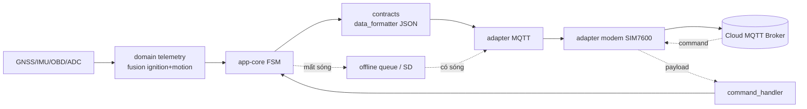

# 00 — Tổng quan kiến trúc và lộ trình

> Đọc trang này trước khi gõ dòng code nào. Mục tiêu: hiểu **bản đồ tổng thể** và **lý do** firmware được tách lớp như hiện tại.

## 🎯 Mục tiêu bước này

- Hiểu firmware làm gì ở mức hệ thống.
- Hiểu 7 lớp kiến trúc và quy tắc phụ thuộc (dependency rule).
- Biết tại sao xây từ dưới lên (bottom-up) và lộ trình từng bước.

## 1. Firmware này làm gì?

Thiết bị là **bộ theo dõi phương tiện (vehicle tracker)** chạy trên ESP32-S3, gắn trên xe. Vòng đời rút gọn:

1. Boot → khởi tạo phần cứng (modem, RTC, IMU, storage).
2. Đọc telemetry: vị trí GNSS, điện áp ắc-quy, dữ liệu OBD (RPM, tốc độ…), rung động IMU.
3. Quyết định trạng thái xe: đang nổ máy / đang chạy / đỗ / báo động trộm.
4. Đẩy telemetry lên cloud qua **MQTT trên mạng 4G (SIM7600)**.
5. Mất sóng → ghi vào **offline queue (thẻ SD)**, có sóng lại thì replay.
6. Nhận lệnh từ cloud (đổi config, OTA update, reboot).
7. Khi đỗ lâu → **deep sleep**, thức dậy bằng timer hoặc ngắt chuyển động IMU.

## 2. Bảy lớp kiến trúc

Firmware theo **Clean Architecture / Hexagonal** áp dụng trên C + ESP-IDF. Mỗi lớp là một (hoặc nhiều) ESP-IDF _component_.

```
┌───────────────────────────────────────────────────────────┐
│  main/                  entry point mỏng, chỉ gọi app-core   │
├───────────────────────────────────────────────────────────┤
│  app-core               FSM trung tâm + bootstrap + DI wiring│ ← điều phối
├───────────────────────────────────────────────────────────┤
│  domain-*               logic nghiệp vụ thuần (không phần cứng)│
├───────────────────────────────────────────────────────────┤
│  adapter-*              triển khai thật cho phần cứng         │ ← chi tiết
├───────────────────────────────────────────────────────────┤
│  platform-hal-esp-idf   định nghĩa PORT (interface)          │ ← ranh giới
│  platform-board-esp32s3 pin map + power GPIO                 │
├───────────────────────────────────────────────────────────┤
│  contracts-device-cloud hợp đồng payload JSON/OTA với cloud  │
├───────────────────────────────────────────────────────────┤
│  shared-kernel          models, config, util (không phụ thuộc)│ ← nền móng
└───────────────────────────────────────────────────────────┘
```

### Quy tắc phụ thuộc (CỐT LÕI)

> **Mũi tên phụ thuộc luôn chỉ vào trong.** Lớp ngoài biết lớp trong; lớp trong **không** biết lớp ngoài.

- `shared-kernel` không `#include` của bất kỳ ai. Nó là nền.
- Ranh giới giữa app-core và phần cứng được mô tả bằng **port** — một struct chứa con trỏ hàm (`tracker-runtime-ports.h`).
- `adapter-*` triển khai phần cứng thật, rồi được "cắm" (inject) vào port registry lúc boot.

> ⚠️ **Hiện trạng thật (đọc kỹ):** registry port hiện được **validate lúc boot** để chắc mọi adapter bắt buộc đã link đúng, nhưng FSM **chưa** gọi mọi thứ qua `s_ports->...`. Một số module FSM vẫn `#include` header adapter và gọi trực tiếp (vd `tracker_mqtt_publish_rawdata`, `offline_queue_enqueue`). Nói cách khác: port vừa là **hợp đồng + chốt fail-fast**, vừa là **đường refactor** để tiến tới DI thuần — chưa phải bảng dispatch runtime đầy đủ. Tài liệu này mô tả đúng hiện trạng đó thay vì lý tưởng hóa.

### Tại sao quan trọng?

- Mục tiêu khi thay modem SIM7600 → SIM7080: chỉ viết adapter mới điền cùng `modem_transport_port_t`. Port đã sẵn sàng cho điều này; phần FSM gọi trực tiếp là thứ cần dọn nốt để đạt "FSM không đổi một dòng".
- Đọc code dễ: muốn biết "app-core cần gì từ thế giới ngoài" → mở đúng file `tracker-runtime-ports.h`.

## 3. Port là gì? (khái niệm xương sống)

Port = một `struct` các con trỏ hàm, mô tả **firmware cần gì**, không nói **làm thế nào**.

```c
// platform-hal-esp-idf/include/tracker-runtime-ports.h
typedef struct {
    void (*set_apn)(const char *apn);
    void (*request_connect)(void);
    bool (*is_connected)(void);
    esp_err_t (*sleep)(void);
    esp_err_t (*wakeup)(void);
} modem_transport_port_t;
```

Adapter điền các con trỏ này bằng hàm thật:

```c
// app-core/src/tracker-app-bootstrap.c
static const modem_transport_port_t s_modem_transport_port = {
    .set_apn         = modem_lte_set_apn,      // hàm thật trong adapter
    .request_connect = modem_lte_request_connect,
    .is_connected    = modem_lte_is_connected,
    .sleep           = modem_lte_sleep,
    .wakeup          = modem_lte_wakeup,
};
```

Toàn bộ port gom vào một registry `tracker_runtime_ports_t` và được validate một lần lúc boot. Đây chính là **Dependency Injection** thủ công bằng C.

## 4. Vì sao xây từ dưới lên?

Vì quy tắc phụ thuộc. Nếu xây FSM trước, nó sẽ thiếu type, thiếu port → không build được. Thứ tự an toàn:

```
shared-kernel  →  contracts  →  platform (board + HAL/port)
   →  adapters  →  domain  →  app-core (FSM)  →  bootstrap  →  main
```

Mỗi bước **build pass** rồi mới sang bước sau. Đừng viết 5 component rồi mới `idf.py build` — lúc đó lỗi chồng lỗi rất khó gỡ.

## 5. Sơ đồ luồng dữ liệu end-to-end



## 6. Lộ trình chi tiết (checklist)

- [ ] 01 — Dựng project skeleton ESP-IDF, `app_main` in log.
- [ ] 02 — `shared-kernel`: types, config, util, retry.
- [ ] 03 — `contracts-device-cloud`: data_formatter JSON, ota_contract.
- [ ] 04 — `platform-board-esp32s3`: pin_map, power_mgr, adc_reader.
- [ ] 05 — `platform-hal-esp-idf`: định nghĩa port + validate.
- [ ] 06 — `adapter-kv-nvs`: lưu/đọc config.
- [ ] 07 — `adapter-modem-sim7600-at`: AT transport + LTE + GNSS.
- [ ] 08 — `adapter-mqtt` + `adapter-ble-obd`.
- [ ] 09 — `adapter-rtc-ds3231m` + `adapter-storage` (offline queue).
- [ ] 10 — `domain-*`: telemetry fusion, obd, ota policy.
- [ ] 11 — `app-core`: state machine.
- [ ] 12 — bootstrap wiring + `main.c`.
- [ ] 13 — power/sleep/OTA + validation cuối.

## ⚠️ Bẫy thường gặp

- **Đảo ngược dependency:** lỡ tay cho `shared-kernel` `#include` một adapter → vòng phụ thuộc, build lỗi khó hiểu. Giữ `shared-kernel` sạch.
- **Gọi thẳng driver từ FSM:** phá vỡ kiến trúc. Luôn đi qua port.
- **Build dồn:** sửa từng component xong build ngay.

## ➡️ Tiếp theo

[01 — Thiết lập môi trường ESP-IDF](./01-thiet-lap-moi-truong-esp-idf.md)
