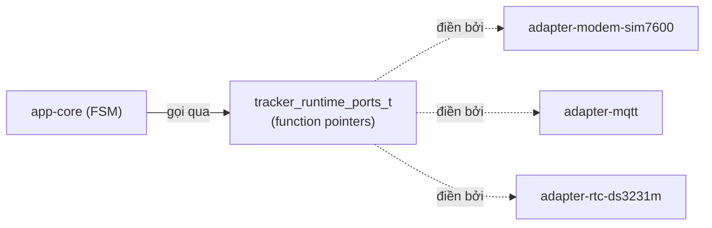

# 05 — Ports và Dependency Injection (ranh giới kiến trúc)

> 🎯 Mục tiêu: hiểu và xây lớp `platform-hal-esp-idf` — nơi định nghĩa **port** (interface bằng function pointer) và hàm `validate` chốt fail-fast lúc boot.

Nguồn thật: `components/platform-hal-esp-idf/include/tracker-runtime-ports.h`, `src/tracker-runtime-ports.c`

> ⚠️ **Đọc trước để khỏi hiểu nhầm:** trong codebase hiện tại, port registry được **validate** lúc boot (chốt mọi adapter bắt buộc đã link đúng) nhưng **chưa** được dùng làm bảng dispatch runtime — các module FSM vẫn `#include` header adapter và gọi hàm adapter **trực tiếp** (vd `tracker_mqtt_publish_rawdata`). Nói cách khác: port ở đây là **bản hợp đồng + chốt kiểm kê**, là _seam_ (đường nối) sẵn sàng cho việc tách/test sau này, chứ chưa phải cơ chế gọi gián tiếp mỗi vòng lặp. Chương này mô tả port như một **mẫu thiết kế** đáng học và đúng với phần khai báo, kèm ghi chú rõ hiện trạng.

## 1. Vấn đề nếu KHÔNG có port

Giả sử FSM gọi thẳng driver:

```c
// ❌ FSM phụ thuộc cứng vào driver modem
#include "modem_lte.h"
void fsm_step(void) { modem_lte_request_connect(); }
```

Hệ quả:

- Đổi từ SIM7600 sang module khác → **sửa FSM**.
- Muốn unit-test FSM trên PC → không được, vì kéo theo cả driver phần cứng.
- FSM `REQUIRES` mọi adapter → vòng phụ thuộc, build chậm, khó tách.

## 2. Giải pháp: Port = struct các function pointer

Port là **bản hợp đồng hành vi**. app-core chỉ biết "tôi gọi `connect()` nào đó", không cần biết ai thực thi.



Chiều phụ thuộc: **adapter → port ← app-core**. Cả hai phụ thuộc vào _abstraction_ (port), không phụ thuộc lẫn nhau. Đây chính là **Dependency Inversion**.

## 3. Định nghĩa port (trích thật)

🧩 `tracker-runtime-ports.h`

```c
#pragma once
#include "esp_err.h"
#include "app_config.h"
#include "ota_contract.h"

/* Callback nhận lệnh từ cloud */
typedef void (*tracker_command_message_callback_t)(const char *topic, const char *payload);

/* --- Port modem: bề mặt điều khiển LTE --- */
typedef struct {
    void      (*set_apn)(const char *apn);
    void      (*request_connect)(void);
    bool      (*is_initialized)(void);
    bool      (*is_connected)(void);
    esp_err_t (*sleep)(void);
    esp_err_t (*wakeup)(void);
} modem_transport_port_t;

/* --- Port MQTT --- */
typedef struct {
    esp_err_t (*init)(const config_t *cfg);
    esp_err_t (*connect)(void);
    esp_err_t (*disconnect)(void);
    bool      (*is_connected)(void);
    esp_err_t (*publish)(const char *topic, const char *payload, int qos);
    int       (*publish_with_msg_id)(const char *topic, const char *payload, int qos);
    esp_err_t (*subscribe_commands)(void);
    void      (*set_command_callback)(tracker_command_message_callback_t cb);
} mqtt_transport_port_t;

/* … storage_queue, ota_download, config_store, rtc_clock, obd_reader, power_control … */

/* --- Registry tổng: tất cả port gộp một struct --- */
typedef struct {
    const modem_transport_port_t *modem;
    const mqtt_transport_port_t  *mqtt;
    const storage_queue_port_t   *storage_queue;
    const ota_download_port_t    *ota_download;
    const config_store_port_t    *config_store;
    const rtc_clock_port_t       *rtc_clock;
    const obd_reader_port_t      *obd_reader;
    const power_control_port_t   *power_control;
} tracker_runtime_ports_t;

esp_err_t tracker_runtime_ports_validate(const tracker_runtime_ports_t *ports);
```

> 💡 Mỗi port chỉ phơi bày **đúng những gì lớp trên cần** — không phải toàn bộ API driver. Đây là "interface segregation": port hẹp, dễ thay.

## 4. Hàm validate — chốt chặn lúc boot

Vì C không ép kiểu interface lúc compile, ta **kiểm tra runtime**: mọi port + callback bắt buộc phải khác `NULL` trước khi FSM chạy.

🧩 `tracker_runtime_ports.c` (rút gọn)

```c
#include "tracker-runtime-ports.h"

#define REQUIRE(cond, tag) \
    do { if (!(cond)) { ESP_LOGE("PORTS", "missing %s", tag); \
         return ESP_ERR_INVALID_ARG; } } while (0)

esp_err_t tracker_runtime_ports_validate(const tracker_runtime_ports_t *p) {
    REQUIRE(p, "registry");
    REQUIRE(p->modem && p->modem->request_connect, "modem.request_connect");
    REQUIRE(p->mqtt && p->mqtt->publish, "mqtt.publish");
    REQUIRE(p->config_store && p->config_store->load, "config_store.load");
    REQUIRE(p->rtc_clock && p->rtc_clock->get_time_ms, "rtc_clock.get_time_ms");
    // … kiểm tra hết các port bắt buộc …
    return ESP_OK;
}
```

> 💡 "Fail fast tại boot" tốt hơn nhiều so với crash giữa runtime khi gọi function pointer `NULL`. Nếu wiring thiếu, log chỉ rõ port nào thiếu.

## 5. CMakeLists của lớp port

🧩

```cmake
# platform-hal-esp-idf/CMakeLists.txt
idf_component_register(
    SRCS "src/tracker-runtime-ports.c"
    INCLUDE_DIRS "include"
    REQUIRES contracts-device-cloud log shared-kernel
)
```

> ⚠️ **Hiện trạng thật:** bản thân lớp `platform-hal-esp-idf` (định nghĩa port) chỉ `REQUIRES shared-kernel`, `contracts-device-cloud`, `log` — sạch, không kéo adapter. **Nhưng `app-core` thì `REQUIRES` đủ tất cả adapter** (`adapter-modem-sim7600-at`, `adapter-mqtt-sim7600-at`, `adapter-ble-obd-nimble`, …) vì FSM gọi chúng trực tiếp. Đây là điểm khác với mô hình DI "thuần": nếu sau này chuyển hẳn sang gọi qua `s_ports->...`, app-core sẽ có thể bỏ bớt các `REQUIRES` adapter và trở nên test-được độc lập. Việc _điền_ port (gắn driver thật) hiện xảy ra ở bootstrap (`tracker-app-bootstrap.c`, bước 12).

## 6. 🔧 Kiểm tra tư duy (chưa build được gì chạy được)

Bước này thuần thiết kế. Hãy tự trả lời:

- Nếu mai đổi sang modem Quectel, _mục tiêu_ của kiến trúc port là: chỉ viết adapter mới điền cùng `modem_transport_port_t` + sửa dòng wiring ở bootstrap, FSM không đổi. **Lưu ý hiện trạng:** vì FSM đang gọi vài hàm adapter trực tiếp (vd `tracker_mqtt_publish_rawdata`), để đạt được mức "FSM không đổi một dòng" thì cần hoàn tất việc cho FSM gọi qua `s_ports->...`. Port hiện đã sẵn sàng cho việc đó; đây là hướng refactor tự nhiên.
- Muốn test FSM trên máy tính? → khi FSM gọi hoàn toàn qua port, chỉ cần điền port bằng hàm giả (mock). Hiện tại còn vướng các include adapter trực tiếp.

## ⚠️ Bẫy thường gặp

- **Để port là biến toàn cục mutable:** nên `const` và điền một lần lúc boot. Tránh ai đó đổi port giữa runtime.
- **Quên `validate`:** gọi function pointer `NULL` = crash khó debug. Luôn validate trước khi chạy FSM.
- **Port quá rộng:** nếu port phơi cả 40 hàm driver thì mất ý nghĩa. Giữ port hẹp đúng nhu cầu.

## ➡️ Tiếp theo

[06 — Adapter NVS config store](./06-adapter-nvs-config-store.md)
