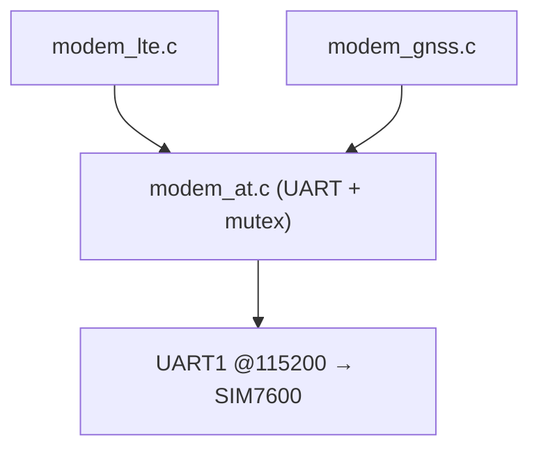

# 07 — Adapter modem SIM7600 (AT + LTE + GNSS)

> 🎯 Mục tiêu: xây adapter modem — adapter phức tạp nhất. Chia thành 3 tầng: **AT transport** (gửi/nhận lệnh) → **LTE** (đăng ký mạng, PDP) → **GNSS** (đọc vị trí). Tất cả qua một UART duy nhất.

Nguồn thật: `components/adapter-modem-sim7600-at/src/` (`modem_at.c`, `modem_lte.c`, `modem_gnss.c`, …)

## 1. Vì sao tách 3 tầng

SIM7600 nói chuyện bằng **AT command** qua UART. Nhưng LTE và GNSS dùng _cùng_ một đường UART đó. Nếu trộn chung, code rối và race condition. Tách:

```
modem_at.c   → transport thuần: gửi 1 dòng AT, chờ "OK"/"ERROR", dispatch URC
modem_lte.c  → dùng AT để: tắt echo, check SIM, đăng ký mạng, mở PDP context
modem_gnss.c → dùng AT để: bật GNSS, đọc +CGNSINF, parse lat/lon/speed
```



## 2. Tầng AT transport — serialize bằng mutex

Vấn đề: hai task cùng gửi AT → response trộn lẫn. Giải pháp: **một mutex** (`s_at_lock`) bao quanh mỗi transaction. Codebase cài UART kèm **event queue** để đếm lỗi tầng vật lý (framing/parity/overflow) phục vụ chẩn đoán.

🧩 `modem_at.c` (rút gọn — tên hàm/đặt biến giữ đúng nguồn)

```c
#define MODEM_RX_BUFFER_SIZE 1024
static SemaphoreHandle_t s_at_lock = NULL;
static QueueHandle_t     s_uart_event_queue = NULL;
static bool              s_uart_ready = false;

esp_err_t modem_at_init(void) {
    if (s_uart_ready) return ESP_OK;
    const uart_config_t uart_cfg = {
        .baud_rate  = MODEM_UART_BAUD,        // 115200
        .data_bits  = UART_DATA_8_BITS,
        .parity     = UART_PARITY_DISABLE,
        .stop_bits  = UART_STOP_BITS_1,
        .flow_ctrl  = UART_HW_FLOWCTRL_DISABLE,
        .source_clk = UART_SCLK_DEFAULT,
    };
    // RX buffer + event queue 32 phần tử để theo dõi sức khỏe UART
    esp_err_t err = uart_driver_install(MODEM_UART_NUM, MODEM_RX_BUFFER_SIZE,
                                        0, 32, &s_uart_event_queue, 0);
    if (err == ESP_OK) err = uart_param_config(MODEM_UART_NUM, &uart_cfg);
    if (err == ESP_OK) err = uart_set_pin(MODEM_UART_NUM, PIN_MODEM_TX, PIN_MODEM_RX,
                                          UART_PIN_NO_CHANGE, UART_PIN_NO_CHANGE);
    if (err == ESP_OK) err = uart_set_line_inverse(MODEM_UART_NUM,
                                                   MODEM_UART_LINE_INVERSE_MASK); // = 0
    if (err == ESP_OK) { s_at_lock = xSemaphoreCreateMutex(); s_uart_ready = true; }
    return err;
}

/* Gửi 1 lệnh, chờ tới khi thấy "OK"/"ERROR" hoặc timeout. response optional. */
esp_err_t modem_at_send(const char *cmd, char *response, size_t resp_len,
                        uint32_t timeout_ms);

/* Gửi rồi khẳng định response CHỨA chuỗi mong đợi (NULL = bỏ qua kiểm tra nội dung). */
esp_err_t modem_at_send_expect(const char *cmd, const char *expect, uint32_t timeout_ms);
```

> 💡 **API thật:** `modem_at_send(cmd, resp, resp_len, timeout)` và biến thể `modem_at_send_expect(cmd, expect, timeout)`. Ngoài ra còn `modem_at_send_prompt_data` (ghi byte thô sau dấu `>`, dùng cho gửi payload nhị phân) và `modem_at_send_collect` (gom byte tới khi idle, cho stream). Header thật: `modem_at.h`.

> 💡 **URC (Unsolicited Result Code):** modem có thể tự gửi thông báo (vd `RDY`, `+CMTI`, `+CGEV`) không theo lệnh nào. Transport gom dòng theo prefix đã đăng ký (tối đa 8 slot `s_urc_entries`) và đẩy vào callback `modem_urc_cb_t`, không nhầm là response của lệnh đang chờ. Handler chạy trong task polling (không phải ISR) nhưng dùng chung cửa sổ AT lock → phải nhanh, không blocking.

## 3. Tầng LTE — chuỗi bring-up có thứ tự, chạy **không chặn**

Điểm quan trọng: connect LTE **không** là một hàm chặn 60s. Codebase tách thành **step machine**: `modem_lte_request_connect()` chỉ đặt cờ, rồi FSM gọi `modem_lte_tick(now_ms)` lặp lại — mỗi lần nhích **một bước** và trả `ESP_ERR_NOT_FINISHED` cho tới khi xong.

🧩 Các bước bring-up (khái niệm, theo `modem_lte_steps.c`)

```c
// Mỗi bước gọi modem_at_send / modem_at_send_expect rồi return tiến độ
char r[128];
modem_at_send_expect("ATE0", "OK", 1000);          // tắt echo
modem_at_send_expect("AT+CMEE=2", "OK", 1000);     // lỗi dạng text
modem_at_send("AT+CPIN?", r, sizeof(r), 2000);     // SIM ready?
modem_at_send("AT+CNMP=38", r, sizeof(r), 2000);   // ưu tiên LTE

// Chờ đăng ký: poll +CEREG? tới khi stat=1 (home) hoặc 5 (roaming)
modem_at_send("AT+CEREG?", r, sizeof(r), 2000);
// → nếu chưa registered, tick sau quay lại bước này (KHÔNG vTaskDelay chặn)

// Mở PDP context với APN rồi kích hoạt
char cmd[96];
snprintf(cmd, sizeof(cmd), "AT+CGDCONT=1,\"IP\",\"%s\"", apn);
modem_at_send(cmd, r, sizeof(r), 2000);
modem_at_send("AT+CGACT=1,1", r, sizeof(r), 10000);
modem_at_send("AT+CGPADDR=1", r, sizeof(r), 3000); // lấy IP
```

> ⚠️ **Thứ tự là bắt buộc.** Không thể mở PDP trước khi đăng ký mạng. Không thể đăng ký khi SIM chưa ready. Sai thứ tự = modem trả ERROR khó hiểu. Xem `04_modem_gnss/sim7600_power_and_boot_sequence.md`.

Các hàm public của tầng LTE (header `modem_lte.h`):

```c
void      modem_lte_set_apn(const char *apn);    // đặt APN cho AT+CGDCONT
void      modem_lte_request_connect(void);       // async: chỉ bật cờ
esp_err_t modem_lte_tick(uint64_t now_ms);       // nhích 1 bước; ESP_ERR_NOT_FINISHED khi đang chạy
bool      modem_lte_is_initialized(void);
bool      modem_lte_is_at_ready(void);           // AT dùng được (sớm hơn PDP) → GNSS warm song song
bool      modem_lte_is_connected(void);          // PDP context đang active
esp_err_t modem_lte_sleep(void);                 // DTR + low-power
esp_err_t modem_lte_wakeup(void);
int       modem_lte_get_rssi(void);              // RSSI dBm, -1 nếu N/A
```

> 💡 `modem_lte_tick` là lý do FSM không bao giờ đứng 60s chờ mạng: mỗi vòng 100ms nó tiến **một bước nhỏ**, watchdog vẫn được feed, command vẫn xử lý kịp. Codebase còn tách `modem_lte_recovery.c` (modem treo → pulse PWRKEY/RESET rồi bring-up lại) và `modem_lte_fsm.c` (state của chính chuỗi connect).

## 4. Tầng GNSS — bật rồi parse +CGNSINF

🧩 `modem_gnss.c`

```c
esp_err_t modem_gnss_enable(bool on) {
    char r[64];
    return modem_at_send(on ? "AT+CGNSPWR=1" : "AT+CGNSPWR=0",
                         r, sizeof(r), 2000);
}

esp_err_t modem_gnss_read(gnss_data_t *out) {
    char r[256];
    esp_err_t err = modem_at_send("AT+CGNSINF", r, sizeof(r), 2000);
    if (err != ESP_OK) return err;
    // +CGNSINF: <run>,<fix>,<utc>,<lat>,<lon>,<alt>,<speed>,<course>,...
    return modem_gnss_parse_cgnsinf(r, out); // tách field, set out->valid
}
```

`gnss_data_t` (từ shared-kernel) chứa `latitude, longitude, speed_kmph, satellites, valid, ...`.

## 5. CMakeLists

🧩

```cmake
idf_component_register(
    SRCS "src/modem_at.c" "src/modem_gnss.c" "src/modem_lte.c"
         "src/modem_lte_fsm.c" "src/modem_lte_recovery.c"
         "src/modem_lte_steps.c" "src/modem_lte_uart_profile.c"
    INCLUDE_DIRS "include"
    REQUIRES domain-telemetry driver log platform-board-esp32s3 shared-kernel
)
```

> 💡 Codebase tách `modem_lte` thành nhiều file (`_steps`, `_recovery`, `_fsm`) để giữ mỗi file <200 dòng. `_recovery` xử lý khi modem treo: pulse PWRKEY/RESET rồi bring-up lại.

## 6. 🔧 Build & kiểm tra (cần phần cứng)

```c
modem_at_init();
char r[64];
if (modem_at_send("AT", r, sizeof(r), 1000) == ESP_OK)
    ESP_LOGI("MODEM", "modem trả lời: %s", r);   // mong đợi "OK"
```

Không có "OK" → kiểm tra: TX/RX có đảo? modem đã power-on chưa (bước 13)? baud đúng 115200?

## ⚠️ Bẫy thường gặp

- **TX/RX đấu ngược:** triệu chứng kinh điển — gửi AT không bao giờ có response. Board này khóa cứng không đảo (`MODEM_UART_LINE_INVERSE_MASK = 0`).
- **Không serialize:** hai task gửi AT đồng thời → parse loạn. Luôn qua mutex.
- **Blocking quá lâu trong FSM:** `request_connect` để async; đừng để FSM đứng chờ 60s đăng ký mạng.
- **Parse `+CGNSINF` cứng nhắc:** số field thay đổi theo firmware modem; parse theo dấu phẩy, kiểm tra `fix` trước khi tin lat/lon.

## ➡️ Tiếp theo

[08 — Adapter MQTT và BLE OBD](./08-adapter-mqtt-va-ble-obd.md)
