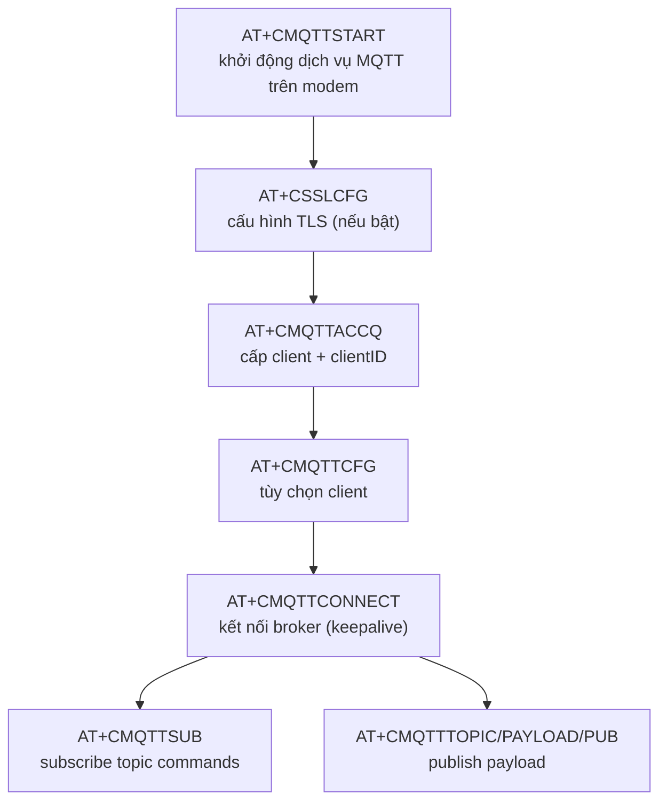
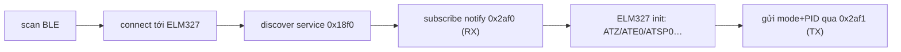

# 08 — Adapter MQTT và BLE OBD

> 🎯 Mục tiêu: xây 2 adapter còn lại của tầng kết nối — **MQTT** (đẩy telemetry lên cloud) và **BLE OBD** (đọc dữ liệu ECU xe qua dongle ELM327).

Nguồn thật: `components/adapter-mqtt-sim7600-at/`, `components/adapter-ble-obd-nimble/`

## Phần A — MQTT transport (MQTT **trên AT**, không phải esp-mqtt)

> ⚠️ **Điểm cốt lõi dễ hiểu nhầm:** dự án **không** dùng `esp-mqtt` chạy TCP/IP trên ESP32. SIM7600 có **MQTT client tích hợp sẵn**, điều khiển bằng lệnh AT (`AT+CMQTT*`). MCU không mở socket TCP — nó ra lệnh cho modem mở. Vì vậy adapter MQTT `REQUIRES adapter-modem-sim7600-at` và include `modem_at.h`, **không** require component `mqtt` của ESP-IDF.

### A1. Topic theo device_id

Firmware build topic từ `device_id` trong config:

```
v1/{device_id}/rawdata     ← telemetry tần suất cao (QoS 0)
v1/{device_id}/status      ← trạng thái phiên (QoS 1)
v1/{device_id}/events      ← sự kiện rời rạc (QoS 1)
v1/{device_id}/firmware    ← tiến độ OTA (QoS 1)
v1/{device_id}/commands    ← lệnh từ cloud (subscribe)
```

> 💡 **QoS chọn theo giá trị dữ liệu:** rawdata mất 1 gói không sao (QoS 0, nhanh, nhẹ). status/events/firmware phải tới (QoS 1). Đừng QoS 1 cho mọi thứ — tốn băng thông modem.

### A2. Vòng đời MQTT-over-AT

Mỗi bước là một lệnh AT gửi tới modem (xem `mqtt_session.c`):



Endpoint có dạng `tcp://host:8883` (TLS) hoặc `tcp://host:1883`. Codebase còn có **DNS fallback** (`AT+CDNSGIP`, nếu DNS fail dùng IPv4 tĩnh) và **fallback broker** thứ hai.

### A3. Các hàm điền `mqtt_transport_port_t`

🧩 `mqtt_client.c` / `mqtt_session.c` (rút gọn — tên hàm giữ đúng nguồn)

```c
esp_err_t tracker_mqtt_init(const config_t *cfg) {
    s_cfg = *cfg;
    // build topic v1/{device_id}/... vào s_topic_rawdata, s_topic_commands, …
    mqtt_build_topics(cfg->device_id);
    mqtt_register_urc_handler();   // bắt URC +CMQTT* (connect lost, rx message…)
    return ESP_OK;
}

esp_err_t tracker_mqtt_connect(void) {
    tracker_mqtt_start_service();   // AT+CMQTTSTART
    if (s_tls_enabled) tracker_mqtt_configure_tls();  // AT+CSSLCFG
    tracker_mqtt_acquire_client();  // AT+CMQTTACCQ <clientID>
    tracker_mqtt_apply_client_options();              // AT+CMQTTCFG
    return tracker_mqtt_open_session();               // AT+CMQTTCONNECT + AT+CMQTTSUB
}

bool tracker_mqtt_is_connected(void) { return s_connected; }

/* Publish 1 payload: set topic rồi set payload rồi publish — toàn bằng AT */
int tracker_mqtt_publish_with_msg_id(const char *topic, const char *payload, int qos);

void tracker_mqtt_set_command_callback(tracker_command_message_callback_t cb) {
    s_command_callback = cb;   // command tới qua URC → parser → callback này
}
```

> 💡 Adapter này **không parse JSON lệnh**. URC parser (`mqtt_urc_parser.c`) chỉ tách topic + payload từ dòng URC modem đẩy lên, rồi gọi `s_command_callback(topic, payload)`. Parse JSON là việc của `command_handler` (domain). Tách biệt transport vs logic.

> 💡 Vì publish/connect đều là chuỗi AT bất đồng bộ, codebase dùng các cờ `s_connect_result_pending/ready`, `s_publish_result_pending/ready` để chờ URC kết quả thay vì block.

### A4. CMakeLists (đúng nguồn)

```cmake
idf_component_register(
    SRCS "src/mqtt_client.c" "src/mqtt_publish.c" "src/mqtt_session.c"
         "src/mqtt_topics.c" "src/mqtt_urc_parser.c"
    INCLUDE_DIRS "include"
    REQUIRES adapter-modem-sim7600-at log shared-kernel
)
```

> 💡 `REQUIRES adapter-modem-sim7600-at` (không phải `mqtt`) là bằng chứng rõ nhất rằng MQTT chạy **qua transport AT của modem**, dùng chung `modem_at_send` với LTE/GNSS.

## Phần B — BLE OBD (NimBLE + ELM327)

### B1. Chuỗi từ scan tới đọc PID



UUID hard-code theo dongle phổ biến: service `0x18f0`, TX char `0x2af1`, RX char `0x2af0`.

### B2. Các hàm điền `obd_reader_port_t`

🧩 `ble_obd.c` (rút gọn)

```c
void *ble_obd_connect(ble_obd_response_cb_t cb, void *ctx, uint32_t timeout_ms);
esp_err_t ble_obd_disconnect(ble_obd_ctx_t *c);
bool ble_obd_is_connected(ble_obd_ctx_t *c);

/* Gửi 1 request mode/PID, response về qua notify → parse → callback */
int ble_obd_rxtx(ble_obd_ctx_t *c, uint8_t mode, uint8_t pid, uint32_t timeout_ms);

esp_err_t ble_obd_elm327_init(ble_obd_ctx_t *c) {
    ble_obd_send_line(c, "ATZ");     // reset
    ble_obd_send_line(c, "ATE0");    // tắt echo
    ble_obd_send_line(c, "ATSP0");   // auto protocol
    return ESP_OK;
}
```

### B3. Vì sao OBD chỉ là nguồn phụ

OBD cho `rpm, speed, coolant, fuel, engine_load`. Nhưng dongle BLE hay rớt, xe tắt máy thì ECU ngủ. Vì vậy firmware coi OBD là **bổ trợ**: dùng để củng cố phán đoán ignition/motion, không phải nguồn chính. Khi OBD không có, GNSS + ADC + IMU vẫn chạy (xem bước 10).

### B4. CMakeLists

```cmake
idf_component_register(
    SRCS "src/ble_init.c" "src/ble_mgr.c" "src/ble_obd.c" "src/ble_util.c"
    INCLUDE_DIRS "include"
    REQUIRES bt domain-telemetry log shared-kernel
)
```

> 💡 `bt` là component Bluetooth/NimBLE của ESP-IDF. Adapter còn `REQUIRES domain-telemetry` vì nó map nhãn ECU-state vào model telemetry chung.

## 🔧 Build & kiểm tra

- MQTT: device connect tới broker qua modem; ở máy dùng `mosquitto_sub -t 'v1/#'` để xem gói tới. (Không test publish bằng `esp_mqtt` trên MCU — publish đi qua AT của modem.)
- BLE: bật dongle ELM327, log MAC khi scan thấy; connect và gửi `0100` (mode 01, PID 00) — response là bitmap PID hỗ trợ.

## ⚠️ Bẫy thường gặp

- **MQTT publish khi chưa connect:** `tracker_mqtt_publish_with_msg_id` trả id âm / lỗi. Phải check `tracker_mqtt_is_connected` hoặc enqueue offline (bước 09).
- **Nhầm esp-mqtt với MQTT-over-AT:** đây là MQTT tích hợp trên SIM7600 (`AT+CMQTT*`), không phải `esp_mqtt_client`. Đừng trộn hai API.
- **Topic build sai khi device_id rỗng:** `v1//rawdata` — luôn validate device_id (đã làm ở app_config).
- **BLE callback chạy trong NimBLE host task:** không làm việc nặng/blocking trong callback; copy data ra rồi xử lý ở FSM.
- **Quên free response BLE:** rò rỉ heap dần dần → reboot sau vài giờ.

## ➡️ Tiếp theo

[09 — Adapter RTC và Storage offline queue](./09-adapter-rtc-va-storage.md)
