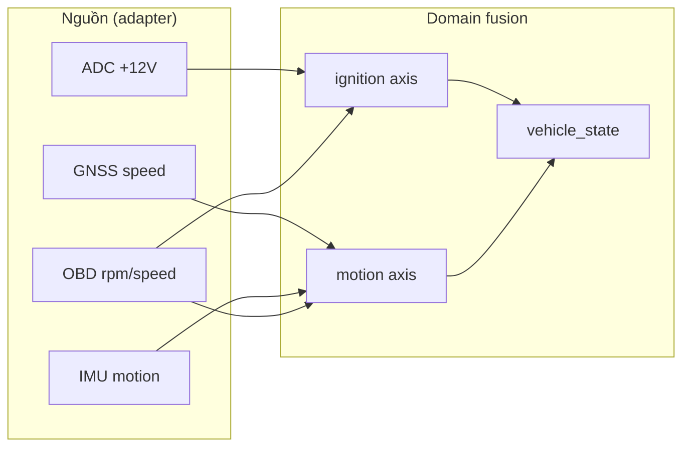

# 10 — Domain telemetry và fusion ignition/motion

> 🎯 Mục tiêu: hiểu tầng **domain** — logic nghiệp vụ thuần (không đụng phần cứng). Trọng tâm: **fusion** nhiều nguồn cảm biến thành 2 trục chính (ignition, motion) rồi suy ra `vehicle_state`.

Nguồn thật: `components/domain-telemetry/`, `components/domain-obd/`, `components/domain-connectivity/`; model ở `shared-kernel/include/telemetry_model.h`. **Lưu ý quan trọng:** logic fusion ignition/motion/vehicle hiện **nằm trong app-core** (`state_machine_core.c`), không phải trong một file `domain-telemetry/telemetry_fusion.c`. Phần dưới mô tả logic đó như một "khái niệm domain" để bạn hiểu, nhưng vị trí code thật là app-core.

## 0. Các domain component thật có gì

| Component             | File thật                            | Trách nhiệm                                            |
| --------------------- | ------------------------------------ | ------------------------------------------------------ |
| `domain-telemetry`    | `telemetry_counters.c`               | Đếm/aggregate số liệu telemetry (seq, counters)        |
| `domain-obd`          | `obd_conversions.c`                  | Bảng PID + hàm convert byte thô → giá trị (rpm, %, °C) |
| `domain-connectivity` | `session_mgr.c`, `command_handler.c` | Debounce ignition + vòng đời session; parse lệnh cloud |

> ⚠️ Logic "xe đang ở trạng thái nào" (resolve ignition/motion, derive vehicle_state) **chưa được tách** thành domain component riêng — nó sống trong `app-core/src/state_machine_core.c`. Đây là một điểm có thể refactor trong tương lai, nhưng tài liệu này mô tả đúng hiện trạng.

## 1. Domain là gì và vì sao tách

Domain = quy tắc nghiệp vụ thuần, **độc lập** với việc dữ liệu đến từ đâu. Ví dụ `obd_conversions.c`: cùng công thức convert RPM dù byte đến từ BLE hay nguồn khác. Tách domain khỏi adapter cho phép:

- Test logic bằng unit test trên PC (không cần ESP32).
- Đổi cảm biến mà không sửa logic.



## 2. Ba trục dữ liệu (đã định nghĩa ở bước 02)

| Trục     | Enum                       | Ý nghĩa                                     |
| -------- | -------------------------- | ------------------------------------------- |
| Ignition | `tracker_ignition_state_t` | Khóa điện ON/OFF/UNKNOWN                    |
| Motion   | `tracker_motion_state_t`   | Đang di chuyển/đứng yên/chưa rõ             |
| Vehicle  | `tracker_vehicle_state_t`  | Trạng thái suy ra (parked, driving, towed…) |

## 3. Fusion ignition — ưu tiên theo độ tin cậy

🧩 Logic (theo `state_machine_resolve_effective_ignition_state` trong `app-core/src/state_machine_core.c`)

```c
tracker_ignition_state_t resolve_ignition(const telemetry_t *t, bool stable) {
    // 1. Cao nhất: verdict đã debounce của session manager
    if (session_mgr_has_stable_ignition())
        return session_mgr_stable_ignition() ? TRACKER_IGNITION_STATE_ON
                                              : TRACKER_IGNITION_STATE_OFF;
    // 2. Chưa stable: tín hiệu ON thô có thể nâng lên ON…
    if (t->ignition) return TRACKER_IGNITION_STATE_ON;
    // 3. …nhưng tín hiệu yếu/absent KHÔNG được khẳng định OFF
    return TRACKER_IGNITION_STATE_UNKNOWN;
}
```

> 💡 **Bất đối xứng có chủ đích:** dễ nâng lên ON, khó khẳng định OFF. Vì báo nhầm OFF rồi cho ngủ sâu trong khi xe đang chạy = mất dấu xe. An toàn hơn là ở UNKNOWN.

## 4. Fusion motion — ưu tiên GNSS rồi OBD

🧩

```c
tracker_motion_state_t resolve_motion(const telemetry_t *t, uint64_t now_ms) {
    if (t->gnss.valid)                                   // 1. GNSS fix → speed
        return t->gnss.speed_kmph > 3.0f ? MOVING : STATIONARY;
    if (obd_recent(now_ms, 30000) && t->obd_speed >= 0)  // 2. OBD <30s
        return t->obd_speed > 3 ? MOVING : STATIONARY;
    if (!t->ignition) return STATIONARY;                 // 3. fallback
    return UNKNOWN;
}
```

Ngưỡng 3 km/h lọc trôi GNSS khi đứng yên.

## 5. Suy ra vehicle_state từ 2 trục

🧩 Bảng quyết định

```c
tracker_vehicle_state_t derive_vehicle(tracker_ignition_state_t ig,
                                        tracker_motion_state_t mo) {
    if (ig == ON  && mo == MOVING)     return MOVING_ON;        // chạy bình thường
    if (ig == ON  && mo == STATIONARY) return IDLING_ON;        // nổ máy đứng yên
    if (ig == OFF && mo == STATIONARY) return PARKED_OFF;       // đỗ bình thường
    if (ig == OFF && mo == MOVING)     return ROLLING_IGN_OFF;  // bị kéo/trộm!
    if (mo == STATIONARY)              return UNKNOWN_STATIONARY;
    if (mo == MOVING)                  return UNKNOWN_MOVING;
    return TRACKER_VEHICLE_STATE_UNKNOWN;
}
```

> 💡 `ROLLING_IGN_OFF` (di chuyển khi khóa điện tắt) là tín hiệu **chống trộm** quan trọng — xe bị kéo đi. Domain phát hiện, FSM sẽ chuyển ALARM.

## 6. CMakeLists thật của các domain

```cmake
# domain-telemetry — chỉ counters
idf_component_register(SRCS "src/telemetry_counters.c" INCLUDE_DIRS "include"
    REQUIRES shared-kernel)

# domain-obd — convert PID
idf_component_register(SRCS "src/obd_conversions.c" INCLUDE_DIRS "include"
    REQUIRES shared-kernel)

# domain-connectivity — session + command
idf_component_register(SRCS "src/command_handler.c" "src/session_mgr.c"
    INCLUDE_DIRS "include"
    REQUIRES adapter-kv-nvs contracts-device-cloud freertos json log shared-kernel)
```

> 💡 `domain-telemetry` và `domain-obd` `REQUIRES` chỉ `shared-kernel` — bằng chứng logic thuần, nhận dữ liệu qua struct, không tự đọc cảm biến. `domain-connectivity` cần thêm `adapter-kv-nvs`/`json` vì `command_handler` parse JSON lệnh và `session_mgr` lưu session vào NVS — đây là domain "dày" hơn, có chạm I/O gián tiếp.

## 7. Session manager — debounce ignition (`domain-connectivity`)

`session_mgr.c` giữ trạng thái "phiên lái": debounce ignition để lọc nhiễu đường dây (ON/OFF chớp nháy), phát hiện cạnh start, sinh `session_id`. FSM hỏi `session_mgr_has_stable_ignition()` / `session_mgr_stable_ignition()` để có verdict đáng tin. Lưu ý: theo doc-comment trong `session_mgr.h`, manager chỉ lo **debounce + cạnh start**; còn **biên dừng (stop)** vẫn do FSM quyết (phối hợp OFF-hold, thứ tự publish status, teardown offline queue, vào sleep).

## 🔧 Build & kiểm tra

Vì domain thuần logic → test trên PC được:

```c
telemetry_t t = { .ignition = false, .gnss.valid = true, .gnss.speed_kmph = 20 };
assert(derive_vehicle(OFF, MOVING) == ROLLING_IGN_OFF);  // phải báo bị kéo
```

## ⚠️ Bẫy thường gặp

- **Cho domain gọi thẳng adapter:** phá vỡ tính thuần, hết test offline được. Luôn truyền dữ liệu vào qua struct.
- **Khẳng định OFF từ tín hiệu yếu:** dẫn tới ngủ sai lúc → mất dấu xe.
- **Quên ngưỡng tốc độ:** GNSS trôi vài km/h khi đứng yên → báo MOVING giả.
- **Không debounce ignition:** dây điện nhiễu → đóng/mở session liên tục, spam status.

## ➡️ Tiếp theo

[11 — App-core state machine (FSM)](./11-app-core-state-machine.md)
