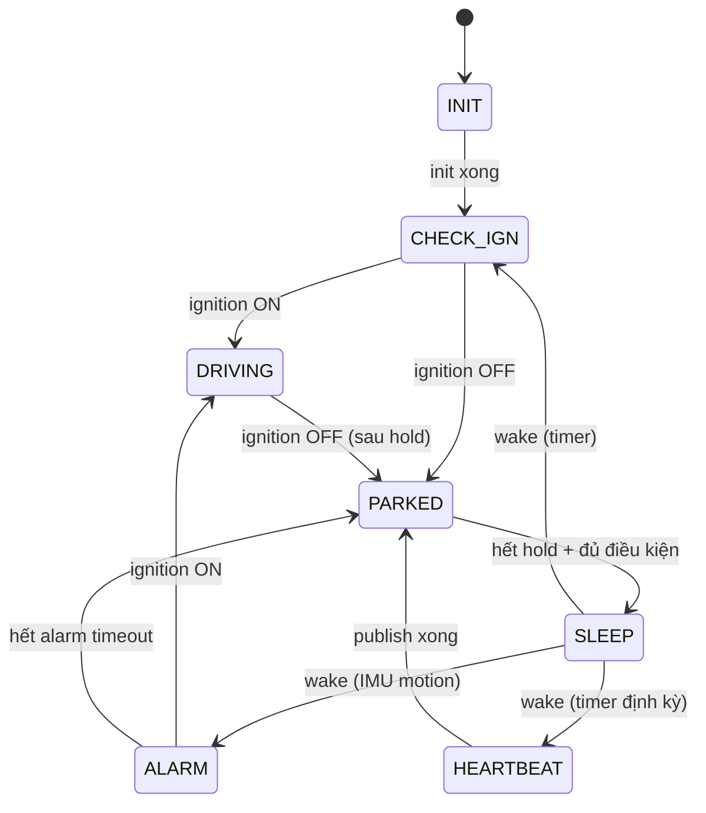

# 11 — App-core state machine (FSM)

> 🎯 Mục tiêu: xây trái tim firmware — **finite state machine** điều phối toàn bộ. FSM là module _duy nhất_ biết "giờ nên làm gì"; mọi subsystem khác là dependency của nó.

Nguồn thật: `components/app-core/src/state_machine_core.c`, `state_machine.c`, các `state_*.c`

## 1. Bảy trạng thái

Đã định nghĩa ở bước 02 (`fsm_types.h`):



| State       | Làm gì                              | Cadence                |
| ----------- | ----------------------------------- | ---------------------- |
| `INIT`      | Init peripheral, load config        | 1 lần/boot             |
| `CHECK_IGN` | Quyết định ignition, chọn nhánh     | nhanh                  |
| `DRIVING`   | Telemetry tần suất cao, OBD connect | `tracking_interval_s`  |
| `PARKED`    | Chờ timeout ignition-off            | thấp                   |
| `ALARM`     | Báo động khi bị kéo lúc đỗ          | `alarm_interval_s`     |
| `HEARTBEAT` | Wake định kỳ báo "còn sống"         | `heartbeat_interval_s` |
| `SLEEP`     | Deep sleep, arm wake source         | —                      |

## 2. Hai hàm public mỏng (facade)

🧩 `state_machine.c` — chỉ chuyển tiếp sang core

```c
esp_err_t state_machine_init(const config_t *config) {
    return state_machine_core_init(config);
}
app_state_t state_machine_run(app_state_t current_state) {
    return state_machine_core_run(current_state);   // chạy 1 bước, trả state kế
}
```

> 💡 **Facade pattern.** File public mỏng, logic thật ở `state_machine_core.c` (rồi tách tiếp ra các `state_*.c`). Lý do: 1 file FSM khổng lồ khó đọc/test. Mỗi `state_*.c` < 200 dòng, lo 1 mảng việc.

## 3. Vòng lặp mỗi iteration

Theo doc-comment trong nguồn, mỗi `state_machine_run()`:

```
1. Refresh telemetry (GNSS, battery, OBD)
2. Check cloud commands
3. Process pending actions (OTA, config update)
4. Publish telemetry
5. Handle offline queue replay
6. Evaluate next state transition
```

🧩 Sườn `state_machine_core_run`

```c
app_state_t state_machine_core_run(app_state_t st) {
    uint64_t now = util_uptime_ms();
    refresh_telemetry(&s_telemetry, now);     // bước 1
    command_handler_poll_actions();           // bước 2-3
    switch (st) {
        case APP_STATE_INIT:      return run_init();
        case APP_STATE_CHECK_IGN: return run_check_ign(now);
        case APP_STATE_DRIVING:   return run_driving(now);   // publish + transition
        case APP_STATE_PARKED:    return run_parked(now);
        case APP_STATE_ALARM:     return run_alarm(now);
        case APP_STATE_HEARTBEAT: return run_heartbeat(now);
        case APP_STATE_SLEEP:     return run_sleep(now);      // không trả về (deep sleep)
    }
    return APP_STATE_CHECK_IGN;
}
```

> 💡 **Cooperative, không blocking.** Mỗi bước làm 1 ít việc rồi trả về. Không có `while(1) delay()` trong state — như vậy watchdog được feed, command được xử lý kịp, và logic dễ test từng nhánh.

## 4. State retained qua deep-sleep

🧩

```c
RTC_DATA_ATTR rtc_context_t g_rtc_context = {
    .last_state = APP_STATE_INIT,
    .boot_count = 0,
    ...
};
```

> 💡 `RTC_DATA_ATTR` đặt biến vào **RTC slow memory** — vùng RAM nhỏ vẫn được nuôi trong deep-sleep. Sau khi wake, `g_rtc_context` còn nguyên: biết state cũ, boot_count, OTA đang chờ confirm… RAM thường thì mất sạch sau deep-sleep.

## 5. Các module state tách riêng

| File                       | Trách nhiệm                                                                                                     |
| -------------------------- | --------------------------------------------------------------------------------------------------------------- |
| `state_runtime_context.c`  | Giữ biến dùng chung giữa các module FSM: `s_config`, `s_telemetry`, `s_ble_ctx`, các cờ trạng thái, retry_state |
| `state_wake_prelude.c`     | Xử lý ngay sau wake (đọc wake cause)                                                                            |
| `state_publish_pipeline.c` | Format + publish + offline enqueue                                                                              |
| `state_obd_runtime.c`      | Vòng đời OBD connect/sample                                                                                     |
| `state_ota_runtime.c`      | Apply/confirm/rollback OTA                                                                                      |
| `state_sleep_controller.c` | Quyết định & vào deep sleep                                                                                     |
| `state_led_control.c`      | Báo trạng thái qua LED                                                                                          |

> 💡 Tách theo **mối quan tâm (concern)**, không theo state. Một concern (vd publish) phục vụ nhiều state.

## 6. Publish pipeline (bước 4)

🧩 (rút gọn từ `state_publish_pipeline.c`)

```c
// Mọi loại payload đi qua một pipeline chung: format → publish → fallback offline.
// publish_fn là con trỏ tới đúng hàm adapter MQTT cho từng topic.
void state_machine_publish_rawdata(void) {
    bool published = state_publish_via_pipeline(
        "rawdata", OFFLINE_RECORD_RAWDATA, NULL,
        state_publish_format_rawdata,   // build JSON qua data_format_rawdata
        tracker_mqtt_publish_rawdata,   // hàm adapter thật
        true, true);
    if (published) imu_reset_accel_delta_window();
}
```

Bên trong `state_publish_via_pipeline`: nếu MQTT đang connect thì gọi `publish_fn`; nếu không thì `offline_queue_enqueue(record_type, json, ...)` để đệm lại.

> 💡 **Lưu ý:** FSM ở đây gọi **thẳng** hàm adapter (`tracker_mqtt_publish_rawdata`, `offline_queue_enqueue`) — không dereference `s_ports->mqtt->publish` mỗi vòng. Registry port (bước 05/12) chỉ được **validate** lúc boot để chắc mọi adapter đã link đúng; việc gọi thật vẫn dùng hàm adapter trực tiếp. Đây là trạng thái thực của codebase — ranh giới kiến trúc được giữ bằng quy ước include + bản kiểm kê port, chưa phải bằng bảng con trỏ runtime.

## 🔧 Build & kiểm tra

- Build `app-core`, gọi `state_machine_init` + loop `state_machine_run` trong task.
- Log mỗi transition: `event=state_transition from=DRIVING to=PARKED`.
- Ép ignition OFF → sau hold phải sang PARKED rồi SLEEP.

## ⚠️ Bẫy thường gặp

- **Blocking trong state** → watchdog reset. Chỉ làm việc ngắn, trả về.
- **Biến runtime không `RTC_DATA_ATTR`** → mất sau deep-sleep, boot_count về 0 mãi.
- **Thêm adapter mới nhưng quên thêm vào `REQUIRES` của app-core** → link fail; hoặc quên điền vào registry → `validate` panic lúc boot.
- **Quên feed offline queue khi mất mạng** → mất telemetry.

## ➡️ Tiếp theo

[12 — Bootstrap wiring và main.c](./12-bootstrap-wiring-va-main.md)
