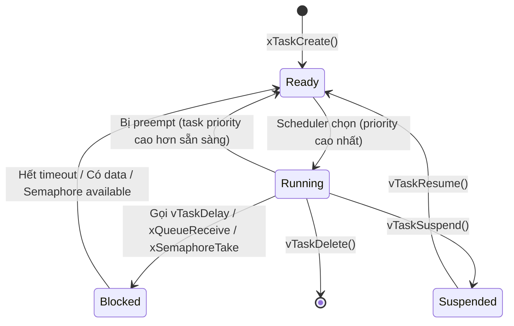
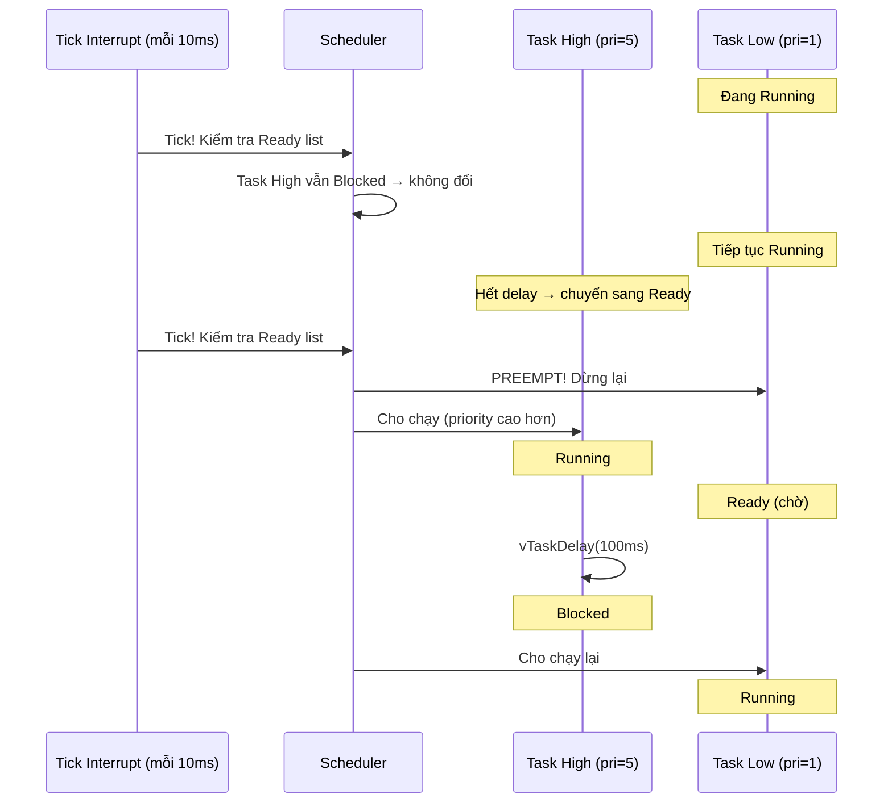
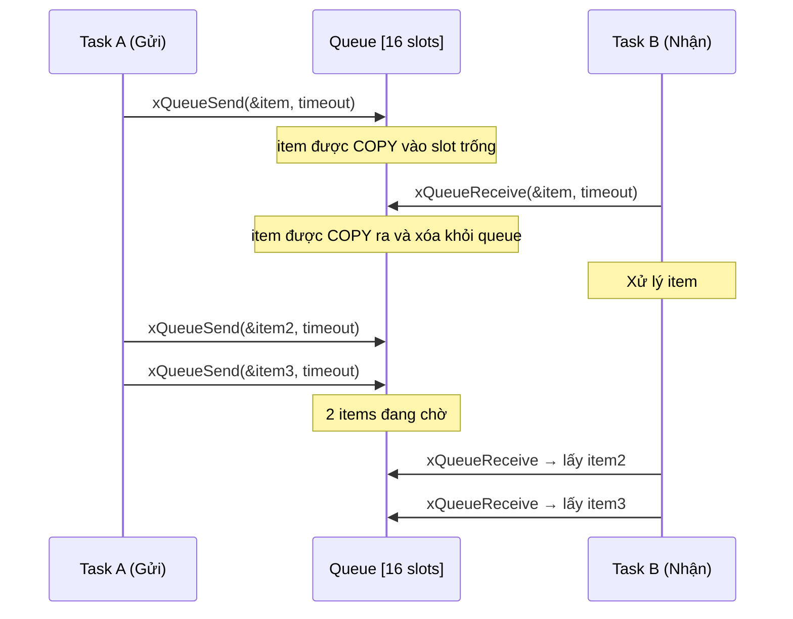
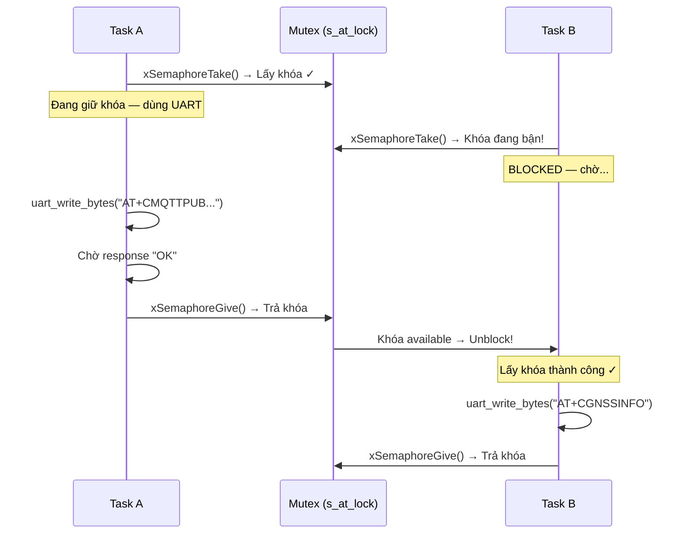
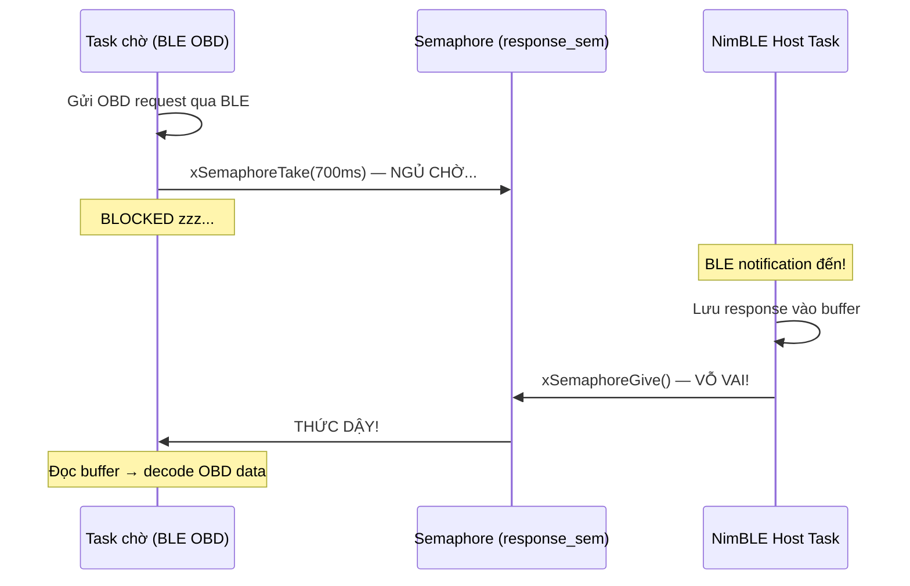
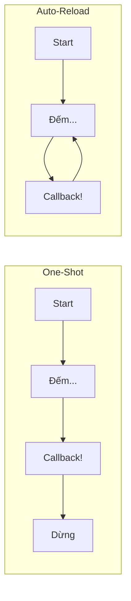
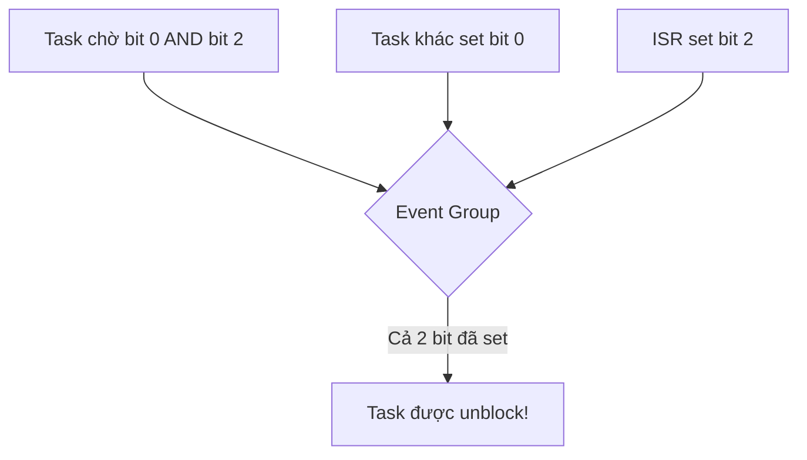
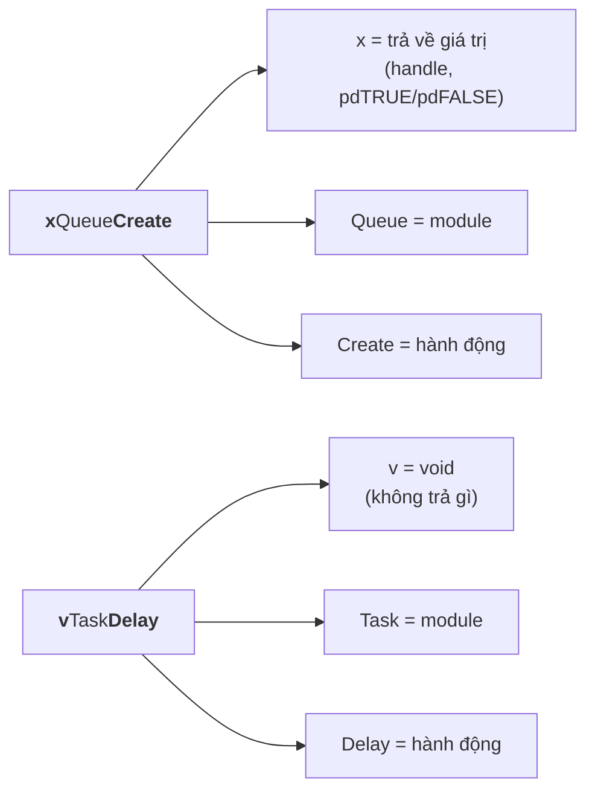

# 01 - FreeRTOS Fundamentals

> Tài liệu nền tảng về FreeRTOS — hệ điều hành thời gian thực được sử dụng trong project firmware.
> Mỗi khái niệm có sơ đồ Mermaid + giải thích + code mẫu từ project.

---

## Mục lục

1. [FreeRTOS là gì?](#1-freertos-là-gì)
2. [Task (Tác vụ)](#2-task-tác-vụ)
3. [Scheduler (Bộ lập lịch)](#3-scheduler-bộ-lập-lịch)
4. [Queue (Hàng đợi)](#4-queue-hàng-đợi)
5. [Mutex (Khóa loại trừ)](#5-mutex-khóa-loại-trừ)
6. [Semaphore (Cờ hiệu)](#6-semaphore-cờ-hiệu)
7. [Timer (Bộ hẹn giờ)](#7-timer-bộ-hẹn-giờ)
8. [Event Group](#8-event-group)
9. [Task Notification](#9-task-notification)
10. [Quy tắc đặt tên API](#10-quy-tắc-đặt-tên-api)
11. [Bảng tra cứu nhanh](#11-bảng-tra-cứu-nhanh)

---

## 1. FreeRTOS là gì?

FreeRTOS là một hệ điều hành thời gian thực (Real-Time Operating System) nhỏ gọn,
chạy trên vi điều khiển. Nó cung cấp:

- **Đa nhiệm**: Chạy nhiều task "song song" trên 1 CPU (hoặc 2 CPU với ESP32)
- **Lập lịch**: Tự động chuyển đổi giữa các task theo priority
- **Đồng bộ**: Queue, Mutex, Semaphore để các task giao tiếp an toàn
- **Quản lý thời gian**: Delay, Timer, Timeout

ESP-IDF (framework của ESP32) tích hợp sẵn FreeRTOS, nên mọi firmware ESP32
đều chạy trên FreeRTOS.

---

## 2. Task (Tác vụ)

### Khái niệm

Task là đơn vị thực thi cơ bản — giống "thread" trong OS thông thường.
Mỗi task có:
- **Stack riêng**: Vùng nhớ riêng cho biến local, call stack
- **Priority**: Số ưu tiên (cao hơn = được chạy trước)
- **State**: Trạng thái hiện tại (Running, Ready, Blocked, Suspended)

### Vòng đời Task



**Giải thích từng trạng thái:**

| Trạng thái | Ý nghĩa | Ví dụ |
|------------|---------|-------|
| **Ready** | Sẵn sàng chạy, đang chờ scheduler chọn | Task vừa được tạo, hoặc vừa hết delay |
| **Running** | Đang thực thi trên CPU | Chỉ có 1 task Running trên mỗi core |
| **Blocked** | Đang chờ một sự kiện (timeout, data, semaphore) | `vTaskDelay(100ms)` — chờ 100ms |
| **Suspended** | Bị tạm dừng bởi code, không tự thức | Ít dùng trong project này |

### Tạo Task — Code mẫu từ project

```c
// File: state_obd_runtime.c
// Tạo task tạm thời để kết nối BLE (vì mất ~8 giây, không thể block FSM)

xTaskCreate(
    state_machine_ble_connect_task,    // Hàm task sẽ chạy
    "ble_obd_conn",                    // Tên (dùng để debug)
    TRACKER_BLE_CONNECT_TASK_STACK_BYTES, // Stack: 8192 bytes
    task_args,                         // Tham số truyền vào task
    5,                                 // Priority: 5
    NULL                               // Task handle (không cần lưu)
);
```

**Giải thích từng tham số:**
- `state_machine_ble_connect_task`: Con trỏ hàm — hàm này sẽ chạy như "main" của task
- `"ble_obd_conn"`: Tên hiển thị khi debug (tối đa 16 ký tự)
- `8192`: Mỗi task cần stack riêng. 8KB đủ cho BLE + ELM327 init
- `task_args`: Dữ liệu truyền vào (preferred MAC, timestamp...)
- `5`: Priority — cao hơn FSM main (priority 1) để được ưu tiên
- `NULL`: Không cần lưu handle vì task tự hủy khi xong

### Task tự hủy

```c
// File: state_obd_runtime.c
static void state_machine_ble_connect_task(void *arg) {
    // ... làm việc (connect BLE, init ELM327) ...
    
    // Gửi kết quả qua queue
    xQueueOverwrite(s_ble_connect_result_queue, &result);
    
    // Tự xóa chính mình — giải phóng stack, scheduler không gọi nữa
    vTaskDelete(NULL);  // NULL = xóa task hiện tại
}
```

---

## 3. Scheduler (Bộ lập lịch)

### Khái niệm

Scheduler quyết định task nào được chạy tại mỗi thời điểm.
FreeRTOS dùng **preemptive priority-based scheduling**:
- Task có priority CAO NHẤT trong trạng thái Ready sẽ được chạy
- Nếu task priority cao hơn trở thành Ready → task hiện tại bị DỪNG ngay lập tức (preemption)
- Nếu nhiều task cùng priority → round-robin (luân phiên mỗi tick)

### Cách scheduler hoạt động



**Giải thích:**
- Cứ mỗi 10ms (tick rate 100Hz), tick interrupt fire và scheduler kiểm tra
- Nếu có task priority cao hơn sẵn sàng → chuyển ngay (preemption)
- Task bị preempt không mất dữ liệu — register được lưu vào stack, sau này khôi phục

### Tick Rate trong project

```
CONFIG_FREERTOS_HZ=100  → 1 tick = 10ms
```

Nghĩa là scheduler kiểm tra mỗi 10ms. Macro `pdMS_TO_TICKS(ms)` chuyển đổi:
- `pdMS_TO_TICKS(100)` = 10 ticks
- `pdMS_TO_TICKS(1000)` = 100 ticks

### vTaskDelay — Nhường CPU

```c
// File: tracker-app-bootstrap.c
// Main loop nhường CPU 100ms mỗi iteration
vTaskDelay(pdMS_TO_TICKS(100));
```

Khi gọi `vTaskDelay`:
1. Task hiện tại chuyển sang **Blocked** (không chiếm CPU)
2. Scheduler cho task khác chạy (NimBLE, BLE connect...)
3. Sau 100ms, task chuyển lại **Ready**, chờ scheduler chọn

**Khác biệt với busy-wait:**
```c
// SAI — chiếm CPU 100%, task khác không được chạy:
uint64_t start = util_uptime_ms();
while (util_uptime_ms() - start < 100) { }

// ĐÚNG — nhường CPU, task khác chạy trong 100ms:
vTaskDelay(pdMS_TO_TICKS(100));
```

---

## 4. Queue (Hàng đợi)

### Khái niệm

Queue là kênh truyền dữ liệu an toàn giữa các task (hoặc giữa ISR và task).
Hoạt động theo FIFO (First In, First Out) — ai gửi trước thì được nhận trước.

### Cách hoạt động



**Đặc điểm quan trọng:**
- Dữ liệu được **COPY** vào queue (không phải pointer) → an toàn ngay cả khi biến gốc bị thay đổi
- Nếu queue đầy và gửi với timeout > 0 → task gửi bị block chờ có chỗ trống
- Nếu queue trống và nhận với timeout > 0 → task nhận bị block chờ có data

### Hai pattern trong project

**Pattern 1: Mailbox (queue 1 slot + overwrite)**

Dùng khi chỉ cần kết quả MỚI NHẤT, không cần lịch sử.

```c
// File: state_machine_core.c — Tạo mailbox
s_ble_connect_result_queue = xQueueCreate(1, sizeof(tracker_ble_connect_result_t));

// File: state_obd_runtime.c — BLE task ghi kết quả (luôn thành công)
xQueueOverwrite(s_ble_connect_result_queue, &result);

// File: state_obd_runtime.c — FSM đọc kết quả (non-blocking)
if (xQueueReceive(s_ble_connect_result_queue, &result, 0) == pdTRUE) {
    // Có kết quả! Xử lý...
}
```

**Pattern 2: Buffer queue (nhiều slot)**

Dùng khi cần đệm nhiều item, xử lý tuần tự.

```c
// File: command_handler.c — Queue 16 chỗ cho cloud commands
s_action_queue = xQueueCreate(16, sizeof(command_action_item_t));

// MQTT callback gửi command vào (timeout 100ms)
xQueueSendToBack(s_action_queue, &item, pdMS_TO_TICKS(100));

// FSM lấy ra xử lý (non-blocking)
if (xQueueReceive(s_action_queue, &item, 0) == pdTRUE) {
    // Xử lý command...
}
```

### Timeout patterns

```c
// Non-blocking: check rồi đi luôn (dùng trong FSM loop)
xQueueReceive(queue, &item, 0);

// Blocking có timeout: chờ tối đa 500ms
xQueueReceive(queue, &item, pdMS_TO_TICKS(500));

// Blocking vô hạn: chờ cho đến khi có data
xQueueReceive(queue, &item, portMAX_DELAY);
```

---

## 5. Mutex (Khóa loại trừ)

### Khái niệm

Mutex (Mutual Exclusion) bảo vệ tài nguyên dùng chung.
Chỉ 1 task được "giữ khóa" tại 1 thời điểm. Task khác muốn truy cập phải chờ.

### Cách hoạt động



**Tại sao cần mutex?**

Nếu không có mutex, 2 task gửi AT command cùng lúc:
```
Task A gửi: AT+CMQTTPUB=0,"/topic",1,0
Task B gửi: AT+CGNSSINFO
Modem nhận: AT+CMQAT+CGNSSTTPUB=INFO0,"/topic",1,0  ← LỖI!
```

### Code mẫu từ project

```c
// File: modem_at.c — Tạo mutex
s_at_lock = xSemaphoreCreateMutex();

// File: modem_at.c — Sử dụng mutex
esp_err_t modem_at_send(const char *cmd, char *response, size_t resp_len, uint32_t timeout_ms) {
    // Lấy khóa — chờ tối đa timeout_ms
    if (xSemaphoreTake(s_at_lock, pdMS_TO_TICKS(timeout_ms)) != pdTRUE) {
        return ESP_ERR_TIMEOUT;  // Không lấy được khóa → báo lỗi
    }

    // === CRITICAL SECTION — chỉ 1 task vào đây ===
    uart_write_bytes(MODEM_UART_NUM, cmd, strlen(cmd));
    err = modem_at_collect_response_until(response, resp_len, timeout_ms, false);
    // === END CRITICAL SECTION ===

    xSemaphoreGive(s_at_lock);  // Trả khóa cho task khác dùng
    return err;
}
```

### Mutex vs Binary Semaphore

| Đặc điểm | Mutex | Binary Semaphore |
|-----------|-------|-----------------|
| Mục đích | Bảo vệ tài nguyên | Báo hiệu sự kiện |
| Ai give? | Cùng task đã take | Bất kỳ task/ISR nào |
| Priority inheritance | CÓ | KHÔNG |
| Dùng khi | "Chỉ 1 người dùng UART" | "Có response rồi!" |

**Priority Inheritance**: Nếu Task Low giữ mutex mà Task High cần → Task Low được tạm nâng priority lên bằng Task High để hoàn thành nhanh hơn. Tránh tình trạng Task Medium chạy xen vào block cả hai (priority inversion).

---

## 6. Semaphore (Cờ hiệu)

### Khái niệm

Semaphore dùng để **báo hiệu sự kiện** giữa các task hoặc giữa ISR và task.
Khác mutex: không cần cùng task give và take.

### Binary Semaphore — "Vỗ vai"



**Giải thích:**
- Task chờ gọi `xSemaphoreTake` → ngủ (không chiếm CPU)
- Khi sự kiện xảy ra, task khác (hoặc ISR) gọi `xSemaphoreGive` → đánh thức
- Nếu hết timeout mà không ai give → trả về pdFALSE (timeout)

### Code mẫu từ project

```c
// File: ble_init.c — Semaphore báo NimBLE task đã thoát
s_ble_stop_sem = xSemaphoreCreateBinary();

// NimBLE task — trước khi tự hủy, báo "tôi xong rồi"
static void ble_task(void *param) {
    nimble_port_run();  // Block cho đến khi stop
    
    xSemaphoreGive(s_ble_stop_sem);  // Báo hiệu: "Tôi đã dừng!"
    vTaskDelete(NULL);
}

// FSM task — chờ NimBLE task thoát trước khi tiếp tục shutdown
esp_err_t ble_stack_deinit(void) {
    nimble_port_stop();  // Yêu cầu NimBLE dừng
    
    // Chờ tối đa 2 giây cho NimBLE task xác nhận đã thoát
    if (xSemaphoreTake(s_ble_stop_sem, pdMS_TO_TICKS(2000)) != pdTRUE) {
        return ESP_ERR_TIMEOUT;  // NimBLE task không thoát → lỗi
    }
    
    nimble_port_deinit();  // An toàn để free resources
    return ESP_OK;
}
```

### Counting Semaphore

Giá trị từ 0 đến N. Mỗi lần give → tăng 1. Mỗi lần take → giảm 1.
Dùng khi có N tài nguyên giống nhau (ví dụ: 3 UART port, ai cần thì lấy 1).

Project này **không dùng** counting semaphore — chỉ dùng binary semaphore và mutex.

---

## 7. Timer (Bộ hẹn giờ)

### Khái niệm

FreeRTOS Software Timer cho phép gọi callback function sau khoảng thời gian nhất định,
mà không cần tạo task riêng.

### Hai loại timer



**Project này KHÔNG dùng FreeRTOS timer trực tiếp.** Thay vào đó, mọi timing đều dùng
pattern polling trong FSM loop:

```c
// Thay vì timer callback, project dùng:
uint64_t now_ms = util_uptime_ms();
if (now_ms - s_last_obd_poll_ms >= TRACKER_OBD_POLL_INTERVAL_MS) {
    state_machine_poll_obd();
    s_last_obd_poll_ms = now_ms;
}
```

**Tại sao không dùng timer?** Vì timer callback chạy trên timer daemon task (context khác),
gây thêm complexity về thread safety. Polling trong FSM loop đơn giản hơn và đủ chính xác
với resolution 100ms.

---

## 8. Event Group

### Khái niệm

Event Group cho phép task chờ **nhiều sự kiện cùng lúc** (AND/OR logic).
Mỗi event là 1 bit trong bitmask.



**Project này KHÔNG dùng Event Group.** FSM loop đã đủ để kiểm tra nhiều điều kiện
mỗi 100ms mà không cần cơ chế phức tạp hơn.

---

## 9. Task Notification

### Khái niệm

Task Notification là cơ chế nhẹ nhất để giao tiếp 1-1 giữa 2 task.
Nhanh hơn queue/semaphore vì không cần tạo object riêng — mỗi task có sẵn 1 notification value.

```c
// Task A gửi notification cho Task B
xTaskNotifyGive(taskB_handle);

// Task B chờ notification
ulTaskNotifyTake(pdTRUE, portMAX_DELAY);
```

**Project này KHÔNG dùng Task Notification** — dùng queue và semaphore cho rõ ràng hơn.

---

## 10. Quy tắc đặt tên API

FreeRTOS dùng **Hungarian Notation** — tiền tố cho biết kiểu trả về:

### Công thức đọc tên hàm



### Bảng tiền tố

| Tiền tố | Kiểu trả về | Ví dụ |
|---------|-------------|-------|
| `x` | BaseType_t, Handle, hoặc struct FreeRTOS | `xTaskCreate`, `xQueueReceive` |
| `v` | void (không trả gì) | `vTaskDelay`, `vTaskDelete` |
| `pd` | Macro/constant (port-defined) | `pdTRUE`, `pdMS_TO_TICKS` |
| `p` | Pointer | `pcTaskGetName` |
| `ux` | unsigned int | `uxTaskGetStackHighWaterMark` |
| `e` | enum | `eTaskGetState` |
| `prv` | private (static, nội bộ) | `prvIdleTask` |

### Hậu tố đặc biệt

| Hậu tố | Ý nghĩa | Khi nào dùng |
|--------|---------|-------------|
| `FromISR` | Phiên bản an toàn cho interrupt | Gọi trong ISR handler |
| (không có) | Phiên bản thường | Gọi từ task context |

```c
// Trong task bình thường:
xQueueSend(queue, &data, timeout);

// Trong ISR (interrupt handler) — PHẢI dùng FromISR:
xQueueSendFromISR(queue, &data, &xHigherPriorityTaskWoken);
portYIELD_FROM_ISR(xHigherPriorityTaskWoken);
```

### Mẹo đoán API

Muốn làm gì? → Ghép: `<kiểu trả về>` + `<Module>` + `<Hành động>` + `[FromISR]`

| Muốn làm | Đoán | Đúng? |
|----------|------|-------|
| Tạo queue | trả handle → `xQueueCreate` | ✓ |
| Xóa task | void → `vTaskDelete` | ✓ |
| Gửi queue từ ISR | trả BaseType → `xQueueSendFromISR` | ✓ |
| Đọc tên task | trả pointer char → `pcTaskGetName` | ✓ |

---

## 11. Bảng tra cứu nhanh

### Hằng số thường dùng

| Hằng số | Giá trị | Ý nghĩa |
|---------|---------|---------|
| `pdTRUE` | 1 | Thành công |
| `pdFALSE` | 0 | Thất bại |
| `pdPASS` | 1 | Task tạo thành công |
| `pdFAIL` | 0 | Task tạo thất bại |
| `portMAX_DELAY` | 0xFFFFFFFF | Chờ vô hạn |
| `0` | 0 | Không chờ (non-blocking) |

### API theo module

**Task:**
| API | Mô tả |
|-----|--------|
| `xTaskCreate(func, name, stack, arg, priority, handle)` | Tạo task |
| `xTaskCreatePinnedToCore(...)` | Tạo task gắn vào core cụ thể |
| `vTaskDelete(handle)` | Xóa task (NULL = xóa chính mình) |
| `vTaskDelay(ticks)` | Delay (block) N ticks |
| `vTaskSuspend(handle)` | Tạm dừng task |
| `vTaskResume(handle)` | Tiếp tục task |

**Queue:**
| API | Mô tả |
|-----|--------|
| `xQueueCreate(length, itemSize)` | Tạo queue |
| `xQueueSend(queue, &item, timeout)` | Gửi vào cuối |
| `xQueueSendToFront(queue, &item, timeout)` | Gửi vào đầu |
| `xQueueReceive(queue, &item, timeout)` | Lấy ra (xóa khỏi queue) |
| `xQueuePeek(queue, &item, timeout)` | Xem mà không xóa |
| `xQueueOverwrite(queue, &item)` | Ghi đè (queue 1 slot) |
| `xQueueReset(queue)` | Xóa toàn bộ items |
| `vQueueDelete(queue)` | Hủy queue |

**Mutex / Semaphore:**
| API | Mô tả |
|-----|--------|
| `xSemaphoreCreateMutex()` | Tạo mutex |
| `xSemaphoreCreateBinary()` | Tạo binary semaphore |
| `xSemaphoreTake(sem, timeout)` | Lấy (lock / chờ signal) |
| `xSemaphoreGive(sem)` | Trả (unlock / gửi signal) |
| `vSemaphoreDelete(sem)` | Hủy |

---

> **Tiếp theo:** [02-freertos-in-project.md](./02-freertos-in-project.md) — Cách FreeRTOS được áp dụng cụ thể trong project firmware
