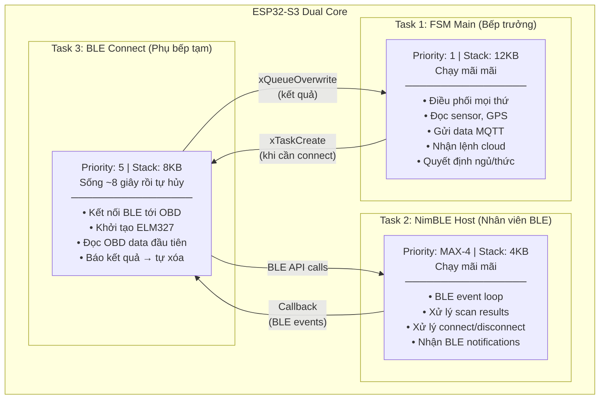
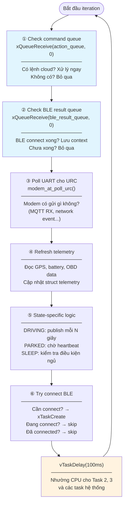
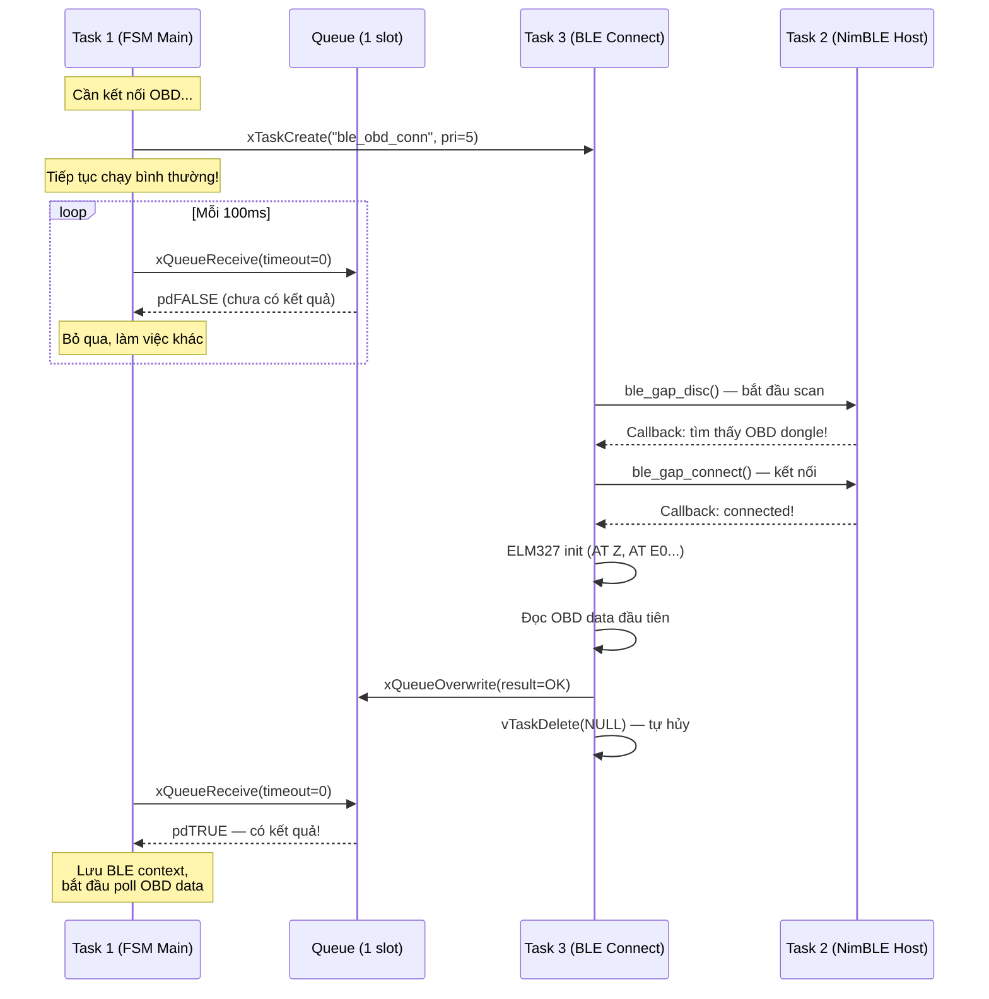
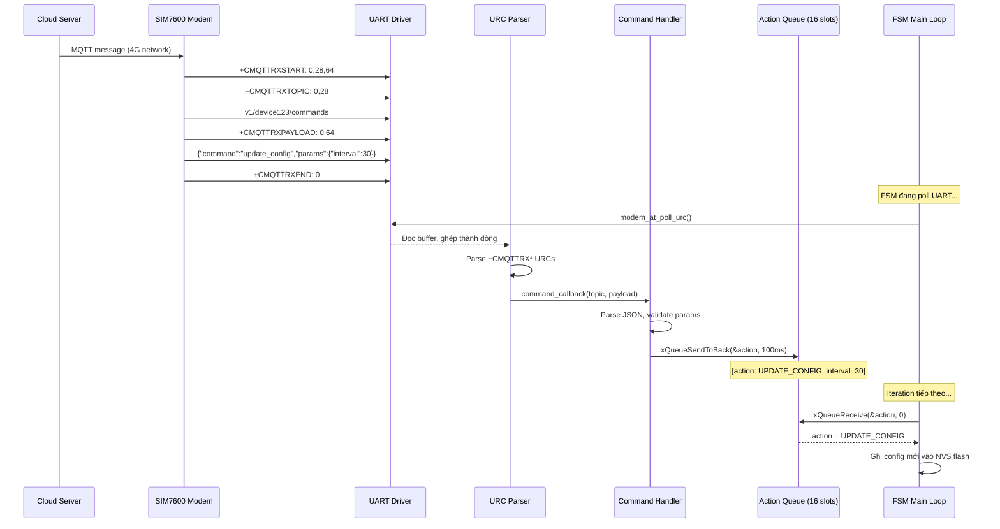
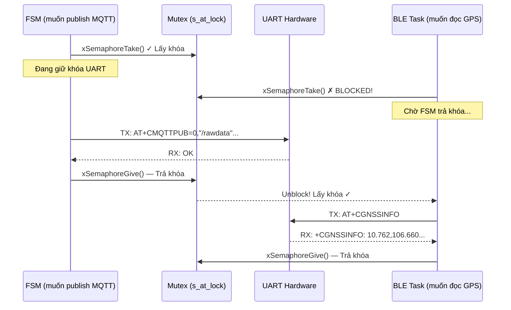
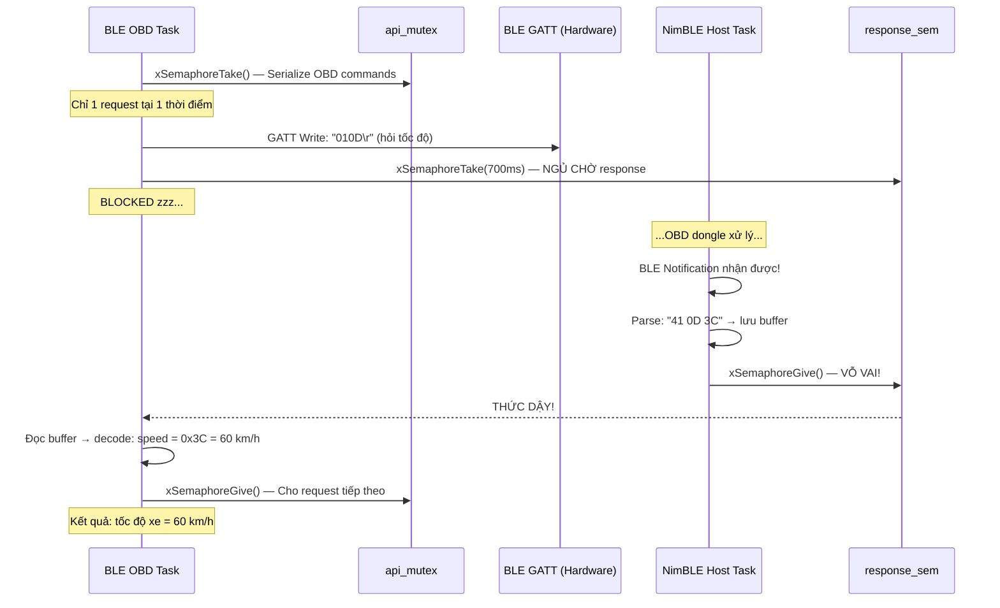
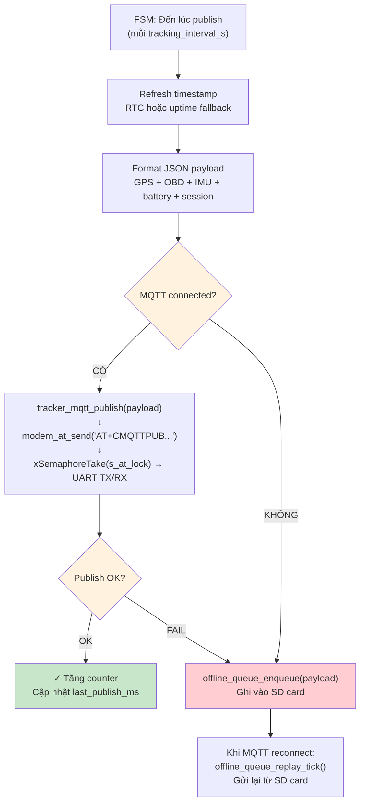
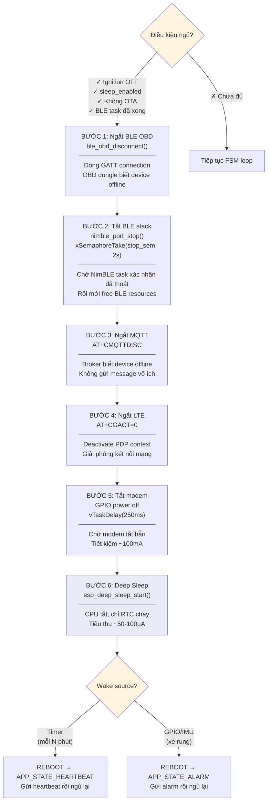
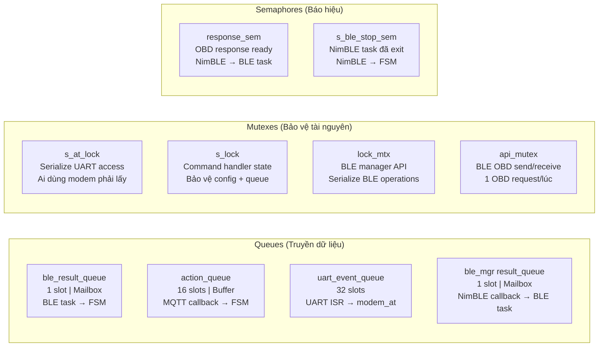

# 02 - FreeRTOS trong Project

> Cách FreeRTOS được áp dụng cụ thể trong firmware IoT Vehicle Tracking System.
> Sơ đồ Mermaid + giải thích chi tiết từng luồng tương tác giữa các task.

---

## Mục lục

1. [Tổng quan kiến trúc task](#1-tổng-quan-kiến-trúc-task)
2. [Vòng lặp FSM chính](#2-vòng-lặp-fsm-chính)
3. [Luồng 1: BLE Connect (Async Task)](#3-luồng-1-ble-connect)
4. [Luồng 2: Cloud Command → FSM](#4-luồng-2-cloud-command--fsm)
5. [Luồng 3: Modem UART Serialization](#5-luồng-3-modem-uart-serialization)
6. [Luồng 4: OBD Request/Response](#6-luồng-4-obd-requestresponse)
7. [Luồng 5: Publish Pipeline](#7-luồng-5-publish-pipeline)
8. [Luồng 6: Sleep Coordination](#8-luồng-6-sleep-coordination)
9. [Tổng kết cơ chế đồng bộ](#9-tổng-kết-cơ-chế-đồng-bộ)

---

## 1. Tổng quan kiến trúc task

Project chỉ có **3 task** chạy đồng thời. Đây là lựa chọn thiết kế có chủ đích
để giảm complexity và tránh race condition.



**Giải thích:**
- **Task 1 (FSM Main)** là "ông chủ" — mọi quyết định đều đi qua đây
- **Task 2 (NimBLE Host)** chạy ngầm, chỉ xử lý tín hiệu BLE ở tầng thấp
- **Task 3 (BLE Connect)** là worker tạm thời — được tạo khi cần, tự hủy khi xong

**Tại sao chỉ 3 task?**
- Ít task = ít race condition = ít bug khó debug
- Tiết kiệm RAM (mỗi task cần 4-12KB stack)
- FSM cooperative loop đủ nhanh (100ms/iteration) cho mọi tác vụ
- Chỉ BLE connect thực sự cần task riêng vì nó blocking 8 giây

---

## 2. Vòng lặp FSM chính

Task 1 chạy vòng lặp vô hạn. Mỗi iteration = 1 bước FSM + yield 100ms.



**Giải thích:**
- Mỗi bước đều dùng `timeout=0` (non-blocking) — FSM chỉ "liếc nhìn", không đứng chờ
- Nếu chưa có data/event → bỏ qua ngay, đi bước tiếp
- `vTaskDelay(100ms)` ở cuối nhường CPU cho các task khác và tiết kiệm điện
- Toàn bộ 1 iteration mất < 10ms (trừ khi publish MQTT qua AT command)

---

## 3. Luồng 1: BLE Connect

Đây là ví dụ kinh điển về pattern **"offload blocking work to ephemeral task"**.

**Vấn đề:** Kết nối BLE + khởi tạo ELM327 mất ~8 giây. Nếu FSM main làm trực tiếp,
nó sẽ bị "đơ" 8 giây — không thể đọc GPS, nhận lệnh cloud, hay làm bất cứ gì.

**Giải pháp:** Tạo task tạm thời làm việc blocking, FSM tiếp tục chạy bình thường,
kết quả trả về qua queue.



**Giải thích từng bước:**

1. FSM kiểm tra: cần connect BLE không? (chưa connected, retry backoff hết, không đang OTA)
2. Nếu cần → `xTaskCreate` tạo Task 3 với tham số (preferred MAC, timestamp)
3. FSM **không chờ** — tiếp tục vòng lặp 100ms bình thường
4. Task 3 chạy song song: scan BLE → connect → init ELM327 → đọc data
5. Task 3 xong → ghi kết quả vào queue 1-slot bằng `xQueueOverwrite` (luôn thành công)
6. Task 3 tự hủy bằng `vTaskDelete(NULL)`
7. FSM ở iteration tiếp theo: `xQueueReceive` thấy có data → xử lý kết quả

**Tại sao dùng `xQueueOverwrite` thay vì `xQueueSend`?**
- Queue chỉ có 1 slot
- `xQueueSend` sẽ FAIL nếu queue đầy (slot cũ chưa được đọc)
- `xQueueOverwrite` ghi đè giá trị cũ → luôn thành công
- Ở đây chỉ cần kết quả mới nhất, không cần lịch sử

---

## 4. Luồng 2: Cloud Command → FSM

Khi server gửi lệnh xuống thiết bị (update config, OTA, reboot...),
dữ liệu đi qua nhiều layer trước khi FSM xử lý.



**Giải thích:**

1. **Cloud → Modem**: Server publish MQTT message, modem SIM7600 nhận qua 4G
2. **Modem → UART**: Modem gửi URC (Unsolicited Result Code) qua UART — đây là cách modem "nói" với ESP32
3. **UART → URC Parser**: FSM gọi `modem_at_poll_urc()` mỗi iteration, đọc UART buffer và parse các dòng `+CMQTTRX*`
4. **URC Parser → Command Handler**: Khi message hoàn chỉnh, gọi callback đã đăng ký
5. **Command Handler → Queue**: Parse JSON, validate, đóng gói thành action item, đẩy vào queue
6. **Queue → FSM**: FSM lấy action ra (non-blocking) và thực thi (ghi NVS, OTA, reboot...)

**Tại sao cần queue 16 chỗ?**
- Server có thể gửi burst nhiều lệnh liên tiếp
- FSM xử lý 1 lệnh/iteration (mỗi 100ms)
- Queue đệm lại để không mất lệnh
- Nếu queue đầy → lệnh mới bị drop, đếm `s_dropped_command_count`

**Tại sao cần mutex (`s_lock`) trong command handler?**
- URC parsing và FSM consume có thể truy cập `s_action_queue` "gần như cùng lúc"
- Mutex đảm bảo không ai đọc struct đang bị ghi dở

---

## 5. Luồng 3: Modem UART Serialization

Modem SIM7600 giao tiếp qua 1 đường UART duy nhất. Nhiều chức năng cần dùng
(MQTT publish, GPS read, LTE status...) nhưng chỉ 1 lệnh AT được gửi tại 1 thời điểm.



**Giải thích:**

Mutex `s_at_lock` hoạt động như chìa khóa phòng tắm — chỉ 1 người vào 1 lúc:

1. FSM muốn publish MQTT → lấy mutex → thành công → gửi AT command
2. Trong lúc đó, nếu task khác muốn dùng UART → lấy mutex → FAIL → phải chờ
3. FSM xong → trả mutex → task đang chờ được unblock → lấy mutex → dùng UART

**Nếu không có mutex:**
```
FSM gửi:  AT+CMQTTPUB=0,"/rawdata",1,0
BLE gửi:  AT+CGNSSINFO
Modem nhận: AT+CMQAT+CGNSSTTPUB=INFO0,"/rawdata"  ← GARBAGE!
```

**Điểm đặc biệt:** Trong khi chờ response từ modem, code vẫn parse URC inline.
Nghĩa là nếu modem gửi `+CMQTTRXSTART` (MQTT message đến) trong lúc đang chờ "OK"
cho lệnh publish, URC vẫn được xử lý ngay — không bị mất.

---

## 6. Luồng 4: OBD Request/Response

Đọc dữ liệu OBD (tốc độ, RPM, nhiệt độ...) qua BLE dùng pattern semaphore signaling.



**Giải thích:**

Đây là pattern **request-response qua 2 task khác nhau**:

1. **api_mutex**: Đảm bảo chỉ 1 OBD request tại 1 thời điểm (vì OBD dongle chỉ xử lý 1 lệnh/lúc)
2. **GATT Write**: Gửi OBD PID request qua BLE (non-blocking — chỉ đẩy data vào BLE stack)
3. **response_sem Take**: Task ngủ chờ response — tiết kiệm CPU, không busy-wait
4. **NimBLE callback**: Khi OBD dongle trả lời, BLE notification đến → NimBLE task xử lý
5. **response_sem Give**: NimBLE task "vỗ vai" → OBD task thức dậy
6. **Decode**: Đọc buffer đã được NimBLE task điền sẵn

**Tại sao dùng semaphore thay vì queue?**
- Không cần truyền data qua semaphore — data đã nằm trong shared buffer
- Semaphore chỉ báo "có rồi!" — nhẹ hơn queue
- Pattern này gọi là **"producer-consumer with shared buffer"**

---

## 7. Luồng 5: Publish Pipeline

Dữ liệu telemetry đi từ sensor → JSON → MQTT → cloud (hoặc SD card nếu offline).



**Giải thích:**

1. **Trigger**: FSM kiểm tra `(now - last_publish) >= tracking_interval` → đến lúc gửi
2. **Timestamp**: Lấy thời gian từ RTC (nếu valid) hoặc uptime (fallback)
3. **Format**: Build JSON chứa tất cả telemetry data + metadata (message_id, seq_no, boot_id)
4. **Publish**: Gửi qua MQTT (dùng AT command qua UART — cần mutex `s_at_lock`)
5. **Fallback**: Nếu MQTT fail hoặc offline → lưu vào SD card
6. **Replay**: Khi online lại, FSM gọi `offline_queue_replay_tick()` gửi lại data cũ

**Điểm quan trọng:** Cùng 1 payload được dùng cho cả live publish và offline storage.
Không format lại — đảm bảo cloud nhận data giống hệt nhau dù gửi trực tiếp hay replay.

---

## 8. Luồng 6: Sleep Coordination

Trước khi ESP32 ngủ, phải tắt mọi thứ theo đúng thứ tự.
Nếu tắt sai thứ tự → crash hoặc resource leak.



**Giải thích thứ tự shutdown:**

Phải tắt từ **tầng cao → tầng thấp** (application → protocol → transport → hardware):

| Bước | Tại sao phải theo thứ tự này? |
|------|-------------------------------|
| 1. BLE OBD | Nếu tắt BLE stack trước → disconnect callback crash |
| 2. BLE stack | Dùng semaphore chờ NimBLE task exit → an toàn free memory |
| 3. MQTT | Nếu tắt LTE trước → MQTT disconnect packet không gửi được |
| 4. LTE | Nếu tắt modem trước → LTE deactivate command không gửi được |
| 5. Modem power | Tốn điện nhất (~100mA), phải tắt cuối cùng |
| 6. Deep sleep | Mọi thứ đã tắt → an toàn ngủ |

**Semaphore trong bước 2:**
```c
nimble_port_stop();  // Yêu cầu NimBLE task dừng
// NimBLE task: dọn dẹp → xSemaphoreGive(stop_sem) → vTaskDelete(NULL)
xSemaphoreTake(stop_sem, 2000ms);  // FSM chờ xác nhận
// Đến đây chắc chắn NimBLE task đã thoát → an toàn free resources
```

---

## 9. Tổng kết cơ chế đồng bộ



### Bảng tổng hợp: Ai nói chuyện với ai?

| Nguồn (Producer) | Đích (Consumer) | Cơ chế | Dữ liệu | Blocking? |
|-------------------|-----------------|--------|----------|-----------|
| BLE Connect task | FSM main | Queue 1-slot | Kết quả connect | FSM: non-blocking |
| MQTT URC parser | FSM main | Queue 16-slot | Cloud commands | FSM: non-blocking |
| NimBLE callback | BLE Connect task | Queue 1-slot | Scan/connect status | BLE: blocking wait |
| NimBLE notify | BLE OBD task | Binary semaphore | "Response ready!" | BLE: blocking 700ms |
| NimBLE host task | FSM (khi shutdown) | Binary semaphore | "Task đã exit!" | FSM: blocking 2000ms |
| Bất kỳ task | Modem UART | Mutex | AT command access | Blocking (timeout) |
| MQTT callback | Command state | Mutex | Config/action data | Blocking 250ms |

### Nguyên tắc thiết kế

| Nguyên tắc | Giải thích |
|-------------|-----------|
| **Single-writer** | Chỉ FSM task ghi runtime state. Nguồn khác "đề xuất" qua queue |
| **Never block FSM** | Main loop luôn dùng timeout=0. Blocking work → task riêng |
| **Mailbox cho 1:1** | Queue 1-slot + overwrite khi chỉ cần kết quả mới nhất |
| **Mutex cho hardware** | UART chỉ có 1 bus → mutex serialize mọi access |
| **Semaphore cho signal** | Khi cần "đợi event" mà không truyền data |
| **Ordered teardown** | Tắt từ trên xuống, dùng semaphore xác nhận task đã exit |

---

> **Tiếp theo:** [03-esp-idf-essentials.md](./03-esp-idf-essentials.md) — ESP-IDF framework cơ bản
