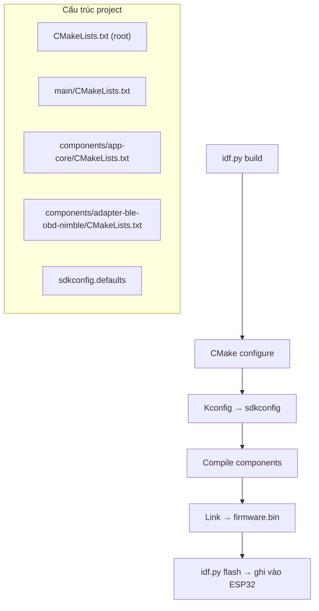
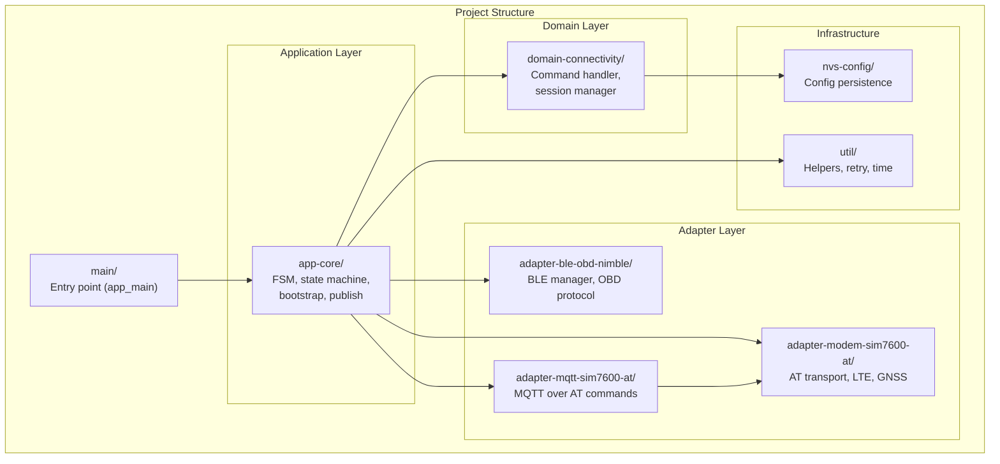
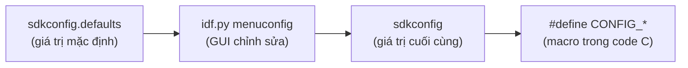
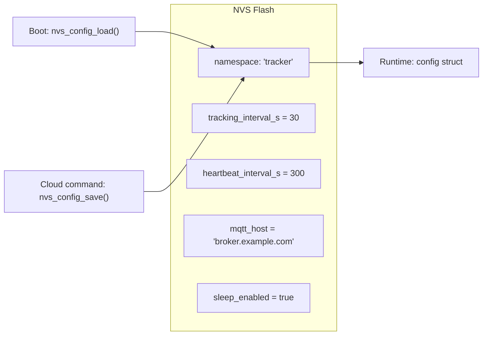
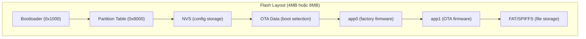
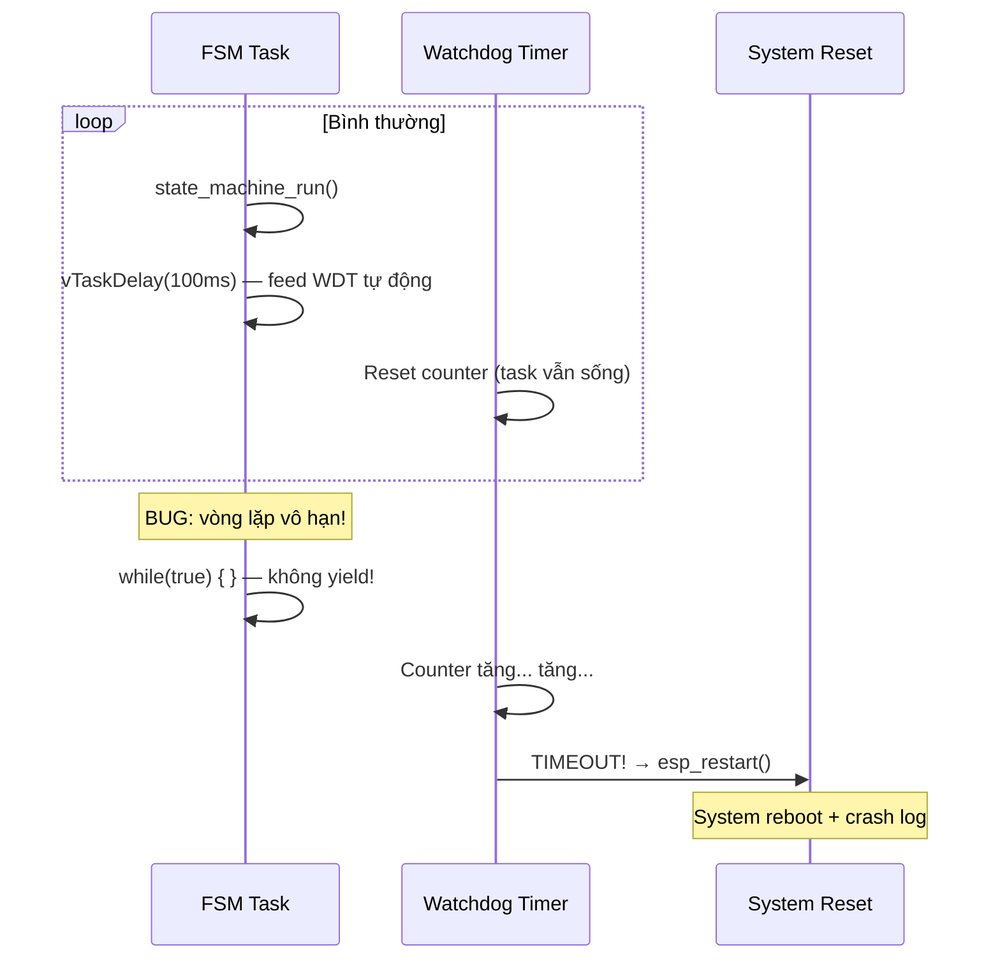

# 03 - ESP-IDF Essentials

> ESP-IDF (Espressif IoT Development Framework) là framework chính thức cho ESP32.
> Tài liệu này cover các thành phần cốt lõi được dùng trong project.

---

## Mục lục

1. [ESP-IDF là gì?](#1-esp-idf-là-gì)
2. [Build System (CMake)](#2-build-system-cmake)
3. [Component Architecture](#3-component-architecture)
4. [Kconfig — Cấu hình compile-time](#4-kconfig--cấu-hình-compile-time)
5. [ESP Logging](#5-esp-logging)
6. [Error Handling](#6-error-handling)
7. [NVS Flash — Lưu trữ cấu hình](#7-nvs-flash--lưu-trữ-cấu-hình)
8. [Partition Table](#8-partition-table)
9. [Task Watchdog](#9-task-watchdog)

---

## 1. ESP-IDF là gì?

ESP-IDF là framework phát triển firmware cho chip ESP32 của Espressif.
Nó bao gồm:
- FreeRTOS (đã tích hợp sẵn)
- Driver cho mọi peripheral (UART, SPI, I2C, GPIO, ADC...)
- Network stack (WiFi, BLE, TCP/IP)
- Build system (CMake + Kconfig)
- Bootloader + OTA support

Project này dùng ESP-IDF v5.x với target ESP32-S3.

---

## 2. Build System (CMake)



**Các lệnh thường dùng:**

| Lệnh | Mô tả |
|-------|--------|
| `idf.py set-target esp32s3` | Chọn chip target |
| `idf.py menuconfig` | Mở GUI cấu hình (Kconfig) |
| `idf.py build` | Compile toàn bộ project |
| `idf.py flash` | Ghi firmware vào chip |
| `idf.py monitor` | Xem UART log output |
| `idf.py flash monitor` | Flash rồi monitor luôn |

---

## 3. Component Architecture

ESP-IDF tổ chức code thành **components** — mỗi component là 1 module độc lập
với source, header, và dependencies riêng.



**Giải thích:**
- **main/**: Chỉ chứa `app_main()` — entry point, delegate mọi thứ cho app-core
- **app-core/**: "Bộ não" — FSM, state transitions, publish pipeline
- **domain-connectivity/**: Logic nghiệp vụ — parse commands, quản lý session
- **adapter-***: Giao tiếp hardware cụ thể — BLE, modem, MQTT
- **util/**: Helpers dùng chung — retry logic, string utils, time

**Mỗi component có cấu trúc:**
```
components/app-core/
├── CMakeLists.txt          ← Khai báo source files + dependencies
├── Kconfig                 ← Config options riêng (nếu có)
├── include/                ← Public headers (API cho component khác dùng)
│   ├── state_machine_core.h
│   └── state_runtime_context.h
└── src/                    ← Private implementation
    ├── state_machine_core.c
    ├── state_obd_runtime.c
    └── tracker-app-bootstrap.c
```

---

## 4. Kconfig — Cấu hình compile-time

Kconfig cho phép cấu hình firmware tại thời điểm compile (không phải runtime).
Giá trị được lưu trong `sdkconfig` và trở thành macro C.



**Ví dụ từ project:**

```
# sdkconfig.defaults
CONFIG_ESP_MAIN_TASK_STACK_SIZE=12288
CONFIG_FREERTOS_USE_TICKLESS_IDLE=y
CONFIG_BT_NIMBLE_ENABLED=y
CONFIG_TRACKER_SD_LOG_ENABLE=y
```

**Sử dụng trong code:**
```c
// Kiểm tra config tại compile-time
#if CONFIG_TRACKER_SD_LOG_ENABLE
    sd_log_write(payload);
#endif

// Dùng giá trị config
#define MAIN_STACK_SIZE CONFIG_ESP_MAIN_TASK_STACK_SIZE  // = 12288
```

---

## 5. ESP Logging

ESP-IDF cung cấp hệ thống log với 5 mức độ:

| Level | Macro | Khi nào dùng | Màu |
|-------|-------|-------------|-----|
| Error | `ESP_LOGE(TAG, ...)` | Lỗi nghiêm trọng, cần fix | Đỏ |
| Warning | `ESP_LOGW(TAG, ...)` | Bất thường nhưng xử lý được | Vàng |
| Info | `ESP_LOGI(TAG, ...)` | Thông tin quan trọng (boot, connect...) | Xanh lá |
| Debug | `ESP_LOGD(TAG, ...)` | Chi tiết cho developer | Không màu |
| Verbose | `ESP_LOGV(TAG, ...)` | Rất chi tiết (mỗi byte, mỗi packet) | Không màu |

**Cách dùng trong project:**
```c
static const char *TAG = "TRACKER_MAIN";  // Mỗi file có TAG riêng

ESP_LOGI(TAG, "event=boot_summary boot_count=%lu wakeup=%d initial_state=%d",
         (unsigned long)g_rtc_context.boot_count, (int)wakeup, (int)state);

ESP_LOGW(TAG, "event=retry_scheduled step=state_machine_init err=%s attempt=%lu",
         esp_err_to_name(err), (unsigned long)s_init_retry.attempts);

ESP_LOGE(TAG, "event=at_uart_init_failed err=%s", esp_err_to_name(err));
```

**Convention trong project:** Dùng format `event=<tên_sự_kiện> key=value` để log dễ parse.

---

## 6. Error Handling

ESP-IDF dùng `esp_err_t` (int) làm return type cho hầu hết API.
Kèm theo các macro helper để giảm boilerplate.

```c
// esp_err_t values:
ESP_OK              // 0 — thành công
ESP_FAIL            // -1 — lỗi chung
ESP_ERR_NO_MEM      // 0x101 — hết memory
ESP_ERR_INVALID_ARG // 0x102 — tham số sai
ESP_ERR_TIMEOUT     // 0x107 — hết thời gian chờ
```

**Macro helper (dùng nhiều trong project):**

```c
// Trả về ngay nếu pointer NULL
ESP_RETURN_ON_NULL(config, ESP_ERR_INVALID_ARG, TAG, "config is NULL");

// Trả về ngay nếu điều kiện FALSE
ESP_RETURN_ON_FALSE(s_lock != NULL, ESP_ERR_NO_MEM, TAG, "lock init failed");

// Chuyển esp_err_t thành string (cho log)
ESP_LOGI(TAG, "err=%s", esp_err_to_name(err));  // → "ESP_ERR_TIMEOUT"
```

**Pattern trong project:**
```c
esp_err_t command_handler_init(config_t *config) {
    ESP_RETURN_ON_NULL(config, ESP_ERR_INVALID_ARG, TAG, "config is NULL");
    
    s_lock = xSemaphoreCreateMutex();
    ESP_RETURN_ON_FALSE(s_lock != NULL, ESP_ERR_NO_MEM, TAG, "lock init failed");
    
    s_action_queue = xQueueCreate(16, sizeof(command_action_item_t));
    ESP_RETURN_ON_FALSE(s_action_queue != NULL, ESP_ERR_NO_MEM, TAG, "queue init failed");
    
    return ESP_OK;
}
```

---

## 7. NVS Flash — Lưu trữ cấu hình

NVS (Non-Volatile Storage) lưu key-value pairs vào flash.
Dữ liệu tồn tại qua reboot và deep sleep.



**Đặc điểm:**
- Wear-leveling tự động (flash có giới hạn write cycles)
- Atomic write (không bị corrupt nếu mất điện giữa chừng)
- Hỗ trợ: int, string, blob (binary data)

**Dùng trong project:**
- Load config khi boot (`nvs_config_load`)
- Save config khi nhận `update_config` command từ cloud
- Lưu OTA context để survive reboot

---

## 8. Partition Table

ESP32 flash được chia thành nhiều partition (phân vùng):



**OTA hoạt động:**
1. Firmware hiện tại chạy từ `app0`
2. Download firmware mới → ghi vào `app1`
3. Set boot partition = `app1` → reboot
4. Firmware mới chạy từ `app1`, confirm OK
5. Nếu fail → rollback về `app0`

---

## 9. Task Watchdog

Task Watchdog Timer (TWDT) phát hiện task bị "đơ" (không yield CPU quá lâu).



**Cấu hình trong project:**
```
CONFIG_ESP_TASK_WDT_EN=y
CONFIG_ESP_TASK_WDT_TIMEOUT_S=30  // 30 giây không yield → reset
```

**Field validation mode** nới lỏng watchdog vì OTA download có thể mất lâu:
```c
#if CONFIG_TRACKER_FIELD_VALIDATION_MODE && CONFIG_ESP_TASK_WDT_EN
    tracker_main_relax_task_wdt_for_field_validation();
#endif
```

---

> **Tiếp theo:** [04-peripheral-drivers.md](./04-peripheral-drivers.md) — UART, SPI, I2C, GPIO, ADC
