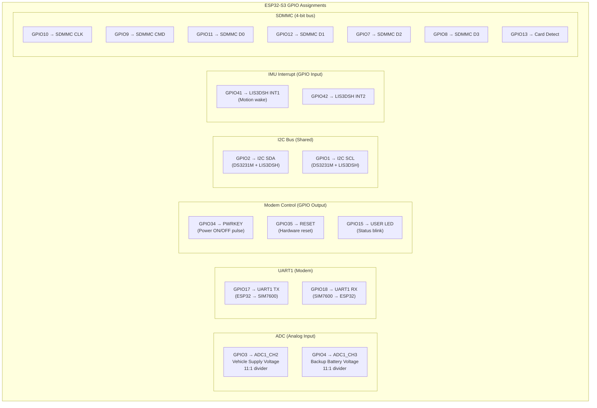
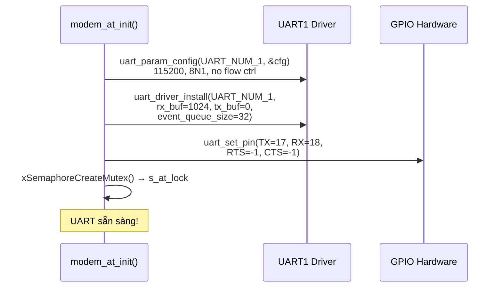
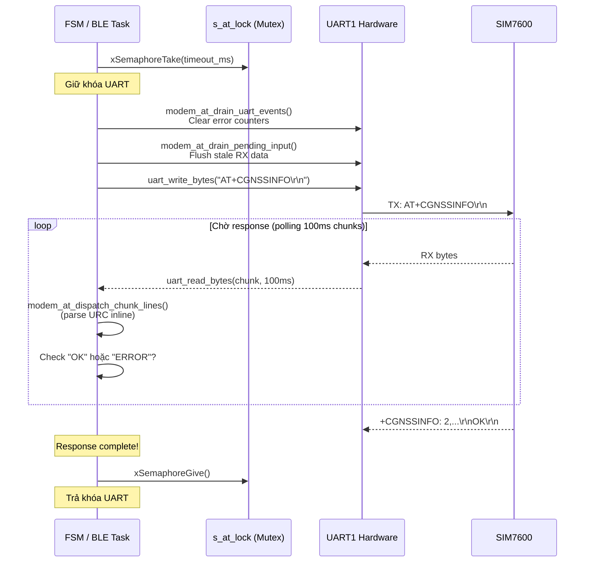
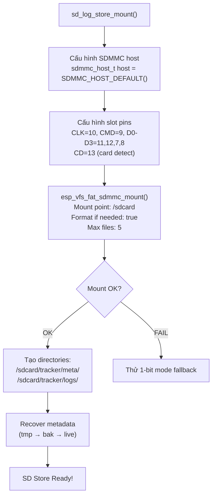
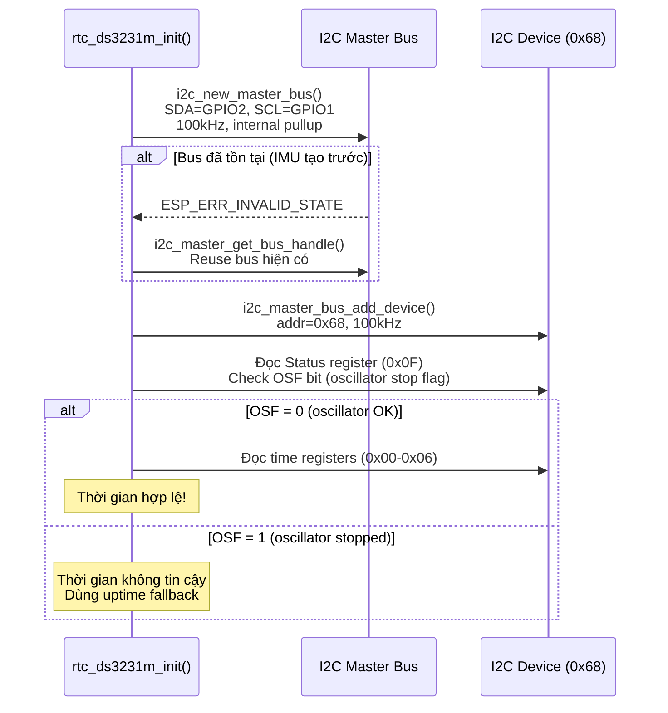
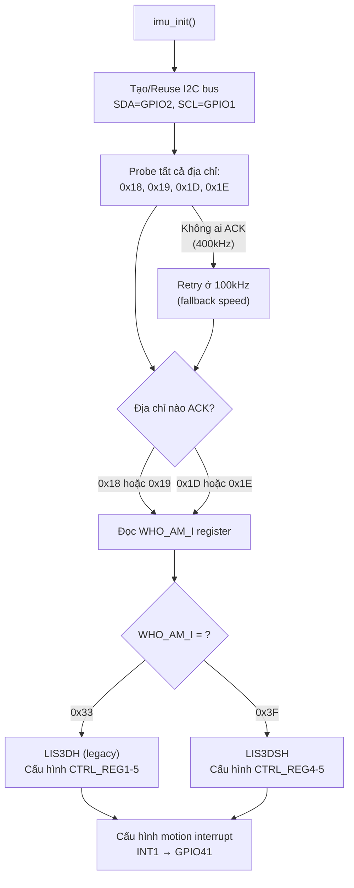
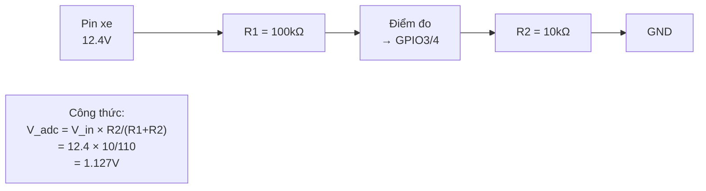
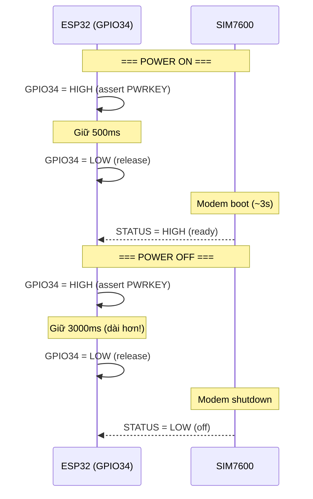

# 04 - Peripheral Drivers (Chi tiết)

> UART, SDMMC, I2C, GPIO, ADC — cách ESP32-S3 giao tiếp với hardware bên ngoài.
> Mỗi peripheral có sơ đồ kết nối, code thực tế từ project, giải thích chi tiết.

---

## Mục lục

1. [Pin Map tổng thể](#1-pin-map-tổng-thể)
2. [UART — Modem SIM7600](#2-uart--modem-sim7600)
3. [SDMMC — SD Card (Offline Queue)](#3-sdmmc--sd-card)
4. [I2C — RTC DS3231M](#4-i2c--rtc-ds3231m)
5. [I2C — IMU LIS3DSH](#5-i2c--imu-lis3dsh)
6. [ADC — Battery & Supply Voltage](#6-adc--battery--supply-voltage)
7. [GPIO — Power Manager (Modem Control)](#7-gpio--power-manager)

---

## 1. Pin Map tổng thể

> File: `components/platform-board-esp32s3/include/pin_map.h`



**Bảng tóm tắt pin:**

| GPIO | Chức năng | Peripheral | Hướng |
|------|-----------|-----------|-------|
| 1 | I2C SCL | I2C_NUM_0 | Bidirectional |
| 2 | I2C SDA | I2C_NUM_0 | Bidirectional |
| 3 | ADC Supply | ADC1_CH2 | Input (analog) |
| 4 | ADC Battery | ADC1_CH3 | Input (analog) |
| 7 | SDMMC D2 | SDMMC | Bidirectional |
| 8 | SDMMC D3 | SDMMC | Bidirectional |
| 9 | SDMMC CMD | SDMMC | Bidirectional |
| 10 | SDMMC CLK | SDMMC | Output |
| 11 | SDMMC D0 | SDMMC | Bidirectional |
| 12 | SDMMC D1 | SDMMC | Bidirectional |
| 13 | SD Card Detect | GPIO | Input (pull-up) |
| 15 | User LED | GPIO | Output |
| 17 | Modem UART TX | UART1 | Output |
| 18 | Modem UART RX | UART1 | Input |
| 34 | Modem PWRKEY | GPIO | Output |
| 35 | Modem RESET | GPIO | Output |
| 41 | IMU INT1 | GPIO | Input (interrupt) |
| 42 | IMU INT2 | GPIO | Input |

---

## 2. UART — Modem SIM7600

> File: `components/adapter-modem-sim7600-at/src/modem_at.c`

### Khái niệm UART

UART truyền data serial không đồng bộ — 2 thiết bị thống nhất baud rate,
gửi/nhận từng byte qua 2 dây (TX, RX).

### Cấu hình trong project

```c
// pin_map.h
#define PIN_MODEM_TX    GPIO_NUM_17   // ESP32 gửi → Modem nhận
#define PIN_MODEM_RX    GPIO_NUM_18   // Modem gửi → ESP32 nhận
#define MODEM_UART_NUM  UART_NUM_1    // Dùng UART port 1 (port 0 = USB console)
#define MODEM_UART_BAUD 115200        // 115200 bits/giây
```

### Khởi tạo UART Driver



**Code thực tế (modem_at.c, dòng ~470-510):**

```c
// Cấu hình UART parameters
uart_config_t uart_config = {
    .baud_rate  = s_uart_baud,           // 115200
    .data_bits  = s_uart_data_bits,      // UART_DATA_8_BITS
    .parity     = s_uart_parity,         // UART_PARITY_DISABLE
    .stop_bits  = s_uart_stop_bits,      // UART_STOP_BITS_1
    .flow_ctrl  = UART_HW_FLOWCTRL_DISABLE,
    .source_clk = s_uart_source_clk,     // UART_SCLK_DEFAULT
};

err = uart_param_config(MODEM_UART_NUM, &uart_config);

// Cài đặt UART driver với buffer và event queue
err = uart_driver_install(
    MODEM_UART_NUM,
    MODEM_RX_BUFFER_SIZE * 2,  // RX buffer: 2048 bytes
    0,                          // TX buffer: 0 (blocking write)
    32,                         // Event queue: 32 slots (cho UART ISR events)
    &s_uart_event_queue,        // Nhận handle event queue
    0                           // Interrupt flags
);

// Gán GPIO pins cho UART
err = uart_set_pin(MODEM_UART_NUM, s_uart_tx_pin, s_uart_rx_pin,
                   UART_PIN_NO_CHANGE, UART_PIN_NO_CHANGE);

// Tạo mutex bảo vệ UART access
s_at_lock = xSemaphoreCreateMutex();
```

**Giải thích từng bước:**
1. `uart_param_config`: Set baud rate, data bits, parity, stop bits
2. `uart_driver_install`: Cài driver với RX buffer (2KB), event queue (32 slots cho ISR diagnostics)
3. `uart_set_pin`: Map GPIO17→TX, GPIO18→RX
4. `xSemaphoreCreateMutex`: Tạo mutex serialize access (chỉ 1 AT command/lúc)

### Gửi/Nhận AT Command



**Code thực tế (modem_at.c, hàm `modem_at_send`):**

```c
esp_err_t modem_at_send(const char *cmd, char *response, size_t resp_len, uint32_t timeout_ms) {
    // 1. Lấy mutex — chờ tối đa timeout_ms
    if (xSemaphoreTake(s_at_lock, pdMS_TO_TICKS(timeout_ms)) != pdTRUE) {
        return ESP_ERR_TIMEOUT;
    }

    // 2. Dọn dẹp: clear error events + flush stale RX
    modem_at_drain_uart_events();
    modem_at_drain_pending_input(MODEM_RX_BUFFER_SIZE);
    
    // 3. Gửi command qua UART
    int written = uart_write_bytes(MODEM_UART_NUM, cmd, strlen(cmd));
    if (written < 0) {
        xSemaphoreGive(s_at_lock);
        return ESP_FAIL;
    }

    // 4. Chờ response (polling loop bên trong)
    esp_err_t err = modem_at_collect_response_until(response, resp_len, timeout_ms, false);
    
    // 5. Trả mutex
    xSemaphoreGive(s_at_lock);
    return err;
}
```

### UART Event Queue (Diagnostics)

ESP-IDF UART driver tạo event queue từ ISR — báo lỗi hardware:

```c
// modem_at_drain_uart_events() — gọi định kỳ
uart_event_t event = {0};
while (xQueueReceive(s_uart_event_queue, &event, 0) == pdTRUE) {
    switch (event.type) {
        case UART_FIFO_OVF:
            s_uart_diag.fifo_overflow_count += 1U;  // FIFO tràn
            uart_flush_input(MODEM_UART_NUM);
            break;
        case UART_BUFFER_FULL:
            s_uart_diag.buffer_full_count += 1U;    // RX buffer đầy
            uart_flush_input(MODEM_UART_NUM);
            break;
        case UART_PARITY_ERR:
            s_uart_diag.parity_error_count += 1U;   // Lỗi parity
            break;
        case UART_FRAME_ERR:
            s_uart_diag.frame_error_count += 1U;    // Lỗi frame
            break;
    }
}
```

---

## 3. SDMMC — SD Card

> File: `components/adapter-storage-sdmmc-fatfs/src/sd_log_store.c`

### Khái niệm SDMMC

SDMMC (SD MultiMediaCard) là giao thức native của SD card — nhanh hơn SPI mode.
Project dùng **4-bit bus** (4 data lines song song) cho throughput cao.

### Pin mapping

```c
// pin_map.h
#define PIN_SDMMC_CLK  GPIO_NUM_10   // Clock
#define PIN_SDMMC_CMD  GPIO_NUM_9    // Command/Response
#define PIN_SDMMC_D0   GPIO_NUM_11   // Data bit 0
#define PIN_SDMMC_D1   GPIO_NUM_12   // Data bit 1
#define PIN_SDMMC_D2   GPIO_NUM_7    // Data bit 2
#define PIN_SDMMC_D3   GPIO_NUM_8    // Data bit 3
#define PIN_SDMMC_CD   GPIO_NUM_13   // Card Detect (có card hay không)
#define SDMMC_BUS_WIDTH 4            // 4-bit mode
```

### Khởi tạo và Mount



**Code thực tế (sd_log_store.c):**

```c
// Mount configuration
esp_vfs_fat_sdmmc_mount_config_t mount_config = {
    .format_if_mount_failed = true,   // Format nếu filesystem corrupt
    .max_files = 5,                    // Tối đa 5 file mở cùng lúc
    .allocation_unit_size = 16 * 1024, // Cluster size 16KB
};

// SDMMC host (native mode, không phải SPI)
sdmmc_host_t host = SDMMC_HOST_DEFAULT();
host.max_freq_khz = SDMMC_FREQ_HIGHSPEED;  // 40MHz

// Slot config với pin mapping
sdmmc_slot_config_t slot_config = SDMMC_SLOT_CONFIG_DEFAULT();
slot_config.clk = PIN_SDMMC_CLK;   // GPIO10
slot_config.cmd = PIN_SDMMC_CMD;   // GPIO9
slot_config.d0  = PIN_SDMMC_D0;    // GPIO11
slot_config.d1  = PIN_SDMMC_D1;    // GPIO12
slot_config.d2  = PIN_SDMMC_D2;    // GPIO7
slot_config.d3  = PIN_SDMMC_D3;    // GPIO8
slot_config.cd  = PIN_SDMMC_CD;    // GPIO13 (card detect)
slot_config.width = SDMMC_BUS_WIDTH; // 4-bit

// Mount filesystem
esp_err_t err = esp_vfs_fat_sdmmc_mount(
    SD_LOG_MOUNT_POINT,  // "/sdcard"
    &host,
    &slot_config,
    &mount_config,
    &s_ctx.card          // Output: card info handle
);
```

### File Structure trên SD Card

```
/sdcard/tracker/
├── meta/
│   ├── queue.dat      ← Metadata hiện tại (write_seq, replay_seq, ack_seq)
│   ├── queue.tmp      ← Temp file (atomic write pattern)
│   └── queue.bak      ← Backup (crash recovery)
└── logs/
    ├── queue.log      ← Data file chính (append-only)
    ├── queue.tmp      ← Temp (compaction)
    └── queue.bak      ← Backup (crash recovery)
```

### Record Format (mỗi dòng trong queue.log)

```
seq|timestamp_ms|session_id|type|critical|gps_fix|net_up|time_trusted|json_payload
```

Ví dụ:
```
42|1716300000000|1001|1|0|1|1|1|{"speed":60,"lat":10.76,"lon":106.66,...}
```

### Crash Recovery

SD card có thể mất điện giữa chừng khi đang ghi. Project dùng **atomic write pattern**:


Nếu crash ở bất kỳ bước nào, khi boot lại:
- Có `queue.dat` → OK, dùng luôn
- Không có `queue.dat` nhưng có `queue.tmp` → promote tmp thành dat
- Không có cả hai nhưng có `queue.bak` → restore từ backup

---

## 4. I2C — RTC DS3231M

> File: `components/adapter-rtc-ds3231m/src/rtc_ds3231m.c`

### Khái niệm I2C

I2C dùng 2 dây (SDA + SCL) cho nhiều thiết bị trên cùng bus.
Mỗi thiết bị có địa chỉ 7-bit riêng. Master (ESP32) điều khiển clock.

### Cấu hình

```c
// rtc_ds3231m.c
#define RTC_DS3231M_I2C_PORT    I2C_NUM_0    // Dùng I2C port 0
#define RTC_DS3231M_I2C_FREQ_HZ 100000       // 100kHz (Standard mode)
#define RTC_DS3231M_I2C_ADDR    0x68         // Địa chỉ DS3231M cố định
#define RTC_DS3231M_TIMEOUT_MS  100          // Timeout mỗi transaction

// pin_map.h
#define PIN_DS3231_SDA  GPIO_NUM_2   // Shared với IMU
#define PIN_DS3231_SCL  GPIO_NUM_1   // Shared với IMU
```

### Khởi tạo I2C Bus + Device



**Code thực tế:**

```c
esp_err_t rtc_ds3231m_init(void) {
    // Cấu hình I2C master bus
    i2c_master_bus_config_t bus_cfg = {
        .i2c_port = RTC_DS3231M_I2C_PORT,       // I2C_NUM_0
        .sda_io_num = PIN_DS3231_SDA,            // GPIO2
        .scl_io_num = PIN_DS3231_SCL,            // GPIO1
        .clk_source = I2C_CLK_SRC_DEFAULT,
        .glitch_ignore_cnt = 7,                  // Lọc nhiễu 7 cycles
        .flags.enable_internal_pullup = true,    // Bật pull-up nội
    };

    esp_err_t err = i2c_new_master_bus(&bus_cfg, &s_ctx.bus_handle);
    if (err == ESP_ERR_INVALID_STATE) {
        // Bus đã được IMU tạo trước → reuse
        err = i2c_master_get_bus_handle(RTC_DS3231M_I2C_PORT, &s_ctx.bus_handle);
    }

    // Thêm device DS3231M vào bus
    i2c_device_config_t dev_cfg = {
        .dev_addr_length = I2C_ADDR_BIT_LEN_7,
        .device_address = RTC_DS3231M_I2C_ADDR,  // 0x68
        .scl_speed_hz = RTC_DS3231M_I2C_FREQ_HZ, // 100kHz
    };
    err = i2c_master_bus_add_device(s_ctx.bus_handle, &dev_cfg, &s_ctx.dev_handle);
    // ...
}
```

### Đọc/Ghi Register

```c
// Đọc nhiều register liên tiếp (burst read)
static esp_err_t rtc_read_regs(uint8_t reg, uint8_t *data, size_t len) {
    return i2c_master_transmit_receive(
        s_ctx.dev_handle,
        &reg,       // Gửi: register address (1 byte)
        1,          // Gửi: 1 byte
        data,       // Nhận: data buffer
        len,        // Nhận: len bytes
        RTC_DS3231M_TIMEOUT_MS  // Timeout 100ms
    );
}

// Ghi 1 register
static esp_err_t rtc_write_reg(uint8_t reg, uint8_t value) {
    uint8_t payload[2] = {reg, value};  // [register_addr, data]
    return i2c_master_transmit(s_ctx.dev_handle, payload, 2, RTC_DS3231M_TIMEOUT_MS);
}
```

**DS3231M Register Map (time):**

| Register | Addr | Nội dung | Format |
|----------|------|----------|--------|
| Seconds | 0x00 | 0-59 | BCD |
| Minutes | 0x01 | 0-59 | BCD |
| Hours | 0x02 | 0-23 | BCD |
| Day | 0x03 | 1-7 | BCD |
| Date | 0x04 | 1-31 | BCD |
| Month | 0x05 | 1-12 | BCD |
| Year | 0x06 | 0-99 | BCD |
| Status | 0x0F | OSF bit | Binary |

**BCD decode:** `0x45` → `4*10 + 5` = 45 (giây/phút/giờ...)

---

## 5. I2C — IMU LIS3DSH

> File: `components/platform-board-esp32s3/src/imu_lis3dsh.c`

### Cấu hình

```c
// imu_lis3dsh.c
#define IMU_I2C_PORT           I2C_NUM_0     // Shared bus với RTC
#define IMU_I2C_FREQ_HZ        400000        // 400kHz (Fast mode)
#define IMU_I2C_FREQ_FALLBACK_HZ 100000      // Fallback 100kHz
#define IMU_I2C_XFER_TIMEOUT_MS  20          // Timeout 20ms

// Địa chỉ có thể (auto-detect)
#define LIS3DH_LEGACY_ADDR_PRIMARY   0x18
#define LIS3DH_LEGACY_ADDR_SECONDARY 0x19
#define LIS3DSH_ADDR_PRIMARY         0x1D
#define LIS3DSH_ADDR_SECONDARY       0x1E
```

### Auto-Detection Flow



**Giải thích:** Board có thể dùng LIS3DH hoặc LIS3DSH (khác register map).
Driver tự detect bằng cách probe I2C address rồi đọc WHO_AM_I register.
Nếu 400kHz fail (dây dài, nhiễu) → retry ở 100kHz.

**Code thực tế (imu_init):**

```c
esp_err_t imu_init(void) {
    // Reuse I2C bus nếu RTC đã tạo
    esp_err_t bus_err = i2c_master_get_bus_handle(IMU_I2C_PORT, &s_bus_handle);
    if (bus_err != ESP_OK) {
        // Tạo bus mới
        i2c_master_bus_config_t bus_cfg = {
            .i2c_port = IMU_I2C_PORT,
            .sda_io_num = PIN_LIS3DSH_SDA,  // GPIO2
            .scl_io_num = PIN_LIS3DSH_SCL,  // GPIO1
            .clk_source = I2C_CLK_SRC_DEFAULT,
            .glitch_ignore_cnt = 7,
            .flags.enable_internal_pullup = true,
        };
        bus_err = i2c_new_master_bus(&bus_cfg, &s_bus_handle);
    }

    // Probe từng địa chỉ
    for (size_t i = 0; i < ARRAY_SIZE(s_probe_targets); ++i) {
        esp_err_t probe_err = i2c_master_probe(
            s_bus_handle, s_probe_targets[i].addr, IMU_I2C_XFER_TIMEOUT_MS);
        if (probe_err == ESP_OK) {
            // Tìm thấy! Bind device và verify WHO_AM_I
            err = imu_try_bind_device(target.addr, speed_hz, target.who_am_i, &who_am_i);
        }
    }
}
```

### Motion Interrupt (Wake from Sleep)

IMU phát hiện chuyển động → kéo GPIO41 lên HIGH → ESP32 wake từ deep sleep.

```c
// Cấu hình motion interrupt
esp_err_t imu_configure_motion_interrupt(uint8_t threshold_mg, uint8_t duration_ms) {
    // Ghi threshold vào register INT1_THS (0x32)
    imu_write_reg(IMU_INT1_THS_REG, threshold_mg);
    // Ghi duration vào register INT1_DURATION (0x33)
    imu_write_reg(IMU_INT1_DURATION_REG, duration_ms);
    // Enable interrupt trên tất cả axes (X, Y, Z)
    imu_write_reg(IMU_INT1_CFG_REG, 0x2A);  // OR combination, high events
}

// Kiểm tra interrupt pin
bool imu_motion_detected(void) {
    return gpio_get_level(PIN_LIS3DSH_INT) == 1;  // GPIO41 HIGH = motion!
}
```

### Acceleration Delta Metric

Project không gửi raw acceleration — gửi **peak delta** (thay đổi lớn nhất giữa 2 mẫu):

```c
// Mỗi lần đọc IMU:
float delta_x = current_x_mg - s_prev_x_mg;
float delta_y = current_y_mg - s_prev_y_mg;
float delta_z = current_z_mg - s_prev_z_mg;
float delta_magnitude = sqrtf(delta_x*delta_x + delta_y*delta_y + delta_z*delta_z);

// Lọc nhiễu (deadzone 60mg)
if (delta_magnitude > IMU_ACCEL_DELTA_DEADZONE_MG) {
    float delta_mps2 = delta_magnitude * IMU_MG_TO_MPS2;  // mg → m/s²
    if (delta_mps2 > s_accel_delta_window_peak_mps2) {
        s_accel_delta_window_peak_mps2 = delta_mps2;  // Lưu peak
    }
}
```

---

## 6. ADC — Battery & Supply Voltage

> File: `components/platform-board-esp32s3/src/adc_reader.c`

### Mạch Voltage Divider

Pin xe 12V quá cao cho ADC (max 3.3V). Dùng resistor divider 11:1:



### Cấu hình ADC

```c
// adc_reader.c
#define ADC_UNIT_USED          ADC_UNIT_1      // Dùng ADC1
#define ADC_CHANNEL_SUPPLY     ADC_CHANNEL_2   // GPIO3 → supply voltage
#define ADC_CHANNEL_BATT       ADC_CHANNEL_3   // GPIO4 → battery voltage
#define ADC_ATTEN_USED         ADC_ATTEN_DB_12 // Attenuation 12dB (range 0-3.3V)
#define ADC_SAMPLES            8               // Lấy 8 mẫu, tính trung bình
#define ADC_SUPPLY_DIVIDER_RATIO 11.0f         // Tỉ lệ divider: nhân ngược lại
#define ADC_BATT_DIVIDER_RATIO   11.0f
```

### Khởi tạo

```c
esp_err_t adc_reader_init(void) {
    // Tạo ADC unit (one-shot mode — đọc khi cần, không continuous)
    adc_oneshot_unit_init_cfg_t unit_cfg = {
        .unit_id = ADC_UNIT_USED,        // ADC1
        .ulp_mode = ADC_ULP_MODE_DISABLE,
    };
    adc_oneshot_new_unit(&unit_cfg, &s_adc_handle);

    // Cấu hình channel
    adc_oneshot_chan_cfg_t chan_cfg = {
        .atten = ADC_ATTEN_USED,         // 12dB → range 0-3.3V
        .bitwidth = ADC_BITWIDTH_DEFAULT, // 12-bit (0-4095)
    };
    adc_oneshot_config_channel(s_adc_handle, ADC_CHANNEL_BATT, &chan_cfg);
    adc_oneshot_config_channel(s_adc_handle, ADC_CHANNEL_SUPPLY, &chan_cfg);

    // Enable calibration (curve fitting) cho accuracy
    adc_cali_curve_fitting_config_t cali_cfg = {
        .unit_id = ADC_UNIT_USED,
        .chan = ADC_CHANNEL_BATT,
        .atten = ADC_ATTEN_USED,
        .bitwidth = ADC_BITWIDTH_DEFAULT,
    };
    adc_cali_create_scheme_curve_fitting(&cali_cfg, &s_batt_cali_handle);
}
```

### Đọc Voltage

```c
static float adc_reader_read_voltage(adc_channel_t channel, ..., float divider_ratio) {
    int raw_total = 0, mv_total = 0, valid_samples = 0;

    // Lấy 8 mẫu
    for (int i = 0; i < ADC_SAMPLES; ++i) {
        int raw = 0;
        adc_oneshot_read(s_adc_handle, channel, &raw);  // Đọc 1 mẫu
        raw_total += raw;

        // Chuyển raw → mV bằng calibration
        int mv = 0;
        adc_cali_raw_to_voltage(cali_handle, raw, &mv);
        mv_total += mv;
        valid_samples++;
    }

    // Tính trung bình rồi nhân tỉ lệ divider
    float mv_avg = mv_total / (float)valid_samples;
    return (mv_avg / 1000.0f) * divider_ratio;
    // Ví dụ: 1127mV / 1000 * 11 = 12.4V
}
```

---

## 7. GPIO — Power Manager (Modem Control)

> File: `components/platform-board-esp32s3/src/power_mgr.c`

### SIM7600 Power Timing



### Khởi tạo GPIO

```c
esp_err_t power_mgr_init(void) {
    // Cấu hình OUTPUT pins (PWRKEY, RESET, DTR)
    uint64_t output_mask = (1ULL << PIN_MODEM_PWRKEY);  // GPIO34
    output_mask |= (1ULL << PIN_MODEM_RESET);            // GPIO35

    gpio_config_t output_cfg = {
        .pin_bit_mask = output_mask,
        .mode = GPIO_MODE_OUTPUT,
        .pull_up_en = GPIO_PULLUP_DISABLE,
        .pull_down_en = GPIO_PULLDOWN_DISABLE,
        .intr_type = GPIO_INTR_DISABLE,
    };
    gpio_config(&output_cfg);

    // Cấu hình INPUT pins (STATUS, NETLIGHT)
    // ... (tương tự với GPIO_MODE_INPUT + pull-down)

    // Khởi tạo tất cả output = LOW (inactive)
    modem_pwrkey_drive(false);
    modem_reset_drive(false);
}
```

### Power ON/OFF Pulse

```c
// Power ON: pulse 500ms
esp_err_t modem_power_on(void) {
    modem_pwrkey_drive(true);                    // GPIO34 = HIGH
    vTaskDelay(pdMS_TO_TICKS(500));              // Giữ 500ms
    modem_pwrkey_drive(false);                   // GPIO34 = LOW
    // Chờ modem boot...
}

// Power OFF: pulse 3000ms (dài hơn!)
esp_err_t modem_power_off(void) {
    modem_pwrkey_drive(true);                    // GPIO34 = HIGH
    vTaskDelay(pdMS_TO_TICKS(3000));             // Giữ 3 giây
    modem_pwrkey_drive(false);                   // GPIO34 = LOW
}

// Inverted stage: board có transistor đảo tín hiệu
static void modem_pwrkey_drive(bool asserted) {
    int raw_level = s_pwrkey_inverted_stage ? (asserted ? 1 : 0) : (asserted ? 0 : 1);
    gpio_set_level(PIN_MODEM_PWRKEY, raw_level);
}
```

**Tại sao có inverted stage?** Mạch board dùng transistor NPN/MOSFET giữa ESP32 GPIO và modem PWRKEY pin. GPIO HIGH → transistor ON → kéo PWRKEY xuống LOW (active-low). Code phải biết có inversion hay không để drive đúng logic.

---

## Tổng kết

| Peripheral | Bus | Tốc độ | File chính | Dùng cho |
|-----------|-----|--------|-----------|----------|
| Modem UART | UART1 | 115200 baud | `modem_at.c` | AT commands, MQTT, GPS |
| SD Card | SDMMC 4-bit | 40MHz | `sd_log_store.c` | Offline data queue |
| RTC | I2C (0x68) | 100kHz | `rtc_ds3231m.c` | Trusted timestamp |
| IMU | I2C (0x1D/0x1E) | 400kHz | `imu_lis3dsh.c` | Motion detect, accel |
| Battery ADC | ADC1 CH2/CH3 | One-shot | `adc_reader.c` | Voltage monitoring |
| Modem GPIO | GPIO34/35 | N/A | `power_mgr.c` | Power ON/OFF/Reset |

---

> **Tiếp theo:** [05-ble-nimble-stack.md](./05-ble-nimble-stack.md) — BLE và NimBLE stack
