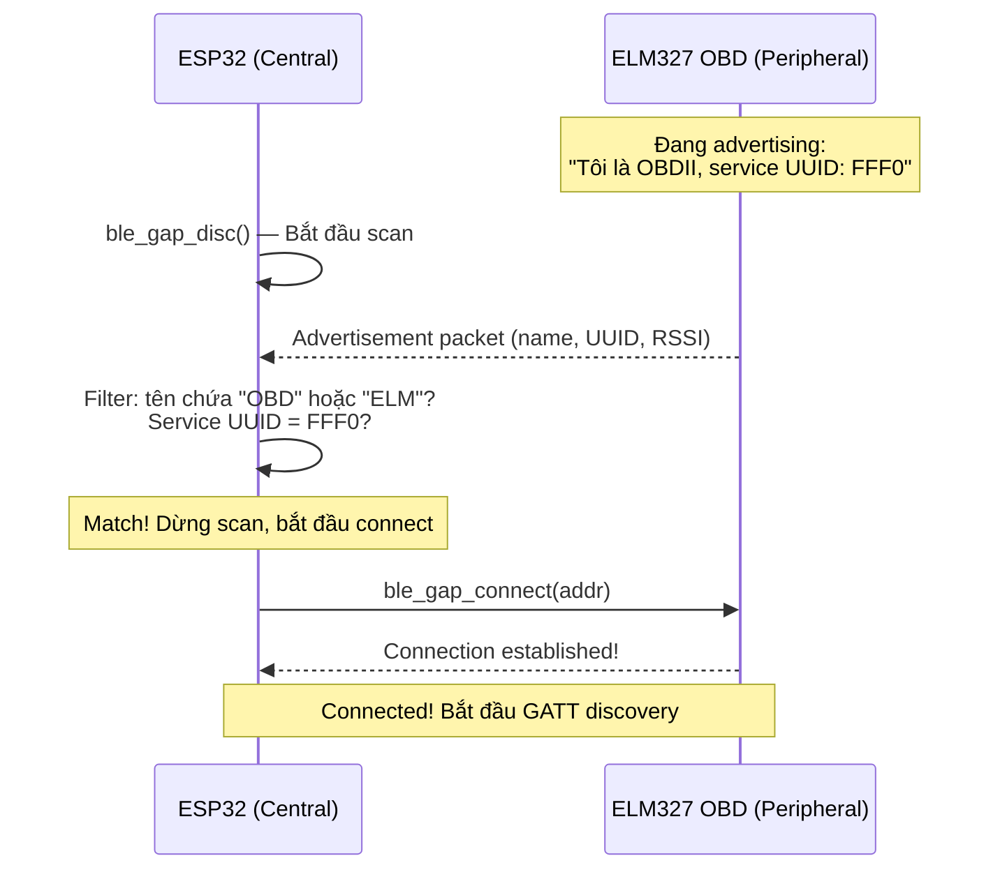
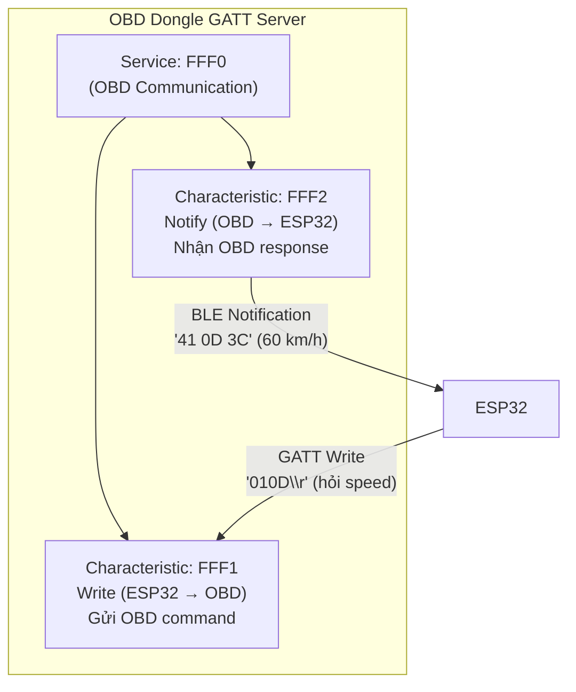
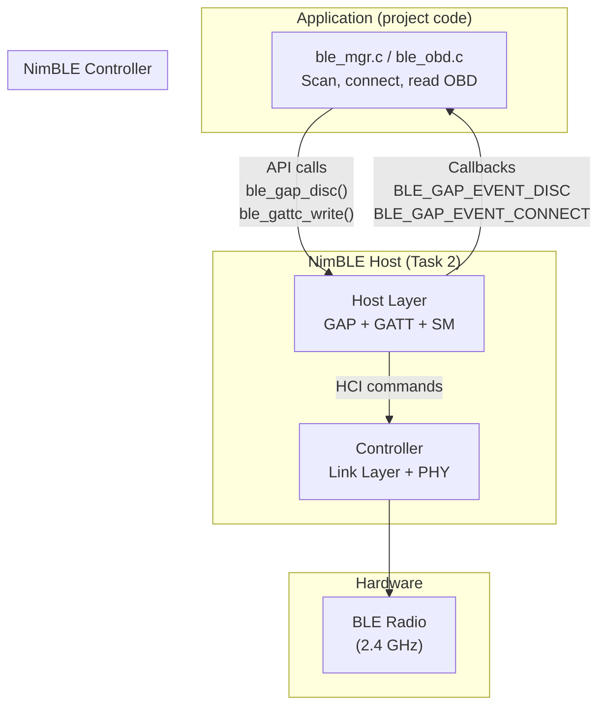
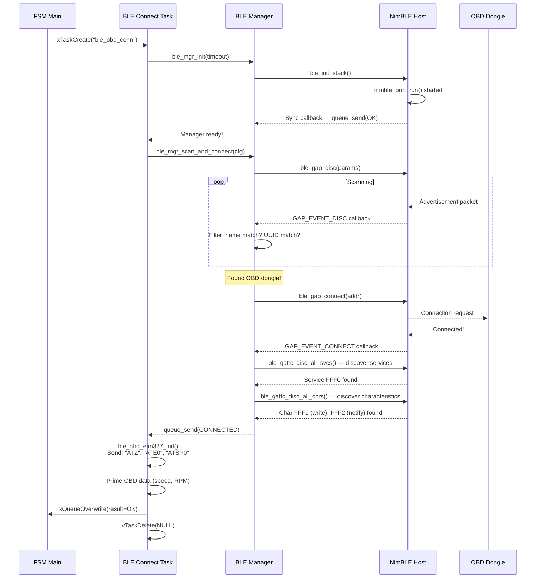

# 05 - BLE & NimBLE Stack

> Bluetooth Low Energy (BLE) và NimBLE stack — cách project kết nối với OBD dongle.

---

## Mục lục

1. [BLE là gì?](#1-ble-là-gì)
2. [GAP — Tìm và kết nối thiết bị](#2-gap--tìm-và-kết-nối-thiết-bị)
3. [GATT — Trao đổi dữ liệu](#3-gatt--trao-đổi-dữ-liệu)
4. [NimBLE Stack Architecture](#4-nimble-stack-architecture)
5. [Flow trong project: Scan → Connect → OBD](#5-flow-trong-project)

---

## 1. BLE là gì?

BLE (Bluetooth Low Energy) là phiên bản tiết kiệm năng lượng của Bluetooth.
Khác Bluetooth Classic:
- Tiêu thụ ít điện hơn 10-100x
- Tốc độ thấp hơn (1-2 Mbps vs 3 Mbps)
- Thiết kế cho IoT: sensor, beacon, wearable

**Trong project:** ESP32 kết nối BLE tới ELM327 OBD dongle để đọc dữ liệu xe
(tốc độ, RPM, nhiệt độ, mã lỗi DTC).

---

## 2. GAP — Tìm và kết nối thiết bị

GAP (Generic Access Profile) quản lý việc tìm kiếm và kết nối:



**Giải thích các vai trò:**
- **Central** (ESP32): Chủ động scan và kết nối — giống "client"
- **Peripheral** (OBD dongle): Quảng bá sự hiện diện, chờ được kết nối — giống "server"
- **Advertising**: Peripheral phát packet mỗi vài ms, chứa tên + service UUID
- **Scanning**: Central lắng nghe advertising packets, filter theo tiêu chí

---

## 3. GATT — Trao đổi dữ liệu

GATT (Generic Attribute Profile) định nghĩa cách đọc/ghi dữ liệu sau khi connected:



**Giải thích:**
- **Service**: Nhóm chức năng (UUID: FFF0 = OBD communication)
- **Characteristic**: Kênh dữ liệu cụ thể trong service
  - **FFF1 (Write)**: ESP32 ghi OBD command vào đây → dongle nhận và xử lý
  - **FFF2 (Notify)**: Dongle gửi response qua notification → ESP32 nhận callback

**Flow đọc OBD PID:**
1. ESP32 write "010D\r" vào characteristic FFF1 (hỏi Vehicle Speed)
2. OBD dongle xử lý, query ECU xe
3. OBD dongle gửi notification trên FFF2: "41 0D 3C"
4. ESP32 nhận callback → decode: mode=41, PID=0D, value=0x3C=60 km/h

---

## 4. NimBLE Stack Architecture

NimBLE là BLE stack nhẹ, open-source, tích hợp trong ESP-IDF:



**NimBLE Host Task:**
- Chạy `nimble_port_run()` trong vòng lặp vô hạn
- Xử lý mọi BLE event (scan result, connect, disconnect, notification)
- Gọi callback functions đã đăng ký khi có event
- Callbacks chạy trên context của NimBLE host task (không phải FSM task!)

---

## 5. Flow trong project

Toàn bộ flow từ scan đến đọc OBD data:



**Giải thích:**
1. FSM tạo BLE Connect task (vì toàn bộ flow này blocking ~8s)
2. BLE Manager khởi tạo NimBLE stack, chờ sync
3. Bắt đầu scan — NimBLE host task nhận advertising packets
4. Filter theo tên/UUID — khi match thì connect
5. Sau connect: discover GATT services và characteristics
6. Init ELM327 (gửi AT commands qua BLE)
7. Đọc OBD data đầu tiên (prime)
8. Gửi kết quả về FSM qua queue → task tự hủy

---

## 6. ELM327 Initialization (Code thực tế)

> File: `components/adapter-ble-obd-nimble/src/ble_obd.c`

Sau khi BLE connected + GATT discovered, phải khởi tạo ELM327 adapter:

```c
esp_err_t ble_obd_elm327_init(ble_obd_ctx_t *ctx) {
    // Gửi tuần tự các AT commands qua BLE GATT write
    const char *commands[] = {
        "ATZ\r",     // Reset adapter
        "ATE0\r",    // Tắt echo (không lặp lại command)
        "ATL0\r",    // Tắt linefeed
        "ATS0\r",    // Tắt spaces trong response
        "ATH0\r",    // Tắt headers
        "ATSP6\r",   // Set protocol = ISO 15765-4 CAN (11-bit, 500kbps)
    };

    for (size_t i = 0; i < ARRAY_SIZE(commands); ++i) {
        esp_err_t err = ble_obd_send_raw(ctx, commands[i], timeout_ms);
        if (err != ESP_OK) return err;
        vTaskDelay(pdMS_TO_TICKS(80));  // Chờ adapter xử lý
    }
    return ESP_OK;
}
```

## 7. OBD Request/Response (Code thực tế)

### BLE OBD Context Structure

```c
struct ble_obd_ctx {
    ble_mgr_ctx_t *mgr_ctx;           // BLE manager handle
    ble_obd_response_cb_t response_cb; // Callback khi có response
    SemaphoreHandle_t api_mutex;       // Serialize requests (1 lúc 1 command)
    SemaphoreHandle_t response_sem;    // Signal "có response rồi!"
    struct {
        char tx_buf[32];               // Buffer gửi: "010D\r"
        uint8_t mode, pid;             // Mode + PID đang chờ
        bool expect_pid_header;        // Cần validate header?
    } tx_data;
    struct {
        char buf[256];                 // Buffer nhận (ghép từ nhiều notification)
        size_t len;                    // Số bytes đã nhận
        bool has_error;                // Có ký tự '?' (error)
    } rx_data;
};
```

### Notification Callback (nhận response từ OBD dongle)

```c
// Chạy trên NimBLE host task context — KHÔNG phải FSM task!
static void ble_obd_notify_cb(const uint8_t *data, size_t len,
                               uint16_t attr_handle, void *usr_ctx) {
    ble_obd_ctx_t *ctx = (ble_obd_ctx_t *)usr_ctx;
    
    // 1. Ghép chunk vào buffer (notification có thể bị split)
    size_t free_space = sizeof(ctx->rx_data.buf) - 1 - ctx->rx_data.len;
    size_t append_len = MIN(len, free_space);
    memcpy(ctx->rx_data.buf + ctx->rx_data.len, data, append_len);
    ctx->rx_data.len += append_len;
    
    // 2. Kiểm tra prompt '>' (ELM327 báo "xong, sẵn sàng command tiếp")
    if (ble_obd_response_has_prompt(ctx->rx_data.buf)) {
        // 3. Vỗ vai task đang chờ!
        xSemaphoreGive(ctx->response_sem);
    }
}
```

### Send Raw Command

```c
esp_err_t ble_obd_send_raw(ble_obd_ctx_t *ctx, const char *command, uint32_t timeout_ms) {
    // 1. Lấy mutex (chỉ 1 command/lúc)
    xSemaphoreTake(ctx->api_mutex, pdMS_TO_TICKS(timeout_ms));
    
    // 2. Clear buffer cũ
    ble_obd_response_reset(ctx);
    
    // 3. Drain stale semaphore tokens
    while (xSemaphoreTake(ctx->response_sem, 0) == pdTRUE) { }
    
    // 4. Gửi command qua BLE GATT write
    ble_gattc_write_flat(conn_handle, tx_char_handle, command, strlen(command));
    
    // 5. Chờ response (semaphore từ notification callback)
    if (xSemaphoreTake(ctx->response_sem, pdMS_TO_TICKS(timeout_ms)) != pdTRUE) {
        xSemaphoreGive(ctx->api_mutex);
        return ESP_ERR_TIMEOUT;  // OBD dongle không trả lời!
    }
    
    // 6. Response có trong ctx->rx_data.buf
    xSemaphoreGive(ctx->api_mutex);
    return ESP_OK;
}
```

---

> **Tiếp theo:** [06-cellular-modem-at-commands.md](./06-cellular-modem-at-commands.md) — SIM7600 AT commands
