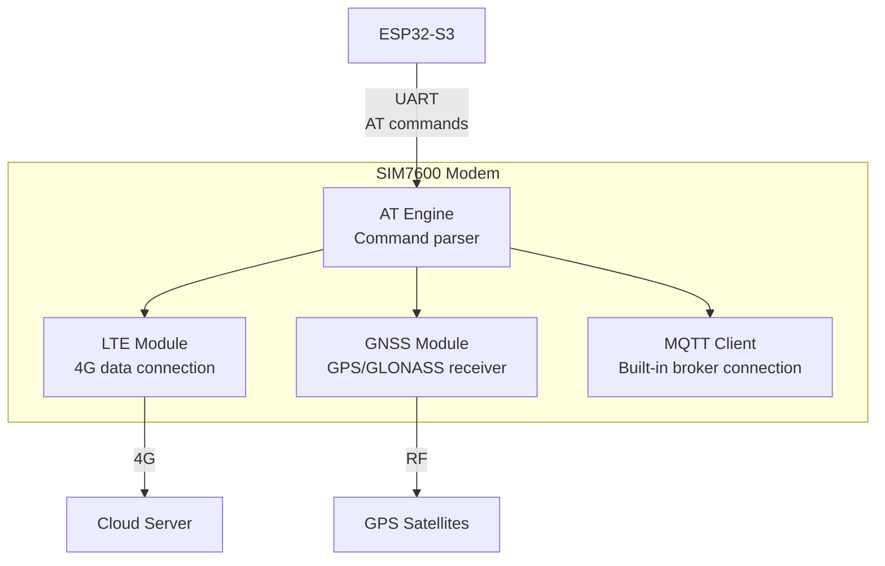
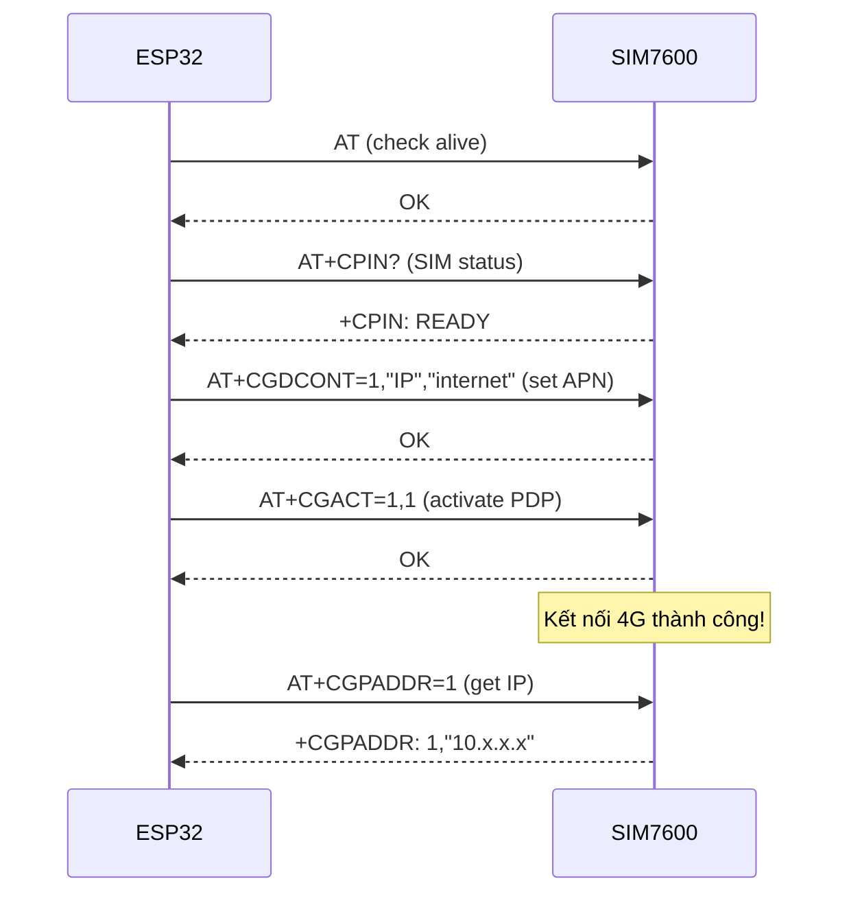
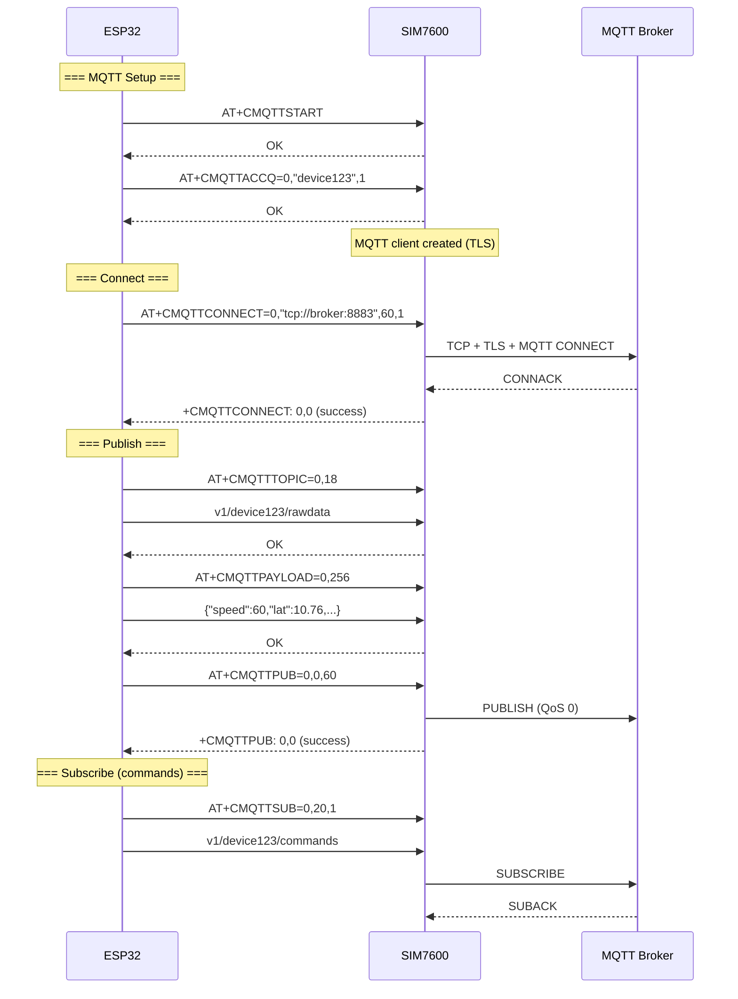
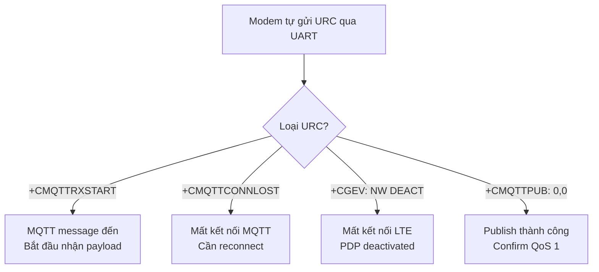
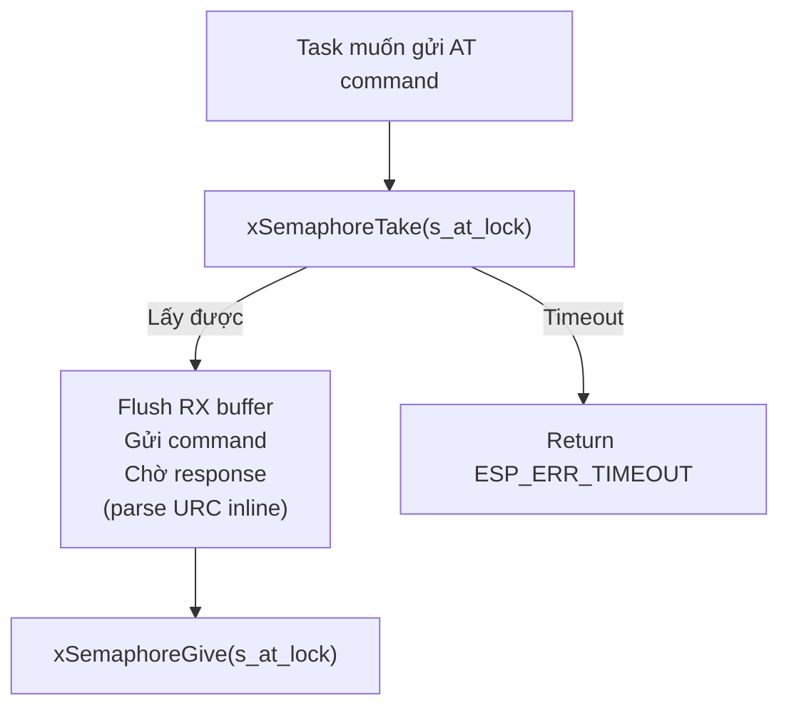
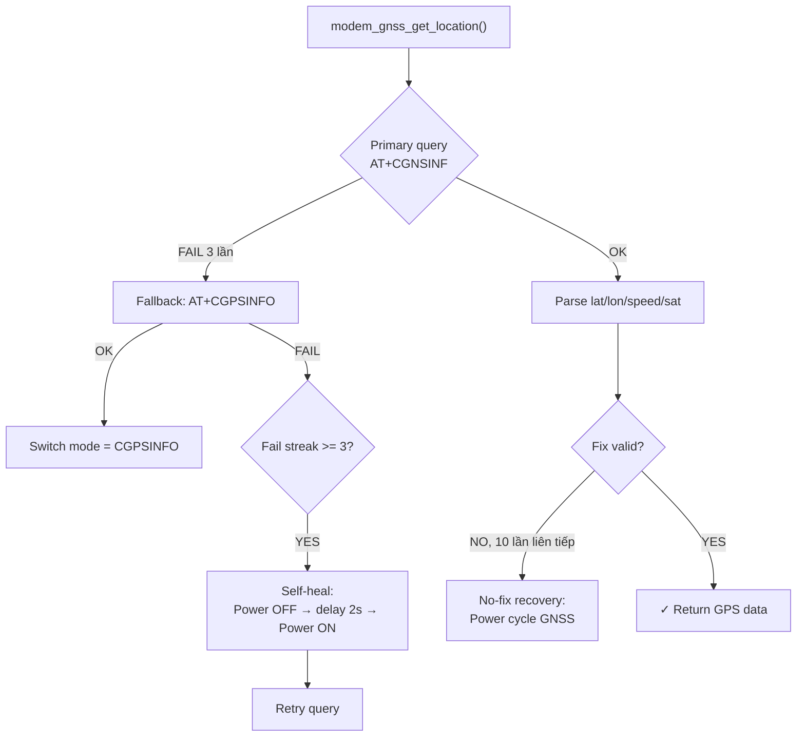

# 06 - Cellular Modem & AT Commands

> SIM7600 modem: LTE connectivity, MQTT over AT, GNSS, URC handling.

---

## Mục lục

1. [AT Commands là gì?](#1-at-commands-là-gì)
2. [Modem SIM7600 trong project](#2-modem-sim7600-trong-project)
3. [LTE Connection Flow](#3-lte-connection-flow)
4. [MQTT over AT Commands](#4-mqtt-over-at-commands)
5. [GNSS (GPS) over AT](#5-gnss-gps-over-at)
6. [URC — Unsolicited Result Codes](#6-urc--unsolicited-result-codes)
7. [Thread Safety](#7-thread-safety)

---

## 1. AT Commands là gì?

AT commands (Attention commands) là giao thức text-based để điều khiển modem.
Mọi lệnh bắt đầu bằng "AT" và kết thúc bằng "\r\n".

**Format cơ bản:**
```
Gửi:  AT+<COMMAND>=<params>\r\n
Nhận:  <response>\r\nOK\r\n     (thành công)
       <response>\r\nERROR\r\n  (thất bại)
```

**Ví dụ:**
```
Gửi:  AT\r\n                    → Kiểm tra modem sống không
Nhận:  OK                       → Modem OK

Gửi:  AT+CSQ\r\n                → Hỏi cường độ tín hiệu
Nhận:  +CSQ: 18,99\r\nOK        → Signal: 18 (tốt)
```

---

## 2. Modem SIM7600 trong project

SIM7600 là modem 4G LTE tích hợp:
- **LTE Cat-4**: Download 150Mbps, Upload 50Mbps
- **GNSS**: GPS/GLONASS/BeiDou tích hợp
- **MQTT client**: Hỗ trợ MQTT qua AT commands (không cần TCP stack trên ESP32)



**Tại sao dùng MQTT qua AT thay vì TCP socket?**
- SIM7600 có MQTT client tích hợp → ESP32 không cần TCP/TLS stack
- Tiết kiệm RAM (~30KB cho TLS)
- Modem xử lý reconnect, keepalive tự động
- Đơn giản hơn: chỉ cần gửi AT commands

---

## 3. LTE Connection Flow



**Giải thích:**
1. Kiểm tra modem sống (`AT`)
2. Kiểm tra SIM card (`AT+CPIN?`)
3. Cấu hình APN — tên điểm truy cập của nhà mạng (`AT+CGDCONT`)
4. Kích hoạt kết nối data (`AT+CGACT`)
5. Lấy IP address để xác nhận online

---

## 4. MQTT over AT Commands



**Giải thích:**
- `AT+CMQTTSTART`: Khởi động MQTT service trên modem
- `AT+CMQTTACCQ`: Tạo MQTT client instance (client ID, TLS mode)
- `AT+CMQTTCONNECT`: Kết nối tới broker (URL, keepalive, clean session)
- `AT+CMQTTPUB`: Publish message (topic + payload đã set trước)
- `AT+CMQTTSUB`: Subscribe topic để nhận commands từ cloud

---

## 5. GNSS (GPS) over AT

```c
// Bật GNSS
modem_at_send("AT+CGNSSPWR=1", ...);  // Power on GNSS module

// Đọc vị trí
modem_at_send("AT+CGNSSINFO", response, ...);
// Response: +CGNSSINFO: 2,10,07,06,10.762345,N,106.660123,E,120525,034521.0,45.2,...
//           mode,sat,date,lat,lon,time,altitude,...
```

**Parse response:**
- `10.762345,N` → Latitude: 10.762345° North
- `106.660123,E` → Longitude: 106.660123° East
- `45.2` → Altitude: 45.2m

---

## 6. URC — Unsolicited Result Codes

URC là message modem **tự gửi** mà không cần ESP32 hỏi.
Ví dụ: MQTT message đến, mất kết nối, SMS nhận...



**Cách project xử lý URC:**

```c
// Đăng ký callback cho URC prefix
modem_at_register_urc("+CMQTT", tracker_mqtt_on_urc_line);

// Callback được gọi khi modem gửi dòng bắt đầu bằng "+CMQTT"
void tracker_mqtt_on_urc_line(const char *line) {
    if (strncmp(line, "+CMQTTRXSTART:", 14) == 0) {
        // Bắt đầu nhận MQTT message...
    }
    if (strncmp(line, "+CMQTTCONNLOST:", 15) == 0) {
        // Mất kết nối! Mark disconnected
        s_connected = false;
    }
}
```

**Điểm quan trọng:** URC có thể đến BẤT CỨ LÚC NÀO — kể cả khi đang chờ response
cho AT command khác. Code phải xử lý URC inline trong vòng lặp chờ response.

---

## 7. Thread Safety



Mutex `s_at_lock` đảm bảo:
- Chỉ 1 AT command trên UART tại 1 thời điểm
- Response không bị lẫn giữa các command
- URC vẫn được parse inline (không mất)

---

## 8. GNSS Self-Heal & Recovery (Code thực tế)

> File: `components/adapter-modem-sim7600-at/src/modem_gnss.c`

GNSS module có logic tự phục hồi khi mất fix hoặc transport fail:



**Giải thích:** Modem GNSS đôi khi "treo" — trả response nhưng không có fix,
hoặc không trả response. Driver tự detect và power-cycle GNSS module để recover.

```c
// modem_gnss.c — Self-heal khi query fail liên tục
static bool modem_gnss_try_self_heal(uint64_t now_ms) {
    // Cooldown: không self-heal quá thường xuyên (20 giây)
    if ((now_ms - s_last_self_heal_ms) < MODEM_GNSS_QUERY_SELF_HEAL_COOLDOWN_MS) {
        return false;
    }
    s_last_self_heal_ms = now_ms;
    
    // Power cycle GNSS
    modem_gnss_power_off();   // AT+CGPS=0
    modem_gnss_power_on();    // AT+CGPS=1 hoặc AT+CGNSPWR=1
    return true;
}
```

## 9. LTE Internal State Machine

> File: `components/adapter-modem-sim7600-at/src/modem_lte.c`

Modem LTE có FSM riêng bên trong (không phải FSM chính của app):

```c
typedef enum {
    MODEM_LTE_STATE_IDLE = 0,
    MODEM_LTE_STATE_POWER_ON_PULSE,    // Đang pulse PWRKEY
    MODEM_LTE_STATE_WAIT_RDY,          // Chờ modem boot (URC: RDY)
    MODEM_LTE_STATE_AT_SYNC,           // Gửi AT, chờ OK
    MODEM_LTE_STATE_CPIN_CHECK,        // Kiểm tra SIM card
    MODEM_LTE_STATE_CEREG_WAIT,        // Chờ đăng ký mạng
    MODEM_LTE_STATE_PDP_ACTIVATE,      // Kích hoạt data connection
    MODEM_LTE_STATE_CONNECTED,         // Online!
    MODEM_LTE_STATE_RECOVER,           // Đang recovery sau lỗi
} modem_lte_state_t;
```

FSM chính gọi `modem_lte_tick()` mỗi iteration → LTE FSM tự chuyển state nội bộ.
Dùng exponential backoff khi fail.

---

> **Tiếp theo:** [07-mqtt-protocol.md](./07-mqtt-protocol.md) — MQTT protocol chi tiết
