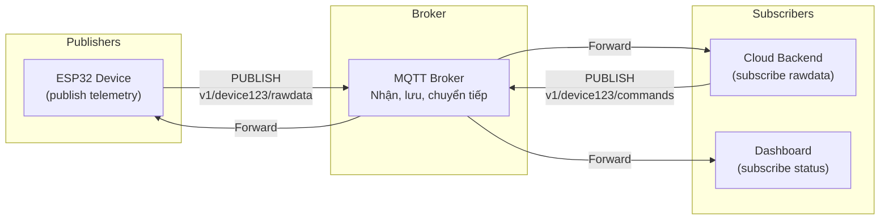
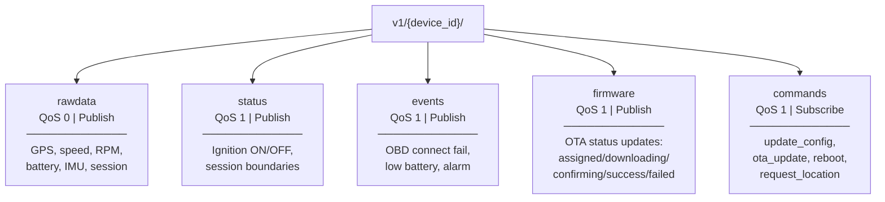
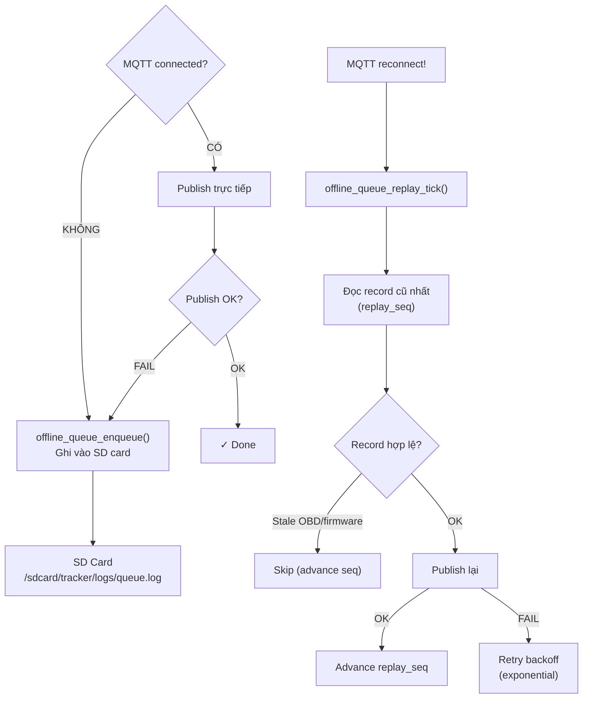

# 07 - MQTT Protocol

> MQTT trong project: publish/subscribe, QoS, topic hierarchy, offline queue.

---

## Mục lục

1. [MQTT là gì?](#1-mqtt-là-gì)
2. [Publish/Subscribe Model](#2-publishsubscribe-model)
3. [QoS Levels](#3-qos-levels)
4. [Topic Hierarchy trong project](#4-topic-hierarchy-trong-project)
5. [Offline Queue & Replay](#5-offline-queue--replay)

---

## 1. MQTT là gì?

MQTT (Message Queuing Telemetry Transport) là giao thức messaging nhẹ,
thiết kế cho IoT — bandwidth thấp, kết nối không ổn định.

**Đặc điểm:**
- Nhẹ: Header chỉ 2 bytes (vs HTTP ~800 bytes)
- Publish/Subscribe: Không cần biết ai nhận
- QoS: Đảm bảo delivery (0, 1, hoặc 2 lần)
- Persistent session: Broker giữ message khi device offline

---

## 2. Publish/Subscribe Model



**Giải thích:**
- **Publisher** gửi message lên topic — không cần biết ai đang lắng nghe
- **Subscriber** đăng ký topic — nhận mọi message publish lên topic đó
- **Broker** là trung gian — nhận từ publisher, chuyển cho subscriber
- Device vừa là publisher (gửi telemetry) vừa là subscriber (nhận commands)

---

## 3. QoS Levels

| QoS | Tên | Đảm bảo | Dùng khi |
|-----|-----|---------|----------|
| 0 | At most once | Gửi 1 lần, không confirm | Telemetry tần suất cao (mất 1 packet OK) |
| 1 | At least once | Gửi lại cho đến khi PUBACK | Commands, status (không được mất) |
| 2 | Exactly once | 4-way handshake | Billing, critical events (project không dùng) |

**Trong project:**
```c
// Rawdata: QoS 0 — tần suất cao, mất 1-2 packet không sao
tracker_mqtt_publish(s_topic_rawdata, payload, 0);

// Status/Events/Firmware: QoS 1 — phải đảm bảo delivery
tracker_mqtt_publish(s_topic_status, payload, 1);
tracker_mqtt_publish(s_topic_events, payload, 1);
```

---

## 4. Topic Hierarchy trong project



**Mỗi message chứa metadata:**
```json
{
  "message_id": "uuid-v4",
  "seq_no": 1234,
  "boot_id": "abc123",
  "timestamp": 1716300000000,
  "timestamp_trusted": true,
  "speed": 60,
  "lat": 10.762,
  "lon": 106.660
}
```

---

## 5. Offline Queue & Replay

Khi mất kết nối MQTT, data được lưu vào SD card và gửi lại khi online:



**Code thực tế** (`components/domain-storage/src/offline_queue.c`):

```c
// Replay 1 record mỗi tick (cooperative — không monopolize MQTT)
void offline_queue_replay_tick(void) {
    if (!s_ctx.online || !sd_log_store_is_mounted()) return;
    
    // Rate limit: tối thiểu 600ms giữa 2 lần publish
    uint64_t now_ms = util_uptime_ms();
    if ((now_ms - s_ctx.last_replay_publish_ms) < 600) return;
    
    // Retry backoff nếu lần trước fail
    if (!retry_state_can_run(&s_ctx.replay_retry, now_ms)) return;
    
    // Đọc record tiếp theo từ SD
    sd_log_record_t record = {0};
    esp_err_t err = sd_log_store_peek_next(replay_seq, &record);
    if (err == ESP_ERR_NOT_FOUND) return;  // Hết queue
    
    // Filter stale records
    if (offline_queue_is_stale_obd_rawdata_record(&record)) {
        sd_log_store_set_replay_seq(record.seq + 1);  // Skip
        return;
    }
    
    // Publish qua MQTT (cùng topic/QoS như live)
    offline_queue_publish_record(&record);
}
```

**Đặc điểm:**
- Cùng 1 JSON payload cho cả live và offline — cloud nhận data giống hệt
- FIFO: gửi lại theo thứ tự thời gian (sequence number)
- Quota: giới hạn dung lượng SD (4MB) — GC compaction xóa record cũ khi đầy
- Replay chỉ 1 record/tick (600ms interval) — không flood MQTT
- Stale filter: skip record cũ có OBD data không hợp lệ hoặc firmware status giả
- Crash-safe: metadata dùng atomic write pattern (tmp → bak → live)
- Record format: `seq|ts_ms|session_id|type|critical|gps_fix|net_up|time_trusted|json`

---

> **Tiếp theo:** [08-state-machine-design.md](./08-state-machine-design.md) — FSM pattern
