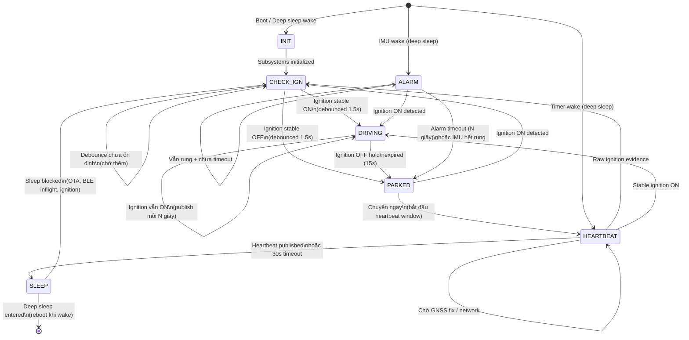
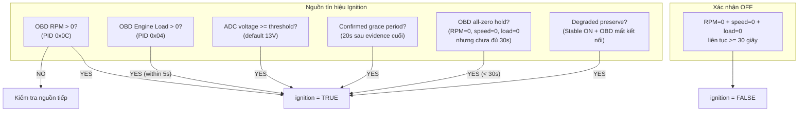
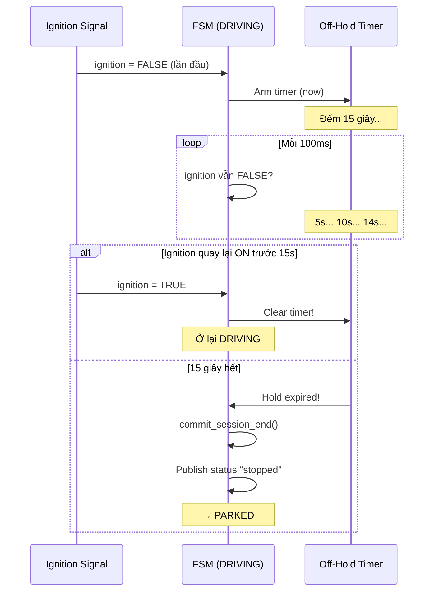

# 08 - State Machine Design (Chi tiết)

> FSM pattern, state transitions, ignition detection logic, sleep eligibility.
> File chính: `components/app-core/src/state_machine_core.c`

---

## Mục lục

1. [FSM là gì?](#1-fsm-là-gì)
2. [States trong project](#2-states-trong-project)
3. [State Diagram chi tiết](#3-state-diagram-chi-tiết)
4. [Ignition Detection — Sensor Fusion](#4-ignition-detection--sensor-fusion)
5. [Điều kiện chuyển state chi tiết](#5-điều-kiện-chuyển-state-chi-tiết)
6. [Sleep Blockers](#6-sleep-blockers)
7. [Timing Constants](#7-timing-constants)
8. [Code thực tế: State Handlers](#8-code-thực-tế-state-handlers)

---

## 1. FSM là gì?

Finite State Machine (Máy trạng thái hữu hạn) — hệ thống luôn ở 1 trạng thái,
chuyển sang trạng thái khác khi điều kiện thỏa mãn. Mỗi state có hành vi riêng.

**Cooperative FSM**: Mỗi 100ms, FSM chạy 1 iteration → kiểm tra điều kiện → quyết định
ở lại state hiện tại hay chuyển sang state mới.

---

## 2. States trong project

```c
// shared-kernel/include/fsm_types.h
typedef enum {
    APP_STATE_INIT = 0,      // Boot, khởi tạo peripherals
    APP_STATE_CHECK_IGN,     // Quyết định ignition ON/OFF
    APP_STATE_DRIVING,       // Xe đang chạy, telemetry tần suất cao
    APP_STATE_PARKED,        // Xe đỗ, chờ chuyển sang heartbeat
    APP_STATE_ALARM,         // IMU phát hiện rung (có thể bị trộm)
    APP_STATE_HEARTBEAT,     // Wake định kỳ, gửi 1 packet rồi ngủ
    APP_STATE_SLEEP,         // Chuẩn bị và vào deep sleep
} app_state_t;
```

---

## 3. State Diagram chi tiết



---

## 4. Ignition Detection — Sensor Fusion

**Đây là phần phức tạp nhất.** Firmware KHÔNG chỉ dùng 1 nguồn để detect ignition.
Nó kết hợp nhiều tín hiệu (sensor fusion) với logic ưu tiên:



**Giải thích từng nguồn:**

| # | Nguồn | Điều kiện | Ưu tiên | Giải thích |
|---|--------|-----------|---------|-----------|
| 1 | **OBD RPM** | `obd_rpm > 0` + OBD live + sample < 5s | Cao nhất | Bằng chứng trực tiếp nhất: động cơ đang quay |
| 2 | **OBD Engine Evidence** | RPM>0 hoặc load>0 trong 5s gần nhất | Cao | Giữ ON ngay cả khi sample tiếp theo chưa đến |
| 3 | **ADC Voltage** | `vehicle_battery >= 13.0V` | Trung bình | Fallback khi OBD disconnected. Xe nổ máy = alternator charge = voltage tăng |
| 4 | **Confirmed Grace** | Stable ON + OBD live + evidence < 20s | Trung bình | Tránh flicker OFF khi OBD tạm mất 1-2 sample |
| 5 | **All-zero Hold** | RPM=0, speed=0, load=0 nhưng < 30s | Thấp | Giữ ON tạm thời — có thể xe đang idle rồi tắt |
| 6 | **Degraded Preserve** | Stable ON + OBD disconnected/stale | Thấp | Không tự chuyển OFF chỉ vì mất BLE |

**Code thực tế** (`state_wake_prelude.c`, dòng ~380):

```c
// Kết hợp tất cả nguồn ignition evidence
bool ignition_next =
    rpm_ignition ||                    // OBD RPM > 0
    obd_engine_on_evidence ||          // RPM/load > 0 trong 5s gần nhất
    adc_ignition ||                    // ADC voltage >= threshold
    confirmed_obd_live_grace ||        // 20s grace sau evidence cuối
    hold_live_zero_on ||               // All-zero nhưng chưa đủ 30s
    preserve_degraded_ignition_on;     // Stable ON + OBD mất

s_telemetry.ignition = ignition_next;  // Kết quả cuối cùng
```

### Xác nhận OFF (All-Zero Confirm)

Khi OBD connected và RPM=0, speed=0, load=0 **liên tục 30 giây** → xác nhận xe thực sự tắt máy:

```c
bool obd_live_zero_confirmed_off =
    obd_live_zero_candidate &&                    // RPM=0, speed=0, load=0
    s_obd_live_zero_started_ms != 0 &&            // Timer đang chạy
    (now_ms - s_obd_live_zero_started_ms) >= 30000; // >= 30 giây

// Nếu bất kỳ signal nào > 0 → reset timer
if (!obd_live_zero_candidate) {
    s_obd_live_zero_started_ms = 0;  // Reset!
}
```

**Tại sao 30 giây?** Vì xe có thể:
- Dừng đèn đỏ (RPM=0 tạm thời khi auto-stop)
- ECU restart ngắn
- OBD dongle trả "0" do lag

30 giây đủ lâu để loại bỏ false positive.

---

## 5. Điều kiện chuyển state chi tiết

### INIT → CHECK_IGN

| Điều kiện | Chi tiết |
|-----------|----------|
| `state_machine_init() == ESP_OK` | Tất cả subsystem init thành công |
| Retry nếu fail | Fixed backoff 10s, retry vô hạn |

### CHECK_IGN → DRIVING hoặc PARKED

| Điều kiện | Kết quả |
|-----------|---------|
| `session_mgr_has_stable_ignition() == true` | Debounce đã ổn định |
| `session_mgr_stable_ignition() == true` | → DRIVING |
| `session_mgr_stable_ignition() == false` | → PARKED |
| Debounce chưa ổn định | Ở lại CHECK_IGN |

### DRIVING → PARKED



**Điều kiện chính xác:**
```c
bool ignition_active = command_handler_is_tracking_enabled() &&
                       (s_telemetry.ignition || stable_ignition_on);

// Nếu ignition_active == false liên tục >= ignition_off_hold_ms (default 15s)
// → commit session end → chuyển PARKED
```

### PARKED → HEARTBEAT

Chuyển **ngay lập tức** (không có điều kiện phức tạp):
```c
case APP_STATE_PARKED:
    if (s_telemetry.ignition && command_handler_is_tracking_enabled()) {
        return APP_STATE_CHECK_IGN;  // Ignition ON → quay lại check
    }
    return APP_STATE_HEARTBEAT;      // Bắt đầu heartbeat window
```

### HEARTBEAT → SLEEP

| Điều kiện | Kết quả |
|-----------|---------|
| Raw ignition evidence (`s_telemetry.ignition == true`) | → CHECK_IGN |
| Stable ignition ON (debounced) | → DRIVING |
| Heartbeat published thành công | → SLEEP |
| 30s timeout (GNSS/network không sẵn sàng) | → SLEEP |

**Heartbeat publish gates** (phải thỏa tất cả hoặc timeout):
- GNSS fix valid HOẶC GNSS chưa start HOẶC timeout
- Network ready (LTE connected) HOẶC timeout
- BLE connect không đang inflight HOẶC timeout

### ALARM → PARKED hoặc DRIVING

| Điều kiện | Kết quả |
|-----------|---------|
| `s_telemetry.ignition == true` | → DRIVING (xe bị lái đi!) |
| `alarm_timeout_s` hết (default 30-3600s) | → PARKED |
| IMU không available | → PARKED |
| `imu_motion_detected() == false` | → PARKED (hết rung) |

### SLEEP → Deep Sleep hoặc CHECK_IGN

| Điều kiện | Kết quả |
|-----------|---------|
| `state_machine_can_enter_sleep() == true` | Shutdown → Deep sleep |
| Bất kỳ blocker nào active | → CHECK_IGN (quay lại kiểm tra) |

---

## 6. Sleep Blockers

`state_machine_can_enter_sleep()` trả `false` khi:

| Blocker | Lý do |
|---------|-------|
| `sleep_enabled == false` | Config tắt sleep |
| `s_ota_in_progress` | Đang download/flash OTA |
| `ota_pending_confirm` | Chờ confirm firmware mới |
| `s_telemetry.ignition == true` | Xe vẫn nổ máy! |
| `session_mgr_stable_ignition() == true` | Debounced ignition vẫn ON |
| `s_ble_connect_inflight` | BLE task đang chạy |
| `FIELD_VALIDATION_KEEP_AWAKE` | Build test giữ thức |

**Khi bị block:** FSM quay lại CHECK_IGN và log lý do mỗi 10 giây:
```
W (45000) STATE_MACHINE: event=sleep_blocked reason=ble_connect_inflight blocked_count=3
```

---

## 7. Timing Constants

| Constant | Giá trị | Ý nghĩa |
|----------|---------|---------|
| `IGNITION_DEBOUNCE_MS` | 1500ms | Chờ ignition ổn định |
| `ignition_off_hold_ms` | 15000ms (config) | Chờ trước khi kết thúc session |
| `HEARTBEAT_ACTIVE_WINDOW_MS` | 30000ms | Max time trong HEARTBEAT |
| `alarm_timeout_s` | 30-3600s (config) | Max time trong ALARM |
| `tracking_interval_s` | 10s (config) | Publish cadence khi driving |
| `alarm_interval_s` | 5s (config) | Publish cadence khi alarm |
| `OBD_LIVE_ZERO_OFF_CONFIRM_MS` | 30000ms | All-zero xác nhận OFF |
| `OBD_ENGINE_ON_EVIDENCE_HOLD_MS` | 5000ms | RPM/load evidence window |
| `OBD_ENGINE_ON_CONFIRMED_GRACE_MS` | 20000ms | Grace sau evidence cuối |
| `IGNITION_OBD_LIVE_SAMPLE_MAX_AGE_MS` | 5000ms | Max age cho OBD sample |
| `ignition_adc_threshold_mv` | 13000mV (config) | ADC ignition threshold |

---

## 8. Code thực tế: State Handlers

### DRIVING Handler

```c
static app_state_t state_machine_handle_driving_state(void) {
    // 1. Refresh mọi sensor (GPS, OBD, battery, MQTT commands)
    state_machine_run_wake_prelude(true);
    
    // 2. Feed ignition sample vào debouncer
    session_mgr_on_ignition_sample(s_telemetry.ignition, util_uptime_ms());
    
    // 3. Mở session mới nếu debouncer raise ON edge
    if (session_mgr_should_start()) {
        state_machine_start_new_session();
    }
    
    // 4. Publish rawdata theo cadence (mỗi tracking_interval_s)
    if (state_machine_should_publish_driving_rawdata(now_ms)) {
        state_machine_publish_rawdata();
    }
    
    // 5. Kết nối BLE OBD nếu cần
    if (modem_lte_is_initialized()) {
        state_machine_try_connect_ble();
    }
    
    // 6. Kiểm tra ignition-off boundary
    if (state_machine_handle_driving_ignition_boundary(now_ms)) {
        return APP_STATE_PARKED;  // Session kết thúc!
    }
    return APP_STATE_DRIVING;
}
```

### ALARM Handler

```c
static app_state_t state_machine_handle_alarm_state(void) {
    state_machine_run_wake_prelude(true);
    
    // Lần đầu vào alarm → publish event cảnh báo
    if (s_alarm_enter_ms == 0) {
        s_alarm_enter_ms = util_uptime_ms();
        state_machine_publish_event("warning", 1001, "motion_detected");
    }
    
    // Publish rawdata theo alarm cadence (nhanh hơn driving)
    if ((now_ms - s_last_raw_publish_ms) >= alarm_interval_ms) {
        state_machine_publish_rawdata();
    }
    
    // Xe nổ máy trong lúc alarm → chuyển DRIVING (bị lái đi!)
    if (s_telemetry.ignition) {
        return APP_STATE_DRIVING;
    }
    
    // Hết rung hoặc timeout → về PARKED
    bool timeout = (now_ms - s_alarm_enter_ms) >= alarm_timeout_ms;
    if (!imu_motion_detected() || timeout) {
        return APP_STATE_PARKED;
    }
    
    return APP_STATE_ALARM;  // Vẫn rung → ở lại
}
```

### HEARTBEAT Handler

```c
static app_state_t state_machine_handle_heartbeat_state(void) {
    state_machine_run_wake_prelude(false);  // Lightweight (không replay)
    
    // Ignition ON → thoát heartbeat ngay
    if (s_telemetry.ignition && tracking_enabled) {
        return APP_STATE_CHECK_IGN;
    }
    if (session_mgr_stable_ignition() && tracking_enabled) {
        return APP_STATE_DRIVING;
    }
    
    // Chờ GNSS fix + network ready (hoặc timeout 30s)
    bool ready = gnss_ready && network_ready && !ble_inflight;
    bool timeout = (now_ms - s_heartbeat_started_ms) >= 30000;
    
    if (!s_heartbeat_raw_published && (ready || timeout)) {
        state_machine_publish_rawdata();     // 1 packet duy nhất
        state_machine_publish_status("heartbeat", "none");
        s_heartbeat_raw_published = true;
    }
    
    if (s_heartbeat_raw_published || timeout) {
        return APP_STATE_SLEEP;  // Xong → ngủ
    }
    return APP_STATE_HEARTBEAT;  // Chờ tiếp
}
```

---

## Tóm tắt: Bảng chuyển state hoàn chỉnh

| Từ | Đến | Điều kiện chính |
|----|-----|-----------------|
| INIT | CHECK_IGN | Init OK |
| CHECK_IGN | DRIVING | Ignition debounced ON (1.5s) |
| CHECK_IGN | PARKED | Ignition debounced OFF (1.5s) |
| DRIVING | PARKED | Ignition OFF hold expired (15s) |
| PARKED | CHECK_IGN | Ignition ON detected |
| PARKED | HEARTBEAT | Ngay lập tức (nếu ignition OFF) |
| HEARTBEAT | CHECK_IGN | Raw ignition evidence |
| HEARTBEAT | DRIVING | Stable ignition ON |
| HEARTBEAT | SLEEP | Published hoặc 30s timeout |
| ALARM | DRIVING | Ignition ON (xe bị lái đi) |
| ALARM | PARKED | Timeout hoặc hết rung |
| SLEEP | Deep sleep | Không blocker nào active |
| SLEEP | CHECK_IGN | Có blocker (OTA, BLE, ignition) |
| Deep sleep | HEARTBEAT | Timer wake |
| Deep sleep | ALARM | IMU/GPIO wake |

---

> **Tiếp theo:** [09-power-management.md](./09-power-management.md) — Sleep modes và tiết kiệm điện
