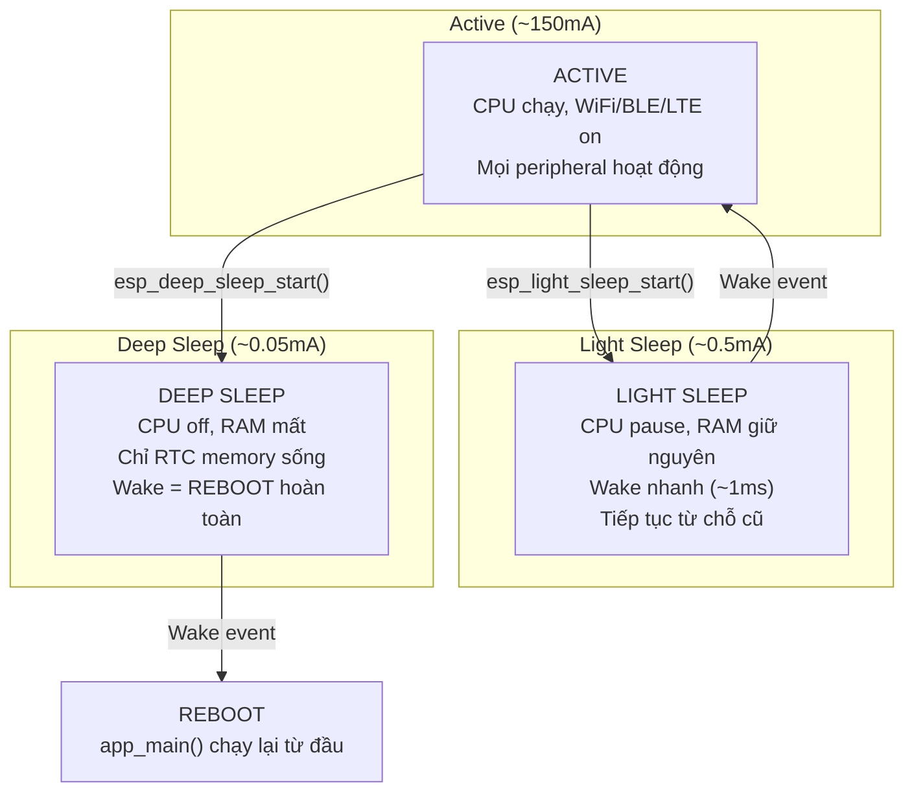
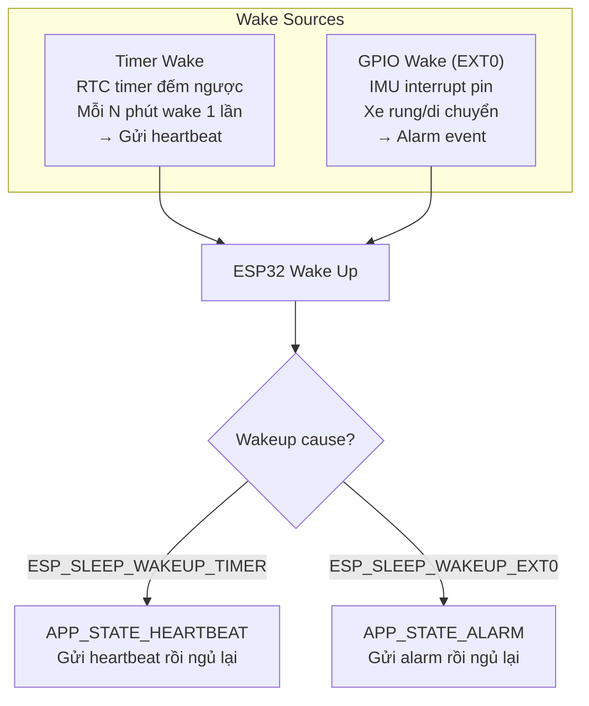
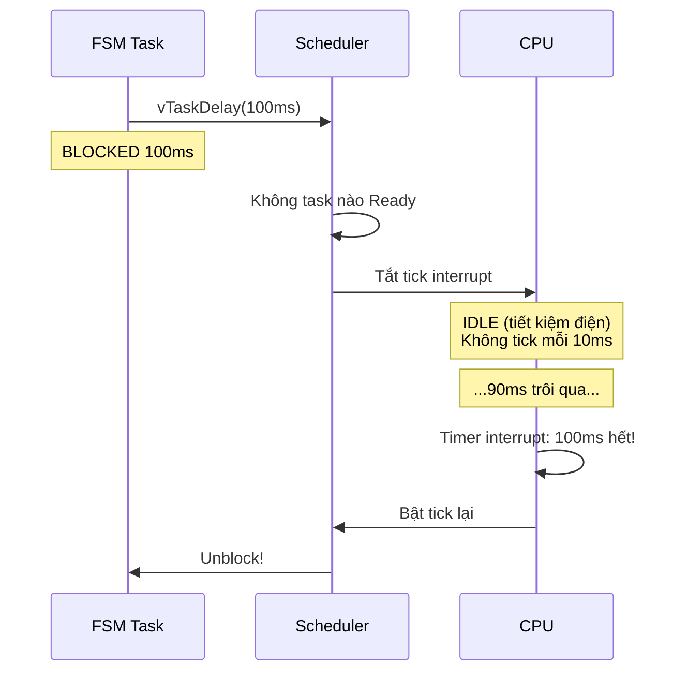
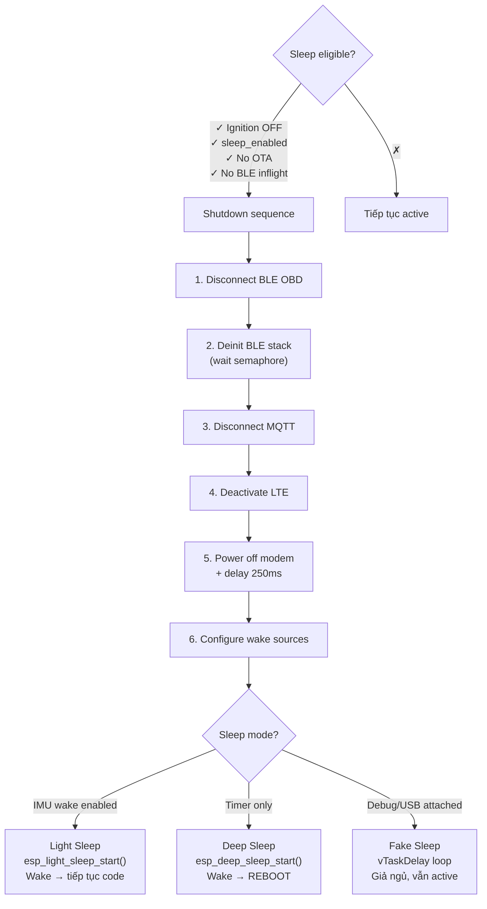

# 09 - Power Management

> Sleep modes, tickless idle, wake sources, power budget.

---

## Mục lục

1. [Tại sao cần quản lý điện?](#1-tại-sao-cần-quản-lý-điện)
2. [ESP32 Sleep Modes](#2-esp32-sleep-modes)
3. [Wake Sources](#3-wake-sources)
4. [Tickless Idle](#4-tickless-idle)
5. [Power Budget](#5-power-budget)
6. [Sleep Flow trong project](#6-sleep-flow-trong-project)

---

## 1. Tại sao cần quản lý điện?

Thiết bị tracker chạy bằng pin xe (12V). Khi xe tắt máy:
- Nếu không ngủ: tiêu thụ ~150mA → hết pin xe trong vài ngày
- Nếu deep sleep: tiêu thụ ~0.1mA → pin xe sống hàng tháng

---

## 2. ESP32 Sleep Modes



| Mode | Dòng điện | RAM | Wake time | Dùng khi |
|------|-----------|-----|-----------|----------|
| Active | ~150mA | ✓ Giữ | N/A | Xe đang chạy |
| Light Sleep | ~0.5mA | ✓ Giữ | ~1ms | Xe đỗ, cần wake nhanh |
| Deep Sleep | ~0.05mA | ✗ Mất | ~200ms (reboot) | Xe đỗ lâu, tiết kiệm tối đa |

**Trong project:**
- **Xe chạy (DRIVING)**: Active — poll OBD, publish liên tục
- **Xe đỗ, IMU wake enabled**: Light sleep — wake nhanh khi có rung
- **Xe đỗ, chỉ timer wake**: Deep sleep — tiết kiệm tối đa

---

## 3. Wake Sources



**Code:**
```c
// Cấu hình wake sources trước khi ngủ
esp_sleep_enable_timer_wakeup(wake_interval_us);  // Timer
esp_sleep_enable_ext0_wakeup(PIN_IMU_INT, 1);     // GPIO (IMU interrupt)

// Sau khi wake, kiểm tra nguyên nhân
esp_sleep_wakeup_cause_t cause = esp_sleep_get_wakeup_cause();
if (cause == ESP_SLEEP_WAKEUP_TIMER) {
    state = APP_STATE_HEARTBEAT;
} else if (cause == ESP_SLEEP_WAKEUP_EXT0) {
    state = APP_STATE_ALARM;
}
```

---

## 4. Tickless Idle

Khi FreeRTOS không có task nào cần chạy (tất cả đang blocked/delayed),
thay vì tick interrupt fire mỗi 10ms (tốn điện), nó tắt tick và đưa CPU vào idle.



**Config:**
```
CONFIG_PM_ENABLE=y
CONFIG_FREERTOS_USE_TICKLESS_IDLE=y
```

---

## 5. Power Budget

| Component | Active | Sleep |
|-----------|--------|-------|
| ESP32-S3 CPU | ~80mA | ~0.01mA (deep) |
| SIM7600 Modem | ~60mA | 0mA (power off) |
| BLE (NimBLE) | ~10mA | 0mA (deinit) |
| SD Card | ~5mA | ~0.01mA (idle) |
| RTC DS3231M | ~0.1mA | ~0.1mA |
| IMU LIS3DSH | ~0.1mA | ~0.01mA |
| **TỔNG** | **~155mA** | **~0.13mA** |

Deep sleep giảm tiêu thụ **1000x** so với active!

---

## 6. Sleep Flow trong project



**Fake Sleep:** Khi USB debug đang kết nối, deep sleep sẽ ngắt kết nối USB → mất monitor.
Project dùng "fake sleep" (vòng lặp delay) để giữ USB nhưng vẫn test sleep logic.

---

> **Tiếp theo:** [10-ota-firmware-update.md](./10-ota-firmware-update.md) — OTA update flow
