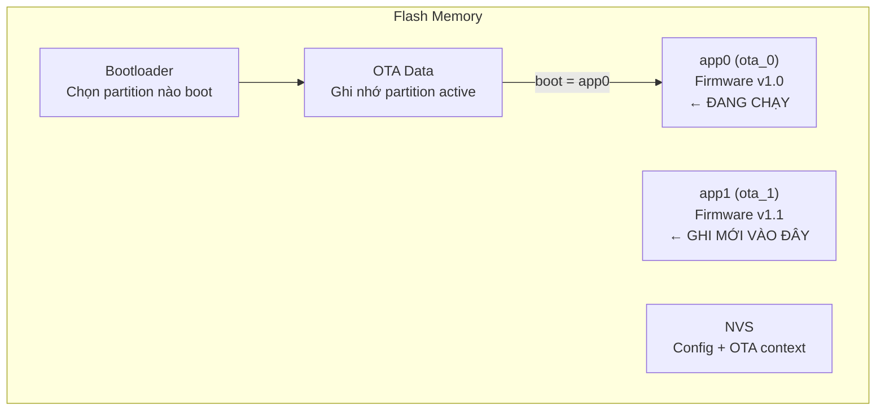
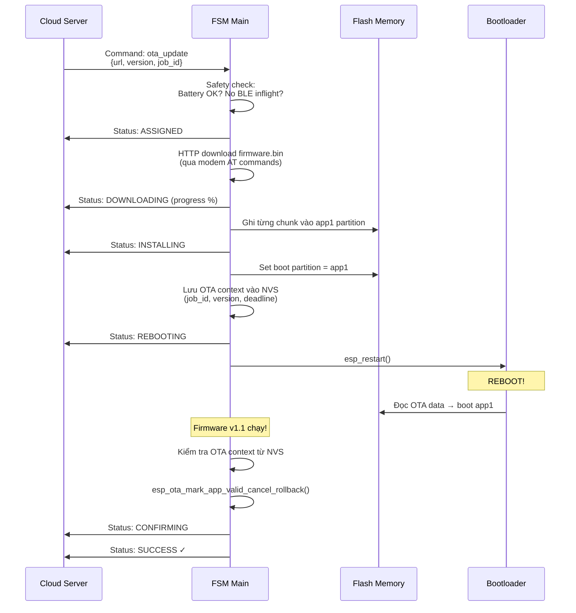
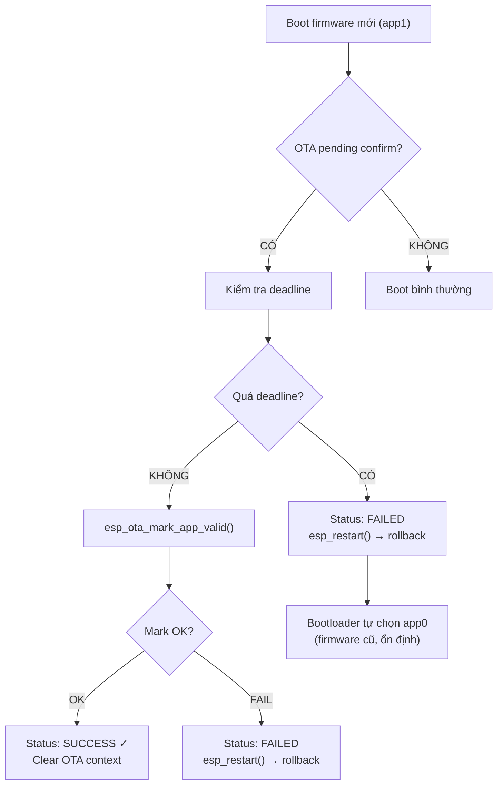

# 10 - OTA Firmware Update

> Over-The-Air update: download, flash, confirm, rollback.

---

## Mục lục

1. [OTA là gì?](#1-ota-là-gì)
2. [Partition Scheme](#2-partition-scheme)
3. [Update Flow](#3-update-flow)
4. [Confirm & Rollback](#4-confirm--rollback)
5. [Safety Checks](#5-safety-checks)

---

## 1. OTA là gì?

OTA (Over-The-Air) cho phép cập nhật firmware từ xa qua mạng,
không cần kết nối USB vật lý. Quan trọng cho thiết bị IoT triển khai ngoài field.

**Rủi ro:** Nếu firmware mới bị lỗi → device "brick" (không hoạt động).
Giải pháp: **dual partition + rollback**.

---

## 2. Partition Scheme



**Giải thích:**
- 2 partition firmware (app0, app1) — luôn có 1 bản backup
- Firmware hiện tại chạy từ app0
- Download firmware mới → ghi vào app1 (không đụng app0)
- Reboot → boot từ app1
- Nếu app1 lỗi → rollback về app0 (vẫn còn nguyên)

---

## 3. Update Flow



---

## 4. Confirm & Rollback



**Giải thích:**
- Sau OTA reboot, firmware mới phải **confirm** trong thời gian cho phép
- `esp_ota_mark_app_valid_cancel_rollback()`: "Firmware mới OK, đừng rollback"
- Nếu firmware mới crash trước khi confirm → watchdog reset → bootloader chọn app0
- Nếu quá deadline → firmware tự rollback

**OTA context được lưu NVS** (survive reboot):
- `job_id`: ID của OTA job (để report status)
- `target_version`: Version mới
- `confirm_deadline_ms`: Thời hạn confirm
- `pending_confirm`: Flag "cần confirm"

---

## 5. Safety Checks

Trước khi bắt đầu OTA:

| Check | Lý do |
|-------|-------|
| Battery > threshold | Mất điện giữa flash → brick |
| No BLE connect inflight | Tránh conflict resource |
| MQTT connected | Cần report status |
| Not already in OTA | Tránh concurrent OTA |

```c
static bool state_machine_ota_start_is_safe(void) {
    // Kiểm tra mọi điều kiện trước khi bắt đầu OTA
    if (s_telemetry.vehicle_battery < s_config.ota_min_battery_mv) return false;
    if (s_ble_connect_inflight) return false;
    // ...
    return true;
}
```

---

> **Tiếp theo:** [11-debugging-techniques.md](./11-debugging-techniques.md) — Debug firmware
