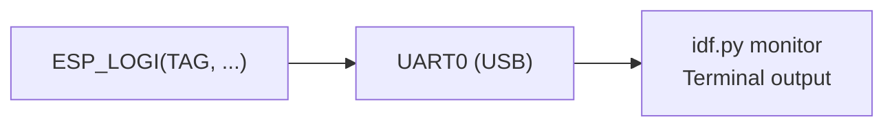
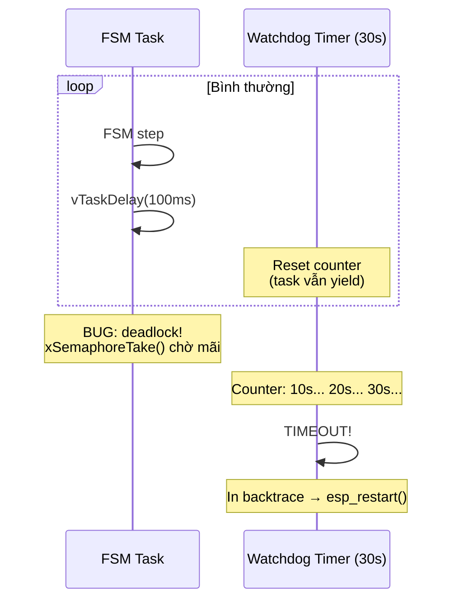
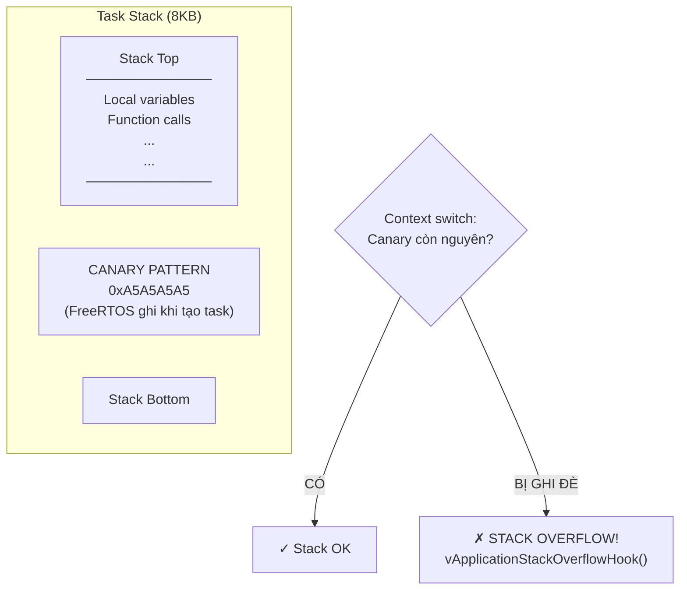

# 11 - Debugging Techniques

> Cách debug firmware ESP32: logging, watchdog, stack overflow, crash analysis.

---

## Mục lục

1. [ESP Logging](#1-esp-logging)
2. [Task Watchdog](#2-task-watchdog)
3. [Stack Overflow Detection](#3-stack-overflow-detection)
4. [Common Crash Patterns](#4-common-crash-patterns)
5. [UART Monitor](#5-uart-monitor)

---

## 1. ESP Logging

Công cụ debug chính trong embedded — không có breakpoint như desktop app.



**Log format trong project:**
```
I (1234) TRACKER_MAIN: event=boot_summary boot_count=5 wakeup=2 initial_state=1
W (5678) OBD_RUNTIME: event=ble_reconnect_hint_cleared reason=connect_failed
E (9012) MODEM_AT: event=at_uart_init_failed err=ESP_ERR_NO_MEM
```

| Phần | Ý nghĩa |
|------|---------|
| `I` / `W` / `E` | Level: Info / Warning / Error |
| `(1234)` | Timestamp (ms since boot) |
| `TRACKER_MAIN` | TAG — file/module nào log |
| `event=...` | Structured log — dễ grep/parse |

**Tips:**
- Dùng `event=<tên>` format → dễ filter: `grep "event=ble_connect"`
- Dùng key=value → dễ parse tự động
- Giảm log level production: `CONFIG_LOG_DEFAULT_LEVEL_WARN`

---

## 2. Task Watchdog

Phát hiện task bị "đơ" (infinite loop, deadlock):



**Output khi watchdog trigger:**
```
E (30000) task_wdt: Task watchdog got triggered.
E (30000) task_wdt: - IDLE0 (CPU 0)
E (30000) task_wdt: Tasks currently running:
E (30000) task_wdt: CPU 0: main
E (30000) task_wdt: Backtrace: 0x40081234:0x3ffb5678 ...
```

**Đọc backtrace:** Dùng `idf.py monitor` — tự động decode địa chỉ thành file:line.

---

## 3. Stack Overflow Detection

Mỗi task có stack cố định. Nếu dùng quá → ghi đè memory → crash khó debug.



**Kiểm tra stack còn lại:**
```c
// Kiểm tra "high water mark" — stack tối thiểu còn lại (bytes)
UBaseType_t remaining = uxTaskGetStackHighWaterMark(NULL);
ESP_LOGI(TAG, "stack_remaining=%u bytes", remaining * 4);
// Nếu < 200 bytes → nguy hiểm, cần tăng stack size
```

---

## 4. Common Crash Patterns

| Crash | Nguyên nhân | Cách fix |
|-------|-------------|----------|
| `LoadProhibited` | Đọc pointer NULL hoặc freed memory | Check NULL trước khi dùng |
| `StoreProhibited` | Ghi vào địa chỉ invalid | Check buffer bounds |
| `InstrFetchProhibited` | Jump tới địa chỉ sai | Function pointer bị corrupt |
| `Watchdog timeout` | Task không yield > 30s | Tìm infinite loop / deadlock |
| `Stack overflow` | Đệ quy sâu hoặc buffer local quá lớn | Tăng stack hoặc dùng heap |
| `Heap exhaustion` | malloc trả NULL | Check return value, free đúng |

**Pattern debug:**
1. Đọc crash log → tìm backtrace
2. `idf.py monitor` decode backtrace → file:line
3. Kiểm tra code tại vị trí đó
4. Thêm log trước/sau để narrow down

---

## 5. UART Monitor

```bash
# Flash và monitor cùng lúc
idf.py flash monitor

# Chỉ monitor (không flash)
idf.py monitor

# Filter log theo TAG
idf.py monitor | grep "OBD_RUNTIME"

# Decode backtrace tự động (built-in)
# Khi thấy "Backtrace: 0x400..." → tự hiện file:line
```

**Phím tắt trong monitor:**
- `Ctrl+]` : Thoát monitor
- `Ctrl+T` → `Ctrl+R` : Reset ESP32
- `Ctrl+T` → `Ctrl+F` : Filter output

---

> **Tiếp theo:** [12-c-programming-patterns.md](./12-c-programming-patterns.md) — C patterns cho embedded
