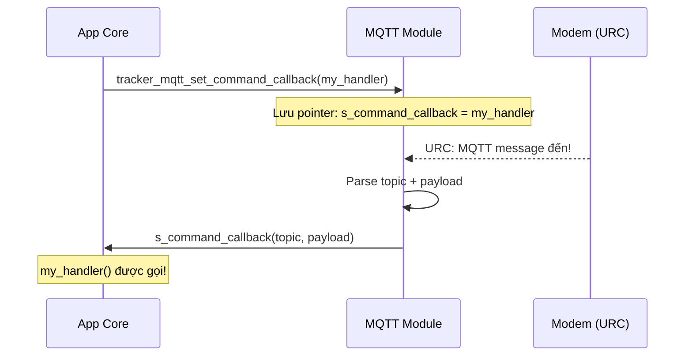
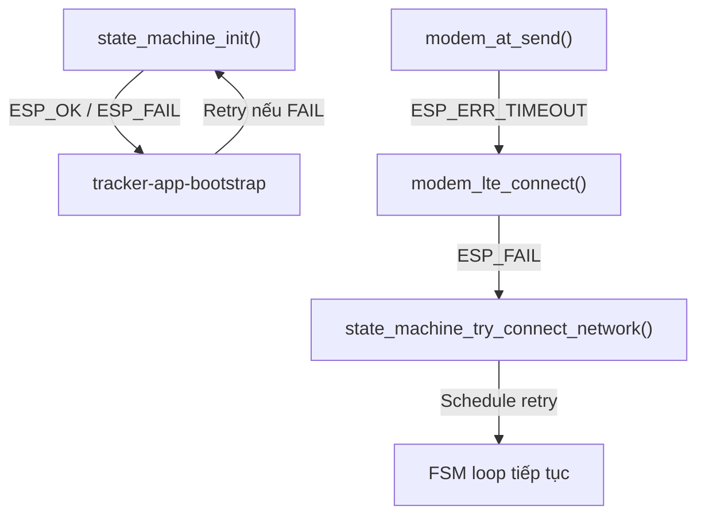

# 12 - C Programming Patterns

> Các pattern C thường dùng trong embedded firmware.

---

## Mục lục

1. [Callback Functions](#1-callback-functions)
2. [Opaque Pointer (Handle)](#2-opaque-pointer-handle)
3. [Error Propagation](#3-error-propagation)
4. [Static & Const](#4-static--const)
5. [Memory Management](#5-memory-management)
6. [Defensive Coding](#6-defensive-coding)

---

## 1. Callback Functions

Callback = truyền hàm như tham số. Cho phép module A gọi code của module B
mà không cần biết module B là gì.



**Code mẫu:**
```c
// Định nghĩa kiểu callback
typedef void (*mqtt_command_cb_t)(const char *topic, const char *payload);

// Module MQTT lưu callback
static mqtt_command_cb_t s_command_callback = NULL;

void tracker_mqtt_set_command_callback(mqtt_command_cb_t cb) {
    s_command_callback = cb;  // Lưu pointer hàm
}

// Khi có message → gọi callback
if (s_command_callback != NULL) {
    s_command_callback(topic, payload);
}

// App core đăng ký handler
void state_machine_command_callback(const char *topic, const char *payload) {
    command_handler_process(payload);
}

// Đăng ký
tracker_mqtt_set_command_callback(state_machine_command_callback);
```

**Tại sao dùng callback?**
- MQTT module không cần `#include` app-core
- Loose coupling: thay đổi handler không cần sửa MQTT module
- Testable: có thể inject mock callback khi test

---

## 2. Opaque Pointer (Handle)

Ẩn implementation details — caller chỉ thấy "handle", không biết struct bên trong.

```c
// Public header (ble_obd.h) — caller thấy:
typedef struct ble_obd_ctx ble_obd_ctx_t;  // Opaque! Không biết bên trong có gì

ble_obd_ctx_t *ble_obd_connect(...);
void ble_obd_disconnect(ble_obd_ctx_t *ctx);
esp_err_t ble_obd_request_pid(ble_obd_ctx_t *ctx, uint8_t mode, uint8_t pid);

// Private implementation (ble_obd.c) — chỉ file này biết:
struct ble_obd_ctx {
    uint16_t conn_handle;
    SemaphoreHandle_t api_mutex;
    SemaphoreHandle_t response_sem;
    uint8_t response_buf[256];
    // ... internal state ...
};
```

**Lợi ích:**
- Caller không thể truy cập trực tiếp internal state → an toàn
- Thay đổi struct không cần recompile caller
- API rõ ràng: chỉ dùng được qua exported functions

---

## 3. Error Propagation

Pattern truyền lỗi từ tầng thấp lên tầng cao:



**Pattern:**
```c
esp_err_t modem_lte_connect(void) {
    esp_err_t err;
    
    err = modem_at_send("AT+CGACT=1,1", response, sizeof(response), 5000);
    if (err != ESP_OK) {
        return err;  // Propagate lỗi lên caller
    }
    
    // Kiểm tra response
    if (strstr(response, "OK") == NULL) {
        return ESP_FAIL;
    }
    
    return ESP_OK;
}
```

---

## 4. Static & Const

| Keyword | Ý nghĩa | Dùng khi |
|---------|---------|----------|
| `static` (biến) | File-scope — chỉ file này thấy | Biến module-level (s_lock, s_config) |
| `static` (hàm) | Private — không export | Helper functions nội bộ |
| `const` | Không thể thay đổi | Config constants, string literals |
| `static const` | Private + immutable | Lookup tables, magic numbers |

**Convention trong project:**
```c
// s_ prefix = static (file-scope)
static SemaphoreHandle_t s_at_lock = NULL;
static bool s_uart_ready = false;

// g_ prefix = global (extern)
rtc_context_t g_rtc_context;

// UPPER_CASE = compile-time constant
#define TRACKER_BLE_CONNECT_TIMEOUT_MS 8000U

// static const = runtime constant
static const char *TAG = "MODEM_AT";
static const TickType_t LOCK_TIMEOUT = pdMS_TO_TICKS(250);
```

---

## 5. Memory Management

Embedded có RAM hạn chế (~320KB trên ESP32-S3). Phải cẩn thận:

| Loại | Ở đâu | Khi nào free | Dùng khi |
|------|-------|-------------|----------|
| Stack | Task stack | Tự động (return) | Biến local nhỏ |
| Heap | RAM chung | Phải gọi free() | Buffer lớn, dynamic size |
| Static | RAM cố định | Không free | Biến module-level |
| RTC | RTC memory | Survive deep sleep | Context qua sleep |

**Pattern trong project:**
```c
// Stack — biến local (tự free khi hàm return)
char response[256];  // OK nếu < vài KB

// Heap — dynamic allocation (PHẢI free)
tracker_ble_connect_task_args_t *args = calloc(1, sizeof(*args));
// ... dùng args ...
free(args);  // PHẢI free, nếu không → memory leak

// Static — sống mãi
static telemetry_t s_telemetry = {0};

// RTC — survive deep sleep
RTC_DATA_ATTR rtc_context_t g_rtc_context;
```

---

## 6. Defensive Coding

```c
// 1. Luôn check NULL
ESP_RETURN_ON_NULL(config, ESP_ERR_INVALID_ARG, TAG, "config is NULL");

// 2. Luôn check return value
esp_err_t err = modem_at_send(...);
if (err != ESP_OK) {
    ESP_LOGW(TAG, "AT send failed: %s", esp_err_to_name(err));
    return err;
}

// 3. Bounded copy (tránh buffer overflow)
util_copy_string(dest, sizeof(dest), src);  // Không bao giờ overflow

// 4. Timeout cho mọi blocking operation
xSemaphoreTake(lock, pdMS_TO_TICKS(250));  // Không chờ vô hạn

// 5. Giới hạn loop iterations
for (uint32_t i = 0; i < TRACKER_PENDING_ACTION_DRAIN_LIMIT; ++i) {
    // Tránh drain vô hạn nếu queue liên tục có data
}
```

---

> **Tiếp theo:** [13-project-architecture.md](./13-project-architecture.md) — Kiến trúc tổng thể project
