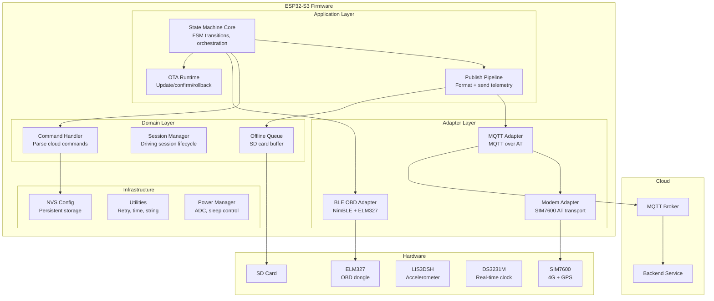
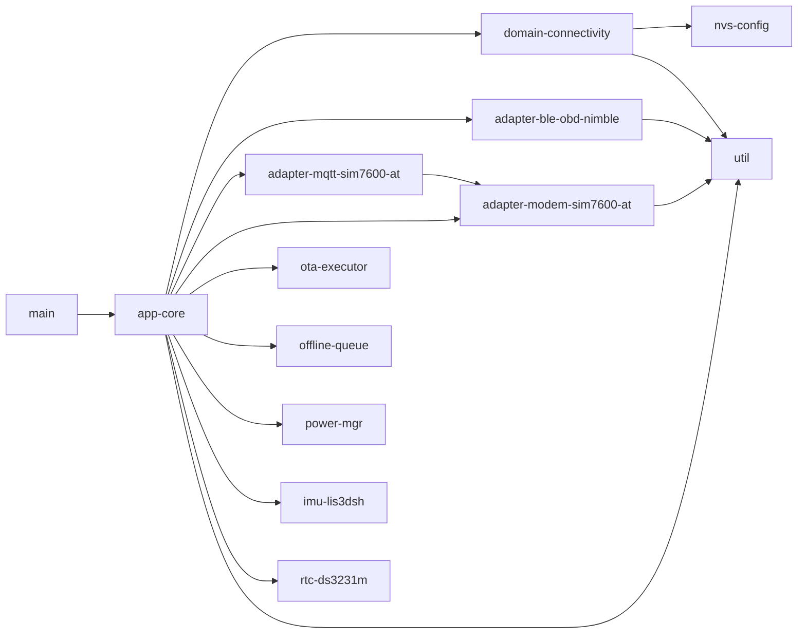
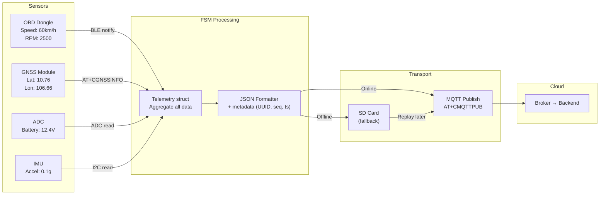
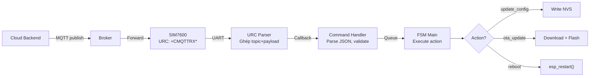

# 13 - Project Architecture

> Kiến trúc tổng thể firmware: component layout, data flow, design decisions.

---

## Mục lục

1. [High-Level Architecture](#1-high-level-architecture)
2. [Component Dependency](#2-component-dependency)
3. [End-to-End Data Flow](#3-end-to-end-data-flow)
4. [Design Decisions](#4-design-decisions)
5. [File Map](#5-file-map)

---

## 1. High-Level Architecture

**Layered Architecture:**
- **Application**: Logic điều khiển — KHÔNG biết hardware cụ thể
- **Domain**: Logic nghiệp vụ — command parsing, session management
- **Adapter**: Giao tiếp hardware cụ thể — có thể thay thế (ví dụ: đổi modem)
- **Infrastructure**: Utilities dùng chung

---

## 2. Component Dependency

**Quy tắc dependency:**
- Mũi tên = "phụ thuộc vào" (include header, gọi API)
- Tầng trên phụ thuộc tầng dưới (KHÔNG ngược lại)
- Adapter không phụ thuộc lẫn nhau
- Util không phụ thuộc ai (leaf node)

---

## 3. End-to-End Data Flow

### Xe đang chạy → Cloud nhận telemetry

### Cloud gửi command → Device thực thi

---

## 4. Design Decisions

| Quyết định | Lý do |
|------------|-------|
| **1 task FSM thay vì multi-task** | Đơn giản, không race condition, dễ debug. 100ms latency đủ cho tracker |
| **MQTT qua AT thay vì TCP socket** | Tiết kiệm 30KB RAM (không cần TLS stack trên ESP32). Modem xử lý reconnect |
| **Offline queue trên SD card** | Flash NVS có giới hạn write cycles. SD card chịu được millions of writes |
| **Cooperative FSM thay vì event-driven** | Deterministic timing, dễ trace, không cần event loop framework |
| **BLE connect offload sang task riêng** | Blocking 8s — ngoại lệ duy nhất cần task riêng |
| **Retry manager pattern** | Exponential backoff tránh flood khi lỗi liên tục. Configurable per-subsystem |
| **RTC-retained context** | Survive deep sleep — giữ boot count, BLE MAC, OTA state qua sleep cycles |
| **Structured logging (event=...)** | Dễ grep, dễ parse tự động, dễ monitor field devices |

---

## 5. File Map

| File | Vai trò |
|------|---------|
| `main/main.c` | Entry point — chỉ gọi `app_core_bootstrap_run()` |
| `app-core/src/tracker-app-bootstrap.c` | Boot sequence, config load, FSM main loop |
| `app-core/src/state_machine_core.c` | FSM switch/case, state handlers, init |
| `app-core/src/state_obd_runtime.c` | BLE OBD connect task, OBD polling |
| `app-core/src/state_publish_pipeline.c` | Format + publish telemetry/status/events |
| `app-core/src/state_sleep_controller.c` | Sleep decision, shutdown sequence |
| `app-core/src/state_ota_runtime.c` | OTA command handling, confirm/rollback |
| `app-core/src/state_wake_prelude.c` | Wake-up initialization sequence |
| `domain-connectivity/src/command_handler.c` | Parse cloud commands, queue actions |
| `adapter-ble-obd-nimble/src/ble_mgr.c` | BLE scan/connect/disconnect manager |
| `adapter-ble-obd-nimble/src/ble_init.c` | NimBLE stack init/deinit |
| `adapter-modem-sim7600-at/src/modem_at.c` | UART AT transport, mutex, URC dispatch |
| `adapter-mqtt-sim7600-at/src/mqtt_client.c` | MQTT connect/publish/subscribe |
| `adapter-mqtt-sim7600-at/src/mqtt_urc_parser.c` | Parse MQTT URC messages |

---

> Đây là file cuối trong bộ tài liệu programming-knowledge.
> Quay lại: [01-freertos-fundamentals.md](./01-freertos-fundamentals.md)
