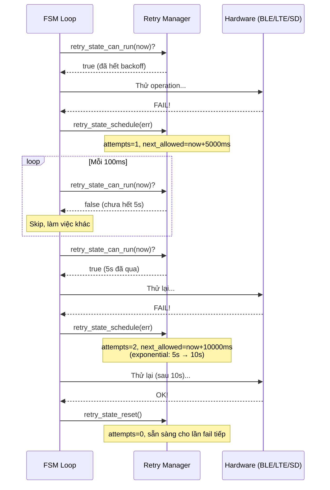
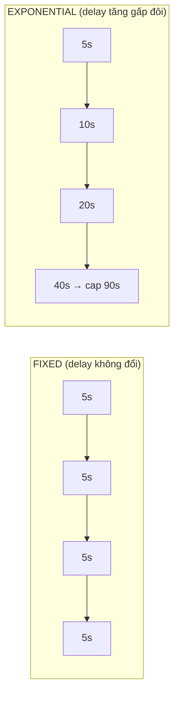

# 14 - Retry Manager

> Pattern retry/backoff dùng xuyên suốt firmware: BLE, LTE, GNSS, SD mount, offline replay.
> File: `components/shared-kernel/src/retry_manager.c` + `include/retry_manager.h`

---

## Mục lục

1. [Tại sao cần Retry Manager?](#1-tại-sao-cần-retry-manager)
2. [Retry Policy — Cấu hình backoff](#2-retry-policy)
3. [Retry State — Trạng thái runtime](#3-retry-state)
4. [Cách hoạt động](#4-cách-hoạt-động)
5. [Các policy trong project](#5-các-policy-trong-project)
6. [RETRY_ATTEMPT Macro](#6-retry_attempt-macro)

---

## 1. Tại sao cần Retry Manager?

Khi một operation fail (BLE connect, LTE attach, SD mount...), firmware không nên:
- Retry ngay lập tức liên tục → flood, tốn CPU, tốn pin
- Bỏ cuộc luôn → mất kết nối vĩnh viễn

Giải pháp: **retry với backoff** — chờ lâu dần giữa các lần thử.



**Giải thích:** Retry manager không tự gọi operation — nó chỉ trả lời "được thử chưa?"
và "lần sau chờ bao lâu?". FSM loop hỏi mỗi iteration (100ms) và chỉ thử khi được phép.

---

## 2. Retry Policy

Policy là cấu hình **bất biến** (const) — định nghĩa cách backoff hoạt động:

```c
typedef struct {
    retry_mode_t mode;       // FIXED hoặc EXPONENTIAL
    uint32_t base_delay_ms;  // Delay ban đầu
    uint32_t max_delay_ms;   // Delay tối đa (cap)
    uint32_t max_attempts;   // Giới hạn số lần (0 = vô hạn)
    uint32_t jitter_ms;      // Random spread (0 = tắt)
} retry_policy_t;
```

**Hai chế độ:**



- **FIXED**: Mỗi lần retry chờ cùng thời gian. Dùng cho init retry (10s cố định)
- **EXPONENTIAL**: Delay nhân đôi mỗi lần fail. Dùng cho BLE, LTE (tránh flood khi lỗi kéo dài)

---

## 3. Retry State

State là trạng thái **thay đổi** runtime — theo dõi đã thử bao nhiêu lần:

```c
typedef struct {
    uint32_t attempts;        // Số lần đã thử
    uint64_t next_allowed_ms; // Thời điểm sớm nhất được thử lại
    esp_err_t last_err;       // Lỗi gần nhất
} retry_state_t;
```

---

## 4. Cách hoạt động

**API chính:**

| Hàm | Mô tả |
|-----|--------|
| `retry_state_reset(state)` | Reset về 0 — cho phép thử ngay |
| `retry_state_can_run(state, now)` | `now >= next_allowed_ms`? |
| `retry_state_schedule(state, policy, now, err)` | Tính delay, set next_allowed |
| `retry_state_current_delay_ms(state, policy, seed)` | Tính delay hiện tại |

**Công thức exponential:**
```
delay = base_delay_ms × 2^attempts
delay = min(delay, max_delay_ms)        // Cap
delay = delay + (seed_ms % jitter_ms)   // Jitter (optional)
```

---

## 5. Các policy trong project

| Subsystem | Mode | Base | Max | Dùng cho |
|-----------|------|------|-----|----------|
| BLE retry (driving) | Exponential | 5s | 120s | Reconnect OBD khi xe chạy |
| BLE retry (parked) | Exponential | 5s | 30s | Reconnect OBD khi xe đỗ |
| Network retry | Exponential | 5s | 90s | LTE reconnect |
| RTC bootstrap | Exponential | 5s | 60s | I2C RTC init |
| IMU bootstrap | Exponential | 5s | 60s | I2C IMU init |
| Init retry | Fixed | 10s | 10s | state_machine_init |
| SD mount | Fixed | 30s | 30s | SD card remount |
| Offline replay | Exponential | 1s | 30s | MQTT replay publish |

---

## 6. RETRY_ATTEMPT Macro

Macro tiện lợi gộp pattern 8-10 dòng thành 1 dòng:

```c
// Thay vì viết:
if (retry_state_can_run(&s_network_retry, now_ms)) {
    esp_err_t err = modem_lte_tick(now_ms);
    if (err != ESP_OK) {
        retry_state_schedule(&s_network_retry, &policy, now_ms, err);
    } else {
        retry_state_reset(&s_network_retry);
    }
}

// Viết gọn:
RETRY_ATTEMPT(s_network_retry, g_network_policy, now_ms, "lte_tick", modem_lte_tick(now_ms));
```

---

> **Tiếp theo:** [15-telemetry-model.md](./15-telemetry-model.md)
