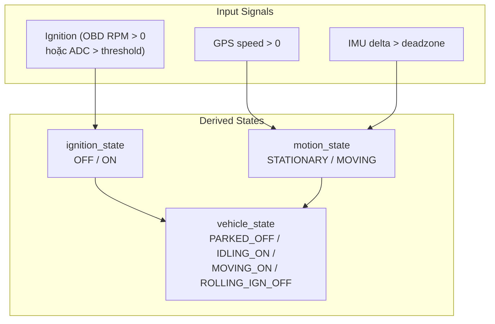

# 15 - Telemetry Model & Data Formatter

> Cấu trúc dữ liệu telemetry và cách format JSON gửi lên cloud.
> Files: `shared-kernel/include/telemetry_model.h`, `contracts-device-cloud/include/data_formatter.h`

---

## Mục lục

1. [Telemetry Struct](#1-telemetry-struct)
2. [State Enums](#2-state-enums)
3. [GNSS Model](#3-gnss-model)
4. [OBD Model](#4-obd-model)
5. [Data Formatter — JSON Output](#5-data-formatter)
6. [Telemetry Counters](#6-telemetry-counters)

---

## 1. Telemetry Struct

`telemetry_t` là snapshot tổng hợp mọi dữ liệu sensor tại 1 thời điểm:

```c
// shared-kernel/include/telemetry_model.h
typedef struct {
    // === GPS ===
    gnss_data_t gnss;              // lat, lon, speed, satellites, fix_valid

    // === Voltage ===
    float vehicle_battery;          // Pin xe 12V (qua ADC divider)
    float device_battery;           // Pin backup ESP32

    // === IMU ===
    float imu_accel_delta_mps2;     // Peak acceleration delta (m/s²)

    // === Ignition & State ===
    bool ignition;                  // Ignition ON/OFF (debounced)
    tracker_ignition_state_t ignition_state;   // UNKNOWN/OFF/ON
    tracker_motion_state_t motion_state;       // STATIONARY/MOVING
    tracker_vehicle_state_t vehicle_state;     // PARKED_OFF/IDLING/MOVING_ON/...
    tracker_device_state_t device_state;       // BOOTING/ACTIVE/SLEEPING/...

    // === OBD Data ===
    int32_t obd_rpm;                // Engine RPM (PID 0x0C)
    int32_t obd_speed;              // Vehicle speed km/h (PID 0x0D)
    int32_t obd_coolant_temp;       // Coolant °C (PID 0x05)
    int32_t obd_fuel_level;         // Fuel % (PID 0x2F)
    int32_t obd_engine_load;        // Engine load % (PID 0x04)
    bool obd_ble_connected;         // BLE link active?
    bool obd_elm_ready;             // ELM327 initialized?
    obd_readiness_t obd_readiness;  // MIL + monitor status
    obd_dtc_list_t obd_stored_dtc;  // Stored DTCs (mode 03)
    obd_dtc_list_t obd_pending_dtc; // Pending DTCs (mode 07)
} telemetry_t;
```

---

## 2. State Enums

Firmware derive các "axis" trạng thái từ raw sensor data:



| Vehicle State | Ignition | Motion | Ý nghĩa |
|---------------|----------|--------|----------|
| `PARKED_OFF` | OFF | Stationary | Xe đỗ, tắt máy |
| `ROLLING_IGN_OFF` | OFF | Moving | Xe lăn bánh không nổ máy (dốc?) |
| `IDLING_ON` | ON | Stationary | Xe nổ máy, đứng yên |
| `MOVING_ON` | ON | Moving | Xe đang chạy bình thường |

---

## 3. GNSS Model

```c
// shared-kernel/include/gnss_model.h
typedef struct {
    double latitude;           // Vĩ độ (decimal degrees)
    double longitude;          // Kinh độ (decimal degrees)
    float speed_kmh;           // Tốc độ GPS (km/h)
    float course_deg;          // Hướng di chuyển (0-360°)
    uint8_t satellites;        // Số vệ tinh (GPS + GLONASS)
    uint64_t timestamp_ms;     // Timestamp từ GNSS
    bool fix_valid;            // Có fix hợp lệ không?
    gnss_query_mode_t query_mode; // CGNSINF hoặc CGPSINFO
} gnss_data_t;
```

---

## 4. OBD Model

### PID Conversions

```c
// domain-obd/src/obd_conversions.c

// RPM: 2 bytes, formula = (A*256 + B) / 4
int obd_convert_rpm(int32_t *value, const uint8_t *data, size_t len) {
    *value = ((data[0] << 8) | data[1]) / 4;  // Ví dụ: 0x0B 0xB8 → 3000 RPM
}

// Temperature: 1 byte, formula = A - 40
int obd_convert_temperature(int32_t *value, const uint8_t *data, size_t len) {
    *value = (int32_t)data[0] - 40;  // Ví dụ: 0x5A → 50°C
}

// Percent: 1 byte, formula = A * 100 / 255
int obd_convert_percent(int32_t *value, const uint8_t *data, size_t len) {
    *value = (data[0] * 100) / 255;  // Ví dụ: 0x80 → 50%
}
```

### DTC (Diagnostic Trouble Codes)

```c
// shared-kernel/include/obd_model.h
typedef struct {
    bool valid;
    uint8_t count;
    char codes[8][6];  // Tối đa 8 mã lỗi, mỗi mã 5 ký tự: "P0171"
} obd_dtc_list_t;
```

---

## 5. Data Formatter

JSON payload được build bằng cJSON library:

```c
// contracts-device-cloud/include/data_formatter.h

// Rawdata: GPS + OBD + battery + session metadata
char *data_format_rawdata(const config_t *cfg, const telemetry_t *telemetry,
                          bool include_auth_token, bool timestamp_trusted,
                          uint64_t timestamp_ms, const char *message_id,
                          uint32_t seq_no, const char *boot_id,
                          uint32_t local_session_key, uint64_t canonical_session_id,
                          const char *session_boot_id);

// Status: ignition boundary events
char *data_format_status(..., const char *boundary_event);

// Event: alerts and diagnostics
char *data_format_event(..., const char *event_type, int code, const char *message);

// Firmware: OTA lifecycle
char *data_format_firmware(..., const firmware_status_t *status);
```

**Output JSON mẫu (rawdata):**
```json
{
  "deviceId": "TRACKER_001",
  "messageId": "a1b2c3d4-...",
  "seqNo": 1234,
  "bootId": "boot-5-3f2a1b4c",
  "timestamp": 1716300000000,
  "timestampTrusted": true,
  "ignition": true,
  "ignitionState": "on",
  "motionState": "moving",
  "vehicleState": "moving_on",
  "lat": 10.762345,
  "lon": 106.660123,
  "speed": 60.5,
  "satellites": 8,
  "vehicleBattery": 12.4,
  "deviceBattery": 3.95,
  "imuAccelDelta": 0.45,
  "obd": {
    "connected": true,
    "rpm": 2500,
    "speed": 60,
    "coolantTemp": 85,
    "fuelLevel": 65,
    "engineLoad": 42
  }
}
```

---

## 6. Telemetry Counters

30+ runtime counters cho diagnostics (không persist qua reboot):

```c
// domain-telemetry/include/telemetry_counters.h
typedef struct {
    // SD Card
    uint32_t sd_write_ok, sd_write_fail, sd_fsync_fail;
    // Offline Replay
    uint32_t replay_success, replay_retry, replay_drop, quota_hit;
    // MQTT
    uint32_t mqtt_publish_ok, mqtt_publish_fail, mqtt_publish_fallback;
    // LTE Recovery
    uint32_t lte_recovery_start, lte_recovery_success, lte_recovery_fail;
    // OBD
    uint32_t obd_read_ok, obd_timeout, obd_invalid_response;
    // OTA
    uint32_t ota_http_start, ota_http_success, ota_http_fail;
    // GNSS
    uint32_t gnss_cgnsinf_fix_ok, gnss_cgnsinf_fail;
    uint32_t gnss_cgpsinfo_fix_ok, gnss_cgpsinfo_fail;
    uint32_t gnss_no_fix_recover, gnss_self_heal, gnss_query_mode_switched;
} telemetry_counters_t;
```

Counters được log định kỳ trong health snapshot và có thể gửi lên cloud.

---

> **Tiếp theo:** [16-obd-protocol.md](./16-obd-protocol.md)
