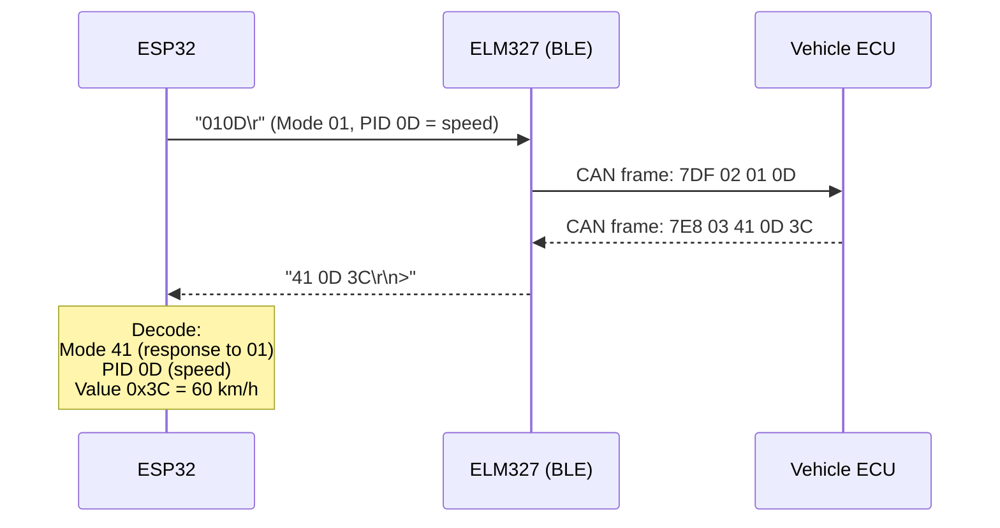
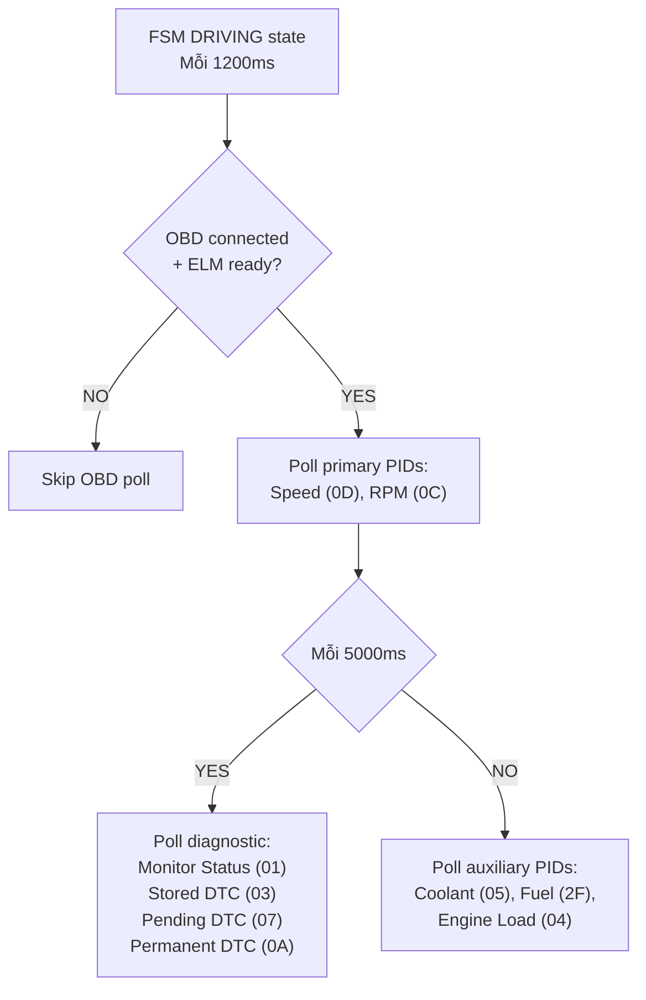

# 16 - OBD-II Protocol

> Giao thức OBD-II: PID requests, response decode, DTC, readiness monitors.
> Files: `domain-obd/`, `adapter-ble-obd-nimble/`, `app-core/src/state_obd_runtime.c`

---

## Mục lục

1. [OBD-II là gì?](#1-obd-ii-là-gì)
2. [OBD Modes](#2-obd-modes)
3. [PID Request/Response](#3-pid-requestresponse)
4. [PIDs dùng trong project](#4-pids-dùng-trong-project)
5. [DTC — Mã lỗi xe](#5-dtc--mã-lỗi-xe)
6. [Readiness Monitors](#6-readiness-monitors)
7. [Polling Flow trong FSM](#7-polling-flow-trong-fsm)

---

## 1. OBD-II là gì?

OBD-II (On-Board Diagnostics) là chuẩn chẩn đoán xe hơi. Mọi xe từ 1996+ đều có
cổng OBD-II (16-pin connector dưới vô-lăng). Qua cổng này có thể đọc:
- Tốc độ, RPM, nhiệt độ, mức nhiên liệu
- Mã lỗi (DTC) khi đèn check engine sáng
- Trạng thái hệ thống khí thải

**Trong project:** ESP32 kết nối BLE tới ELM327 dongle cắm vào cổng OBD-II.
ELM327 dịch OBD protocol (CAN bus) sang text commands qua BLE.

---

## 2. OBD Modes

| Mode | Hex | Mô tả | Response prefix |
|------|-----|--------|-----------------|
| 01 | 0x01 | Current data (live) | 41 |
| 02 | 0x02 | Freeze frame data | 42 |
| 03 | 0x03 | Stored DTCs | 43 |
| 04 | 0x04 | Clear DTCs | 44 |
| 07 | 0x07 | Pending DTCs | 47 |
| 09 | 0x09 | Vehicle info (VIN) | 49 |
| 0A | 0x0A | Permanent DTCs | 4A |

**Response rule:** Mode + 0x40. Ví dụ: request mode 01 → response bắt đầu bằng 41.

---

## 3. PID Request/Response



**Format:**
- Request: `"01XX\r"` — Mode (01) + PID (XX)
- Response: `"41 XX YY [ZZ]\r\n>"` — Mode+40, PID, Data bytes, prompt `>`

---

## 4. PIDs dùng trong project

| PID | Hex | Tên | Bytes | Công thức | Đơn vị |
|-----|-----|-----|-------|-----------|--------|
| Vehicle Speed | 0x0D | `obd_speed` | 1 | A | km/h |
| Engine RPM | 0x0C | `obd_rpm` | 2 | (A×256+B)/4 | rpm |
| Coolant Temp | 0x05 | `obd_coolant_temp` | 1 | A−40 | °C |
| Engine Load | 0x04 | `obd_engine_load` | 1 | A×100/255 | % |
| Fuel Level | 0x2F | `obd_fuel_level` | 1 | A×100/255 | % |
| Monitor Status | 0x01 | `obd_readiness` | 4 | Bitmask | flags |

**Ví dụ decode RPM:**
```
Response: "41 0C 0B B8"
A = 0x0B = 11
B = 0xB8 = 184
RPM = (11 × 256 + 184) / 4 = (2816 + 184) / 4 = 3000 / 4 = 750 RPM
```

---

## 5. DTC — Mã lỗi xe

DTC format: 1 chữ cái + 4 số (ví dụ: P0171)

| Prefix | Hệ thống |
|--------|----------|
| P | Powertrain (động cơ, hộp số) |
| C | Chassis (khung gầm) |
| B | Body (thân xe) |
| U | Network (mạng CAN) |

**Decode từ 2 bytes:**
```
Byte 1: [AA][BB][CC][DD]  Byte 2: [EE][FF][GG][HH]
         ↑↑  ↑↑↑↑↑↑↑↑
         ||  ||||||||
         ||  └───────── Digit 2-4 (hex → decimal)
         └──── Prefix: 00=P, 01=C, 10=B, 11=U
               + First digit (0-3)
```

**Trong project:**
```c
// Mode 03: Stored DTCs (đèn check engine đang sáng)
ble_obd_request_mode(ctx, OBD_MODE_STORED_DTC, timeout);

// Mode 07: Pending DTCs (sắp sáng đèn)
ble_obd_request_mode(ctx, OBD_MODE_PENDING_DTC, timeout);

// Mode 0A: Permanent DTCs (không xóa được bằng scan tool)
ble_obd_request_mode(ctx, OBD_MODE_PERMANENT_DTC, timeout);
```

---

## 6. Readiness Monitors

PID 0x01 (Monitor Status) cho biết hệ thống khí thải đã self-test xong chưa:

```c
typedef struct {
    bool valid;
    bool mil_on;                    // Đèn check engine sáng?
    uint8_t reported_dtc_count;     // Số DTC hiện tại
    // Common monitors
    obd_monitor_status_t misfire;
    obd_monitor_status_t fuel_system;
    obd_monitor_status_t comprehensive_components;
    // Spark-ignition specific
    obd_monitor_status_t catalyst;
    obd_monitor_status_t evaporative_system;
    obd_monitor_status_t oxygen_sensor;
    // ...
} obd_readiness_t;
```

---

## 7. Polling Flow trong FSM



**Timing constants:**
```c
#define TRACKER_OBD_POLL_INTERVAL_MS        1200   // Primary PIDs
#define TRACKER_OBD_DIAGNOSTIC_POLL_INTERVAL_MS 5000 // DTC + readiness
#define TRACKER_OBD_PID_TIMEOUT_MS          700    // Timeout per request
```

---

> **Tiếp theo:** [17-runtime-config.md](./17-runtime-config.md)
