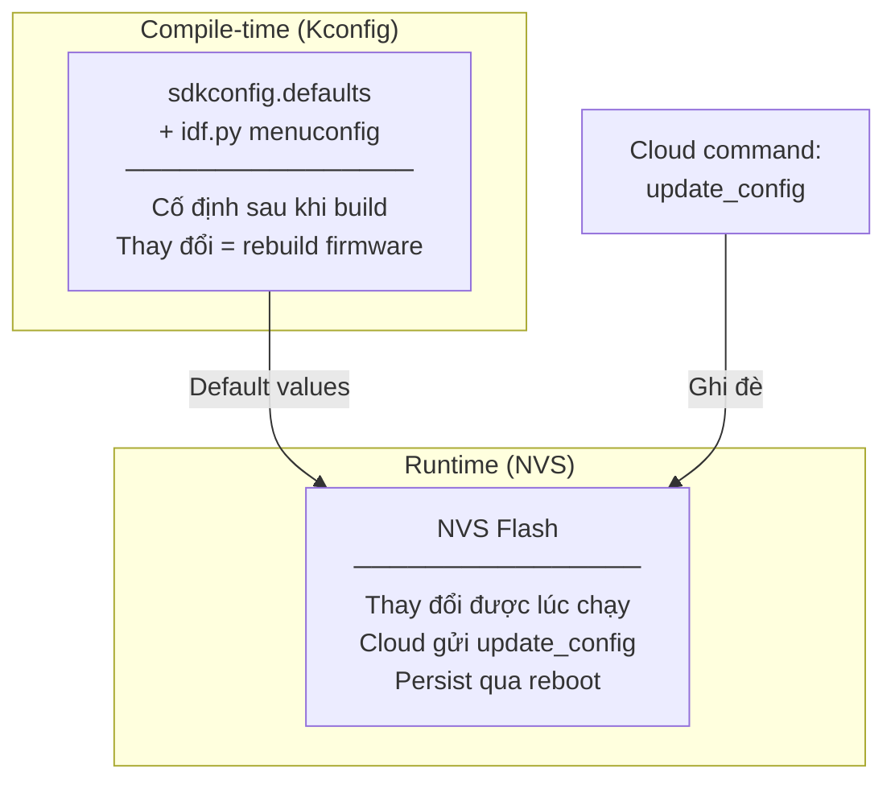
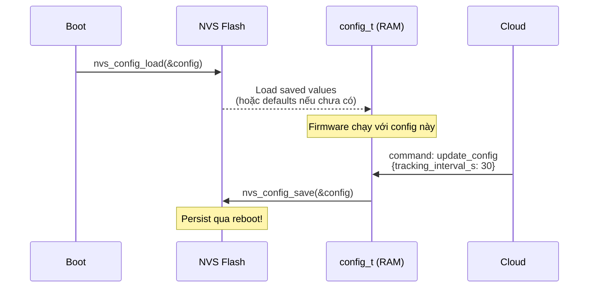
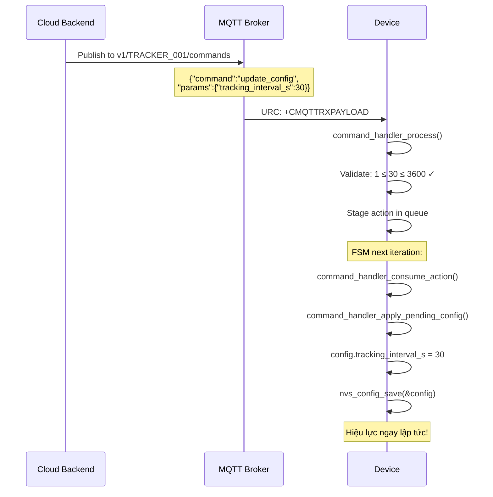

# 17 - Runtime Config & Kconfig

> Cấu hình firmware: compile-time (Kconfig) vs runtime (NVS). Mọi tham số có thể thay đổi.
> Files: `shared-kernel/include/runtime_config.h`, `adapter-kv-nvs/`, `main/Kconfig.projbuild`

---

## Mục lục

1. [Hai loại config](#1-hai-loại-config)
2. [Runtime Config (config_t)](#2-runtime-config)
3. [NVS Persistence](#3-nvs-persistence)
4. [Kconfig Options](#4-kconfig-options)
5. [Cloud Update Flow](#5-cloud-update-flow)

---

## 1. Hai loại config



| Loại | Khi nào thay đổi | Ví dụ |
|------|-------------------|-------|
| Kconfig | Compile time (rebuild) | TLS enable, SD quota, field-validation mode |
| NVS config | Runtime (cloud command) | Tracking interval, MQTT host, sleep enable |

---

## 2. Runtime Config

```c
// shared-kernel/include/runtime_config.h
typedef struct {
    // === Identity ===
    char device_id[32];           // "TRACKER_001"
    char auth_token[64];          // Token gửi trong payload

    // === MQTT ===
    char mqtt_host[64];           // "mqtt.thingdock.dev"
    uint16_t mqtt_port;           // 1883 hoặc 8883 (TLS)
    char mqtt_username[32];
    char mqtt_password[64];

    // === Timing ===
    uint16_t tracking_interval_s;    // Publish mỗi N giây khi driving (1-3600)
    uint16_t heartbeat_interval_s;   // Wake mỗi N giây khi sleeping (60-65535)
    uint16_t alarm_interval_s;       // Publish mỗi N giây khi alarm (1-60)
    uint16_t ignition_off_hold_ms;   // Chờ N ms trước khi kết thúc session (1000-60000)
    uint16_t alarm_timeout_s;        // Alarm tự tắt sau N giây (30-3600)

    // === Safety ===
    uint16_t ota_min_battery_mv;     // Pin tối thiểu cho OTA (3300-4500)
    uint16_t ignition_adc_threshold_mv; // Ngưỡng ADC ignition fallback (11000-15000)

    // === Features ===
    bool sleep_enabled;              // Cho phép deep sleep?
    bool imu_wakeup_enabled;         // IMU motion wake?
    bool command_subscribe_enabled;  // Nhận commands từ cloud?

    // === Network ===
    char apn[64];                    // APN nhà mạng: "internet"
    char obd2_ble_address[18];       // Preferred OBD MAC: "AA:BB:CC:DD:EE:FF"
} config_t;
```

---

## 3. NVS Persistence



**NVS Keys:**
```c
#define TRACKER_NVS_NAMESPACE       "tracker_cfg"
#define TRACKER_NVS_CONFIG_KEY      "config"         // Binary blob (config_t)
#define TRACKER_NVS_OTA_CONTEXT_KEY "ota_ctx_v1"     // OTA confirm state
#define TRACKER_NVS_SESSION_CONTEXT_KEY "session_ctx_v1" // Active session
```

---

## 4. Kconfig Options

40+ options trong `main/Kconfig.projbuild`. Nhóm chính:

### Network & Security
| Option | Default | Mô tả |
|--------|---------|--------|
| `TRACKER_DEFAULT_MQTT_HOST` | mqtt.thingdock.dev | Broker mặc định |
| `TRACKER_DEFAULT_MQTT_PORT` | 1883 | Port mặc định |
| `TRACKER_TLS_VERIFY_SERVER` | y | Verify TLS certificate |
| `TRACKER_TLS_CA_CERT_NAME` | isrgrootx1.pem | CA cert trên modem |
| `TRACKER_MQTT_DNS_FALLBACK_IPV4` | "" | Fallback IP khi DNS fail |

### Timing
| Option | Default | Mô tả |
|--------|---------|--------|
| `TRACKER_DEFAULT_TRACKING_INTERVAL_S` | 10 | Publish interval driving |
| `TRACKER_DEFAULT_HEARTBEAT_INTERVAL_S` | 900 | Wake interval sleeping |
| `TRACKER_IGNITION_DEBOUNCE_MS` | 1500 | Debounce window |
| `TRACKER_IGNITION_OFF_DRAIN_MS` | 3000 | Drain timeout after IGN OFF |

### SD Card
| Option | Default | Mô tả |
|--------|---------|--------|
| `TRACKER_SD_LOG_ENABLE` | y | Enable SD logging |
| `TRACKER_SD_LOG_QUOTA_BYTES` | 4194304 | Max queue size (4MB) |
| `TRACKER_SD_LOG_SOFT_QUOTA_PERCENT` | 80 | Throttle rawdata at 80% |
| `TRACKER_SD_LOG_HARD_QUOTA_PERCENT` | 95 | GC compaction at 95% |

### Field Validation Mode
| Option | Default | Mô tả |
|--------|---------|--------|
| `TRACKER_FIELD_VALIDATION_MODE` | n | Enable test overrides |
| `TRACKER_FIELD_VALIDATION_KEEP_AWAKE` | n | Disable sleep for testing |
| `TRACKER_FAKE_SLEEP_ENABLED` | n | Fake sleep (no real sleep) |

---

## 5. Cloud Update Flow



**Validation bounds (server không thể set giá trị ngoài range):**
```c
#define TRACKER_CONFIG_MIN_TRACKING_INTERVAL_S  1
#define TRACKER_CONFIG_MAX_TRACKING_INTERVAL_S  3600
#define TRACKER_CONFIG_MIN_HEARTBEAT_INTERVAL_S 60
#define TRACKER_CONFIG_MAX_HEARTBEAT_INTERVAL_S 65535
```

---

> **Tiếp theo:** [18-dependency-injection.md](./18-dependency-injection.md)
