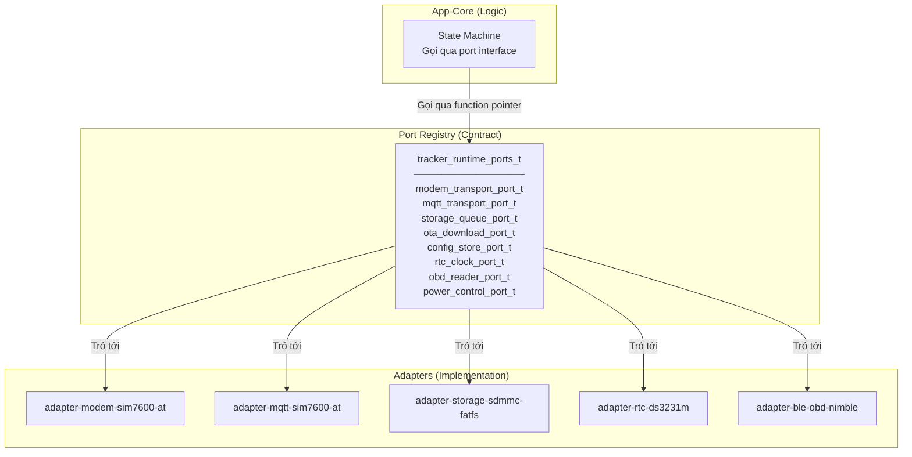

# 18 - Dependency Injection (Runtime Ports)

> Pattern Dependency Injection trong C firmware — tách logic khỏi hardware cụ thể.
> File: `components/platform-hal-esp-idf/include/tracker-runtime-ports.h`

---

## Mục lục

1. [Vấn đề](#1-vấn-đề)
2. [Giải pháp: Port Registry](#2-giải-pháp-port-registry)
3. [Các Port Interfaces](#3-các-port-interfaces)
4. [Bootstrap Wiring](#4-bootstrap-wiring)
5. [Lợi ích](#5-lợi-ích)

---

## 1. Vấn đề

Nếu app-core gọi trực tiếp `modem_lte_connect()`, `tracker_mqtt_publish()`:
- App-core phụ thuộc cứng vào SIM7600 adapter
- Không thể test app-core mà không có hardware thật
- Đổi modem (ví dụ: sang Quectel) = sửa app-core

---

## 2. Giải pháp: Port Registry



---

## 3. Các Port Interfaces

Mỗi port là struct chứa function pointers:

```c
// Modem transport
typedef struct {
    void (*set_apn)(const char *apn);
    void (*request_connect)(void);
    bool (*is_initialized)(void);
    bool (*is_connected)(void);
    esp_err_t (*sleep)(void);
    esp_err_t (*wakeup)(void);
} modem_transport_port_t;

// MQTT transport
typedef struct {
    esp_err_t (*init)(const config_t *cfg);
    esp_err_t (*connect)(void);
    esp_err_t (*disconnect)(void);
    bool (*is_connected)(void);
    esp_err_t (*publish)(const char *topic, const char *payload, int qos);
    void (*set_command_callback)(tracker_command_message_callback_t cb);
} mqtt_transport_port_t;

// OBD reader
typedef struct {
    void *(*connect)(tracker_obd_response_callback_t cb, void *ctx, uint32_t timeout);
    esp_err_t (*disconnect)(void *ctx);
    bool (*is_connected)(void *ctx);
    int (*request_pid)(void *ctx, uint8_t mode, uint8_t pid, uint32_t timeout);
    esp_err_t (*elm327_init)(void *ctx);
} obd_reader_port_t;

// Full registry
typedef struct {
    const modem_transport_port_t *modem;
    const mqtt_transport_port_t *mqtt;
    const storage_queue_port_t *storage_queue;
    const ota_download_port_t *ota_download;
    const config_store_port_t *config_store;
    const rtc_clock_port_t *rtc_clock;
    const obd_reader_port_t *obd_reader;
    const power_control_port_t *power_control;
} tracker_runtime_ports_t;
```

---

## 4. Bootstrap Wiring

Khi boot, `tracker-app-bootstrap.c` tạo registry và inject vào app-core:

```c
// tracker-app-bootstrap.c
static const modem_transport_port_t s_modem_port = {
    .set_apn = modem_lte_set_apn,
    .request_connect = modem_lte_request_connect,
    .is_initialized = modem_lte_is_initialized,
    .is_connected = modem_lte_is_connected,
    .sleep = modem_lte_sleep,
    .wakeup = modem_lte_wakeup,
};

static const tracker_runtime_ports_t s_ports = {
    .modem = &s_modem_port,
    .mqtt = &s_mqtt_port,
    .storage_queue = &s_storage_port,
    // ...
};

// Validate tất cả ports có đủ trước khi chạy
esp_err_t err = tracker_runtime_ports_validate(&s_ports);
```

---

## 5. Lợi ích

| Lợi ích | Giải thích |
|---------|-----------|
| **Testability** | Mock ports cho unit test (không cần hardware) |
| **Swappable** | Đổi modem = chỉ đổi adapter, app-core không đổi |
| **Explicit deps** | Nhìn registry biết ngay FSM cần gì |
| **Validation** | Boot-time check đảm bảo không thiếu port |
| **Clean architecture** | App-core không `#include` adapter headers |

---

> **Tiếp theo:** [19-session-lifecycle.md](./19-session-lifecycle.md)
