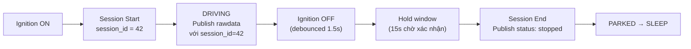
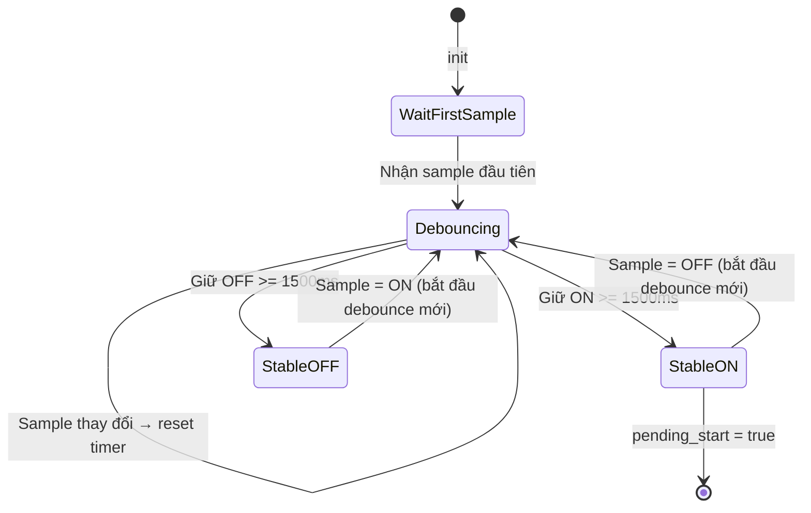
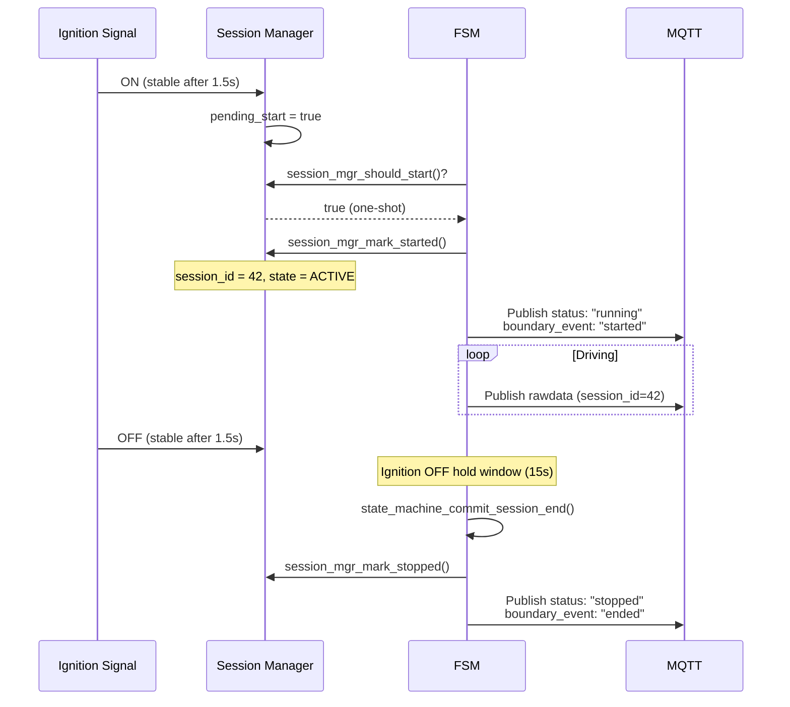
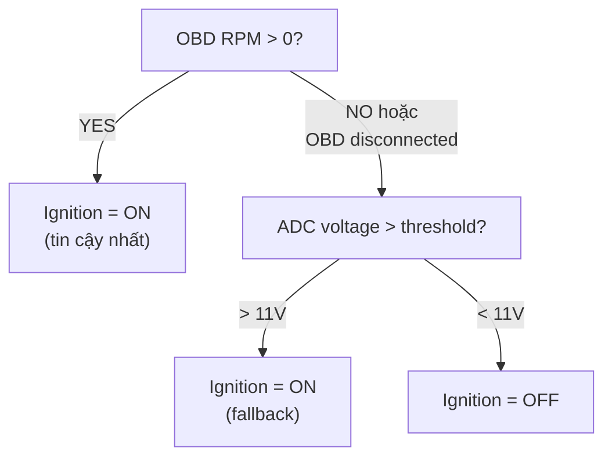

# 19 - Session & Ignition Lifecycle

> Quản lý driving session: ignition debounce, session start/stop, NVS persistence.
> Files: `domain-connectivity/src/session_mgr.c`, `app-core/src/state_machine_core.c`

---

## Mục lục

1. [Session là gì?](#1-session-là-gì)
2. [Ignition Debounce](#2-ignition-debounce)
3. [Session Lifecycle](#3-session-lifecycle)
4. [Ignition Detection Methods](#4-ignition-detection-methods)
5. [Session Persistence](#5-session-persistence)

---

## 1. Session là gì?

Một "session" = 1 chuyến đi (từ nổ máy đến tắt máy).
Cloud dùng session để nhóm telemetry data theo chuyến.



---

## 2. Ignition Debounce

Tín hiệu ignition có thể "nhảy" (relay bounce, ECU restart). Session manager
chờ signal ổn định trước khi xác nhận:



**Code:**
```c
void session_mgr_on_ignition_sample(bool ignition_on, uint64_t now_ms) {
    // Nếu sample khác lần trước → reset debounce timer
    if (ignition_on != s_ctx.last_sample) {
        s_ctx.last_sample = ignition_on;
        s_ctx.edge_ms = now_ms;  // Restart timer
    }

    // Chờ đủ 1500ms ổn định
    uint64_t elapsed = now_ms - s_ctx.edge_ms;
    if (elapsed < CONFIG_TRACKER_IGNITION_DEBOUNCE_MS) {
        return;  // Chưa đủ → chờ tiếp
    }

    // Ổn định! Accept new state
    session_mgr_accept_stable_ignition(ignition_on);
}
```

---

## 3. Session Lifecycle



**Ignition OFF Hold Window:**

Sau khi ignition OFF debounce xong, FSM vẫn chờ thêm 15 giây (`ignition_off_hold_ms`)
trước khi kết thúc session. Lý do:
- Xe dừng đèn đỏ → RPM=0 tạm thời → không nên kết thúc session
- ECU restart ngắn → không nên tạo session mới
- Cho phép OBD data cuối cùng được publish trước khi disconnect

---

## 4. Ignition Detection Methods

Project dùng 2 nguồn để detect ignition:



| Nguồn | Ưu tiên | Khi nào dùng |
|--------|---------|-------------|
| OBD RPM | Cao nhất | Khi BLE OBD connected + ELM ready |
| ADC voltage | Fallback | Khi OBD disconnected |

---

## 5. Session Persistence

Session context được lưu NVS để survive reboot:

```c
typedef struct {
    bool active;                    // Session đang mở?
    uint32_t local_session_key;     // Session ID local
    uint64_t canonical_session_id;  // Session ID từ cloud
    char boot_id[48];               // Boot ID tạo session
} session_persist_context_t;
```

Khi reboot giữa chuyến đi (OTA, crash):
1. Boot mới đọc NVS → thấy session active
2. `session_mgr_restore_active(session_id)` → tiếp tục session cũ
3. Chờ ignition sample mới để xác nhận xe vẫn đang chạy

---

> **Tiếp theo:** [20-command-handler.md](./20-command-handler.md)
