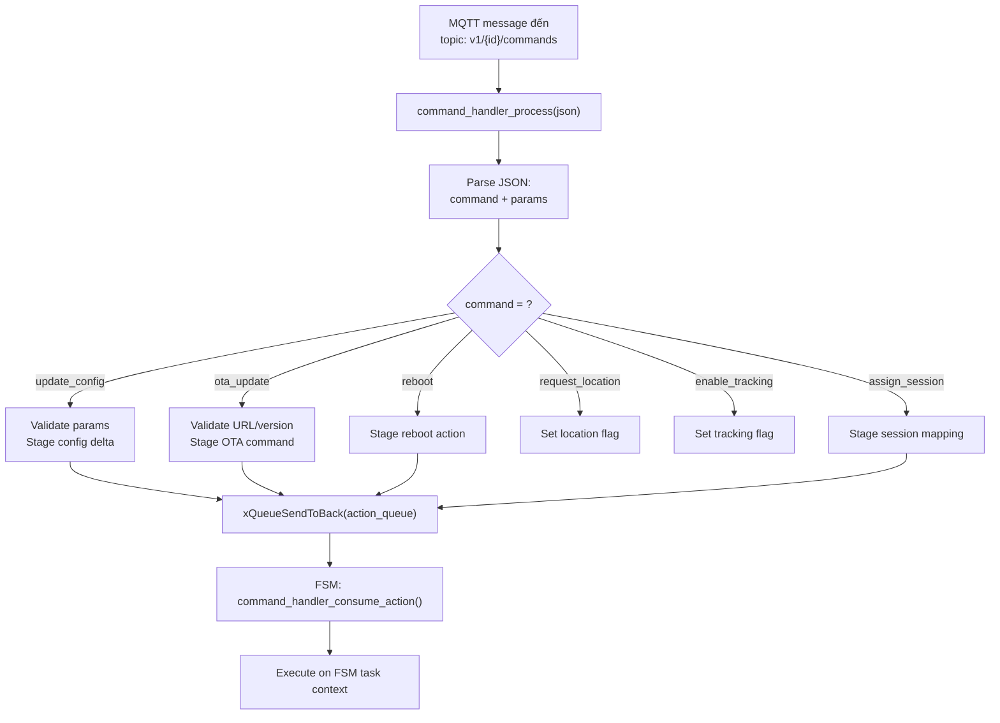
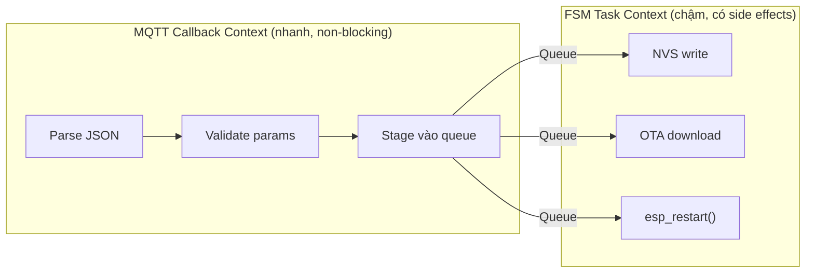

# 20 - Command Handler

> Parse và thực thi cloud commands: update_config, ota_update, reboot, assign_session.
> File: `components/domain-connectivity/src/command_handler.c`

---

## Mục lục

1. [Command Flow](#1-command-flow)
2. [Supported Commands](#2-supported-commands)
3. [Ownership Split](#3-ownership-split)
4. [Thread Safety](#4-thread-safety)

---

## 1. Command Flow



---

## 2. Supported Commands

| Command | Action | Params | Xử lý |
|---------|--------|--------|--------|
| `update_config` | APPLY_CONFIG | `{tracking_interval_s, ...}` | Validate bounds → NVS save |
| `ota_update` | OTA_UPDATE | `{url, version, sha256, size}` | Safety check → HTTP download |
| `ota_rollback` | OTA_ROLLBACK | `{job_id}` | Rollback to previous partition |
| `reboot` | REBOOT | none | `esp_restart()` |
| `request_location` | (flag) | none | Publish rawdata ngay lập tức |
| `enable_tracking` | (flag) | `{enabled: bool}` | Enable/disable telemetry |
| `assign_session` | ASSIGN_SESSION | `{local_key, canonical_id}` | Map local → cloud session |

---

## 3. Ownership Split



**Tại sao split?**
- MQTT callback phải return nhanh (< vài ms)
- NVS write mất 10-50ms, OTA mất phút
- Queue decouple: callback chỉ stage, FSM thực thi khi sẵn sàng

---

## 4. Thread Safety

```c
// Mutex bảo vệ shared state
static SemaphoreHandle_t s_lock = NULL;
static QueueHandle_t s_action_queue = NULL;  // 16 slots

// MQTT callback path (có thể từ context khác):
bool command_handler_take_lock(void) {
    return xSemaphoreTake(s_lock, pdMS_TO_TICKS(250)) == pdTRUE;
}

// FSM consume path:
command_action_t command_handler_consume_action(void) {
    if (!command_handler_take_lock()) return COMMAND_ACTION_NONE;
    
    command_action_item_t item = {0};
    if (xQueueReceive(s_action_queue, &item, 0) != pdTRUE) {
        command_handler_give_lock();
        return COMMAND_ACTION_NONE;
    }
    
    command_handler_give_lock();
    return item.action;
}
```

**Bounded drain:** FSM chỉ xử lý tối đa 4 actions/iteration (`TRACKER_PENDING_ACTION_DRAIN_LIMIT`)
để command traffic không starve telemetry/sleep logic.

---

> Đây là file cuối trong bộ tài liệu bổ sung.
> Quay lại: [01-freertos-fundamentals.md](./01-freertos-fundamentals.md)
