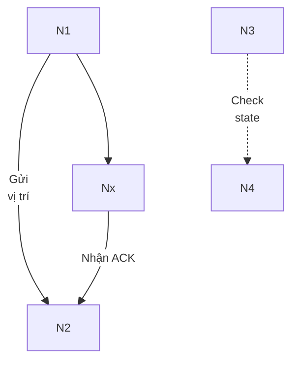

# Báo cáo researcher 01: Review lỗi giao nhau mũi tên/chú thích UML (Mermaid) trong thesis-chapters
Ngày: 2026-03-18 04:53:56 (Asia/Saigon)
Work context: E:/anmh1205/IoT_Vehicle_Tracking_System

## 1) Root-cause taxonomy (nguyên nhân gốc cho lỗi mũi tên/nhãn đâm xuyên chữ)

### 1.1 Syntax edge-label và token hóa Mermaid
- **Pattern**: `A -->|label| B` xuất hiện với nhãn dài, có unicode tiếng Việt, dấu phẩy, dấu ngoặc, hoặc ký tự `|`.
- **Hiệu ứng**: Layout fallback và text anchor của Mermaid đặt nhãn giữa cạnh, dễ đè lên line khi cạnh ngắn/cross.
- **Dấu hiệu trong repo**: toàn bộ nhóm file trong `resources/reports/thesis-chapters/assets/uml/*.mmd` đều có nhiều cú pháp `|label|` (đặc biệt các nhóm `04-*`, `05-*`, `06-*`, `07-*`, `09-*`, `10-*`, `thesis-99-*`).

### 1.2 Layout engine và đường cong cạnh
- **Pattern**: flowchart mặc định chưa khóa `layout`/spacing đồng nhất giữa tất cả file.
- **Hiệu ứng**: cạnh dồn cụm tại các cụm actor/nút “hub”, nhãn đặt giữa cạnh xung đột với label của cạnh/cạnh đối diện.
- **Nguy cơ cao**: các file có mật độ liên kết lớn (`09-...hinh-4-15..25`, `10-...hinh-4-20..38`, `thesis-99-...`) có nhiều cạnh quay đầu / song song.

### 1.3 Chồng chéo cạnh (parallel edges + same endpoints)
- **Pattern**: nhiều cạnh song song cùng A→B với nhãn khác nhau nhưng khác kiểu, hoặc có cả `-->`/`-.->`/`-->>`.
- **Hiệu ứng**: label của các cạnh bị phủ lên nhau; Mermaid không luôn giữ khoảng cách đủ.
- **Triệu chứng**: lỗi “nhãn lẩn vào mũi tên” hoặc “nhãn bị cắt bởi đường biên mũi tên kế cận”.

### 1.4 Node/label kích thước không đồng nhất
- **Pattern**: nhãn rất dài hoặc cụm chữ dày trong một số file khác nhau, font-size không chuẩn hóa bởi pipeline.
- **Hiệu ứng**: nhãn trôi khỏi tuyến, chồng lên node hoặc sát mũi tên.

### 1.5 Pipeline/renderer không nhất quán
- **Pattern**: nhiều file được render từ script khác nhau hoặc phiên bản Mermaid khác nhau qua `generate-thesis-report-figures.mjs` + `thesis-mermaid-diagrams.mjs`.
- **Hiệu ứng**: cùng cú pháp nhưng render khác nhau giữa môi trường, làm tăng lỗi đè/chồng.
- **Nguồn tham chiếu**: `resources/reports/thesis-chapters/assets/generate-thesis-report-figures.mjs`, `resources/reports/thesis-chapters/assets/thesis-mermaid-diagrams.mjs`, `resources/reports/thesis-chapters/assets/mermaid-thesis-config.json`.

## 2) Mẫu pattern sửa chuẩn (KISS/YAGNI/DRY)

### Mục tiêu chuẩn hóa
- Tối giản label, ưu tiên từ khóa ngắn.
- Chỉ dùng 1-2 độ dài label; nếu quá dài thì tách xuống dòng bằng `\n`.
- Cố định spacing/spacing + route để giảm crossing.
- Tránh parallel edge thẳng giữa cùng 2 node.

### Mẫu chuẩn áp dụng cho toàn bộ .mmd

### Quy tắc DRY
- Tạo **không tăng tính năng mới**: chỉ bổ sung 1 khối chuẩn đầu file (init + đặt spacing) và chuẩn hóa edge syntax, không viết macro phức tạp.
- Tránh chỉnh sửa ngữ nghĩa nghiệp vụ; chỉ chỉnh độ dễ đọc trực quan.

## 3) Checklist kiểm tra trước/sau render cho toàn bộ `.mmd` trong `assets/uml`

### Trước render (static check, script hóa hàng loạt)
1. Scan cú pháp edge label: `|[^|]{0,}?|` phải có spacing và không bôi đen kiểu ký tự đặc biệt gây vỡ.
2. Cờ cảnh báo “label quá dài”: đề xuất ngưỡng >24 ký tự -> tách dòng `\n`.
3. Tìm cạnh song song cùng cặp node `(A,B)` xuất hiện >1 lần: gắn `edge-id` hoặc phân luồng qua node trung gian.
4. Kiểm tra self-loop và backward edge có thể gây chồng: chuyển về `flow LR`/`TB` hoặc dùng subgraph.
5. Kiểm tra font size/renderer config thống nhất (đọc `mermaid-thesis-config.json`).
6. Kiểm tra file có encoding UTF-8 chuẩn, tránh ký tự lạ làm label vỡ.
7. Chuẩn hóa tên nhãn: tránh `|` trong text, thay bằng `-` hoặc `\n`.

### Sau render (visual QA, thủ công tối thiểu + tự động)
1. Bật zoom 200% và quét toàn cảnh cho từng diagram: phát hiện label chồng/đè.
2. Kiểm tra các cặp “đầu mút gần nhau”: nhãn có chạm mũi tên hay không.
3. Đo baseline 5 triệu: số ảnh có lỗi label-overlay = 0.
4. So khớp text semantic với sơ đồ gốc (không được đổi nhãn nghiệp vụ).
5. So sánh lại đầu ra SVG trước/sau khi sửa để đảm bảo không đổi layout tổng thể quá lớn.

## 4) Danh sách file ưu tiên rà soát thủ công (rủi ro cao)

### Cụm mật độ cạnh cao (điều chỉnh toàn diện trước)
- `resources/reports/thesis-chapters/assets/uml/09-chuong-4-trien-khai-cloud-hinh-4-15.mmd` → `09-chuong-4-trien-khai-cloud-hinh-4-25.mmd`
- `resources/reports/thesis-chapters/assets/uml/10-chuong-4-ket-qua-do-luong-hinh-4-20.mmd` → `10-chuong-4-ket-qua-do-luong-hinh-4-38.mmd`
- `resources/reports/thesis-chapters/assets/uml/thesis-99-bao-cao-thesis-hoan-chinh-01.mmd` → `thesis-99-bao-cao-thesis-hoan-chinh-09.mmd`

### Cụm thay đổi gần đây (đã có churn lớn)
- `resources/reports/thesis-chapters/assets/uml/04-chuong-3-giai-phap-firmware-hinh-3-7.mmd` đến `04-chuong-3-giai-phap-firmware-hinh-3-11.mmd`
- `resources/reports/thesis-chapters/assets/uml/05-chuong-3-giai-phap-backend-hinh-3-12.mmd` đến `05-chuong-3-giai-phap-backend-hinh-3-14a.mmd`
- `resources/reports/thesis-chapters/assets/uml/06-chuong-3-giai-phap-frontend-hinh-3-15.mmd` đến `06-chuong-3-giai-phap-frontend-hinh-3-23.mmd`

### Cụm nền tảng đã có nhiều edge-label
- `resources/reports/thesis-chapters/assets/uml/03-chuong-3-giai-phap-phan-cung-hinh-3-1.mmd`
- `resources/reports/thesis-chapters/assets/uml/03-chuong-3-giai-phap-phan-cung-hinh-3-2.mmd`
- `resources/reports/thesis-chapters/assets/uml/03-chuong-3-giai-phap-phan-cung-hinh-3-3.mmd`
- `resources/reports/thesis-chapters/assets/uml/03-chuong-3-giai-phap-phan-cung-hinh-3-4.mmd`

## 5) Chiến lược sửa hàng loạt
1. **Chuẩn hóa renderer**: khóa cấu hình flowchart chung cho toàn bộ pipeline Mermaid (một lần trong `thesis-mermaid-diagrams.mjs` + config JSON).
2. **Tiền xử lý toàn bộ `.mmd`** bằng script: rút gọn nhãn >24 ký tự, gắn `\n` theo dấu ngắt logic, phát hiện duplicate edge pairs.
3. **Sửa thủ công có kiểm soát**: chỉ những file trong nhóm rủi ro cao trước, sau đó mở rộng toàn thư mục.
4. **Render + CI-like check local**: nếu dùng CLI Mermaid, lưu lại log có số lỗi cú pháp + checksum ảnh đầu ra.
5. **Đóng vòng QA**: mỗi file đã sửa phải có ảnh SVG đầu ra sau: không có label overlay; label vẫn khớp semantics.

## 6) Unresolved questions
- Có cần khóa chặt toàn bộ flowchart về `TD` hay `LR` cho mỗi chương hay giữ layout riêng theo ngữ cảnh?
- Độ dài nhãn tối đa nên là bao nhiêu ký tự/vị trí ngắt để cân bằng giữa đọc được + đúng nội dung?
- Có chấp nhận thay đổi nhỏ về trực giác layout (ví dụ `flowchart LR` thay cho `TD`) nếu giảm lỗi overlay?
- Đội biên tập có yêu cầu thống nhất font-size/canvas cho toàn bộ chapter hay cho từng chapter riêng?
- Có thể bổ sung step tự động screenshot diff (image compare) trước khi merge không?